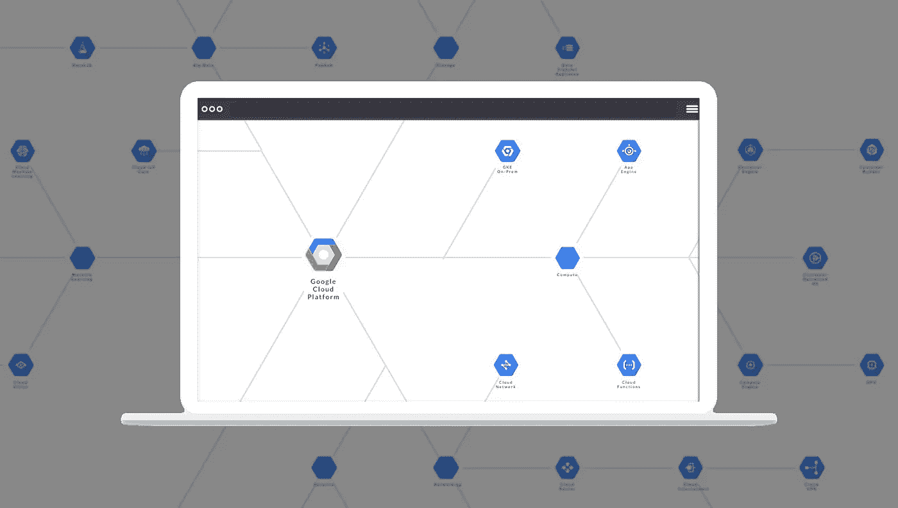
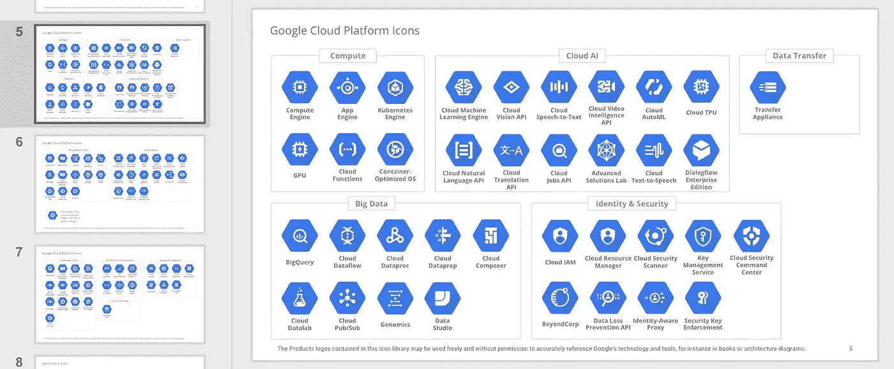
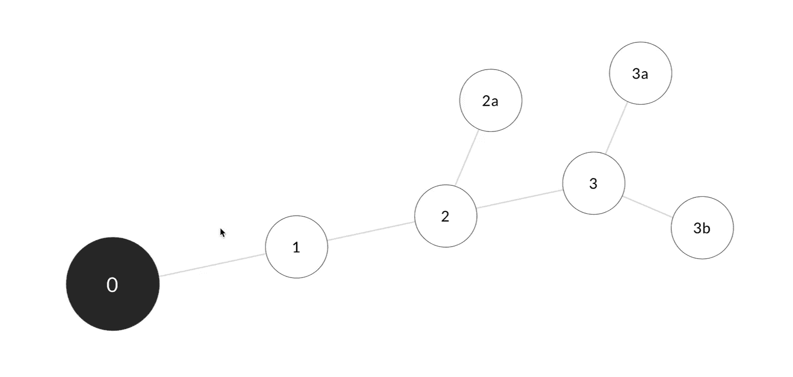
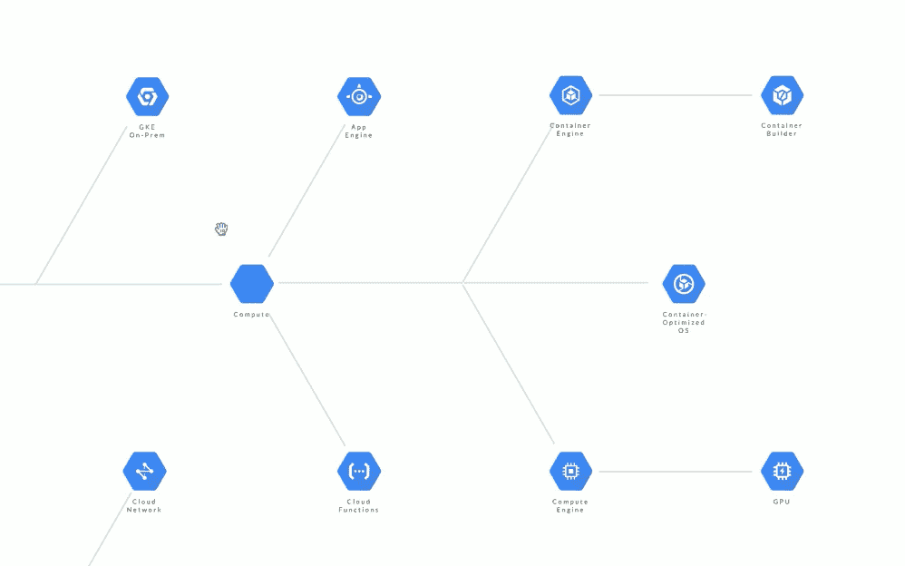

# 如何从头开始构建交互式信息图

> 原文：<https://medium.com/hackernoon/how-to-build-an-interactive-infographic-from-scratch-94128678c83b>

## 用普通 Javascript 创建交互式信息图(第一部分)



Interactive infographics with plain Javascript

## 介绍

今天的浏览器让我们以前所未有的方式连接信息。信息图表就是这样一个领域。作为一个象形图，它是一个极好的可视化工具。作为一个交互式网页，你只需要一点点编码就可以达到一个新的参与水平。

许多开源库呈现出奇妙的信息图。我们最喜欢的是 D3 和 vis.js。然而，有时我们需要公共图书馆没有的功能。

## 目标

让我们用普通 Javascript 构建一个交互式信息图。

## 个案研究

对于网络开发者来说，谷歌云平台(GCP)就像一个糖果店。它的产品种类数不胜数，每一种都以不同的方式相互联系，以解决复杂的问题。



The GCP “Org chart”. Official source: [Google Cloud Platform](https://docs.google.com/presentation/d/1vjm5YdmOH5LrubFhHf1vlqW2O9Z2UqdWA8biN3e8K5U/edit#slide=id.p14)

如果我们利用现代浏览器的力量来展示 GCP 产品的优势，用户界面会是什么样子？有可能使用基本的 Javascript 技术产生非凡的结果吗？

## 设计方法

我们的设计方法基于这样的理念:使用一致且持久的用户界面(UI)来讲述一个引人入胜的故事。让我们从两个方面重新思考设计:

*   **信息架构**。我们能否将信息视为一条连续的路径，而不是通过重复的页面加载来拼接的拼图？
*   **用户界面**。我们能通过一个交互式的一致的用户界面来呈现信息吗？


UI concept: the looking-glass

*   **简洁**。我们想用尽可能少的代码创建一个可定制的用户界面。
*   **简约**。我们希望使用开箱即用的浏览器功能，而不是第三方库。这意味着只使用普通的 Javascript。
*   **复用性**。我们希望将视图从模型中分离出来，以便更容易将我们的项目应用到其他用例中。

## 入门—基本构建模块

让我们引入**节点**和**链接**的概念，作为我们设计工作流程的基本构建模块。

**节点**是起点和终点。例如，公交车站可以称为节点。从一个节点到另一个节点的总线路径可以被称为**链路**。一组相关的节点和链接可以称为一个`branch`。



Basic building blocks : each node describes a set of unique relationships

**节点元素**。我们可以使用一个 HTML 元素和一个惟一的 id 来描述一个节点。例如，`node11`将是分支#1 的节点#1。类似地，`node12`将是分支#1 的节点#2。在上图中，这将是圆“1”和“2”。公交路线#1(即分支#1)将连接环路“1”和“2”，以及其他环路(即 2a、3、3a、3b)。

让我们使用`style`属性来描述每个元素的独特位置、形状和行为。您可以使用任何 HTML、CSS、图标或图像来表示节点或链接。我们视频中的圆形节点只是带有 CSS `border-radius`的 div 标签。

```
<div id=”node11" style=”…”>1–1 Occupation Name</div>
<div id=”node12" style=”…”>1–2 Occupation Name</div>
```

**链接元素**。链接连接节点。比如`link1112`连接`node11`和`node12`。

```
<div style=”...” id=”link1112"></div>
```

提示:使用一个图像覆盖来指导你的 HTML 元素的 CSS 定位。

## 撇开概念不谈——网页上的交互是如何工作的

我们讨论的节点和链接本质上是浏览器运行时的 DOM 元素。DOM，即文档对象模型，是一种树状数据结构，用于表示 HTML 元素并将内容映射到物理显示器上。

反过来，我们也可以通过操作 DOM 与任何显示元素进行交互。在我们的项目中，我们希望这些节点和链接能够响应特定的用户动作，比如一个`mouseover`事件。

```
document.addEventListener( "mouseover", myCustomFunction );
```

*   `mouseover`检测鼠标光标悬停在特定 DOM 文档(如按钮)上。
*   一旦检测到，它将调用`myCustomFunction`做一些事情(例如，弹出一个动画序列或从数据库中检索信息)。

我们将使用这个 Javascript API 来检测用户动作，并触发一系列功能来创建交互式网页。

## 创建工作流快捷方式

让我们分两步将节点和链接元素绑定到`loop`中的`event listeners`:

**第一步**。分配模型(数据)。

将 HTML 元素的唯一值存储为一个`item[]`数组。

```
var item = [
 ‘11’,’12',’1112',
 ‘21’,’22',’2122',
 ...
 ];
```

item[]数组中的每个值将对应每个节点或链接的唯一 id 值(如`11`指`node11`；`1112`指`link1112`。).您可以将 item[]视为一个主注册表。

接下来设置`legend[]`以固定`an array of objects`。每个对象都是一个数据集，对应于一个特定的用户操作。

```
*var* legend = {
 'item11' : { "node" : ['11'], "links" : [] },
 'item12' : { "node" : ['11','12'], "links" : ['1112'], },
 ...
}
```

*   当鼠标光标悬停在`node11`上时，对象`item11`将调用`node11`进行 CSS 定位。
*   类似地，当光标悬停在 node12 上时，对象`item12`调用`node11`、`node12`和`link1112`进行 CSS 定位。
*   `item`只是一个前缀标签。使用您的命名约定。

让我们花一点时间来考虑上述模式的含义。我们不仅创建了一个系统来存储内容，我们还创建了一个**图形关系**来描述数据连接。

我们减少了大量的代码；加快了设计工作流程；并将视图从模型(数据)中分离出来。让我们继续构建视图引擎。

提示:对于动态内容管理，考虑将数据集编码为 JSON，并通过数据库访问它们。此外，使用任何工具来编辑数据集和 HTML 布局。

**第二步**。循环遍历每个 HTML 元素，以编程方式关联事件侦听器。

```
while (item[i]) {
   itemElement[i] = "node".concat(item[i]);
   itemElementName[i] = document.getElementById( itemElement[i] );
   itemElementName[i].addEventListener( "mouseover", mouseOver );
   itemElementName[i].addEventListener( "mouseout", mouseOut );
   ...
   i++;
}
```

1.  `while`遍历在`item[]`注册的每个 DOM 元素的 id 值。
2.  `“item”.concat(item[i])`重新附加您可能有的任何自定义前缀(即“node”)以匹配实际的 id 值。
3.  `itemElementName[i] = document.getElementById( item[i] )`构建一个 DOM 引用数组。
4.  “`mouseover`”和“`mouseout`”将每个 DOM 元素绑定到一个用户动作。

*提示# 1:移动和触摸设备有自己的一组事件监听器，如* `*touchstart*` *和* `*touchmove*` *。使用它们来创建响应式设计。*

*提示 2:使用触摸或滚轮事件监听器上的“被动”参数来提高浏览器性能，如下所示:*

```
document.addEventListener('touchstart', onTouchStart, **{passive: true}**);
```

**使用 CSS 定制交互行为**

我们可以创建自定义函数`mouseOver`和`mouseOut`来应用 CSS 效果:

```
*function* mouseOver(event) {
 *for* (*var* i in legend[*this*.id]["node"]) {
 *var* currKey = "node".concat(legend[*this*.id]["node"][i]);
      document.getElementById(currKey).style.background = "grey";
      ...
   }
 *for* (*var* i in legend[*this*.id]["link"]) {
      *var* currKey = "link".concat(legend[*this*.id]["link"][i]);
      document.getElementById(currKey).style.border = "1px solid 
      #000";
      ...
   }}
```

*   使用事件监听器`mouseover`将 DOM 元素绑定到您的自定义函数`mouseOver`。该函数接受`event`参数(由浏览器提供),给出活动的`this.id`值。
*   `legend[this.id][“node”]`标识应用 CSS 定位的数据集。
*   `*for*` 循环通过`legend[]`集合。

在我们的例子中，`mouseOver`函数将目标节点的背景颜色变成灰色。

在`link`元素上使用相同的想法。在我们的示例中，当鼠标指针悬停在`node12`上时，我们将`links1112`的颜色从灰色变为纯黑色(节点 11 和节点 12 也变成灰色)。

接下来，一旦光标退出当前 DOM 元素，就“重置”CSS 行为(见粗体)。

```
*function* mouseOut() {
 *for* (*var* i in legend[*this*.id]["node"]) {
 *var* currKey = "node".concat(legend[*this*.id]["node"][i]);
      **document.getElementById(currKey).style.background = "unset";**
      ...
   } *for* (*var* i in legend[*this*.id]["link"]) {
      ...
   }}
```

## 利用 SVG 实现无限扩展

我们的 GCP 信息图表广泛使用 SVG 来支持缩放特性的高清分辨率，这将在我们讨论的下一部分中实现。

要将 HTML/CSS `circle 1`或`node11`变成六边形的 SVG 形状，只需将 SVG 内容包装在 HTML 容器中(见粗体)。

```
<div id=”node11" style=”display:flex; align-items:center;">
    **<svg>
        <path d="...some paths"/>
    </svg>**
    <div style="align-items:center; width:100%;">
        My Text Label
    </div>
</div>
```

*   `id=”node11"`引用同一节点。它现在包含 SVG 数据，而不是呈现 HTML 圆形。
*   `display:flex`和`align-items:center`使用现在所有主流浏览器都支持的 Flexbox 来自动对齐我们的 SVG 和文本内容。
*   `<svg>...</svg>`包含描述可缩放图标的 SVG 数据。访问[GCP 官方图标库](https://cloud.google.com/icons/files/gcp-icons.zip)下载完整的图标包。

## 填充内容

我们将 SVG 添加到模型中。让我们看看到目前为止包含 GCP 内容的示例布局是什么样子的。



Graph relationships and interacting with SVG content

*   使用`scale3d`效果创建有冲击力的高亮效果。
*   用`dashed`来说明不同的关系。

## 后续步骤

我们设计了一个模式和一个视图引擎，作为我们设计工作流程的基础。

在下一部分中，我们将向 UI 添加导航功能。

## *旁注*

这个故事是关于用 Javascript 创建交互式信息图的 5 部分系列。我们精心挑选了重要的部分，这样你就可以快速找到关键部分，并在你的项目中加以调整。对 CSS 和 HTML 有所了解确实有所帮助。不相关的代码块被掩盖了。

所有的视频插图都是从 Chrome 浏览器中截取的。虽然演示基于 GCP，但您可以在组织结构图、生态系统、地铁图、流程图、进程树、网络拓扑和任何图表中找到应用程序。

非常感谢查克·埃里克森和谷歌团队提供的精彩的 [GCP 解决方案图标和图表包](https://cloud.google.com/icons/)。

## 到其他部分的链接

**Part-one →** *你来了。*

[**第二部分**增加了浏览内容的导航功能。](/@PageiiStudio/how-to-create-a-navigation-ui-bac94a9e51fa)

[**第三部**增加了动态小地图，增强导航功能。](/@PageiiStudio/how-to-create-a-two-way-navigation-map-e96600a73cbd)

[**Part-four** 增加了一个内嵌 UI 来访问分层内容。](/@PageiiStudio/how-to-create-a-progressive-ui-to-enhance-presentation-cc42fe97360c)

[**第五部分**展示了为什么创建具有人情味的用户界面如此容易。](/@PageiiStudio/10-ui-tweaks-for-web-developers-af2502b8f994)

如果你喜欢这个故事，你可以在 [Pageii 工作室](https://pageii.com/story;title=Building-an-interactive-infographic-from-scratch)找到更多。