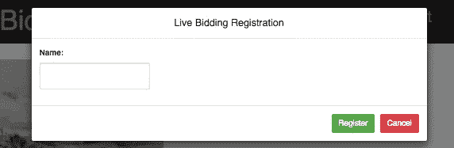
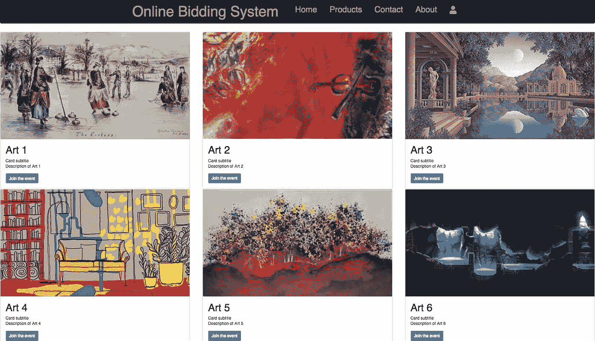
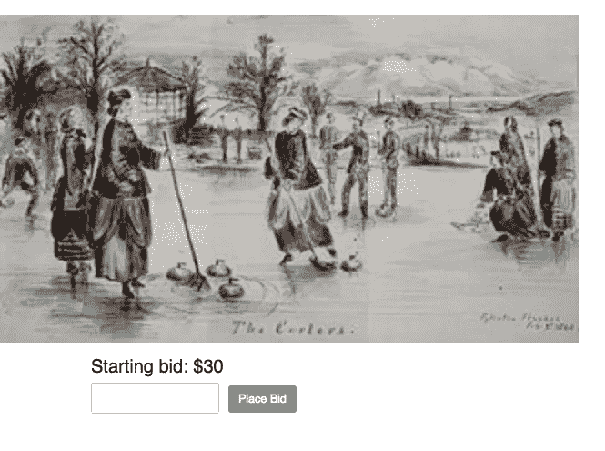
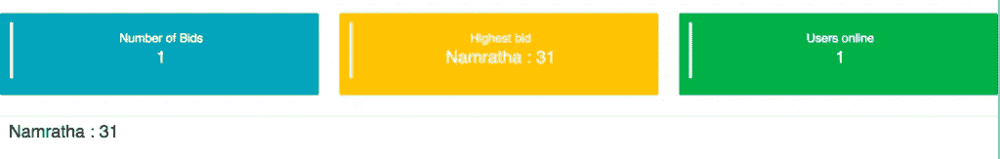

# 如何用 React 构建一个在线实时竞价/拍卖系统

> 原文：<https://medium.com/hackernoon/how-to-build-an-online-realtime-bidding-auction-system-with-react-925cc5aa7937>

在本教程中，我们将向您展示如何使用 [PubNub 实时消息](https://www.pubnub.com/products/realtime-messaging/?utm_source=Syndication&utm_medium=Medium&utm_campaign=SYN-CY18-Q3-Medium-July-16)和 React-Bootstrap 在 [React](https://hackernoon.com/tagged/react) 中构建一个在线实时拍卖系统。拍卖应用程序将有一个艺术作品画廊，您可以加入投标活动，对艺术作品进行投标。在投标的同时，您可以实时检查其他用户的投标。你的应用程序也将有一个仪表板，可以被管理员用来跟踪观众和他们的出价。

# 什么反应，为什么反应？

[React](https://reactjs.org/) 是一个用于构建用户界面的 JavaScript 库。React 给了你一个模板语言和一些函数钩子来呈现 HTML。你的 HTML/JavaScript 包被称为“组件”。组件类似于 JavaScript 函数。它们接受称为 props 的任意输入，并返回 React 元素。这些元素描述了屏幕上应该出现的内容。

开发人员喜欢 ReactJS，因为它具有很高的性能，几乎可以即时呈现变化。ReactJS 最好的一点是，它是一个相对较小的框架，不需要花费太多时间来学习！

# 入门指南

**[**完整的 GitHub 代码库可以在这里找到**](https://github.com/namrathasubramanya/reactjs-bidding-dashboard) **。****

**你首先需要[注册一个 PubNub 账户](https://dashboard.pubnub.com/signup/?utm_source=Syndication&utm_medium=Medium&utm_campaign=SYN-CY18-Q3-Medium-July-16)来获得你唯一的发布/订阅密钥。然后，在您的终端中使用以下命令安装 [PubNub](https://hackernoon.com/tagged/pubnub) 包。**

**`npm install --save pubnub pubnub-react`**

**导入所需的库。**

**PubNub React 是 PubNub Javascript 的一个包装器。它添加了一些额外的特性来简化与 React 的集成。为了获得 React 组件和 PubNub 之间的集成，当您需要在 UI 中呈现数据时，`PubNubReact`将是一种没有任何困难或额外工作的方法。**

**以下是在应用程序中初始化 PubNub 的方法。**

**让我们将应用程序分为投标门户和管理仪表板。拍卖期间，客户将使用竞价门户来竞价。管理员可以使用仪表板来跟踪拍卖的价值。**

# **投标门户**

# **登记**

**让我们用一个注册模型来注册用户。强制注册。这样，你可以跟踪每一个出价。**

****

**内部`render()`:**

# **主页**

**路由帮助我们在 React 中构建单页面应用程序。要使用路由，我们必须拉下 React Router 和 React DOM:**

**`npm install react-router-dom --save`**

**这就是如何使用路由器通过在选项卡之间切换来构建单页面应用程序。**

# **产品— PubNub 渠道**

**这里的产品代表了 PubNub 的不同渠道。您可以重复使用 React 组件，使不同 art 产品上的按钮引导您进入不同的频道。**

****

**持卡人组件接收由产品页面中的<cardholder>标签传递的值。</cardholder>**

**下面是持卡人的一小段代码，通过传递不同的产品名称及其相关的字幕和描述，可以用它来构建 n 个产品。**

**此外，您可以让按钮根据产品引导您进入不同的 PubNub 频道。**

# **出价**

****

**您的应用程序中最有趣的部分是您出价的页面。“产品”页面上的按钮会将您引导至相应的 PubNub 渠道，这些渠道又会将您引导至相应的竞价页面，您可以在这里提交金额。**

# **PubNub 实时消息**

**一旦你将你的价格提交到输入表单中，PubNub 就会通过艺术频道以 1/4 秒的延迟将消息发布给拍卖主持人。如果您订阅了相同的频道，您可以查看当前参与投标的各种用户的投标。**

# **仪表盘**

# **PubNub 实时消息**

**您可以使用`{message.length}`找出地图的大小，也可以从地图中找出最高出价并显示在仪表板上，如下所示:**

# **出席**

**Presence 可以在不到一毫秒的时间内随时提供连接到 PubNub 频道的用户和设备的状态。PubNub 要求您在他们的 PubNub 仪表板上启用状态。[以下是如何启用存在感](https://support.pubnub.com/support/solutions/articles/14000043855-how-do-i-enable-add-on-features-for-my-keys-)。现在您可以执行这段代码来找出目前有多少用户/设备连接到 PubNub 的通道。**

****

**以下是如何设计管理仪表板卡来显示出价数量、最高出价和查看者数量。您还可以实现图形和图表来图形化地表示这些值。**

# **实施思路**

**恭喜你！现在你有了自己的小竞价门户。您可以使用 OAuth 2.0 登录，而不是用户名模式，并且您可以设计仪表板来显示多个艺术品的统计数据。您还可以授予管理员对[叫牌](https://en.wikipedia.org/wiki/Auction_chant)的访问权限，就像“去一次..两次…”然后在管理仪表板中选择获胜者。**

***最初发表于*[T5【www.pubnub.com】](https://www.pubnub.com/blog/online-realtime-bidding-auction-app-react-pubnub/?utm_source=Syndication&utm_medium=Medium&utm_campaign=SYN-CY18-Q3-Medium-July-16)*。***