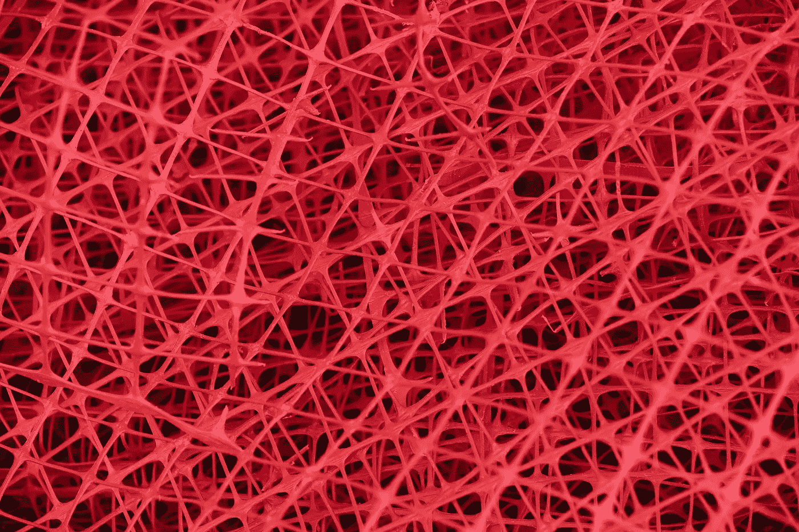

# 如何建立和使用神经网络

> 原文：<https://medium.com/hackernoon/how-to-build-and-use-neural-networks-c2a0de2e07d9>

创建一个神经网络意味着创建一个单一的思维系统，被训练来解决一个单一的问题，或者最多是相关的问题。它获得输入数据，通过人工神经元网络对这些数据进行切片和切块，希望通过观察每一块数据的特征并将其与已知资源进行比较来对其进行分类。

应用程序是无止境的，从为工作选择合适的候选人，到评估事故风险，甚至预测气候变化。几乎任何活动部门都有可以通过神经网络解决的问题。因此，更详细地了解一下是有意义的。

## 构建神经网络

这个过程有点像做蛋糕。你收集成分(人工神经元)，你在碗里混合它们(创建你可以看到的第一层)，然后把所有东西放在烤箱里(隐藏层)，希望得到最好的结果(输出层)。

为了获得更多的技术，让我们通过[的必要步骤](https://medium.freecodecamp.org/building-a-3-layer-neural-network-from-scratch-99239c4af5d3)来实际构建一个功能神经网络。因为没有人想重新发明轮子，所以从导入一些有用的库开始，当然还有数据集。

接下来，因为第一层中的每个神经元没有预定义的权重(重要性)，所以它们被分配 0 到 1 之间的随机数。一旦设置好了，你就可以开始有趣的网络教学了。

在前向传播步骤中，您遍历网络，将您收到的结果与您预期的结果进行比较，以查看您离目标有多远。这本质上证明了模型有多好。

在反向传播阶段，你的目标是让网络从它的错误中学习，从最终目标开始，通过系统反向工作。这个反馈过程为人工神经元的初始层提供了新的、更精确的权重。

来回重复循环数百次(这些被称为历元)，使得预测足够精确，以至于不能再进一步改进。当观察到这种情况时，是时候停止了，或者网络变得训练过度。过度训练意味着它过于关注训练数据集，以至于不再能够看到全局，并且对其他数据集也没有用。

## 神经网络应用

正如之前在开篇中提到的，神经网络在从医疗保健到军事防御或风险管理的广泛领域中有无数的应用。让我们来看看目前最令人兴奋的用途，并对未来提出一些建议。

## 交易平台

如果在 2008 年之前使用了正确的预测模型，那么这场金融危机就有可能永远不会发生，或者不会达到现在的程度。经纪人被机器取代只是时间问题。这种趋势是由高频交易决定的，这种交易价值低，但交易量大。由于人类不可能每隔 15-20 秒做出正确的投资决策，这对于由神经网络驱动的人工智能来说是一个极好的例子。

## 推荐引擎

营销已经从大众诉求发展到个性化定制。你的建议、信息和推荐越个人化，你就越有可能卖出很多东西。神经网络可以学习偏好，然后生成类似或相关的产品推荐。通过相关技术，如图像识别，该系统可以非常复杂，它可以获得一张明星服装的照片作为输入，并返回类似商品的商店列表。

## 卫生保健

通过神经网络检测癌症[的成功已经是一个公认的突破。在训练有素的医生做出相同的诊断之前，它可以发现各种类型的恶性肿瘤。但这并不是人工智能改善我们健康的唯一方式。甚至像月经周期预测](https://www.ncbi.nlm.nih.gov/pmc/articles/PMC5722487/)这样不太危及生命的问题[也可以受益于人工神经元完成的模式识别，为打算成为父母的人提供更准确的日历。另一个用途包括预测住院天数。](https://indatalabs.com/resources/neural-network-implementation-in-healthcare-app)

## 自然语言处理

这是神经网络的高风险之一，因为它可以用来在人和机器之间建立一个安全的通信桥梁。当 NLP 完全发挥作用时，只有那时聊天机器人才能令人满意地取代呼叫中心代理和其他面向公众的工作。对于指导手册、故障排除甚至教学都会有很大的帮助。

## 风险管理和欺诈检测

作为习惯动物，人们有复制自己行为的倾向。改变我们的行为方式需要巨大的意志力、专注和决心。即便如此，大多数时候我们还是会回到旧习惯。这种心理观察是使用神经网络对贷款和抵押贷款进行风险评估的基础。虽然 FICO 分数可以在一年左右的时间里得到提高，但观察数字背后的模式可以揭示意图是否良好，资金管理是否合理，或者这只是一个欺骗系统的问题。

基于同样的习惯理念，建立在人工神经元上的欺诈检测在每次发生不寻常的交易时都会触发红色警报。你可能已经熟悉“这真的是你吗？”从不同设备访问电子邮件时进行验证。这和你第一次在国外使用信用卡是一样的，或者是一大笔购物，系统会认为这是不正常的。

## 从无人驾驶汽车到更安全的世界

这些只是使用神经网络的几种方式。当然，自动驾驶汽车仍将是旗舰应用之一，也是人工智能粉丝的梦想。开发这样一个项目不仅是因为它的最终结果——自动驾驶汽车将使交通堵塞变得过时——是重要的，而且是为了使所有系统就位的中间发展。这些中间的研究步骤，将有助于提高其他领域的安全，如机场，学校和医院。