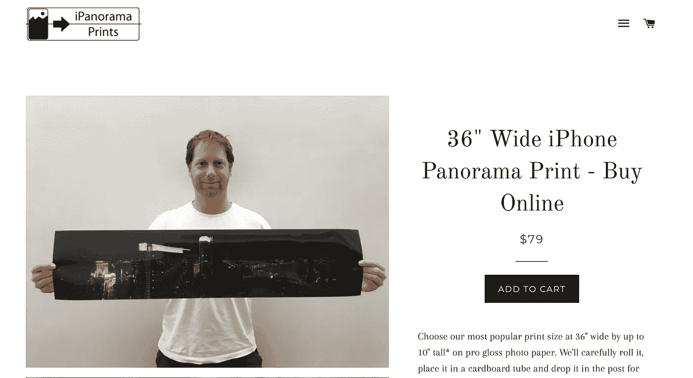
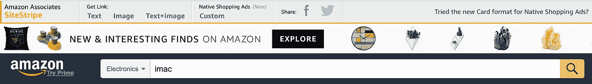
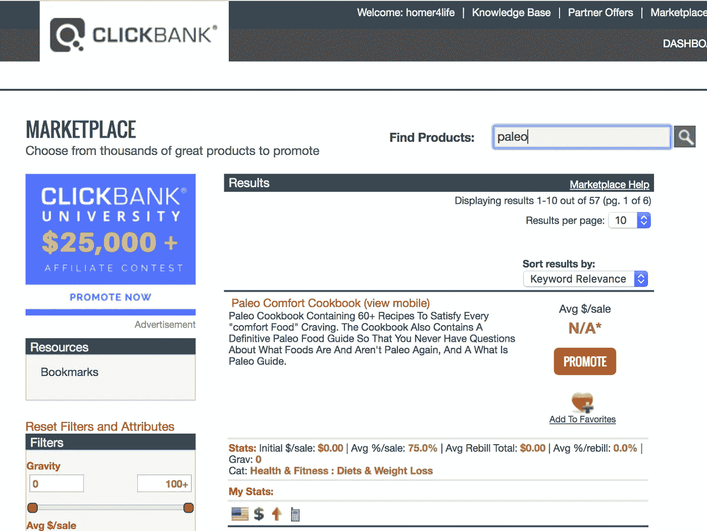
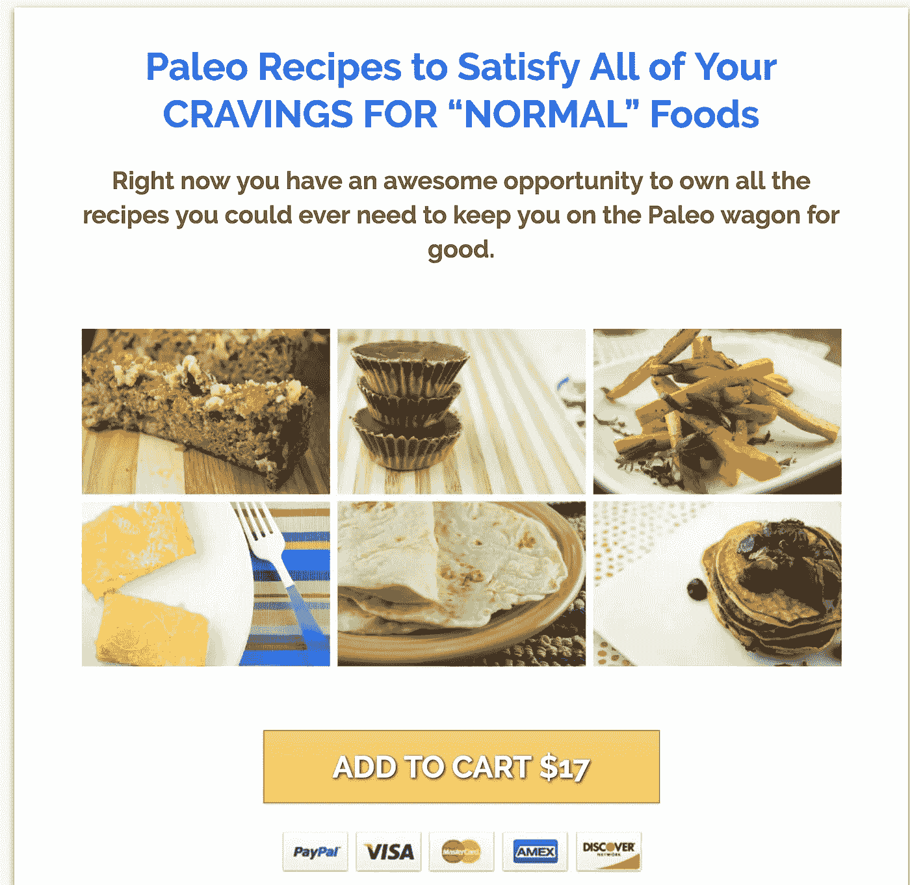
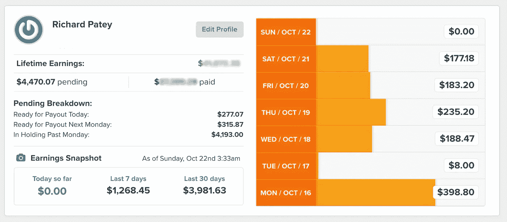

# 如何建立一个权威网站“缪斯”

> 原文：<https://medium.com/hackernoon/how-to-build-authority-site-muse-1882afc527bf>

2012 年，我第一次阅读了蒂姆·费里斯的《每周四小时工作制》，六个月后，我开始了我的第一次 FHWW 缪斯尝试 [iPanorama 版画](https://richardpatey.com/how-to-print-your-panorama-iphone-photos/)。

Yup that’s me

当时，让我犹豫了六个月的事情是强调创造你自己的产品，以及花费蒂姆推荐的 500 美元左右的广告费用。这是为了看看广告支出是否有利于向你为测试产品创建的销售页面发送流量(针对你了解并属于的受众)。

在那个时候，作为一个只有免费增值模式的新企业家，500 美元是一个太大的心理障碍。

然而，这本书比我读过的任何一本书都更能改变我对网络可能性的看法，因此这篇文章没有批评的意思(我是蒂姆的忠实粉丝)，然而我认为新企业家很难:

*   创造一个产品(甚至是一个信息/数字产品)
*   构建销售页面
*   学习付费广告(比如谷歌 Adwords 或者现在的脸书)

我认为对新创业者来说比较容易的是**简单的把别人的产品作为加盟**；企业谁已经创建了自己的转换销售网页或产品网页，为您发送您的流量。

这样你就不需要有付费广告预算了。你可以简单地通过创建你自己的内容来产生流量，在你熟悉的任何媒体上，让它在谷歌上排名，并在你熟悉的平台上推广，无论是 Twitter 还是论坛。

实际上，Tim 在“收入自动驾驶仪 I Finding A Muse”的工具和技巧部分提到，通过 Clickbank 和 Commission Junction 等附属网络对产品进行试验，作为概念验证，以找到您自己要创建的产品。

**在这篇文章中，我认为简单地将他人的产品作为代销商进行营销，而不打算创建自己的产品，会更容易、更好。**

在本文中，您将了解到:

1.  为什么我相信建立一个内容“权威网站”是每月产生足够的被动收入来取代全职工资的最佳策略。
2.  我所知道的实现这一目标的三种最佳商业模式/盈利方法。
3.  如何建立营销渠道，以产生线索，并转化为客户。

# 缪斯数学——定义挑战

我们的目标是建立一个基于网络的业务，以每周不到 4 小时的业主时间，尽快产生平均美国个人收入。

根据维基百科，美国平均个人收入为 44510 美元，相当于 3709 美元/平方米。让我们把这个数字四舍五入到 4000 美元/平方米(或者蒂姆所说的月总收入)。

如前所述，我觉得 500 美元的广告预算对新创业者来说太多了。为了让有经验的在线企业家也对这个挑战感兴趣，我要说我们只有 50 美元/m 的初始预算来投资产生 4k 美元/m。

那么，在 2019 年，以仅 50 美元/米的起始预算尽快实现被动月环比 4k 美元/米的最佳选择是什么？

正如蒂姆在书中提到的，当建立一个 muse 在线业务时，你需要**确保你进入了一个足够大的市场**。

我的第一次缪斯尝试没有成功。

我买了一个专注于打印人们在 iPhone 上拍摄的全景照片的域名，而不是一个专注于 iPhone 摄影的大型网站。我受限于我能创造的内容类型，我能提供的产品类型，以及我能关注的关键词(人们使用的搜索短语)的数量。

【nichepursuits.com、authorityhacker.com 和 empireflippers.com 分别有[的精彩帖子](http://www.nichepursuits.com/4-key-strategy-differences-small-niche-sites-authority-sites/)、关于[的讨论](https://www.authorityhacker.com/what-is-an-authority-site/)[和](https://empireflippers.com/debate-niche-sites-vs-authority-sites/)的争论。例如，利基网站将是[家庭帐篷中心](https://www.familytentcenter.com/10-person-tent/)，然而权威网站将是[户外装备实验室](https://www.outdoorgearlab.com/)。

印刷业务的收入不足以维持生活，但我最终在 2016 年在帝国脚蹼上卖了它，获得了几年的利润(现在你会接近 3 年的利润)。

# 2019 年设计缪斯

回到蒂姆写这本书的时候，购买意向关键词的广告词点击量通常是 5-15 美分，你可以通过向销售页面发送冷流量立即产生 3-4 倍的广告支出回报。蒂姆在他的书的[缪斯数学](https://fhww.files.wordpress.com/2012/02/musemath.pdf)附录中提到了用他的 BrainQuicken 补充来做这件事。

问题是，在 2019 年，点击通常至少要贵 10 倍，对于任何不是 Adwords 专家的人来说，让购买意图点击立即盈利是非常困难的。相反，你需要使用弹出窗口、[电子邮件营销自动化](https://richardpatey.com/mailchimp-vs-drip/)和营销渠道等方法从每个访问者身上榨取更多的钱，以弥补你的获取成本。

幸运的是，脸书广告和漏斗软件填补了这一空白，但需要一种不同于书中所述的策略。

根据我的经验，脸书的每次点击成本还不到 Adwords 的一半，你可以用他们的[受众洞察](https://www.google.co.uk/url?sa=t&rct=j&q=&esrc=s&source=web&cd=1&ved=0ahUKEwj4u9_V6uHPAhUCOxoKHfdPDW8QFggcMAA&url=https%3A%2F%2Fwww.facebook.com%2Fbusiness%2Fnews%2Faudience-insights&usg=AFQjCNEdFWh4KN-EZ4L2BUan8L9BK0UUmg&sig2=GQd_WMbP5dP31OBTkpSXtQ&bvm=bv.135974163,d.d2s)工具瞄准利基受众，这在谷歌上是不可能的。

然而，在脸书，人们并不处于购买状态，你必须通过大量信息内容来吸引他们的兴趣，然后产生产品评论风格的内容。

# 如何建立一个权威网站

对于那些刚开始构建内容网站的人，这里有一个快速的十大入门清单。

1.  选择一个合适的领域，一个你能理解并能写至少 50 页内容的领域(即使你不是最后写它的人)。这个小众应该是“女子单板滑雪”之类的两三个字的词组。
2.  为你的利基市场购买一个不会限制你的品牌域名。你希望开始专注于一个细分市场，但能够增加额外的细分市场，成为权威——我使用 [123 Reg](http://www.123-reg.co.uk/) ，因为我是英国人，但也是 [Godaddy](http://www.godaddy.com/) 。
3.  然后做关键词研究，在利基中找到一个理想的三四个单词短语的子利基。使用诸如 [Ahrefs 关键字浏览器](http://geni.us/ahrefs)之类的工具来寻找“最佳”关键字，例如“最佳女子滑雪板”。这些短语应该相对没有竞争力，但至少应该有几百个搜索短语。
4.  购买虚拟主机——我使用一个共享的 [Dreamhost](https://www.dreamhost.com/r.cgi?521458%20) 账户，然后将盈利的网站转到他们自己的托管服务器上。
5.  安装 [Wordpress](https://wordpress.org/) 并选择一个主题，免费是好的开始，我倾向于为我的网站使用 [Thrive 主题](https://thrivethemes.com/affiliates/ref.php?id=5919_8)。
6.  创建一个[谷歌分析](http://analytics.google.com/)账户，获取代码并安装一个[跟踪代码 wordpress 插件](https://en-gb.wordpress.org/plugins/tracking-code-manager/)来添加代码
7.  安装 [Yoast SEO 插件](https://yoast.com/wordpress/plugins/seo/)来优化你的关键词(搜索短语)内容，人们正在搜索谁可能会购买你想作为代销商推广的产品
8.  为你的子领域中的顶级产品写下个人的**产品评论内容**，并写一篇比较文章，将它们相互比较。
9.  使用[buzzsumo.com](http://buzzsumo.com/)或 [Ahrefs 内容浏览器](http://geni.us/ahrefs)为你的子领域关键词找到最好的**信息内容**。
10.  编写[更好的内容](http://backlinko.com/skyscraper-technique)和[在社交渠道](https://blog.kissmetrics.com/17-advanced-methods/)上推广，并通过[电子邮件推广](https://richardpatey.com/influencer-outreach-ninja/)到链接到现有内容的网站。

# 如何从权威网站赚钱

对我来说，这可以归结为三个选择之一。

## 1)亚马逊子公司

最简单的方法是写一些内容，提及亚马逊上正在销售的产品。你可以想象，作为世界上最大的在线市场，这并没有太大的限制。你只需注册一个[亚马逊联盟账户](https://affiliate-program.amazon.com/gp/associates/join/landing/main.html),然后获取你想从中赚取佣金(通常在 6%左右)的商品的联盟链接。

注册后，使用出现在亚马逊顶部的[亚马逊网站条纹](http://Amazon SiteStripe)，你可以抓取一个简单的文本链接、图片或两者都有。

权威黑客有一个[大指南](https://www.authorityhacker.com/amazon-associates/)可以完整解释。

**优点**

非常容易赚钱

**缺点**

需要大量内容和流量才能达到 4k/m

Tung Tran 是亚马逊联盟专家，在他的优秀博客[cloudliving.com](http://cloudliving.com/)上，他正在挑战从一个权威网站[thankyourskin.com](http://thankyourskin.com/)获得 1 万美元/米。在他的一次更新中，他提到花了一年时间才达到 4k/m，这需要每月超过 150，000 的访问者，每月产生超过 50，000 的亚马逊点击量。

当时在谷歌上搜索该网站(site:thankyourskin.com)时，它有 170 条强有力的内容(现在已经超过 500 条)。非常有趣的是，亚马逊产品页面的转化率超过了 6%——在你自己的电子商务网站 shopify 上的转化率应该是 2%。

## 2)点击银行

为了有可能更快取得成效，在 clickbank.com 上推广其他人的数码产品是值得关注的。Clickbank 是众多绩效营销网络中的一个，它在大量利基市场提供各种各样的电子书、在线课程和会员资格。

例如，如果你对古生物学感兴趣，你可以推销一本烹饪书:

赚钱的方法是让人们去点击银行上的销售页面，这个页面是经过优化的，一定比例的人会购买。在我们的示例中，销售页面是[这里是](http://www.neelyquinn.com/paleo-comfort-cookbook/)，如下所示:

然而，你首先要确保你收集了人们的电子邮件，然后再把它们发送到其他人的页面上。

其工作原理是，你创建令人敬畏的内容，然后在帖子中提供所谓的[内容升级](http://www.smartpassiveincome.com/content-upgrade/)，提供关于他们刚刚消费的更多信息，以换取留下电子邮件。一旦人们选择了，你可以直接发送到 Clickbank 上的报价，但通常你需要将他们发送到所谓的桥梁页面，在那里你祝贺他们选择，介绍你自己或品牌，然后建议他们也在 Clickbank 上查看报价。

一旦你有了某人的电子邮件地址，你就需要设置一个自动回复器来把这条线索培养成客户。通常情况下，只有不到 2%的人最终会购买你的产品，所以你需要通过一系列的电子邮件，给出价值并重新介绍产品，来尝试转化剩下的 98%的人。此外，通过创建一个更长的序列，您可以在 clickbank 上添加多个报价，这将大大增加销售线索的终身价值，但这很难跟踪。

我推荐并使用[的滴滴](https://drip.pxf.io/c/470780/390571/5674)，它现在有一个 0 美元的免费计划，我写了为什么我从 [Mailchimp 转到滴滴](https://richardpatey.com/email-marketing-automation-leaving-mailchimp-drip/)。

## 点击银行联盟营销漏斗结构

内容>内容升级(销售线索磁铁)> bridge page > clickbank 优惠。

这种方法的要点是，你只需要几篇很好的内容转化为线索，就能获得 4k/m 的收入。[authorityhacker.com](http://authorityhacker.com/)的人通过这种渠道在他们的权威网站[healthambition.com](http://authorityhacker.com/)上发了一篇博文，达到 2500 美元/m，正如本播客第[集](https://www.authorityhacker.com/product/)中提到的。

**优点**

只需要一些好的内容就可以达到 4k/m

**缺点**

需要维持流量以维持月销售额，难以计算出客户终身价值

# 3)重复性软件调试

软件即服务(SaaS)业务估值高的原因是其每月经常性收入(MRR)、高利润和高终身客户价值(LTV)的可预测商业模式。

由于这一点，软件公司可以向代销商支付丰厚的经常性佣金，让人们注册他们的平台。多年来，我一直在为 Leadpages 和 Drip 以及我的[工具页面](https://richardpatey.com/tools)上的所有其他公司做这件事，但直到我积极开始用我之前的业务[漏斗引擎](https://funnelengine.com/templates)推广诸如 clickfunnels 等附属程序[之类的软件，我才意识到我可以靠做这件事来全职谋生。](https://richardpatey.com/likes/clickfunnels)

**优点**

代销商收入每个月都在增长，你正在以更高的倍数积累资产。我以超过 5 万美元的价格[出售了漏斗引擎。](https://richardpatey.com/productized-to-authority-site-exit/)

**缺点**

有点局限于网上赚钱的空间，除非能有创意和目标利基谁可以受益

# 结束语

我认为最容易理解和使用的商业模式是亚马逊联盟，在亚马逊上写内容和链接到产品，还有一些 AMZ 课程。

如果你已经有了漏斗的经验，那么点击银行是一个很好的赚钱方式。

然而，对我来说，没有什么比简单地写你已经在使用的网络和营销软件并通过链接赚取佣金更容易的了。

你可以在这里阅读更多关于我为什么更喜欢推广软件[的信息。](https://richardpatey.com/promoting-software/)