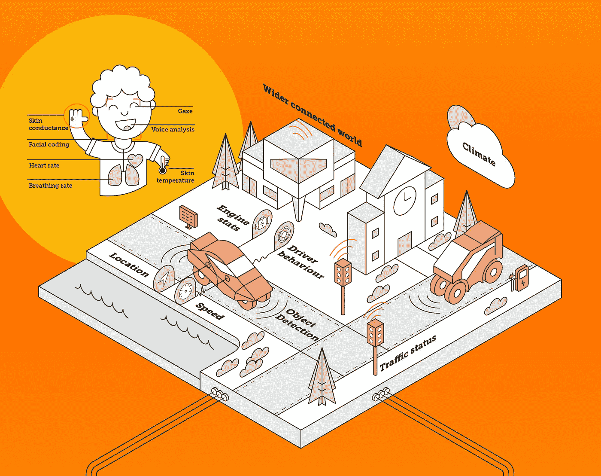
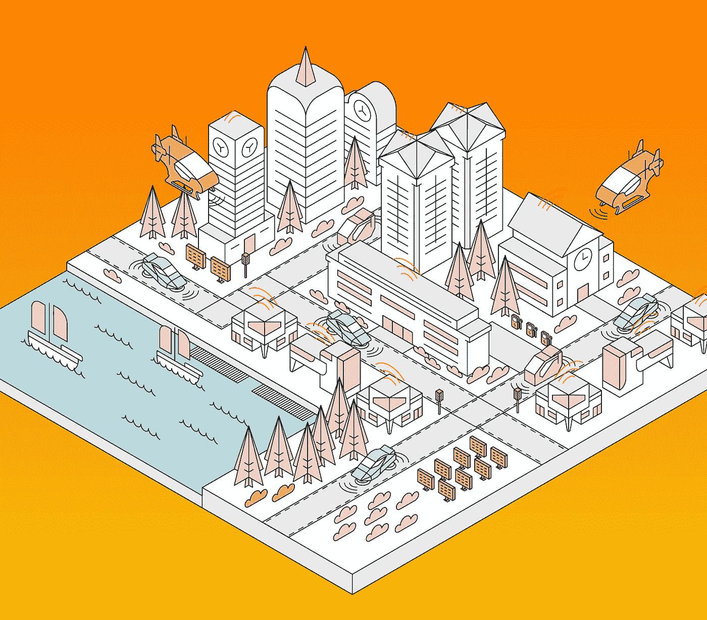

# 如何建造情感智能交通

> 原文：<https://medium.com/hackernoon/how-to-build-emotionally-intelligent-transportation-e6c0e62b58ba>

正如我们和其他人已经说过的那样，[我们的车辆很快就会知道我们的感受](/@ben.bland/the-role-of-human-emotions-in-the-future-of-transport-f390bc3e56eb)，并实时对我们的情绪做出反应。那么，什么样的技术和流程将支撑这个新时代的[情感](https://hackernoon.com/tagged/emotionally)智能[交通](https://hackernoon.com/tagged/transport)解决方案呢？

> 请参见[随附的信息图](https://sensum.co/img/sensum-empathic_mobility_tech_stack.png)快速浏览，或者继续阅读深入了解。

Take a tour through the world of empathic mobility in the infographic accompanying this story – see link above.

在不深究如何测量人们情绪的基础的情况下，让我们明确一下基本前提:

*一个人生理上的变化可以预示其情绪状态的变化。*

换句话说，我们可以从身体内部或身体上的变化推断出情绪反应——心率、面部表情、声调、呼吸频率等等。现在，越来越便宜和精确的传感器使我们能够在几乎任何环境下测量人类的情绪。

通过将人类数据插入我们的车辆，它们可以被训练对我们的情绪状态做出反应。这可以提供许多好处，从救生安全，到舒适和娱乐。如果它知道你快乐、焦虑、心烦意乱、疲惫、喝醉或有医疗事件，你的乘坐可能会非常不同。

这是*移情移动*，这里是移情移动堆栈中一些关键技术的快速浏览。

# 首先，收集你的数据

虽然有许多数据信号可以用来推断情绪反应，但车内环境有一些独特的限制和机会。当前集成到下一代传输中的主要数据类型包括:

## 面部编码

来自指向乘客面部的摄像机的视频可以针对他们的面部表情进行处理。这样做的好处是不需要在硬件解决方案上有很大的飞跃，你只需要在驾驶舱中嵌入一个摄像头，面向乘客。

另一方面，数据信号可能会受到各种因素的影响，包括照明条件、肤色/种族、眼镜、面部毛发和头部运动。任何有意义的信号也仅限于我们开车时面部表情的频率，而大多数时候(希望)我们面前没有人可以表达我们的感受。

## “内部”生物特征

我们身体中存在各种隐藏的、无意识的变化，这些变化可以给我们提供用户情绪状态的连续和高频读数。根据我们的经验，排名前几位的是心率、皮肤电导和呼吸频率。这些通常使用消费级或医疗级可穿戴设备来测量。它们可能是有见地的信息来源，但我们不能指望每个人每次想去某个地方旅行时都戴上腕带或胸带之类的东西。

生物特征信号的检测开始从身体转移到侵入性较小的形式，如座位上的传感器。甚至还有远程、非接触式的方法来测量心率和呼吸等数据，通常是通过用户身体反射信号来实现的。这一领域的领导者包括红外摄像机、激光器和雷达。我们已经与几家正在探索如何将这种技术集成到他们下一系列车辆中的汽车制造商以及其数据可以添加到组合中以建立统一解决方案集的技术公司进行了交谈。

## 声音

你只需要一个麦克风就可以将用户的语音记录发送给软件，软件可以对其进行分析，以获取情绪状态等模式。与相机一样，这种方法的优势在于需要相当低的传感器硬件，但仍然需要一些复杂的软件来消除背景噪音，分离多种声音等等。同样，我们并不总是显示面部表情，语音分析只能在居住者说话时工作。

## 语境

即使你的下一个马达布满了武器级的生理传感器，也没有人工智能系统能够完美地解释你身体的行为以获得有用的见解。心率突然加快或皱眉头本身并不一定意味着什么。你可能正在接近一个潜在的事故，或者你只是想起来你忘了把猫放出去。

这就是为什么我们需要尽可能多的背景资料。我最近已经更详细地论证了这一点——参见:[传感器融合:测量真实情感的唯一方法](/adventures-in-consumer-technology/sensor-fusion-the-only-way-to-measure-true-emotion-28af9b6fb0a4)——所以我在这里不会太用力。但是，让我们简要浏览一下移情车辆可以用来丰富其对乘员的理解的一些上下文数据类型。我们可以将他们大致分为两大阵营:

**车辆**。遍布驾驶舱和引擎盖下的传感器已经可以告诉我们很多关于车辆正在做什么。这些信息包括发动机性能统计、车内气候条件、信息娱乐系统的状态，以及关于车辆运动和驾驶员行为的信息，如速度、位置、加速度、制动等。

**环境**。在轮子上的金属盒子外面，有一个巨大的数据生态系统可供我们进一步了解盒子里的人在感受什么和做什么。想想看，当外部传感器向车辆输入关于附近其他车辆或行人、当前天气状况、前方交通状况、乘客的日常安排或最近的睡眠模式的数据时，车辆中的人工智能将变得更加准确和相关……这个列表是无穷无尽的。

这种数据连接矩阵的新兴术语涵盖了从居住者身体内部到全球物联网和云基础设施，有助于说明网络结构:

*   **V2H** :车对人。
*   **V2V** :车对车。
*   **V2I** :车辆对基础设施。
*   **V2X** :车辆对——‘一切/任何东西’。

哦，但是已经有太多的东西被扔掉了。怎么样:

*   **V2P** :车辆对行人。
*   **V2D** :车辆对设备。
*   **V2G** :车辆对电网。
*   **V2H(又来了！)**:车对家。
*   **V2R** :车对路。
*   **V2S** :车辆对传感器。
*   **V2I(又来了！)**:车联网。

你明白了。

如果你想更深入地了解在驾驶座上测量情绪的技术和挑战，请跳到我们最近的故事。

In the near future, vehicles will be empathic machines, connected to the data-rich world around them.

# 接下来，轻轻地搅动你的数据流

现代车辆中运行的当前传感器组已经足够复杂。现在，在汽车制造商接下来的几个生产周期中，我们可能会看到传感器的爆炸式增长，不仅是在数量上，而且在收集的不同类型和数量的数据上。甚至在 2015 年，日立声称“T26 今天，联网车辆产生的数据量超过 25GB/小时 T27”。随着汽车变得越来越智能，数字交通可能会快速增长。

为了将每种数据类型放在正确的位置以便后续处理，车辆需要充当[传感器融合](https://en.wikipedia.org/wiki/Sensor_fusion)平台。它的机载计算机担负着同步所有不同类型和频率的输入数据的重任。然后，在带宽允许的情况下，它们可以被传递到车载或外部处理器，以收集关于车辆及其乘客情况的见解。

# 现在烹调你的数据

新一代的*情感人工智能*处理软件旨在从海量的传感器数据中获取有用的情感洞察。这可以有很多种方式，但基本的想法是输出价值观(例如，有多高兴、悲伤、焦虑等等)。)和通知车辆执行适当响应的事件(例如情绪或行为的变化)。

无论来自乘客的信号是面部表情、心率变异性、声调或其他生理反应的变化，情绪人工智能处理器都会检测到事件。正如我已经提到的，这些生理变化可能与其他环境数据相互关联，如一天中的时间、天气或照明条件。系统中的 AI 根据可用数据对情况进行概率推断，并将结论通知车辆。

总的来说，这是一个扫描多种来源和类型的传入数据以寻找模式，并将它们与关于用户和当前上下文的现有知识进行比较的过程。听起来熟悉吗？这就是我们人类整天做的事情。我们理解和应对情况的能力就是我们所说的*同理心*。

同理心是一种智力，因人而异，可以随着时间的推移而发展。这是聪明的一部分。以类似的方式，我们正在训练智能技术发展自己的移情形式，为我们当前的情绪和行为提供有用或有趣的回应。

# 服务时间

为了阐明端到端的过程，我将举例说明一个潜在的用户场景，并给你一个我们在 [Sensum](https://cdn.shopify.com/s/files/1/2081/7471/files/marypoppins_blu-ray-still-7_large.jpg?v=1507329594) 的系统处理它的方式的基本概述。

假设在一天繁忙的办公室工作和随后与客户的晚餐后，你很晚才开车回家。雨水冲击着挡风玻璃，让你眯着眼看前方模糊的灯光。你开始打瞌睡，但是太累了，还没注意到。

仪表板上的摄像头正在记录你的面部表情、凝视方向以及头部和身体位置的视频。与此同时，麦克风正在监听你的声调变化。座位上的接触传感器和遍布汽车外壳的远程传感器正在收集你的心率、呼吸、皮肤温度等数据。所有这些数据都在不断地流向车辆的车载人工智能芯片组。

当系统看到你的心率变异性和呼吸频率的变化时，它应该会检测到潜在的问题。当你越来越困的时候，你可能会开始翻眼皮和点头，这些都在面部编码流中表现出来。即使这些合并的数据点不足以让计算机做出决定，它也可以根据外部数据通知它天气不好、天色已晚、你忙了一天(从你的日历中推断)的事实来调整它的评估。

我们的系统处理输入数据流的方式是将它识别的任何数据类型相互比较。然后，它在情绪评分的多个“维度”上建立了用户情绪状态的概率模型，如唤醒(兴奋/放松)、效价(积极/消极)和支配(控制/顺从)。根据数据在这个维度空间中聚集的“区域”,系统能够推断出可能的情绪状态，如困倦，这可能由低觉醒、中性价和低支配性等表示。

> 如果你想了解更多，请点击这里了解我们自己的系统是如何工作的。

好了，现在车载人工智能系统正在通知你的汽车，你可能昏昏欲睡。汽车对这些信息的反应可能因车型、制造商及其软件提供商而异。例如，它可以是以下各项的任意组合:

*   **通知**:来自你的车载语音助手的语音通知或者仪表盘上显示的警告。
*   **气候控制**:降低蚕茧的温度，打开流向你面部的气流。
*   媒体:将你的音乐切换到一个更乐观的播放列表。
*   **驾驶员控制**:如果你的汽车有自主能力，它可以要求部分或完全控制车辆。
*   **行程规划**:汽车可能会搜索最近的加油站，并建议停车喝杯咖啡或小睡一会儿。

这是我们目前看到的移情移动技术堆栈的快速浏览。随着情绪相关技术的广泛投资，特别是来自移动领域的投资，这种移情人机交互(HMI)可能用不了多久就会上路。主要汽车制造商已经制造了演示车辆，包括[丰田](http://www.wired.co.uk/article/toyota-concepti-car-ai-yiu)和[奥迪](https://www.youtube.com/watch?v=XZSHUmPx0tU)，所以我们可能会在两三年后的下一轮生产模型中看到重要的移情 HMI。

# 进一步服务建议

*   这个故事的信息图:[移情流动之旅](https://sensum.co/img/sensum-empathic_mobility_tech_stack.png)。
*   [Sensum 移动解决方案](https://sensum.co/mobility)。
*   [人类情感在未来交通工具中的作用](/@ben.bland/the-role-of-human-emotions-in-the-future-of-transport-f390bc3e56eb)。
*   [在驾驶座上测量情绪:来自科学前沿的见解](/@ben.bland/measuring-emotion-in-the-drivers-seat-insights-from-the-scientific-frontline-fabcfc3a842)。
*   [传感器融合:测量真实情感的唯一途径](/adventures-in-consumer-technology/sensor-fusion-the-only-way-to-measure-true-emotion-28af9b6fb0a4)。