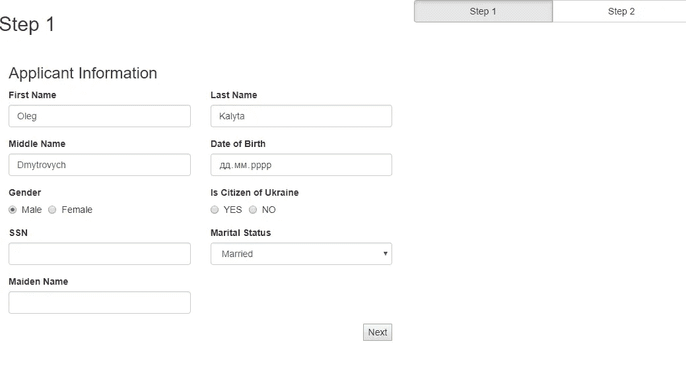

# 如何在 React/Redux 中动态构建表单？

> 原文：<https://medium.com/hackernoon/how-to-build-forms-dynamically-in-react-redux-e3a6c89a3406>

## 包含演示和源代码的分步指南

如今，将长表单拆分成多步向导、实时客户端验证、初始化数据以及使部分/字段依赖于其他字段可见，这些都不会让任何人感到惊讶。它现在是“必备”了。否则，使用复杂的表单会感觉尴尬和痛苦。在 [ProductCrafters](http://productcrafters.io/) 中，我们使用 **Redux** 进行状态管理，所以选择最好的包进行表单管理是合乎逻辑的。[**Redux-Form**](http://redux-form.com/)**(GitHub 上的约 10k 颗星星)**包含所有列出的特性和更多特性，如标准化数据的工具、字段数组等等。使用了两年多之后，我们对它非常满意。

我们正面临着客户要求有部分甚至 100%的动态形式。我们从我们的金融科技应用客户那里收到了这样的请求。最近，我们收到了一个类似的 heathlcare 应用程序请求。含义、表单结构和验证规则将从服务器获取；应根据这些数据创建表单(或向导)*,无需在客户端进行任何更改*。在这篇文章中，**我想分享自己构建这种动态表单向导的经验。**

下面是[演示](https://productcrafters.github.io/Dynamic-Redux-Form-Wizard/):

## 步骤 1:呈现单个动态字段

下面是以 Redux 形式呈现字段的常用方法:

我们需要指定字段名，以及应该呈现它的单个组件(输入、复选框、选择等)，标签是可选的，但我喜欢有一个既能描述字段又能显示字段的单个组件。

首先，我创建了示例服务器响应模拟，以呈现该字段:

为了简化本教程，我将省略获取数据和解析 JSON。我们将使用解析后的模拟。

使用这些数据来给`<Field>`提供全功能输入。

在上面的代码中，我没有使用标准的 HTML5 `<input />`。有自定义创建的组件。并且`stringToComponentMapper`使用 json 数据中的键帮助选择正确的组件。如果你以前从未使用过 redux-form，就使用默认的 HTML 5 元素:“input”、“checkbox”、“select”。

## 步骤 2:创建动态部分

Redux-form 有一个很酷的特性——**form section**。它允许将一个实体的公共字段组合在一起。

> `*FormSection*`组件使得将表单分割成更小的组件变得容易，这些组件可以在多个表单之间重用。它通过在任意深度的`*Field*`、`*Fields*`和`*FieldArray*`孩子的名字前面加上`*name*`属性中指定的值来实现。

这是我们之前写的:

用`<FormSection />`:

我对模拟数据做了一些修改，提取了有自己名字的`section`对象，并将之前的内容移到了`fields`中:

现在我们可以很容易地渲染表单部分。`FormGenerator`通过 prop 接收数据并在其上循环。然后每个部分在其字段上循环。

提取`SectionList`和`SectionRenderer`组件以避免`jsx`中的代码是有意义的。我在这里这样做不是为了让代码更短，而是为了关注动态 UI。

## 步骤 3:动态表单向导

让我们对之前的模拟进行更改:

现在让我们添加两个文件:

**WizardProdiver.js** —将记住当前向导页面并管理页面更改。在这个例子中，我还试验了最新的 React 上下文，如果这对你来说是新的，[阅读官方文档](https://reactjs.org/docs/context.html)。

并且 **PageTemplate.js** 将使用 **FormGenerator** 并在其周围创建一个表单:

最后，我们在 **Wizard.js** 中将所有东西包装在一起:

示例代码:

 [## product crafters/动态还原表单向导

### 在 GitHub 上创建一个帐户，为动态表单向导的开发做出贡献。

github.com](https://github.com/ProductCrafters/Dynamic-Redux-Form-Wizard) 

这里有一个[演示](https://productcrafters.github.io/Dynamic-Redux-Form-Wizard/)。

在本文的报告中，您可能还会发现简单的正则表达式验证。这是非常基本的动态形式。在真实的项目中，我们有更严格的要求，例如，特定字段或部分的可见性的动态规则。这可能是本文第二部分的主题:)

附言🚀我的团队**使用 React/React Native 在 3 年内构建生产应用**。我们帮助初创公司的创始人将他们的想法付诸实践。项目需要帮助吗？✉️[Oleg @ product crafters . io](mailto:oleg@productcrafters.io)