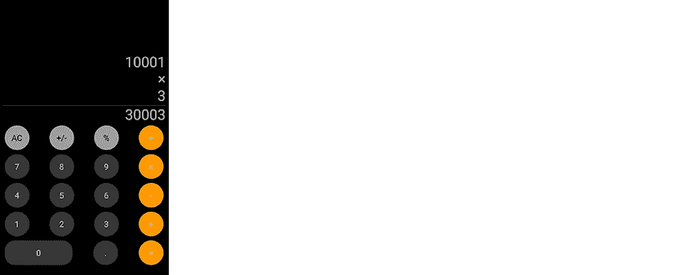
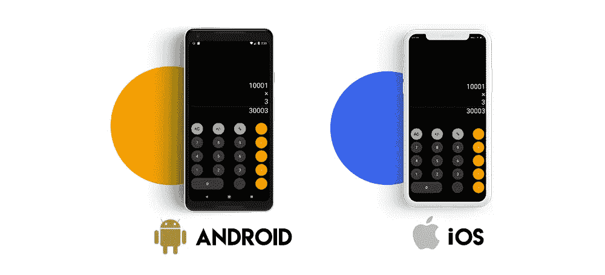

# 如何使用 Flutter 构建 iPhone 计算器

> 原文：<https://medium.com/hackernoon/how-to-build-iphone-calculator-using-flutter-fe934ce78d7e>


在 Flutter 中创建 iPhone 系统计算器的复制品是一个简单的想法。设计并不复杂，程序逻辑也是众所周知的。

让我们把重点放在 UI 设计上，因为逻辑很难教。

你可以看看我们的 [Git 回购](https://github.com/sayonetech/flutter_calculator)来获得一个完整的想法。

# 使用 Flutter 构建 iPhone 计算器应用程序

这是我们要设计的用户界面。



现在，让我们将这个视图分解成一些组件。

1.  操作数、运算符、结果和按钮使用 column 小部件垂直对齐。
2.  现在，我们使用 5 行部件来水平排列按钮。
3.  按钮有不同的设计。因此，我们需要为每种类型创建单独的小部件。

数字按钮是这样设计的:

```
import 'package:flutter/material.dart';class NumberButton extends StatelessWidget {
 NumberButton({this.text,this.onPressed});final String text;
 final Function onPressed;@override
 Widget build(BuildContext context) {
   return Padding(
       padding: const EdgeInsets.all(5.0),
       child: RawMaterialButton(
           shape: const CircleBorder(),
           constraints: BoxConstraints.tight(Size(60.0, 60.0)),
           onPressed:onPressed,
         child: Text(
           text,
           style: TextStyle(color: Colors.white, fontSize: 20.0),
         ),
         fillColor: Color.fromRGBO(56, 54, 56, 1.0),
           ));
 }
}
```

数字按钮是一个无状态小部件，它接受一个字符串“text”和一个函数“onPressed”。它是使用 RawMaterialButton 实现的，因为我们需要按钮的尺寸特别大。给定的形状是一个大小为 60 的圆。

Zero 按钮的 UI 有点不同，所以我为它创建了一个定制的小部件。

```
import 'package:flutter/material.dart';class ZeroButton extends StatelessWidget {
  ZeroButton({this.onPressed});final Function onPressed;
  @override
  Widget build(BuildContext context) {
    return Padding(
      padding: const EdgeInsets.all(5.0),
      child: Container(
        height: 60.0,
        width: MediaQuery.of(context).size.width / 2.5,
        decoration: BoxDecoration(
            borderRadius: BorderRadius.circular(25.0),
            color: Color.fromRGBO(56, 54, 56, 1.0)),
        child: MaterialButton(
          onPressed: onPressed,
          child: Text(
            "0",
            style: TextStyle(color: Colors.white, fontSize: 20.0),
          ),
        ),
      ),
    );
  }
}
```

零按钮的宽度是相对于屏幕宽度给出的。

现在有一个二元运算符按钮和一元运算符按钮，它们只是在文本颜色、背景颜色和动作上有所不同。

```
import 'package:flutter/material.dart';class BinaryOperatorButton extends StatelessWidget {
  BinaryOperatorButton({this.onPressed,this.text});final text;
  final Function onPressed;@override
  Widget build(BuildContext context) {
    return Padding(
        padding: const EdgeInsets.all(5.0),
        child: RawMaterialButton(
          shape: const CircleBorder(),
          constraints: BoxConstraints.tight(Size(60.0, 60.0)),
          onPressed:onPressed,
          child: Text(
            text,
            style: TextStyle(color: Colors.white, fontSize: 20.0),
          ),
          fillColor: Colors.orange,
        ));
  }}
```

对于一元运算符按钮:

```
import 'package:flutter/material.dart';class UnaryOperatorButton extends StatelessWidget {UnaryOperatorButton({this.text,this.onPressed});final String text;
  final Function onPressed;@override
  Widget build(BuildContext context) {
    return Padding(
        padding: const EdgeInsets.all(5.0),
        child: RawMaterialButton(
          shape: const CircleBorder(),
          constraints: BoxConstraints.tight(Size(60.0, 60.0)),
          onPressed:onPressed,
          child: Text(
            text,
            style: TextStyle(color: Colors.black, fontSize: 20.0),
          ),
          fillColor: Colors.grey,
        ));
  }
}
```

现在整个布局是在 calculator.dart 中完成的。下面给出了它的构建方法。

```
@override
Widget build(BuildContext context) {
  return new Scaffold(
    backgroundColor: Theme.of(context).primaryColor,
    body: SafeArea(
      child: Padding(
        padding: const EdgeInsets.all(8.0),
        child: Column(
          children: <Widget>[
            Expanded(
              child: Container(
                child: Align(
                  alignment: Alignment.bottomRight,
                  child: Column(
                    crossAxisAlignment: CrossAxisAlignment.end,
                    mainAxisAlignment: MainAxisAlignment.end,
                    children: <Widget>[
                      operand1 != null
                          ? SingleChildScrollView(
                              scrollDirection: Axis.horizontal,
                              child: Text(
                                operand1 is double
                                    ? operand1.toStringAsFixed(2)
                                    : operand1.toString(),
                                style: _whiteTextStyle,
                                textAlign: TextAlign.right,
                              ),
                            )
                          : Container(),
                      operator != null
                          ? Text(
                              operator.toString(),
                              style: _whiteTextStyle,
                              textAlign: TextAlign.right,
                            )
                          : Container(),
                      operand2 != null
                          ? Text(
                              operand2.toString(),
                              style: _whiteTextStyle,
                              textAlign: TextAlign.right,
                            )
                          : Container(),
                      result != null
                          ? Divider(
                              height: 5.0,
                              color: Colors.white,
                            )
                          : Container(),
                      result != null
                          ? SingleChildScrollView(
                              scrollDirection: Axis.horizontal,
                              child: Text(
                                result is double
                                    ? result.toStringAsFixed(2)
                                    : result.toString(),
                                style: _whiteTextStyle,
                                textAlign: TextAlign.right,
                              ),
                            )
                          : Container(),
                    ],
                  ),
                ),
              ),
            ),
            Row(
              mainAxisAlignment: MainAxisAlignment.spaceBetween,
              children: <Widget>[
                UnaryOperatorButton(
                  text: "AC",
                  onPressed: () {
                    _otherOperationAction(OtherOperation.clear);
                  },
                ),
                UnaryOperatorButton(
                  text: plus_or_minus_sign,
                  onPressed: (){_unaryOperationAction(UnaryOperation.changeSign);},
                ),
                UnaryOperatorButton(
                  text: percent_sign,
                  onPressed: (){_unaryOperationAction(UnaryOperation.percent);},
                ),
                BinaryOperatorButton(
                  text: divide_sign,
                  onPressed: () {
                    _binaryOperationAction(BinaryOperation.divide);
                  },
                )
              ],
            ),
            Row(
              mainAxisAlignment: MainAxisAlignment.spaceBetween,
              children: <Widget>[
                NumberButton(
                    text: "7",
                    onPressed: () {
                      _numberButtonAction("7");
                    }),
                NumberButton(
                    text: "8",
                    onPressed: () {
                      _numberButtonAction("8");
                    }),
                NumberButton(
                    text: "9",
                    onPressed: () {
                      _numberButtonAction("9");
                    }),
                BinaryOperatorButton(
                  text: multiply_sign,
                  onPressed: () {
                    _binaryOperationAction(BinaryOperation.multiply);
                  },
                )
              ],
            ),
            Row(
              mainAxisAlignment: MainAxisAlignment.spaceBetween,
              children: <Widget>[
                NumberButton(
                    text: "4",
                    onPressed: () {
                      _numberButtonAction("4");
                    }),
                NumberButton(
                    text: "5",
                    onPressed: () {
                      _numberButtonAction("5");
                    }),
                NumberButton(
                    text: "6",
                    onPressed: () {
                      _numberButtonAction("6");
                    }),
                BinaryOperatorButton(
                  text: minus_sign,
                  onPressed: () {
                    _binaryOperationAction(BinaryOperation.subtract);
                  },
                )
              ],
            ),
            Row(
              mainAxisAlignment: MainAxisAlignment.spaceBetween,
              children: <Widget>[
                NumberButton(
                    text: "1",
                    onPressed: () {
                      _numberButtonAction("1");
                    }),
                NumberButton(
                    text: "2",
                    onPressed: () {
                      _numberButtonAction("3");
                    }),
                NumberButton(
                    text: "3",
                    onPressed: () {
                      _numberButtonAction("3");
                    }),
                BinaryOperatorButton(
                  text: add_sign,
                  onPressed: () {
                    _binaryOperationAction(BinaryOperation.add);
                  },
                )
              ],
            ),
            Row(
              mainAxisAlignment: MainAxisAlignment.spaceBetween,
              children: <Widget>[
                ZeroButton(onPressed: (){_zeroButtonAction();},),
                BinaryOperatorButton(
                  text: ".",
                  onPressed: () {
                    _otherOperationAction(OtherOperation.addDecimal);
                  },
                ),
                BinaryOperatorButton(
                  text: equal_sign,
                  onPressed: () {
                    _otherOperationAction(OtherOperation.equals);
                  },
                )
              ],
            ),
          ],
        ),
      ),
    ),
  );
```

# 最终结果



这是它在两台设备上的外观。我们的颤振实验取得了良好的效果。SayOne 移动团队自 2017 年以来一直致力于 Flutter。我们从未如此热衷于任何其他技术。在接下来的几天里，请继续关注我们对 Flutter 的更多实验！

如果你有兴趣了解更多关于我们的颤振项目，并想尝试一下，写信给我们在 hello@sayonetech.com[或访问](mailto:hello@sayonetech.com) [SayOne](https://www.sayonetech.com/contact/) 。

*最初发布于*[*https://www . sayone tech . com/blog/how-build-iphone-calculator-using-flutter/*](https://www.sayonetech.com/blog/how-build-iphone-calculator-using-flutter/)*。*