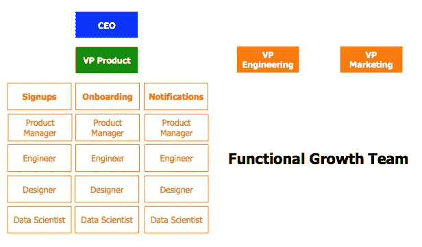

# 如何建立你的成长团队以获得持续的成功

> 原文：<https://medium.com/hackernoon/how-to-build-out-your-growth-team-for-sustained-success-2f13a2f2e7c5>

对于任何新业务来说，稳定的增长是重中之重。建立一个能够持续成长并与你的企业一起成长的团队是一件棘手的事情。

有很多关于成长[黑客](https://hackernoon.com/tagged/hacking)和快速技巧的喋喋不休；很难掌握如何建立一个为长期成功而设计的成长团队。

不管你身处哪个行业，也不管你有多喜欢速战速决——经验告诉我，你需要采取常识性的方法来建立你的增长团队。这一切都始于确保你的资金，然后[确定你需要雇用的角色](https://blog.markgrowth.com/how-to-assemble-a-perfect-team-and-raise-a-startup-from-scratch-b6d4214ca49d)，然后欢迎这些新员工进入一种文化，而不是出于所有正确的原因拥抱增长。

以下是专家对你成长的每个阶段的看法。

# 最重要的事情——获得资助

没有人是免费工作的，顶尖的成长黑客人才很受欢迎。要雇佣一个成长团队，你需要钱。但传统的商业融资是一个极其缓慢且充满挑战的过程。它还因缺乏透明度而臭名昭著，在一个旨在让贷款人而不是借款人受益的系统中。

为了快速增长，你需要考虑所有的替代融资方案，这在一个喜欢把事情变得模糊不清的行业中极具挑战性。

替代融资专家和 Fundwise Capital 的联合创始人 Leo Kanell 认为，小企业可以从各种来源拼凑可行的融资，作为完全知情的消费者，他们应该能够这样做。

“了解如何获得无担保信贷是一个非常重要的工具，可以让你去你想去的地方，”他在最近与 Kajabi 的[案例研究中解释道，kaja bi 是 Fundwise 用来发布教育材料的平台。在 Fundwise 的网站上，您可以了解无担保融资选项，如 0%贷款、循环信贷额度、定期贷款，以及传统信贷额度和 SBA 贷款。因此，你可能根本不需要求助于一个可疑的 ICO 或卑躬屈膝地寻求 VC 注射。](https://blog.newkajabi.com/build-a-powerful-team-with-this-week-s-kajabihero)

花时间真正调查你的融资选择，并制定一个可靠的融资计划。

# 谁在你的成长团队中？

一旦你有了流动预算，是时候专注于团队建设了。首先确定你需要的关键成员。

著名的成长专家 Sujan Patel 建议说:“以下七个角色都需要考虑，尽管在一些组织中，一个人可能会负责多个职位，而另一些组织会有几个人专门负责每个职能。”。

他建议公司从这些角色开始:

*   数据分析师
*   营销副总裁
*   内容营销人员
*   社交媒体和社区经理
*   成长黑客
*   项目管理人
*   全栈开发者

请注意，出于某种原因，他没有把烟火专家列入七人名单。随着你的成长，这些角色可能会重叠和扩展，但这会给你一个坚实的基础。随着你的成长，帕特尔提醒我们，成长不一定总是与营销重叠。

“在我从事营销工作的时间里，我所做的一些最大、最有影响力的改变不是我发起的活动，而是我在与销售团队、支持团队和产品团队密切合作后对产品及其支持服务所做的改变，”Patel 解释道。

为了实现这种迭代式的增长发现，将团队成员作为用户进行培训是非常重要的。通过积极的工作过程，他们经常发现看似微小却有效的方法来移动指针。通过创建一个整个团队都参与用户体验的过程来利用这些时刻。

# 合适的人担任合适的角色

当你组建团队时，请记住每个角色都有独特的个性。例如，GrowthTribe 的 [Esther Dalkmann 建议](http://blog.growthtribe.io/what-is-a-growth-team-how-to-build-one/)你应该寻找一位“敢于冒险、善于分析、富有创造力、有点坏心眼……拥有从全栈开发到有说服力的文案和数据挖掘等技能”的增长主管

另一方面，你的数据分析师“喜欢软数据(解释硬数据‘为什么’的定性信息)，并能够从中找到可操作的见解，”Dalkmann 继续说道。

[Image source](http://blog.growthtribe.io/what-is-a-growth-team-how-to-build-one/)

不要试图强行配合；这将不可避免地适得其反，使你的团队倒退，在这个过程中失去增长的动力。

# 定义您的成长文化

当你安排好你的团队时，你应该使用什么样的结构？[成长分析师安德鲁·麦金尼斯](/swlh/how-do-you-choose-the-best-growth-team-model-632ad5a85be9)解释了最常见的选项，这些选项会对你的团队文化产生重大影响。

他写道:“在采访 20 位增长领袖时，出现了两种流行模式:独立模式和功能模式。”。“对于如何在业务的可扩展增长阶段组建增长团队，这两者都是很好的起点。这是游戏的名字在右上的时候。”

[Image source](/swlh/how-do-you-choose-the-best-growth-team-model-632ad5a85be9)

当然，每种模式都有优点和缺点，但总的来说，麦金尼斯发现功能模式更受支持。

“根据我们的贡献者，当从事增长计划的人向职能部门负责人(如产品、工程等)汇报时。)，其他人相信增长指标会以正确的方式实现，”他解释道。

无论你选择哪种模式，你都需要建立一种文化，专注于正确的增长类型，以获得持续的成功。这需要确定在任何给定的实验周期中你想要优先提升的关键指标。但这也需要着眼于大局。

“当公司不惜任何代价优先考虑——并在文化上奖励——短期增长时，坏结果是常见的，”[增长策略师克里斯·博尔曼](https://chrisbolman.com/growth-team-org-structure-building/)写道。“想想 Theranos，早期 Zenefits，或者优步的各种挫折。围绕获取或保留制定短期优先事项很重要，但除非增长是可持续的，否则不可能成功。这是一个长期的过程。”

要知道增长和品牌之间的紧张是不可避免的。正如博尔曼解释的那样，“没有一家公司是完美的，这些紧张关系经常出现——增长和品牌之间的关系，或者增长和产品其他领域之间的关系——从相互尊重、透明和同情的角度来管理它们非常重要。”

当你建立了一种基于为客户增加价值的增长文化，就更容易[克服这些紧张](https://blog.markgrowth.com/how-startup-silos-literally-lead-to-death-ae0be661e2c4)并利用增长机会。例如，在 Fundwise，Kanell 和他的团队使用分析来了解他们的用户何时何地需要更多信息。他们的回应是将他们的教育分解成具体的产品，并为用户提供实时应用审查。这使得用户结果更好，这是他们保持增长的最终目标。

# 成长的大图景实际上是许多小图景

当然，总体战略和大格局是重要的，但不要忘记，一些最重要的增长机会就发生在当下。倾听客户的反馈。关注客户告诉你的事情——无论是直接的，通过社交媒体，还是通过他们的行为数据。然后训练你的团队问“我能交付给这位客户的下一个最好的东西是什么？什么能帮助他们采取下一步措施来解决问题？”

这是一个构建良好的团队满足有机增长和定位您的公司持续成功的地方。