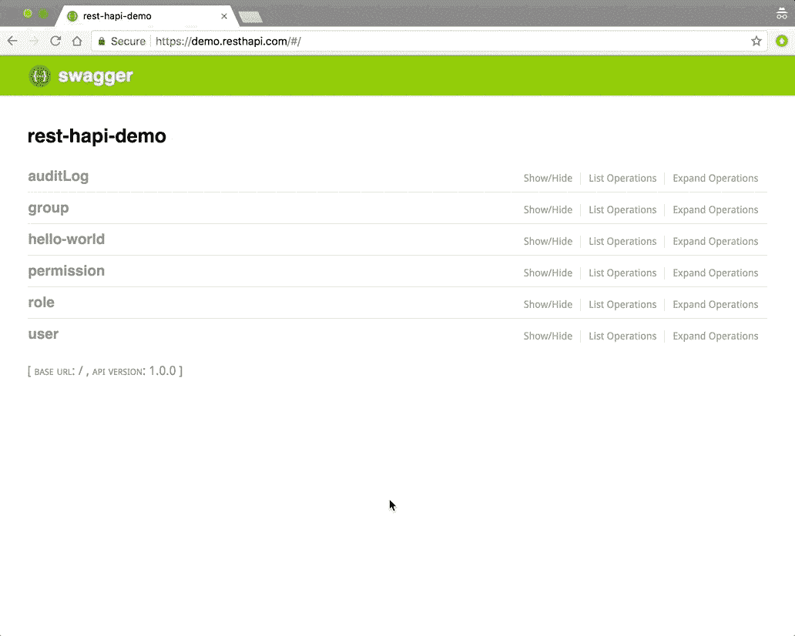

# 如何用 Node.js 快速构建强大的 REST APIs

> 原文：<https://medium.com/hackernoon/how-to-build-powerful-rest-apis-blazingly-fast-with-node-js-86d6e55a5b34>

让我们面对现实吧，如果你是一个 web 开发人员，你要和 API 打交道。不管是自己写还是用别人的，都只是工作的一部分。REST APIs 尤其常见。不幸的是，当谈到 Javascript 和 Node.js 的[狂野西部世界](https://twitter.com/nodejs/status/915607972918603776)时，编写 RESTful APIs 的[标准和良好实践](https://hackernoon.com/restful-api-designing-guidelines-the-best-practices-60e1d954e7c9)有时会被抛到脑后。

为什么？

*   因为它“更容易”
*   因为有时候“足够好”就够了
*   因为每个人的“标准”可能不同
*   …你说吧

don’t be that developer…

这些都是编写弱代码的好理由吗？当然不是，但它们仍然存在。它的人性。“走捷径”太容易了，有时在时间紧迫的情况下，这似乎是不可避免的。相信我，我也经历过。那么对此能做些什么呢？好消息是，当你有了正确的工具集时，会有更好的开发方法，如果足够幸运，你甚至会发现“正确的”方法 ***是最简单的方法*** 。我花了很长时间才找到自己的发现之路。我希望通过分享我的故事，我可以让你(和你的 API 消费者)不那么心痛。以下是我学到的…

> *如果想直接进入正题，可以跳到* ***结果*** *部分。或者参观*[https://github.com/JKHeadley/rest-hapi](https://github.com/JKHeadley/rest-hapi)

you’re in for a wild ride

# 故事

在过去的几年里，我一直在软件咨询公司 Scal.io 担任网页开发员。在此期间，我有幸学习了 Node.js，并在多个应用程序上工作，这些应用程序都服务于 RESTful APIs。起初一切似乎都很好。我的意思是，只要谷歌一下关于用 Node.js 构建 RESTful API 的任何教程，你就会发现大量关于如何在几分钟内建立并运行你自己的服务器的文章和视频。

哇！这东西很简单！(我以为)*至少一开始* …

没过多久，我就开始遇到问题了。

哦，你想要有效载荷验证？查询参数呢？我如何记录这些端点？我真的需要一遍又一遍地复制和粘贴这些路由处理程序吗？等等，你想用 MongoDB，但是[还支持关系](https://hackernoon.com/the-problem-with-mongodb-d255e897b4b)？😳

用 Node.js 编程非常灵活，这意味着即使是一个简单的任务也可以用许多不同的方法来解决。不幸的是，这意味着开发人员可以自由地[过度复杂的事情](/javascript-scene/the-single-biggest-mistake-programmers-make-every-day-62366b432308)(我们倾向于这样做)。难怪当特性请求开始堆积时，API 开发会失控。这可能很快变成一个丑陋的混乱， ***尤其是*** 如果你试图与其他开发者协调。

the king of sanity?

在一起完成了几个项目后，我的一个优秀的开发人员[朋友](https://github.com/zacharyclaysmith)想出了(并实现了)基于我们的数据模型生成 RESTful 端点的好主意。我立刻喜欢上了它。现在，我们花了更多的时间关注应用的结构和业务逻辑，而不是一遍又一遍地编写 CRUD 端点。不仅如此，任何时候我们需要新的功能(比如过滤 GET 请求)时，我们只需要为所有端点编写一次就可以了！这感觉就像一个干燥的 API 天堂😆

我知道我们正在做一些事情…

# 旅程

在我们完成这个项目后不久，我就开始研究如何利用我们已经创造的东西，把它变成一个有用的工具。最初的解决方案运行良好，但是它与项目紧密结合，仍然缺少大量的功能。我花了几天时间集思广益，重新编写代码。经过看似巨大的努力，我终于有了一个可行的解决方案。然而(像大多数开始一样)…这很尴尬。

这个工具可以工作，但是它是作为一个框架存在的，你必须直接从 GitHub (eww)中克隆出来。开发人员被迫围绕框架设计他们的项目，即使与我们最初的解决方案相比，它仍然缺乏很多功能。

I feels it tho!

幸运的是，事情才刚刚开始。我对这个项目仍然有自己的希望和梦想，现在它正式公开了，它开始慢慢地获得一些兴趣。随着开发人员给出反馈、提交问题，甚至有人开始投稿，开源的魔力开始显现！

不久之后，主要的改进就完成了，比如把这个项目变成了一个 npm 模块和一个 T2 hapi 服务器插件。我也有了一个惊人的机会(感谢 [Scal.io](http://scal.io) )在一些现实世界的项目中开发和使用这个工具。

我一直相信这个项目的核心概念，但是通过我自己的经历来验证它的有用性是令人兴奋的。

yessss

它改进得越多，我就越觉得我们真的挖掘到了 RESTful API 开发的金矿。最终的代码是一致的、健壮的，并且易于遵循(标准…耶！).不仅如此，以前需要几天或几周才能开发的东西现在只需几个小时就能完成！

# 结果呢

rest-hapi

经过近两年的努力工作和开发，我很高兴向 web 开发社区介绍 rest-hapi v1。到目前为止，我们已经能够将许多有用的功能打包到该工具中，包括:

*   在[中间件](https://jkheadley.github.io/rest-hapi/docs/middleware.html)的支持下，自动生成 [CRUD](https://jkheadley.github.io/rest-hapi/docs/creating-endpoints.html) 和[关联](https://jkheadley.github.io/rest-hapi/docs/associations.html)端点
*   [joi](https://github.com/hapijs/joi)验证
*   路线级和文件级[授权](https://jkheadley.github.io/rest-hapi/docs/authorization.html)
*   所有生成端点的 [Swagger docs](https://jkheadley.github.io/rest-hapi/docs/swagger-documentation.html)
*   [查询参数](https://jkheadley.github.io/rest-hapi/docs/querying.html)支持关联模型的搜索、排序、过滤、分页、嵌入
*   通过[审计日志](https://jkheadley.github.io/rest-hapi/docs/audit-logs.html)查看端点活动历史
*   对[政策的支持](https://jkheadley.github.io/rest-hapi/docs/policies.html)
*   [重复字段](https://jkheadley.github.io/rest-hapi/docs/duplicate-fields.html)
*   支持[“软”删除](https://jkheadley.github.io/rest-hapi/docs/soft-delete.html)
*   文档的可选[元数据](https://jkheadley.github.io/rest-hapi/docs/metadata.html)
*   mongose[包装器方法](https://jkheadley.github.io/rest-hapi/docs/mongoose-wrapper-methods.html)
*   …以及更多！

只需几个简单的数据模型，您就可以立即生成数百个记录在案的可靠端点。看看这些例子:

generating endpoints locally

querying the user collection and populating the user-role relationship

从一开始，我们的目标就是开发一个工具，允许开发者以最小的开销构建强大的 REST APIs，我相信我们已经做到了！我仍然对这个项目的未来充满希望和梦想，但是现在我为我们所取得的成就感到骄傲。

它是同类工具中唯一的吗？没有。

它适合每种情况吗？当然不是！

对你有用吗？我们希望你能[检查一下](https://github.com/JKHeadley/rest-hapi)并自己做出决定！我们希望听到您的反馈。如果你喜欢它，请在 GitHub 上给它一颗星😉

在以后的文章中，我将深入探讨 rest-hapi 背后的设计理念的更多细节，以及一些如何使用它来构建自己的优秀 REST APIs 的实际例子。

如果你想联系我，你可以通过推特[、脸书](https://twitter.com/JKHeadley)[、领英](https://www.facebook.com/justinkheadley)或电子邮件[headley.justin@gmail.com](mailto:headley.justin@gmail.com)联系我。希望你喜欢这篇文章。感谢阅读！

## 如果你喜欢这篇文章，就把它拍下来。反馈总是很受欢迎。别忘了你最多可以鼓掌 50 次！❤