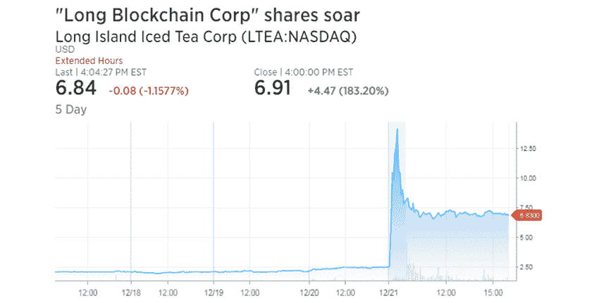
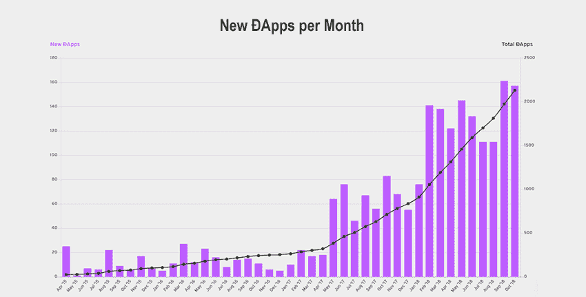
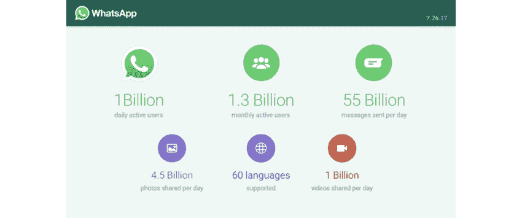
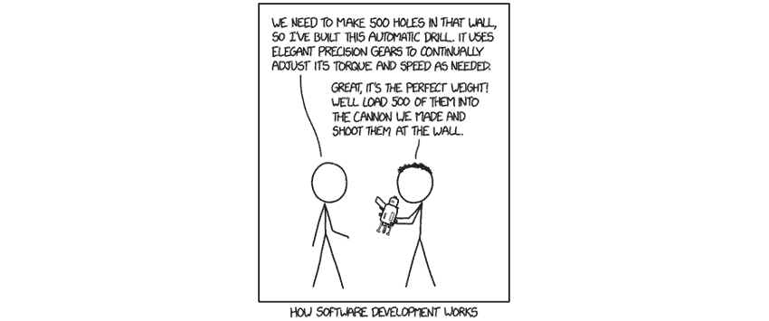
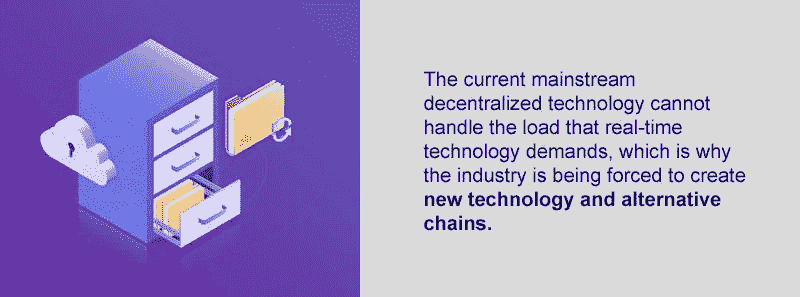
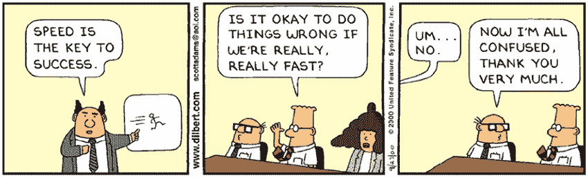

# 如何构建实时 DApps？

> 原文：<https://medium.com/hackernoon/how-to-build-real-time-dapps-78bf4841b786>

[source](https://michelkoven.files.wordpress.com/2014/04/charles-gussin-la-construction-de-la-tour-de-babel-1690.jpg)

正如在计算机成为主流用途之前，用户友好的软件是必要的一样，dApps(更具体地说，实时 dApps)是运行在区块链上的软件，将有助于将其投入主流使用。请记住，在 Windows 和图形用户界面出现之前，就有计算机在使用，但这要困难得多，使用这些计算机的人也少得多。区块链和分布式账本技术(DLT)目前还处于起步阶段，他们还没有超级用户友好的软件来帮助公众与他们互动。但是考虑到 a [报道的 84%的公司](https://www.cnbc.com/2018/08/27/84percent-of-companies-are-dabbling--in-blockchain-new-survey-says-.html)正在关注区块链，如果你是一名程序员，那么实时 dApps 可能是你职业发展的方向。把这篇文章看作是关于你潜在未来的速成课程。

[https://www.cnbc.com/2017/12/21/long-island-iced-tea-micro-cap-adds-blockchain-to-name-and-stock-soars.html](https://www.cnbc.com/2017/12/21/long-island-iced-tea-micro-cap-adds-blockchain-to-name-and-stock-soars.html)

# 实时 dApp 技术要求

对于那些已经了解 dApps 的人来说，这将是一个复习。另一方面，对于那些阅读这篇文章却对这个话题知之甚少甚至一无所知的人来说，这一节是为你准备的。但是在我们进一步讨论之前，我们需要讨论 dapp 的基础知识，以便理解实时 dapp 是如何(以及为什么)不同的。[根据戴维·约翰斯顿和他的同事](https://github.com/DavidJohnstonCEO/DecentralizedApplications)，dApp 的资格如下:

*   应用程序的数据和操作记录必须加密存储在一个公共的、分散的区块链中，以避免任何中心故障点。
*   应用程序必须是完全开源的，它必须自主运行，没有实体控制它的大多数令牌。
*   应用程序必须使用加密令牌(比特币或其系统自带的令牌)，这是访问应用程序所必需的，来自(矿工/农民)的任何价值贡献都应在应用程序的令牌中得到奖励。
*   应用程序必须根据标准加密算法生成令牌，作为对应用程序有贡献的值节点的证明。

[https://www.stateofthedapps.com/stats](https://www.stateofthedapps.com/stats)

正如我们前面解释的，dApp 运行在区块链或其他 DLT 之上，目的是使应用程序更易访问，功能更强。但这只是等式的一半，因为大多数现代 dApps 还远没有实时运行。

为了实时运行，顾名思义，它必须在尽可能短的时间内发送、接收和验证信息，最好少于一秒。当讨论“实时”应用程序时，通常会提到一个关键词:[服务器推送](https://en.wikipedia.org/wiki/Push_technology)。这些服务器推送在现实世界中经常使用；在你的手机上追踪你的 Lyft/优步的位置，在 iMessage 上给你的朋友发送消息，在线玩多人游戏。基本上，服务器推送是指通过中央服务器处理数据的任何时候。

实时 dApps 将 dApps 与服务器推送技术结合成一个分散的过程。实时 dApps 不依赖于中央服务器，而是依靠区块链或其他 DLT 来处理智能合同，实时处理所有数据。当你看看当前区块链主要的[平均交易速度](https://www.fool.com/investing/2018/05/23/ranking-the-average-transaction-speeds-of-the-15-l.aspx)(比特币——78 分钟，以太坊——6 分钟，Ripple——4 秒，比特币现金——60 分钟，EOS——1.5 秒)的能力时，很明显这些离“实时”能力有多远。为了客观地看待这些数字，下面是实时技术及其服务器负载的一些常见用途(不考虑实际数据大小):

*   WhatsApp—[63.7 万 Tx/s](https://www.zdnet.com/article/whatsapp-now-one-billion-people-send-55-billion-messages-per-day/)
*   电报— [174，000 Tx/s](https://telegram.org/blog/15-billion)
*   堡垒之夜(假设每个玩家平均 50 毫秒 ping)—[166，000，000 Tx/s](https://www.pcgamesn.com/fortnite/fortnite-battle-royale-player-numbers)

[https://blog.whatsapp.com/10000631/Connecting-One-Billion-Users-Every-Day](https://blog.whatsapp.com/10000631/Connecting-One-Billion-Users-Every-Day)

不用说，当前主流的分散技术无法处理实时技术要求的负载，这就是为什么行业被迫创建新技术和替代链的原因。

# DApp 结构和对新链条的需求

大多数 Dapp 都是使用特定的公式构建的，我们将在这里使用 Brendan Lee 的“[我们在构建我们的第一个以太坊 Dapp](/coinmonks/what-we-learned-building-our-first-dapp-28b01f9fc244) 时学到的东西”这篇中型文章为例，为您进行分解，他在文中解释了他们使用的技术堆栈。您可能知道也可能不知道这些技术是什么，因此我们将在这里为您详细介绍:

1.  [Solidity](https://en.wikipedia.org/wiki/Solidity) 是以太坊的主要编程语言，智能合约为以太坊链上的 dApp 创建“服务器”。
2.  [IPFS](https://ipfs.io/) ，或星际文件系统，是一个分散的存储选项，允许用户将他们的存储需求分布在一系列节点上。
3.  正如 Lee 指出的,[松露](https://gist.github.com/smarr/d1f8f2101b5cc8e14e12)和[加纳切](https://truffleframework.com/ganache)正在测试框架。想象这是以太坊的[微软 Visual Studio C++](https://visualstudio.microsoft.com/vs/features/cplusplus/) 测试等价物。
4.  这些都是前端开发语言，根据程序员的需求而变化，很像 JS，Ruby，C++等。
5.  [MetaMask](https://metamask.io/) 是一个用于以太坊的钱包，因为钱包是为运行 dApp 的节点(以及存储数据的 IPFS 节点)提供资金所必需的。还必须持有 dApp 用户接受的资金。

上面提到的当前结构是针对传统 dapp 的，尽管实时 dapp 是相似的，但有一个关键的区别:它们交互的链必须比以太坊快得多。

# 哪些区块链满足实时 dApp 的要求？

目前市场上有一些替代方案可以完成运行实时 dApps 的任务，每一个都以自己独特的方式提供服务。让我们来看看每一个。

# 织机网络

[Loom](https://loomx.io/) 依靠以太坊作为基础，同时在其上建造侧链。这意味着以太坊是主干，而 Loom 创建了向以太坊登记以借用其安全协议的侧链，同时允许巨大的扩展和更大的 Tx/s。Loom 是以太坊之上的第 2 层区块链，运行他们所谓的“DAppChains”，使用替代的共识规则集(如[委托利益证明](https://hackernoon.com/explain-delegated-proof-of-stake-like-im-5-888b2a74897d))。

*链条速度:*小于 1 秒的批准时间，Tx/s 1，000，000+

*概要:*Loom 网络与以太坊共存，当它需要解决争议时向以太坊报到，但在其他情况下保持独立。这允许亚秒交易批准时间，极低的天然气价格，以及实时 dApps 在织机侧链上运行的能力。

# #元哈希

就 dApp 支持而言，#MetaHash 提供了以太坊的完整替代方案。这是通过专注于四个组件来实现的:#TraceChain(基于一种自学习算法，随着更高带宽的节点添加到网络中而增长)，#MetaApps(他们的 dApps 和实时 dApps 版本)，#MetaGate(包含开放源代码，允许开发人员创建 dApps 和#TraceChain 功能)，以及#MetaHashCoin(用于共识协议的网络数字支付货币)。

*链条速度:*3 秒内批准，发送/秒 50，000–1，000，000+秒

*总结:* #MetaHash 在考虑其#TraceChain 的速度和交易批准时间时是一个可靠的替代方案；然而，他们完全独立于以太坊运作的事实可能会在未来造成问题。

# Zilliqa

Zilliqa 是一个可伸缩的、支持 miner、数据流和分片友好的区块链，可用于智能合约和 dApps。Zilliqa 的 Tx/s 基于分片的[频率，本质上意味着可能的事务数量随着网络和节点大小而增加。尽管 Zilliqa 比以太坊、比特币等快得多，但它很难跟上高强度的实时 dApps，除非分片节点极其可靠。它目前使用 ERC20 协议，运行在以太坊上，但他们的目标是在未来拥有自己的区块链。](https://blockonomi.com/sharding/)

*链条速度:* 2 分钟批准时间，最快大约 10，000 Tx/s

*总结:* Zilliqa 肯定会有它的用途(广告)，但在更大的实时 dApps 方案中，它将很难跟上其较慢的块批准时间。

# 我们现在去哪里？

如果你是一个寻找下一个 dApp 项目基地的创始人，那么答案就有点模糊了。这取决于你的需求:你是否需要每秒百万次的交易，你是否介意处理以太坊网络？如果是这样的话，请使用织布机。但是如果您想扩展并采用一个完全重写的解决方案，不再有过去的问题，那么#MetaHash 是您理想的项目。

在一天结束时，最重要的事情是看过去浮华的营销活动，并进入技术细节，以确保项目是建立在坚实的代码。正如我们之前所说的，这项技术还很年轻，所以随着时间的推移，预计会看到区块链/DLT 景观的变化。

## 关于作者:

基里尔·希洛夫——geek forge . io 和 Howtotoken.com 的创始人。采访全球 10，000 名顶尖专家，他们揭示了通往技术奇点的道路上最大的问题。加入我的**# 10k QA challenge:**[geek forge 公式](https://formula.geekforge.io/)。