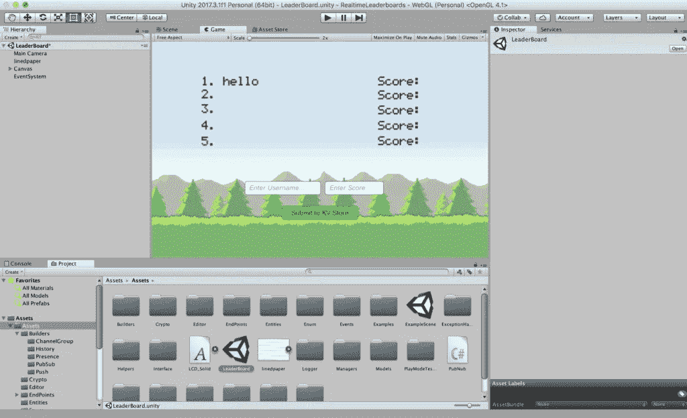
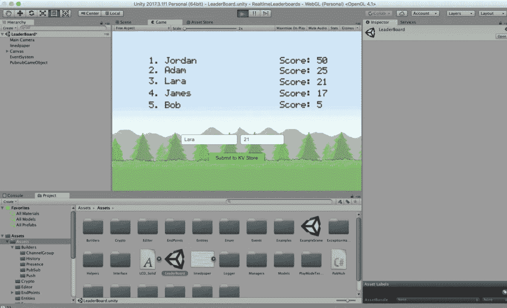
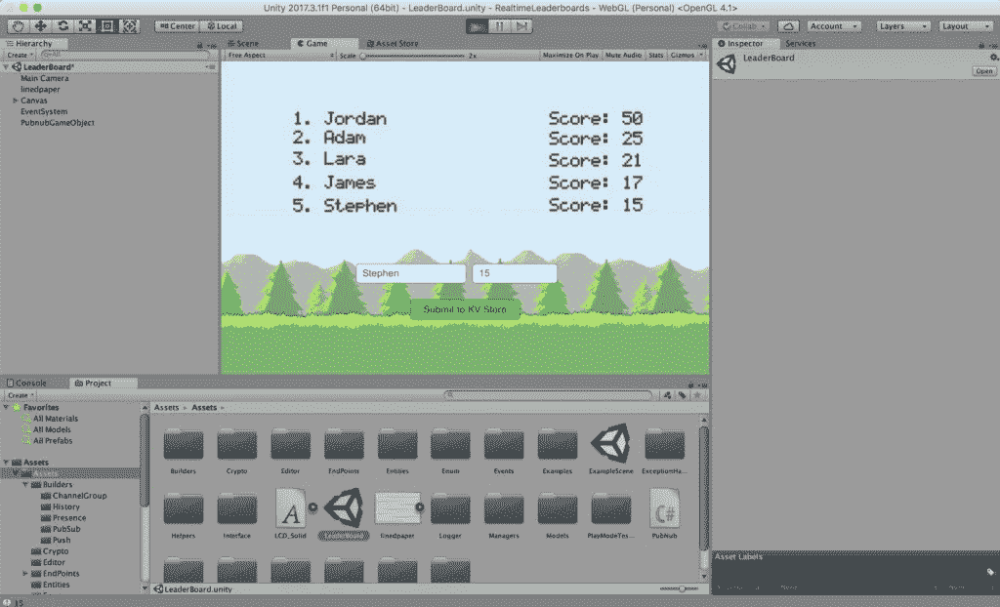
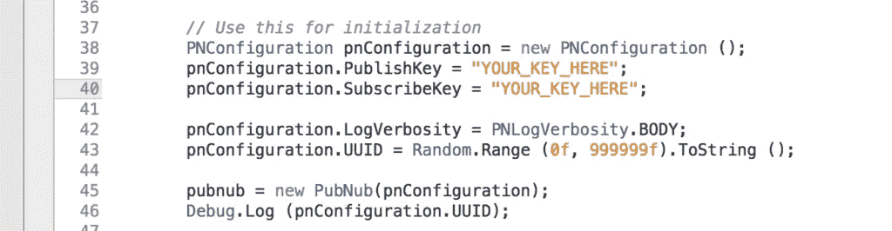
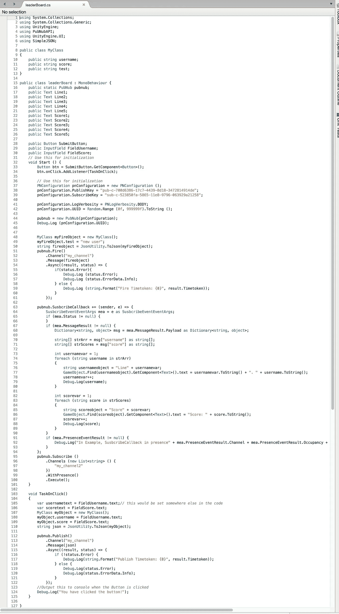
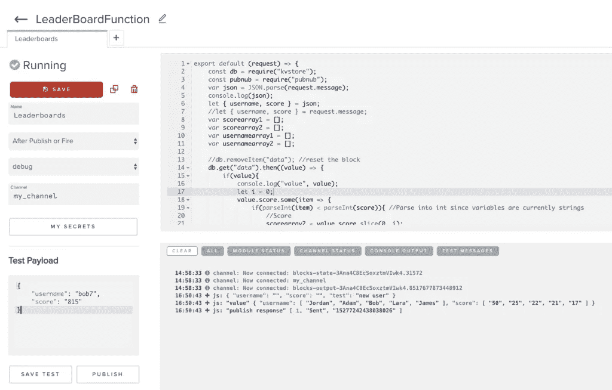
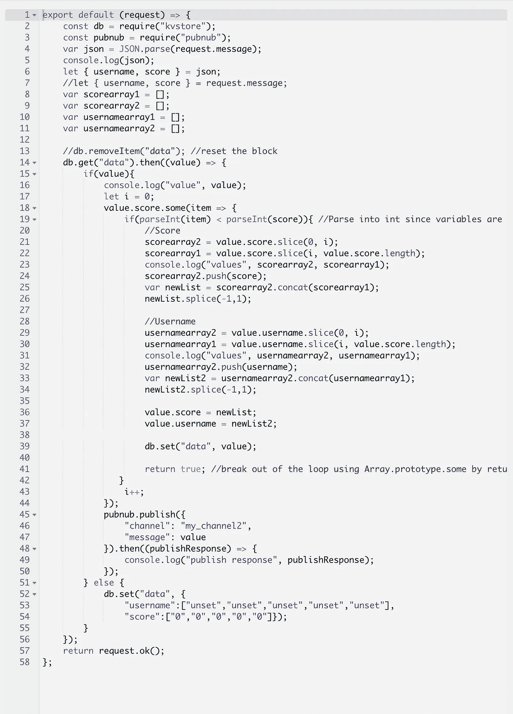
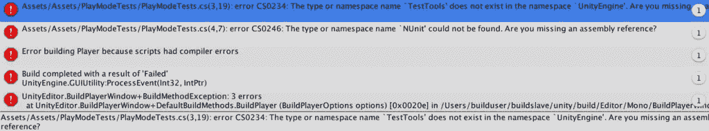

# 如何在 Unity 中建立实时更新的排行榜

> 原文：<https://medium.com/hackernoon/how-to-build-realtime-updating-leaderboards-in-unity-1f30545af17a>

**为什么是排行榜？**

排行榜是视频游戏中最古老的[社交功能之一，用于提高玩家之间的竞争水平。全球记分牌产生更长的游戏时间，吸引了大多数玩家。此外，排行榜通过激励玩家获得更高的排名，有助于提高玩家的参与度和忠诚度。如果一个玩家在排名中下滑，他们通常会试图重新确立自己的位置。](https://www.gamasutra.com/blogs/JoeHanson/20180507/317700/Level_Up_Engagement_and_Put_the_Social_in_Multiplayer_Games.php)

你可以使用 PubNub 建立排行榜，让[实时更新](https://www.pubnub.com/solutions/realtime-updates/)。实时记分很重要，因为它给用户即时反馈，增加了玩家的满意度。

# 建立统一

首先，查看我的 [GitHub](https://github.com/JordanSchuetz/Realtime-Unity-Leaderboards-with-PubNub) 并克隆/下载回购。如果您还没有安装 Unity，请在此处安装它[。repo 包含一个包含所有项目文件的 Assets 文件夹。打开 Unity，进入**文件- >打开项目**，选择文件夹。在 Unity 中加载项目需要一些时间。完成后，打开您的**项目**选项卡中的 Assets 文件夹，双击](https://unity3d.com/get-unity/download) [**排行榜**](https://hackernoon.com/tagged/leaderboard) Unity 场景。

当您点击**排行榜**场景时，您应该会看到:



要尝试演示，请单击顶部的播放按钮。

如果出现以下错误，请按照以下步骤操作:

> *无法加载场景“排行榜”,因为它尚未添加到构建设置或资产包尚未加载。*

要解决这个问题，请转到**文件- >构建设置**。点击**添加开放场景**按钮。然后回到你的项目选项卡，双击**排行榜**，回到你的构建设置，再次点击**添加开放场景**。然后在您的项目选项卡中，再次双击排行榜场景并运行项目。

# 运行项目

现在你的项目已经设置好了，点击 **Run** 按钮。当您运行项目时，PubNub [触发消息](https://github.com/JordanSchuetz/Realtime-Unity-Leaderboards-with-PubNub/blob/master/Assets/leaderBoard.cs#L52)被发送到 PubNub 函数。在下面的截图中可以看到，当 [KV Store](https://www.pubnub.com/docs/blocks/tutorials/kv-store) 中没有存储分数时，它会用“未设置”填写每一个未填写的条目。下面我将通过输入用户名和分数向 KV 商店添加更多条目。


让我们添加更多条目。劳拉、詹姆斯和鲍勃刚刚被添加到下面的高分名单中。



现在让我们把斯蒂芬加入名单。如您所见，由于他的得分高于 Bob，但低于 James，因此他排名第五。所有连接到[游戏](https://hackernoon.com/tagged/game)的玩家将会看到这个分数的实时更新。这个逻辑是在 PubNub 函数中使用 KV 存储和数组排序完成的。单击下面的“尝试我们的演示”按钮，了解它是如何工作的。

[](https://jordanschuetz.github.io/Realtime-Unity-Leaderboards-with-PubNub/webgldemo/index.html)

*打开两个窗口实时查看高分更新*

# 它是如何工作的？

创建排行榜可能是一项复杂的任务，因为当新分数添加到列表中时，您希望所有用户都能看到相同的信息。使用 PubNub 和 PubNub 函数可以无缝地为您的应用程序创建自定义排行榜。

在主文件夹中，我创建了一个名为 [**排行榜**](https://github.com/JordanSchuetz/Realtime-Unity-Leaderboards-with-PubNub/blob/master/Assets/leaderBoard.cs) 的脚本，用于处理所有数据的发送和接收。在 **Start()** 函数中，我们首先定义一些组件和变量。当前演示使用的是我的个人 pub/sub 键。您必须进入并替换您自己的 pub/sub 键，您可以在 [PubNub 管理仪表板](https://dashboard.pubnub.com/login)中找到这些键。在管理仪表板中创建一个新应用程序，并将您的发布/订阅密钥复制到 **leaderBoard.cs** 代码中。



在上面的代码中，我们将每个玩家的 UUID 设为一个随机数。但是，如果您正在创建您的游戏，您会希望将此号码与一个唯一的用户名相关联，这样人们就不会在您的实时排行榜中使用相同的用户名。

下面的代码是整个 **leaderBoard.cs** 文档。当脚本第一次运行时，它初始化 PubNub，并向 PubNub 函数发送一个 Fire 消息。这个 fire 对象告诉函数发送回存储在数据库(KV Store)中的最新数据。当客户端从 PubNub 函数得到响应时，它运行 **pubnub。SubscribeCallback** 并遍历字典，替换自上次更新以来发生变化的任何数据。

**TaskOnClick** 函数获取您在输入字段中输入的信息，并将该数据发布到 PubNub 函数，然后该函数更新当前订阅了 **my_channel2** 的所有客户端。



为了让排行榜起作用，我们现在必须设置一个 PubNub 函数。要创建一个函数，请转到 PubNub 管理仪表板，然后单击您的应用程序。在左侧，单击 Functions 按钮，并创建一个新模块。确保您正在收听正确的频道名称，在本例中，我将我的频道称为“ **my_channel** ”。

在函数中，我们首先必须导入 KV Store 和 PubNub 依赖项。接下来，我们 **JSON** 解析从 Unity 客户端收到的消息，并将消息内容放入名为 username 和 score 的变量中。



接下来，我们使用 **db.get** 来检查 KV 存储器中是否存储了任何数据。如果没有，我们使用 **db.set** 创建一个字符串格式来表示数据的结构。一旦数据在 KV 存储中，我们使用**value . score . some(item =>{ })遍历数组；。**我们使用原型，因为我们希望能够在循环结束时返回 true，以便在条目被正确替换后取消循环。当循环完成时，它通过发送 pubnub.publish 消息将新的更新值发送给订阅了 **my_channel2** 的所有客户端。



就这样，伙计们！使用 PubNub 和 Unity 创建自定义排行榜超级简单。

# 调试和构建

当您开始构建您的项目时，您可能会遇到这样一个错误:

```
error CS0234: The type or namespace name 'TestTools' does not exist in the namespace 'UnityEngine'. Are you missing a reference? CS0246: The type or namespace name 'NUnit' could not be found. Are you missing an assembly reference?
```

要解决这个问题，请转到:窗口->测试运行程序->选择播放模式

您将被要求启用播放模式。然后重置编辑器。



现在，当您开始构建项目时，这些错误应该会被删除。

# 包扎

用 Unity 来设置 PubNub 简单而无缝。此外，如果您有数百万用户同时玩您的游戏，PubNub 可以扩展并支持该延迟和流量。要下载 Unity SDK，请访问我们的 [Unity 文档](https://www.pubnub.com/docs/unity3d-c-sharp/pubnub-c-sharp-sdk)。你可以在我的 [GitHub 这里](https://github.com/JordanSchuetz/Realtime-Unity-Leaderboards-with-PubNub)下载我的演示项目。感谢阅读干杯！

【www.pubnub.com】最初发表于[](https://www.pubnub.com/blog/realtime-highscores-leaderboards-in-unity/)**。**