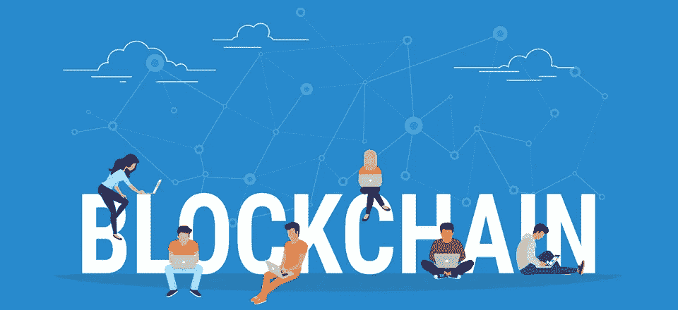

# 如何在你的区块链项目中建立信任和透明度

> 原文：<https://medium.com/hackernoon/how-to-build-trust-and-transparency-into-your-blockchain-project-ca1e2a62fd63>

让你的区块链项目引人注目，建立参与者、支持者和客户的信任和透明度。

我们生活在一个数字世界。我们周围的一切都在不断变化。例如，现在我们有像比特币或以太网这样的数字资产，使我们能够在没有第三方的情况下直接转移任何东西。

这是由**区块链**技术实现的。区块链是这些数字资产的全球领先软件平台。这项新技术正在为任何人建立一个简单、创新和更好的金融系统。

区块链的数据库分布在计算机网络中，没有给黑客留下任何空间。它的系统是完全透明的，所有用户都可以看到公共区块链上的交易和变更。这就是为什么许多行业都在努力将区块链实施到他们的行业中，并且随着时间的推移，区块链项目越来越多。

你目前正在做一个区块链的项目吗？这篇文章很适合你。在整个过程中，了解如何在您的区块链项目中建立信任和透明度是非常重要的。失去社区的信任会随时毁掉你的项目。

对任何区块链项目的主要建议是保持你的项目的**可信度**。这意味着你必须诚实、真实、开放，并且随时为你的客户服务。不要忘记你的社区成员将会看到你的项目是成功还是失败。

## 我们想分享一些关于在您的项目中建立信任和透明度的建议:

*   说到区块链，对于一个透明可信的项目来说，最重要的事情之一就是你要清楚地说明资金的分配情况。这是用户获得更多信任和信心的方法。发起 ICO 的人或公司没有义务分享这些信息，但这是向你的支持者展示你的项目是严肃和透明的最好方式之一。
*   如果你有一个活生生的真实的产品呈现在客户面前，总是更好，这样他们就可以看到它是如何工作的。但是，有一些项目在没有任何工作产品的情况下筹集了资金。不管你有没有真正的产品，当 ICO 结束的时候，就是开始展示你的产品的时候了。这就是为什么如果你想让你的客户信任你，坚持你向他们展示的路线图是很重要的。在你的参与者开始使用你的产品之前，你可以让你的一些团队成员作为测试员来看看你的产品是如何工作的。
*   别忘了你的社区！今天，在任何时候与你的客户交谈都是非常容易的。我们有很多社交网络，如 Telegram、RocketChat、Email 等。你必须始终保持你的社区与时俱进。想办法让他们参与到你的项目中，这样他们就能做出贡献，感到兴奋，成为你区块链之旅的一部分。此外，最好定期分享贵公司的更新和发展情况。
*   总会有投机者会问很多关于代币价值的问题。你必须礼貌地回答这些问题。告诉他们这是一个长期项目，告诉他们检查路线图，强调你到目前为止取得的所有成就，并专注于你已经承诺并写在白皮书中的一切。

# 最后

一个更透明、更安全、更值得信赖的项目会获得很多利益和支持者。这样的项目将总是获得越来越多的信心，并将吸引新的客户，这将有助于该项目。总会有一些骗子试图毁掉你的社区，但这可以通过诚实透明的沟通来解决。

我们位于区块链的电力交易平台 [Energy Premier](https://medium.com/u/e338af49a57a?source=post_page-----ca1e2a62fd63--------------------------------) 目前正在与强大的社区和优秀的团队开发预售和 ICO。该平台通过消除多个中间商和距离作为交易的限制因素，使供应商能够直接进入零售能源市场，从而为消费者带来更低的价格。

我们很高兴地说，我们已经有一个活的和工作的产品，我们的区块链项目是建立了很多透明度和信任到目前为止！

您可以在这里 查看我们做的 [**，也可以随时加入我们的**](https://tokensale.energypremier.com/) **[**电报**](https://t.me/joinchat/Hq0j1hDxZ3eRKFNo5f7oTw) 频道来认识我们的团队成员！**

*感谢您的阅读。*

