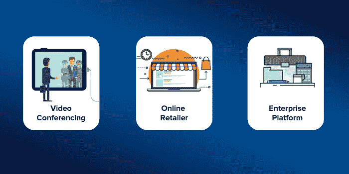
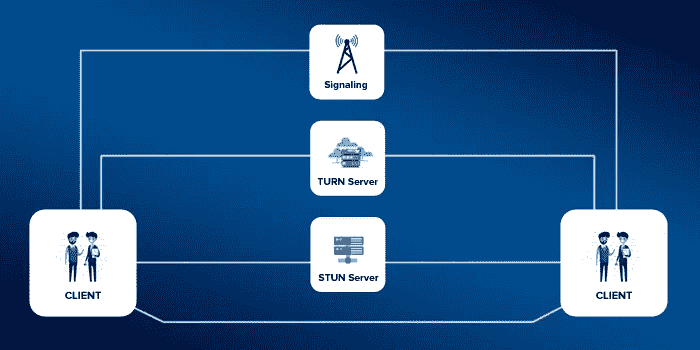
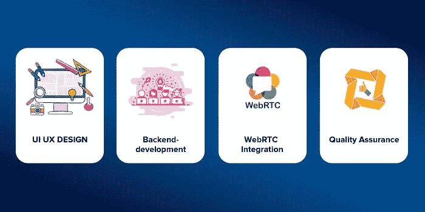

# 如何零编码搭建 Android、iOS & Web 的视频聊天 App？

> 原文：<https://medium.com/hackernoon/how-to-build-video-chat-app-for-android-ios-web-with-zero-coding-8019bd77a8de>

Create a video web chat app

> “视频聊天适合各种可能的用途，而且更适合实时交流。”

从祖父母希望与他们的孙子联系，到必须通过视频电话会议召开的会议，像 Skype 这样的视频聊天应用程序正处于视频通话革命的前沿。很难理解 Skype 市值背后的事实，它价值 85 亿美元。

那么，现在你想知道如何构建自己的视频聊天应用程序吗？在视频聊天应用行业，市场上充斥着谷歌视频聊天服务(Google Hangouts)、Skype 等巨头。显然不是问题！然而，你有一切来处理这些问题“如何在 android/iOS 中创建视频聊天应用？”或者“如何打造自己的视频聊天 app？”

在开始开发一款能让你获得数百万收入的视频聊天应用程序之前，让我们先弄清楚它的用途，以及你如何根据你的业务目标来选择它的应用程序。

# 视频聊天应用在企业中的重要性

Video Conferencing

1.  ***视频会议:*** 这有助于组织提升员工的生产力。员工倾向于参与电子邮件对话，这造成了缓慢的工作节奏，多方视频会议可以轻松地启动一对一或员工之间的实时协作。
2.  ***网上零售商:*** 许多电子商务网站要求为顾客的查询提供解决方案/答案，以增加品牌业绩，通过引导顾客来提高销售额和品牌的忠诚度。
3.  ***企业平台:*** 研究发现，通过协作工具，团队效率平均提升约 45%。还可以通过实施社交平台和一对一视频通话协作来提高企业的参与度。

除了这些用例之外，还涉及到各种各样的应用，例如销售产品故障排除、实时视频技术支持等等。

回到循环，为每一个应用开发一个视频聊天 app，都需要有深刻的技术知识和技术背景的经验。有一些经验丰富的聊天应用程序提供商有潜力在 Android/iOS 中创建视频聊天，也能够开发具有丰富功能的聊天功能。

# 介绍 Contus Fly —一款实时聊天应用解决方案

Contus Fly 是一个多方面的聊天解决方案，用于在 android/iOS 上 [**构建自己的视频聊天应用**](http://www.contus.com/messaging-solutions.php?utm_source=video-chat-app&utm_medium=CTA&utm_campaign=Hackernoon) ，并配备理想的功能。聊天解决方案内置了 WebRTC 信令，使得在任何时间向任何用户进行高质量的视频/音频通话变得简单。Contus Fly 提供 ***一次性支付选项*** 向“N”个用户进行视频/音频通话，不考虑费用/分钟使用量。

# Contus Fly 使用的技术可以创建您自己的视频聊天应用程序

就多媒体通信而言，视频和音频呼叫都依赖于客户机服务器之间的流媒体的性能。为了创建一个视频聊天应用程序，Contus Fly 使用 WebRTC 信令，在客户端服务器之间实时传输媒体内容。理解 VoIP(基于互联网协议的语音)技术非常重要。VoIP 技术支持一些至关重要的过程:

*   **信令** —点对点连接
*   **STUN 服务器** —本地 IP 地址
*   **转服务器** —调解器

WebRTC Video Calling

整个处理是为了获得 IP 地址，信令 web sockets 在这里建立服务器之间的客户端连接。并且通过使用 NAT(网络地址转换)以及提供对等连接，使用 STUN 服务器来获取 IP 地址。因此，制作视频聊天应用程序的整个过程在这里详细解释( [WebRTC 视频语音聊天应用程序](https://blog.contus.com/webrtc-video-voice-chat-application/))。

# 用于实时音频/视频呼叫的内置 WebRTC 信令

Contus Fly 使用 WebRTC API，通过消除安装插件或下载应用程序的使用，允许音频和视频通信通过直接点对点通信工作到网页中。Contus Fly 使用了三个 WebRTC APIs，其中音频/视频呼叫可以在没有任何按使用付费条款的情况下进行。

1.  ***MediaStream:*** 这允许您通过屏幕、摄像头和麦克风获取访问权限，以在 HTTP 连接的设备内传输数据，从而确保安全性。
2.  ***RTC 对等连接:*** 该技术对发送到远程服务器的整个媒体和语音/视频内容进行编码和代码转换。
3.  ***RTC 数据信道:*** 这有助于在两个用户之间创建对等连接，以便在安全层下发送数据/内容，并且还具有实时功能。

除了已经使用的技术，在使用 Contus Fly 构建支持 WebRTC 的视频聊天应用程序时，还有一些关键步骤需要处理。

# 使用 Contus Fly 构建您自己的视频聊天应用程序的关键步骤

## 用户界面/UX 设计:

*   Contus Fly 认为这是获得视频聊天应用参与度的主要过程之一。
*   UX 必须是直观的，用户体验高，用户不应该花太多时间去理解设置菜单和功能。
*   作为 UI 的一部分，要开发一个吸引人的设计，说明应用程序的目的，吸引用户的兴趣，而不管设备和平台。

## 可靠的后端开发:

*   作为流程的初始部分，Contus Fly 参与分析您的需求，以创建一个完整的可定制后端解决方案。
*   从服务器的设置、部署和云存储，Contus fly 的技术人员了解每一个功能，以建立您的高度先进的后端基础设施。

Make Video Calling App

## Web 和移动应用程序上的 WebRTC 集成:

*   通过集成 WebRTC，可以在 iOS 和 Android 聊天应用上部署实时通信。
*   Contus Fly 确保确定在 iOS 或 Android 上创建视频聊天应用程序的平台，使用 Swift 语言比使用 Objective-C 语言创建基于 iOS 的视频聊天应用程序更舒适。
*   说到基于 Android 的应用，Contus Fly 使用 Android SDK 等语言，用 Javascript 搭建 Android 视频聊天 app。

## 质量保证:

*   Contus fly 的 QA 工程师确保每个代码在提供点对点连接时都执行自己的功能。
*   如果视频聊天应用程序出现任何错误，我们的工程师会采用技术策略，使用工具以更有效的方式解决问题。

# 丰富视频聊天应用性能的功能

1.  ***一对一音视频通话:*** 随时对任何用户进行持续高清音视频通话，实时分享信息，以更高效的方式避免成本和时间的消耗。
2.  ***群组通话:*** Contus fly 的支持 webRTC 的视频聊天应用程序为您提供了在高清像素视频聊天中为适度数量的 3-5 个群组呼叫者进行多次视频会议的可能性。

Best Group Video Calling

***3。端到端加密:*** Contus fly 的多用户视频聊天应用程序确保为 HTTP 服务器内发生的视频/音频对话提供坚实的保护。

***4。屏幕/桌面共享:*** 专为举办在线演示和会议而设计，以提高业务效率。

***5。自定义滤镜&动画:*** 通过允许用户在视频聊天时添加效果、自定义涂鸦和即时动画，为您的视频聊天应用增加额外的参与度。

# 除了开发一个视频聊天应用，你还能如何赚钱？

每个视频聊天应用程序的最终目的是产生比关注其他聊天功能更多的利润。Contus Fly 提供了大量的现代货币化方法来增加您的收入。

1.  **广告:**通过在视频聊天应用程序上整合品牌广告来创造用户和品牌之间的互动，最终为您的视频聊天应用程序带来最大利润，这是一种更高效的赚钱方式。
2.  **优质贴纸:**使用品牌优质贴纸，用户会发现它更有吸引力，并将内容变成更令人惊叹的内容。允许用户为贴纸付费以便与其他用户聊天。
3.  **付费语音通话:**通过互联网打电话是可能的，而打电话到全球任何有线电话都需要付费版本。通过这个功能，你可以产生最大数量的利润。

# 那么最后，做一个视频聊天 App 要多少钱？

由于这总是一个严肃的讨论，与一些 SaaS 的音频/视频聊天应用提供商相比，视频/音频功能的部署是相当大的预算。市场上的一些通信平台提供了内置的 WebRTC 功能，即付即用，平均每个参与者 0.0015 美元/分钟。这将导致消耗大量的金钱。但是当谈到 Contus Fly 的内置 WebRTC 时，通过互联网拨打电话的费用是根据用户数量一次性支付的*而不考虑分钟数。*

## 结论

视频聊天应用正在重塑娱乐和商业的实时沟通方式，这是非常有希望的。因此，视频聊天应用提供商的整个市场被分成了几个主要的平台和解决方案。由于这种分离，开发视频聊天应用的质量取决于聊天应用提供商。现在，为了与合适的解决方案提供商合作，您必须非常清楚地了解您的业务需求，添加特性/功能，以及主要是具有成本效益选项的 WebRTC 实现。