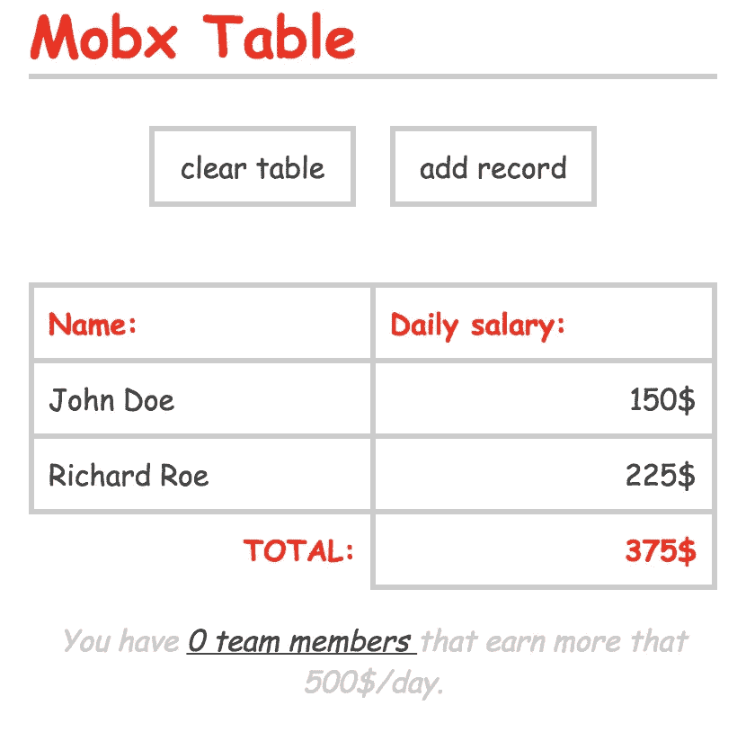
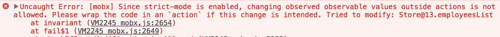
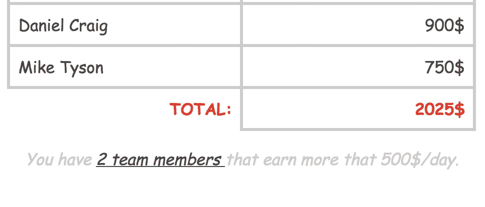

# 如何用 Mobx 构建你的第一个应用并做出反应

> 原文：<https://medium.com/hackernoon/how-to-build-your-first-app-with-mobx-and-react-aea54fbb3265>


如果你在 React 世界，你很有可能听说过 Mobx。Mobx 是由 [Michel Weststrate](https://twitter.com/mweststrate) 开发的轻量级且易于学习的状态管理库。[它的第四版](/@mweststrate/mobx-4-better-simpler-faster-smaller-c1fbc08008da)几周前发布了，它有很多很酷的新功能。

我们将通过构建一个小项目开始我们在 Mobx 世界中的旅程:一个简单的表管理器，它将管理一些雇员的工资数据。



从功能角度来看，我们的应用将能够:

*   在表格中呈现雇员列表(雇员由姓名和薪水组成)
*   添加新员工
*   清除员工列表
*   计算工资的总成本
*   显示有多少员工每天收入超过 500 美元

也许，最重要的“特性”是我们将通过管理 Mobx 的应用状态来做任何事情。

# 项目的基本设置

我们将从以下基本设置开始。我们只有一些非常基本的组件，主要是返回一些带有一些基本 HTML 标签的 div。

基本组件架构如下所示:

*   应用程序组件
*   控件组件
*   表格组件
*   行无状态组件

# 向我们的应用程序添加商店

在这个阶段，我们的应用程序没有任何数据支持。只有一些空的组件。我们的应用程序的初始数据将是一个带有姓名和日薪的雇员对象数组

```
employeesList = [
    {name: "John Doe", salary: 150},
    //... 
]
```

这些数据必须在多个组件中使用:
—在表中(为了列出雇员)
—以及在控件组件中，用于添加新雇员或清除列表

鉴于[通过 props 发送数据和回调对于应用的核心数据来说并不是最具可伸缩性的解决方案](https://www.reddit.com/r/reactjs/comments/4v3mcb/passing_down_too_many_props_to_child_components/)，我们可以尝试将一个 **appStore** 对象放在一起，来封装和管理这些核心数据。这样，最初，我们只需通过这个应用商店。

```
class Store {
  employeesList = [
    {name: "John Doe", salary: 150},
    {name: "Richard Roe", salary: 225},
  ]
}
const appStore = new Store()
```

创建 AppStore 后，我们现在可以将其发送到主要组件:

```
<Controls store={appStore} />
<Table store={appStore} />
```

现在，我们可以在表格组件中列出联系人:

```
class Table extends Component {
    render() {
        <tbody>
          {store.employeesList.map((e, i) =>
            <Row 
              key={i} 
              data={e}
            />
          )}
        </tbody>
    }
}
```

到目前为止一切顺利。但是，如果我们试图通过向 **appStore.employeesList** 中推送一个新项目来添加新员工，或者如果我们试图清除该列表:

```
class Controls extends Component {
  addEmployee = ()=> {
    const name = prompt("The name:")
    const salary = prompt("The salary:")
    this.props.store.employeesList.push({name, email})
    // ERROR !!! this will not update the view 
  }

  clearList = ()=> {
    this.props.store.employeesList = []
    // ERROR !!! this will not update the view 
  }

  render() {
    return(<div className="controls">
      <button onClick=>clear table</button>
      <button>add record</button>
    </div>)
  }
}
```

我们不会对视图进行任何更新，即使事情看起来像它们应该的那样工作:

你也可以试着做一个数据的控制台日志，你会发现一切似乎都没问题。问题在于 React 在对象改变时没有得到通知，所以它可以开始重新渲染。

# 正在安装 Mobx

Mobx 处理的正是这些类型的情况。当数据状态发生变化时，它是通知 React 的完美工具。

但是首先，让我们先把它添加到我们的应用程序中。安装 Mobx 最快的方法是使用 NPM。除了 **mobx** 之外，我们还将添加 **mobx-react** ，我们将使用它将 mobx 和 react 粘合在一起。

因此，打开一个控制台，键入:

```
npm install -save mobx mobx-react
```

安装完成后，我们将在 App.js 中添加一些新的导入内容:

```
import {decorate, observable} from "mobx"
import {observer} from "mobx-react"
```

# Mobx 基础知识介绍:观察者—可观察的

简而言之，mobx 工作在可观察的——观察者流程上。你声明一些数据是可观察的，当这些数据改变时，所有使用这些数据的观察者都会得到通知。

在我们的示例中，更改的数据是 employeesList。在 mobx 中有[几个](https://www.robinwieruch.de/create-react-app-mobx-decorators/) [不同的](https://mobx.js.org/refguide/observable.html) [选择](/@mweststrate/mobx-4-better-simpler-faster-smaller-c1fbc08008da)来声明一些数据是可观测的。我们将使用最新的，因为在我看来，它是最优雅和最容易使用的。它是在 Mobx4 中添加的，大概是这样的:

```
class Store {
  //...
}

decorate(Store, {
  employeesList: observable
})

const appStore = new Store()
```

现在，为了完成这个流程，我们必须让 Table 组件成为一个**观察者**:

```
class Table extends Component {
  //...
}
Table = observer(Table)
```

有了这些新的变化，我们应该一切正常:

# 在 Mobx 中使用操作和配置-强制操作

尽管看起来一切正常，但我们违反了 Mobx 的一条非常重要的规则:**状态数据只能通过动作**来修改。这将使代码更具可伸缩性，并改进数据流管理。

Mobx 甚至提供了一种机制来确保这条规则得到遵守。如果我们将以下两行添加到应用程序中:

```
import {configure} from "mobx"
configure({enforceActions: true})
```

当我们按下 clear employeesList 按钮或添加新员工时，我们将结束 this: **错误:[mobx]由于启用了严格模式，不允许在操作之外更改观察到的值**:



这是因为我们试图在函数之外改变状态。要解决这个问题，我们首先必须导入**动作**，向存储中添加两个新函数，并将它们声明为动作:

```
import {action} from "mobx"

class Store {
  //...
  clearList() {
    this.employeesList = []
  }

  pushEmployee(e) {
    this.employeesList.push(e)
  }
}

decorate(Store, {
  clearList: action,
  pushEmployee: action
})
```

有了这些动作，我们现在可以用对这些动作的调用来替换*不安全的*数据操作:

```
class Controls extends Component {
  addEmployee = ()=> {
    const name = prompt("The name:")
    const salary = parseInt(prompt("The salary:"), 10)
    this.props.store.pushEmployee({name, salary})
  }

  clearList = ()=> {
    this.props.store.clearList()
  }
  //...
}
```

到目前为止，一切都应该恢复正常，我们的数据管理现在完全封装在 Mobx 存储中:

所以，总结一下:

*   在需要的地方，让你的数据**可见**
*   将**观察器**设置为使用**可观察数据**的组件
*   仅通过**动作**改变**可观察**

*我希望你喜欢这个教程，如果你想看更多 Mobx 或 React 的例子，你可以随时订阅* [*我的电子邮件列表*](http://www.js-craft.io/newsletter/) 。

# 在 Mobx 中使用计算值

Mobx 的另一个核心概念是，**计算值**。基本上，我们可以将计算值定义为通过对核心数据进行计算而生成的数据。您可以将它们视为 Excel 中公式生成的数据。

一个完美的例子是个人工资总额。



为了创建一个计算值，我们将导入**计算的**概念，并将一个新的属性 getter 添加到 Mobx 存储中。新的属性将存储工资总额。

```
import {computed} from "mobx"
class Store {
  //...
  get totalSum() {
    let sum = 0
    this.employeesList.map( e => sum = sum + e.salary)
    return sum
  }
}
decorate(Store, {
  //...
  totalSum: computed
})
```

最后，我们只需要在表中添加一个页脚，并使用计算出的值。

```
class Table extends Component {
  render() {
    const {store} = this.props
    return(<table>
      //...
      <tfoot>
        <tr>
          <td>TOTAL:</td>
          <td>{store.totalSum}</td>
        </tr>
      </tfoot>
    </table>)
  }
}
```

当我们清除或添加到 employeesList 时，这个总数也将被更新。

Mobx 的一个黄金法则就是**存储最少的所需数据量，尽可能多的进行计算**。这将为您提供良好的性能和重新渲染速度。

例如， **Mobx 计算值**的另一个可能的用例是计数&跟踪有多少记录满足特定条件。比方说，我们想添加一个应用页脚，我们将显示每天收入超过 500 美元的员工总数。

与 totalSum 类似，在这种情况下，我们也将添加一个计算值，只是现在我们将使用数组过滤器的长度:

```
class Store {
  //...
  get highEarnersCount () {
    return this.employeesList.filter( e => e.salary > 500).length
  }
}
```

为了在表格组件中显示结果，我们将添加一个新的 div:

```
class Table extends Component {
  render() {
    return (<div>
      //...
      <div className="fade">
        You have <u>{store.highEarnersCount} team members </u>that earn more that 500$/day.
      </div>
    </div>)
  }
}
```

应该就是这个了。您可以在下面的 codesandbox 中体验完整的示例:

我怎么强调 Mobx 中计算值的重要性都不为过。它们在很多情况下都非常有用。你也可以在 Mobx 的创造者 Michel Weststrate 的 [egghead 课程中看到一个很好的例子。](https://egghead.io/courses/manage-complex-state-in-react-apps-with-mobx)

有很多 Mobx 特性没有在本教程中介绍。比如提供者、进行 HTTP 调用或使用带有路由器的 Mobx 等等。但是现在你已经掌握了基本原理:动作->可观察->观察者->反应再现。Mobx 文档写得很好，包含了很多最佳实践。

*我希望你喜欢这个教程，如果你想看更多 Mobx 或 React 的例子，你可以随时订阅* [*我的电子邮件列表*](http://www.js-craft.io/newsletter/) 。