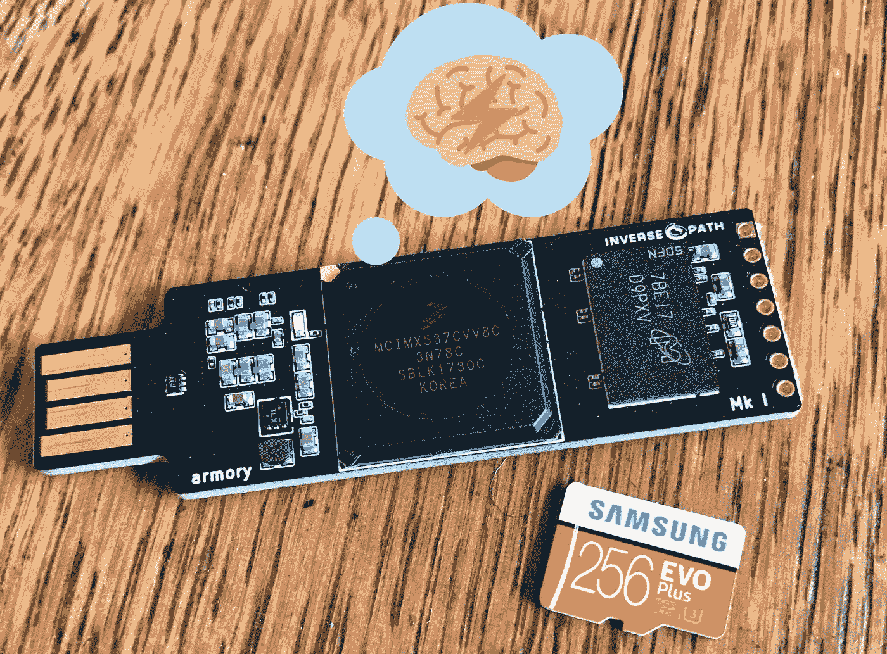
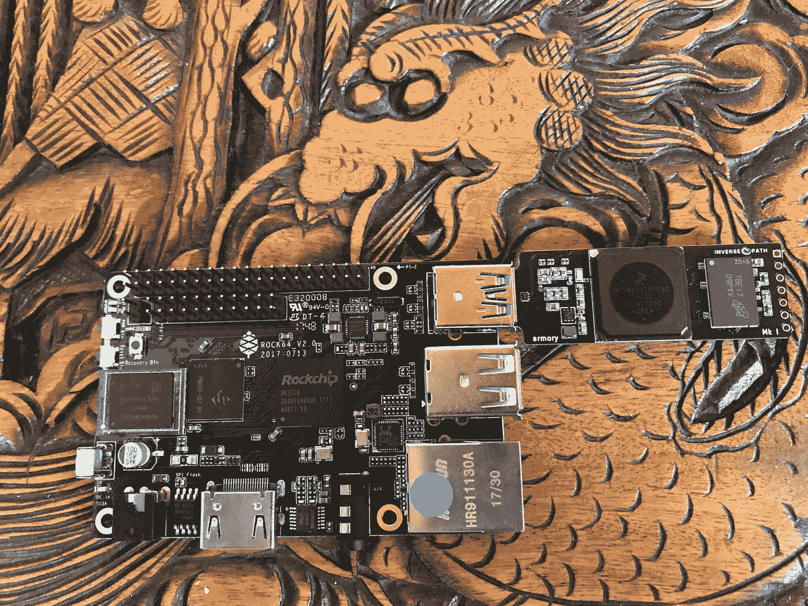

# 如何构建自己的便携插件 Lightning 节点！

> 原文：<https://medium.com/hackernoon/how-to-build-your-own-portable-plug-in-lightning-node-c4093a4b10fb>



部分:

*   简介/要求
*   数据包转发设置
*   建筑`c-lightning`和`bitcoin-cli`
*   安装闪电充电
*   为销售点解决方案安装`nanopos`

反向路径 USB 军械库是现在流行的 SoC 供电的硬件类别中的一个独特的设备，包括 Raspberry Pi 和 Rock64。像其他系统一样，它在计算能力方面相对不足。然而，它的独特之处在于其紧凑的外形和组件。军械库不需要电源适配器或墙上插座；它只需要一个 USB 接口就能工作。军械库通过 USB 为自己供电，并以同样的方式通过模拟以太网连接与其主机设备通信。军械库采用运行频率为 800 Mhz 的恩智浦 I . MX53 ARM Cortex-A8 处理器。它还包括 512 MB 的 DDR3 RAM 和一个用于存储的 microSD 卡插槽。

> USB armory 板由 Inverse Path 创建，用于支持各种安全应用的开发。
> 
> 模拟任意 USB 设备的能力与 i.MX53 SoC 速度、安全功能以及灵活和完全可定制的操作环境相结合，使 USB armory 成为各种个人安全应用的理想平台。
> 
> USB 军械库硬件的开放和最小化设计的透明性促进了可审计性，并且极大地限制了供应链攻击的可能性和范围。来自:[https://inversepath.com/usbarmory](https://inversepath.com/usbarmory)

利用外形、USB 供电和模拟 USB 以太网的一个很好的用例是便携式比特币闪电钱包。通过这种配置，用户可以设置一个运行`c-lightning`的设备，并将他们的私钥存储在一个便携式平台上，该平台可以轻松插入现有的硬件，如运行`bitcoind`的 Raspberry Pis。另外，另一种情况是，如果用户有一台运行完整节点的笔记本电脑。军械库可以简单地插入电源，然后用户可以通过 Lightning 网络进行交易，并运行 Lightning 供电的应用程序(LApps)。

这种设置的另一个用例是为功能不足的设备增加处理能力，如较旧的笔记本电脑或 Raspberry Pi。这样，军械库就像是闪电的协处理器！



An Armory connected to a Rock64

# 要求:

*   [一个反路径 USB 军械库](https://inversepath.com/usbarmory)
*   安装了[官方 Debian 基本映像](https://github.com/inversepath/usbarmory-debian-base_image/releases)的 4GB 或更大容量的 microSD 卡
*   USB 主机设备(笔记本电脑、工作站或类似 RPi 的设备)
*   在您的局域网上运行，或在其他地方使用 RPC 的访问凭证运行

# `Prep`打开军械库进行安装:

对于`lightningd`来说，与远程`bitcoind`通信所需要的就是`bitcoin-cli`，这大大减少了建造军械库所需的时间。交叉编译是可能的，但这超出了本指南的范围。为了只构建`bitcoin-cli`，比特币代码需要从其 Github 存储库中取出。但是，在此之前，必须在主机设备(军械库插入的设备)上启用数据包转发。

# 网络:

军械库(如果使用官方的 Debian 基本映像)在插入并启动时，会创建一个虚拟接口[来模拟以太网连接](https://en.wikipedia.org/wiki/Ethernet_over_USB)。一旦配置完成，军械库和它的 USB 主机就可以像在同一个局域网上一样互相通信(因为从技术上来说他们是在同一个局域网上)。由 USB 主机决定是否允许军械库的数据包被转发，如果允许，这将使军械库能够打开与本地网络之外的其他节点的 Lightning 网络通道。安装构建工具和依赖项也需要数据包转发。

## 窗口:

在 Windows 7、8 和 10 上启用数据包转发(也称为连接共享)的说明可以在[这里](https://github.com/inversepath/usbarmory/wiki/Host-communication#setup--connection-sharing-windows-7-8-10)找到。

## MacOS:

MacOS 指令可以在[这里](https://github.com/inversepath/usbarmory/wiki/Host-communication#setup--connection-sharing-macos)找到。

## Linux:

*注:在 Ubuntu 16.04 上，网管不干预。但是，其他发行版的配置可能会。*

来自 Linux 的[指令:](https://github.com/inversepath/usbarmory/wiki/Host-communication#setup--connection-sharing-linux)

```
**Enable masquerading for outgoing connections**:# iptables -t nat -A POSTROUTING -s 10.0.0.2/32 -o wlan0 -j MASQUERADE

**enable IP forwarding:**# echo 1 > /proc/sys/net/ipv4/ip_forward
```

插入军械库，注意闪烁的白色 LED。这意味着军械库正在运行。当军械库被使用时,“心跳”LED 闪烁更快。

现在，用 Debian 基本映像的默认凭证`ssh`进入您的军械库(用户名和密码都是`usbarmory`)

`$ ssh usbarmory@10.0.0.1`

Ping 一个公共地址，看看你的军械库路由是否正确:

`$ ping 8.8.8.8`

如果成功，您将收到回复:

```
PING 8.8.8.8 (8.8.8.8) 56(84) bytes of data.
64 bytes from 8.8.8.8: icmp_seq=1 ttl=60 time=46.3 ms
64 bytes from 8.8.8.8: icmp_seq=2 ttl=60 time=48.0 ms
64 bytes from 8.8.8.8: icmp_seq=3 ttl=60 time=48.1 ms
64 bytes from 8.8.8.8: icmp_seq=4 ttl=60 time=71.5 ms
```

太好了！

# 建筑 c-闪电:

`$ sudo apt update && sudo apt -y upgrade`

一旦完成，重启军械库以防内核更新:

`$ sudo reboot`

现在，开始安装编译`bitcoin-cli`和`c-lightning`所需的构建工具和依赖项:

```
$ sudo apt-get install -y \
  autoconf automake build-essential git libtool libgmp-dev \
  libsqlite3-dev python python3 net-tools libsodium-dev \
  pkg-config libssl-dev libevent-dev \
  libboost-system-dev libboost-filesystem-dev \
  libboost-chrono-dev libboost-program-options-dev \
  libboost-test-dev libboost-thread-dev tmux curl
```

克隆`c-lightning`库:

```
$ git clone https://github.com/ElementsProject/lightning.git
```

导航到本地存储库:

```
$ cd lightning
```

然后开始构建:

```
$ make
```

完成后，导航到`usbarmory`用户的主目录:

```
$ cd ~/
```

下载比特币核心 0.16.0 源代码档案 SHA256SUMS.asc，导入核心维护者的 gpg 密钥验证哈希值。最后，解压缩归档文件:

```
$ wget [https://bitcoincore.org/bin/bitcoin-core-0.16.0/bitcoin-0.16.0.tar.gz](https://bitcoincore.org/bin/bitcoin-core-0.16.0/bitcoin-0.16.0-x86_64-linux-gnu.tar.gz)$ wget [https://bitcoincore.org/bin/bitcoin-core-0.16.0/SHA256SUMS.asc](https://bitcoincore.org/bin/bitcoin-core-0.16.0/SHA256SUMS.asc)$ gpg --recv-key 90C8019E36C2E964$ gpg --verify SHA256SUMS.asc$ sha256sum -c --ignore-missing SHA256SUMS.asc
# should output an "OK"$ tar zxvf bitcoin-0.16.0.tar.gz
```

太棒了。

现在，开始建造`bitcoin-cli`。

# 构建比特币-cli:

导航到比特币源代码目录并开始构建过程:

```
$ cd bitcoin-0.16.0/$ ./autogen.sh
```

运行`autogen.sh`时，可能会出现大量关于语言环境的警告消息。这可以通过设置区域设置来解决:

```
$ sudo dpkg-reconfigure locales# Select something like en_US.UTF-8 and hit Ok
```

继续构建过程:

```
$ CFLAGS="-march=native" ./configure --disable-wallet
```

`-march=native`告诉我们的编译器`gcc`，自动检测军械库的处理器，并启用针对该处理器的优化。它有助于挤出 ARM 处理器的任何性能增加，这很重要，因为这种处理器相对较慢。

`bitcoind`没有在建，所以不需要`libdb`。传递`--disable-wallet`以在不支持 wallet 的情况下构建(`c-lightning`将是此配置中的 wallet)。

现在，构建`bitcoin-cli`:

```
$ make src/bitcoin-cli
```

最后，将新构建的`bitcoin-cli`二进制文件复制到`/usr/local/bin`:

```
$ sudo cp src/bitcoin-cli /usr/local/bin$ whereis bitcoin-cli# Should return "/usr/local/bin/bitcoin-cli"
```

# 通过 RPC 将军械库连接到`bitcoind`:

`c-lightning`使用`bitcoin-cli`向`bitcoind`发送原始交易，原因多种多样，如打开、强制关闭或相互关闭通道。由于`c-lightning`在军械库运行，它也需要`bitcoin-cli`。然而，`bitcoin-cli`需要能够与`bitcoind`通信，所以创建合适的物品并添加到军械库和 USB 主机中，`bitcoin.conf`:

在 USB 主机上，或运行`bitcoind`的其他设备上，在`bitcoin.conf`中指定以下项目:

```
rpcuser= <username>
rpcpassword= <yourpasswordnotthisone>
rpcallowip= <the Armory's IP address>
```

保存这些更改，然后创建军械库的`bitcoin.conf`，并添加以下物品:

```
$ nano ~/.bitcoin/bitcoin.conf
```

在`bitcoin.conf`中:

```
rpcuser= <username from before>
rpcpassword= <password from before>
rpcconnect= <USB hosts's IP (10.0.0.2)>
```

用`10.0.0.2`替换`bitcoind`可能监听的 IP 地址(例如`192.168.0.254`

尝试向军械库查询`bitcoind`:

```
$ bitcoin-cli -getinfo
```

如果成功，将返回一个带有相关信息的响应(方块高度、难度等)。)

厉害！

# 运行 c-lightning:

既然一切都已构建、配置并正确联网，那么就可以运行`c-lightning`了。

启动`tmux`会话，然后启动`lightningd`:

```
$ tmux
$ ./lightning/lightningd/lightningd --network testnet --log-level debug
$ ./lightning/cli/lightning-cli getinfo
```

*注:传* `*--network bitcoin*` *代替，如果你#鲁莽。*

如果`lightningd`开始输出`Adding block <block number>`，并且`lightning-cli`返回当前方块高度(以及其他信息)，则军械库设置成功！

`lightning-cli`现在可以用来生成新的地址进行比特币的存取，以及开启/关闭闪电网络通道！

# 闪电电荷:

LApps 是闪电供电的应用程序，利用闪电网络提供的即时支付。最近发布的应用程序包括 Blockstream 博客上列出的应用程序:[https://block stream . com/2018/03/29/block streams-week-of-LApps-ends . html](https://blockstream.com/2018/03/29/blockstreams-week-of-lapps-ends.html)

要运行这些 LApps，闪电充电需要安装在军械库。

> Lightning Charge 是用 node.js 编写的微支付处理系统，它通过其 REST API 公开了 c-lightning 的功能，可以通过 [JavaScript](https://github.com/ElementsProject/lightning-charge-client-js) 和 [PHP](https://github.com/ElementsProject/lightning-charge-client-php) 库访问。来自:[https://blockstream.com/2018/01/16/lightning-charge.html](https://blockstream.com/2018/01/16/lightning-charge.html)

闪电充电需要`c-lightning`和`nodejs`。立即安装:

```
$ curl -sL https://deb.nodesource.com/setup_8.x | sudo -E bash -$ sudo apt-get install -y nodejs
```

由于 nodesource.com 提供的`nodejs`包，可能会出现权限错误。要解决此问题，请执行以下操作:

```
$ mkdir ~/.npm-global
$ npm config set prefix '~/.npm-global'
```

将以下内容添加到`~/.profile`:

```
$ export PATH=~/.npm-global/bin:$PATH
```

最后:

```
$ source ~/.profile
```

然后简单的用`npm`安装闪电充，运行`charged`:

```
$ npm install -g lightning-charge$ charged --api-token <a secret token>
```

`charged`将会运行在默认端口 9112 上！

# 安装 nanopos LApp，将您的 Lightning 模块转变为微型销售点解决方案:

`nanopos`与`npm`轻松安装:

```
$ npm install -g nanopos
```

用待售产品编辑一个`items.yaml`文件，用`--currency`指定货币，然后运行`nanopos`:

```
$ nanopos -t <charge API token> --items-path items.yaml --currency USD
```

渲染页面的标题可以用`--title`来改变，在 bootswatch.com 有各种各样的主题可以用`-m`来选择。

现在`c-lightning`、`charged`和`nanopos` LApp 都在便携式军械库上运行！


一旦完成交易，只需关闭军械库并拔掉电源插头，以便储存起来运输。当准备好再次交易时，插回电源，`ssh`插入，并再次启动`c-lightning`。这可以配置为使用在 VPS 或类似的面向公众的托管服务上运行的`bitcoind`，以进一步提高可移植性(只需要军械库，而不需要带有`bitcoind`的工作站/笔记本电脑/主机)。

军械库也可以在“独立模式”下运行，这种模式不需要 USB 主机来连接或供电(不过它仍然通过 USB 供电)。这使得其他酷用例，如更便携的电池供电和支持 WiFi 的配置！

感谢阅读！

-格鲁布斯