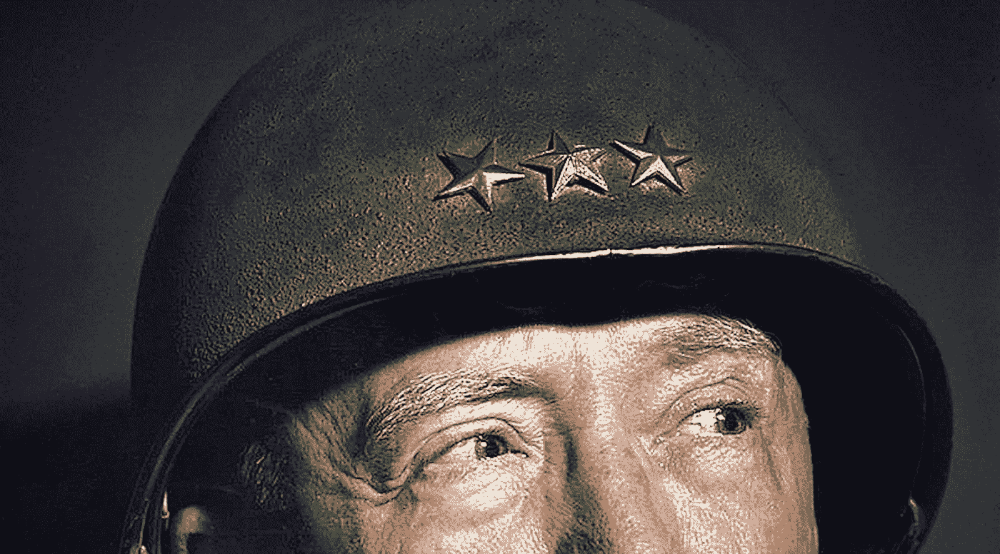
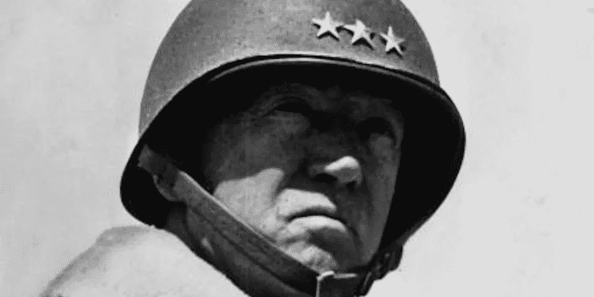
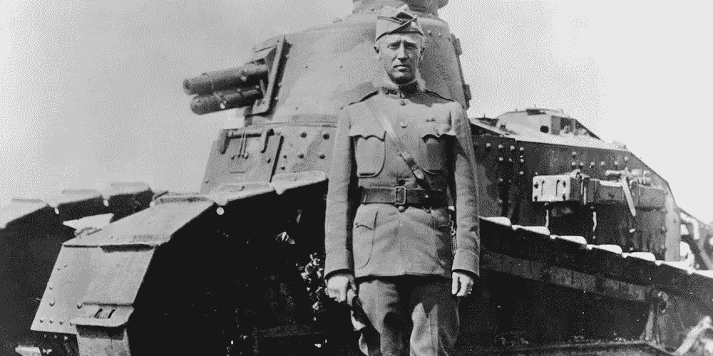
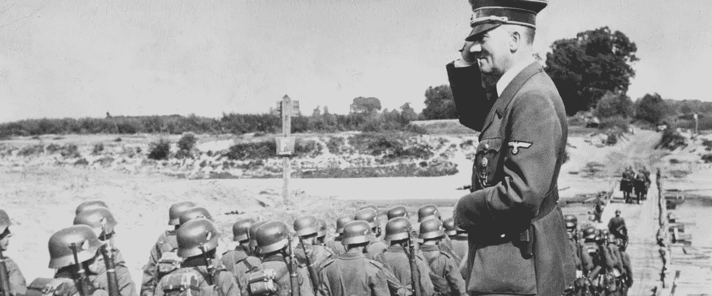
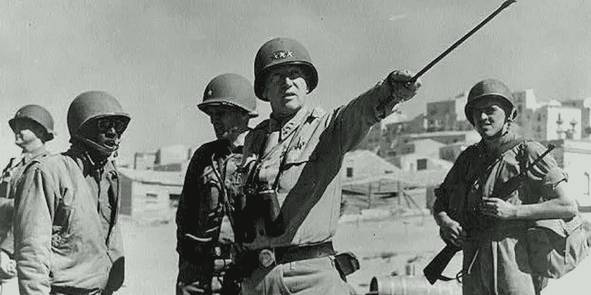
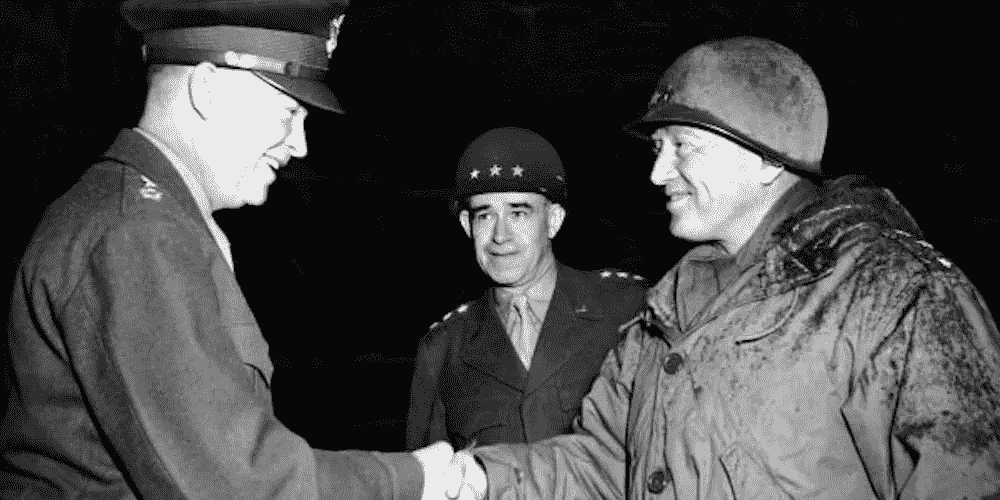
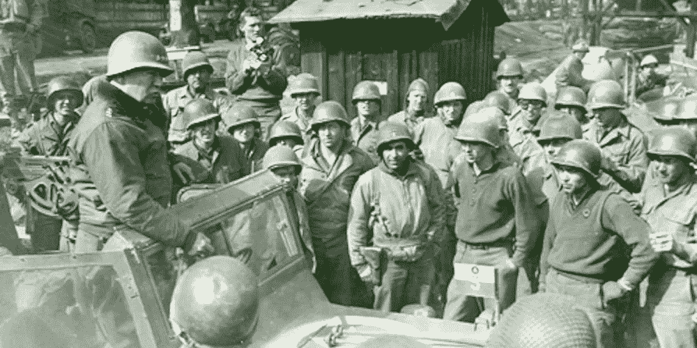

# 如何建立像小乔治·S·巴顿将军那样的个人品牌？

> 原文：<https://medium.com/hackernoon/how-to-build-your-personal-brand-like-general-george-s-patton-1556235622c9>

如果你想更令人难忘，就把自己塑造成一个象征。

在商界，他们称之为品牌 T1。无聊！

在政治上，他们可能会给你贴上 T2 漫画的标签。侮辱！

而*符号*是超级英雄的东西…

> “作为一个人，我是血肉之躯，我可以被忽视，我可以被毁灭；但作为一种象征……我可以是不腐不朽的，我可以是永恒的。” *—蝙蝠侠*

很少有人能像小乔治·S·巴顿将军那样成为一个象征

> “虽然我可能会走在死亡的阴影中，但我不会害怕邪恶，因为我是山谷中最卑鄙的混蛋。”—巴顿

随着巴顿脚步的节拍前进，成为一个象征…

# 你想要什么？/你想成为谁？

自从巴顿还是个孩子的时候，他就喜欢阅读历史上的伟大英雄和战斗，像大多数男孩一样，他在字里行间看到了自己。

> "通过毅力、学习和永恒的渴望，任何人都可以变得伟大." *—巴顿*

但与大多数男孩不同，他在那些战斗中看到了自己，因为他相信自己是以前战争英雄的转世。

一天，当巴顿沿着诺曼底的海滩散步时，他转向他的未婚妻，让她惊讶的是，他说他曾经在这里战斗过，“上辈子”，当两千年前罗马军团来征服的时候，有一天他会再次在这里战斗。三十年后，他将实现他的预言。

除了他的精神之外，他还感到通过他的血液与过去联系在一起。

当他去弗吉尼亚军事学院试穿军装时，老裁缝告诉年轻的巴顿，他的尺寸和他的父亲和祖父完全一样。

# 强调和不强调个性特征……

然后在明确了自己想要什么，想成为什么样的人之后，巴顿开始培养自己的形象。

> “对巴顿来说，领导力从来都不仅仅是制定计划和发布命令，而是将自己变成一个符号”——艾伦·阿克塞尔罗德，历史学家

在弗吉尼亚理工大学，他决定不再微笑，因为他认为这与一个严肃的军人不相称。相反，他会在镜子前练习他的“战争脸”。

为了进一步捕捉他想成为的人的本质，他在一本笔记本上写下了*骑兵领袖的特征…*

> *1.不屈的勇气 2。快速感知攻击时机 3。激发部队信心的能力。无论何时何地都要拼命工作。*

*他特别培养自己的勇气*(虽然有人可能会说这是勇气和愚蠢之间的一线之差)*。*

*当学生们练习射击时，巴顿会走出来站在靶子之间。当消息传到他的母亲那里时，他的母亲被告知他试图自杀，但乔治向她保证，他只是想看看子弹呼啸而过的感觉。*

# ***3)在某方面变得伟大…***

*以全班第一名的成绩毕业后，小乔治·S·巴顿渴望参加一场战争。*

*他很快在“结束一切战争的战争”中得到了这场战斗，也就是 WW1。*

> *"与其白活，不如为之奋斗。"——小乔治·S·巴顿*

*他勇敢地战斗，赢得了多枚奖牌。*

*然后和平来了。*

*但是和平并没有像理想主义者所希望的那样长久，因为几十年后，一场新的战争开始了，这场战争看起来比上一次更加血腥，代价也更加高昂。*

**

*现在，作为一个年长的人和一名将军，巴顿觉得这是他实现儿时梦想的荣耀的机会。*

*在历史上，有时人会顺应时代，但在其他浸淫于知识的场合，时代会顺应人。*

**

## ***这就是 1944 年 12 月一个寒冷的日子里的情形……***

*欧洲盟军最高司令德怀特·戴维·艾森豪威尔转向墙上的地图。他指着西方前线说，*“现在的形势对我们来说是一个机遇，而不是灾难！”**

*围坐在桌子旁的男人看起来毫无生气。*

*艾森豪威尔继续说道，“在这张会议桌前，只会有快乐的面孔。”但是很难责怪这些军官没有微笑，因为他们缺乏远见，牺牲了成千上万的士兵的生命，甚至更多。你看，在这次冷若冰霜的会议前几天，将军们还在争论谁应该获得骑着象征性的白马进入柏林的荣誉，但现在在纳粹的突然袭击打破了盟军防御的一个大洞后，他们现在被迫思考如何夺回他们刚刚花了几个月获得的土地，不仅如此，还要比以前更快，因为每过去一天都意味着数以千计的更多的士兵将死于敌人的防线。*

*但是我们很快就会发现，有一个人没有预见到这一点。*

*就是这个人，因为他的鲁莽经常被媒体嘲笑，因为他的好斗经常被他的同事批评。*

*他的名字叫小乔治·S·巴顿，这是他的时刻！*

*他插嘴说，“见鬼，让我们有胆量让那些狗娘养的一路跑到巴黎去。那我们就真的把他们切碎了，嚼碎了！”*

*将军们咕哝着表示同意，然后回到他们休息的脸上。*

*艾森豪威尔喜欢巴顿的讲话方式，但他想说实话，“乔治，这很好，但绝不能让敌人越过默兹河。”*

*巴顿吸了口雪茄。*

*艾克继续说道，*“一次反击至少要用三个师。什么时候可以开始？”**

*“只要你和我谈完了，”巴顿回答。*

**“什么时候可以进攻？”*艾森豪威尔出版社。*

**“十二月二十一日早晨”，*指两天后，又加了一句，*“同三师”，*手里还攥着点着的雪茄。*

*房间变得寂静无声。*

*10 万人带着足够的物资在 48 小时内移动 100 多英里来建造一个小城市的想法是荒谬的。然后在隆冬时节，在狭窄、结冰的道路上尝试这样的壮举近乎疯狂。看来巴顿的大嘴巴又一次战胜了他。*

**“别昏庸了，乔治，”*艾森豪威尔说。*

*巴顿看着他的副参谋长，他什么也没说，只是点点头，确认巴顿站在坚实的基础上。*

*“我们可以做到，”巴顿直视着艾森豪威尔的眼睛说。*

*巴顿的副官后来写道*“一阵骚动，脚步一拖，在场的人在椅子上直起身来。在某些方面，怀疑主义。但在房间里，兴奋的电流像火焰一样跳跃。”**

*随后，巴顿起身，在接下来的一个小时里提出了一份如何扭转战局的详细战略。*

*会议结束时，艾森豪威尔，计划明天接受他的第五颗星，和他的老朋友开玩笑说，“有趣的是，乔治，每次我得到一颗新的星，我就受到攻击。”*

**“是的，”*巴顿回敬。每次你受到攻击，我都会把你保释出来*

**

*然后，在总部的另一端，巴顿抓起电话，简单地说了一句，“打球吧。”*

*随着这一命令，巴顿让成千上万的人行动起来，正如历史有朝一日所写的那样:拯救了被困的部队，击退了德国人，并为纳粹棺材钉上了最后一颗钉子。*

# *宣传你的形象…*

*但是当巴顿的军队向北冲了 100 英里去营救他们被困的战友时，巴顿并没有简单地呆在温暖的帐篷里。*

> *"坐在转椅上从来没有做出过好的决定." *—巴顿**

*如果你碰巧是巴顿第三集团军的一名士兵，那么你可能会听到远处传来越来越快的喇叭声。*

**

*当你行进时，低头以减少你的脸暴露在寒风中，然后你会看到一个人站在一辆露天吉普车里。*

*当巴顿将军叼着雪茄飞驰而过时，你也许能听出他鼓励和亵渎的话语，比如:*

> *愿上帝怜悯我的敌人，因为我不会！”*

*这是巴顿传奇的素材，记者们喜欢写它，因为巴顿的个性从页面上蹦出来，或好或坏，但在这一时刻，巴顿将军如此清晰地代表了紧张的母亲和父亲希望他们的儿子成为的那种领导人，那些男孩把他们视为活生生的行动英雄的化身。*

# ***最终，***

*把自己变成一个符号也有坏处。最大的一个问题是，成为一个符号和成为一个刻板印象之间有一条细微的界限，这意味着人们可以很容易地把你一笔勾销，并把你放在一个盒子里，就像巴顿在一些场合发生的那样，人们认为他太咄咄逼人和太诚实，但成为一个符号的好处是，当人们需要这样一个盒子时，他们知道在哪里可以找到你。*

*一旦找到，愿你永远不会被遗忘。*

**感谢阅读！如果你喜欢这篇文章，那么你可能会喜欢我的视频文章播放列表:* [*《伟大的人生:历史伟人的人生教训》*](https://www.youtube.com/watch?v=HFp4lqyGTuE&list=PLRLLs01u4Pmz9szX0n-vWem0zF8iKo5Xn)*