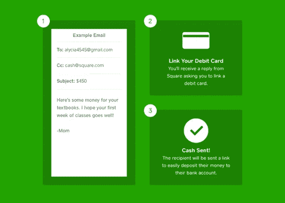

# 如何用现金购买比特币？

> 原文：<https://medium.com/hackernoon/how-to-buy-bitcoin-with-square-cash-app-88a768f98028>

## 随着购买比特币的选择越来越多，这里有一个详细的解释和一步一步的指导，带你使用 Square 的 Cash 应用程序购买比特币。

## 比特币强制介绍

**比特币**是一种加密货币和世界性支付系统。它是第一种去中心化的数字货币，因为该系统在没有中央银行或单一管理员的情况下工作。该网络是点对点的，交易直接在用户之间进行，没有中介。这些交易由网络节点通过使用加密技术进行验证，并记录在称为区块链的公共分布式账本中。比特币是由一个不知名的人或一群人以中本聪的名字发明的，并于 2009 年作为开源软件发布。

## 广场现金漫谈

Cash 是一款实用应用程序，是著名支付解决方案公司 Square 的产品之一，该公司已经凭借其创新解决方案进入了面向商家和小企业主的销售点系统领域。

 [## 试用现金应用程序

### 现金应用可以让你向朋友和家人转账，也可以用你的现金购买比特币

cash .我](https://cash.me/app/VQNHFWW) 

***现金*** 于 2013 年 4 月推出，帮助许多朋友只需轻轻一点就可以互相支付，就像发送电子邮件一样简单。任何拥有银行账户或借记卡的人都可以将你的卡链接到 Cash app，并开始发送/接收钱——让它成为你的晚餐费用或任何东西。

由于 Square 引入现金应用的想法是实现个人对个人的支付，并使其成为无缝体验，他们一直非常成功。

 [## 尝试一下——立即获取现金应用程序

### 现金应用可以让你向朋友和家人转账，也可以用你的现金购买比特币

cash .我](https://cash.me/app/VQNHFWW) 

## 支持用现金购买/出售比特币

现在是 2017 年 12 月，Square 已经做出决定，让他们的客户能够在[现金应用](https://cash.me/app/VQNHFWW)上买卖比特币。这基本上使他们现有的所有 Android 和 iOS 客户更接近拥有比特币。这听起来可能没有实际的那么大——但是对于主流的采用来说，这已经是很大的进步了。

## 现在最大的问题是——如何购买？

## 第一步:获取现金应用程序

 [## 尝试一下——立即获取现金应用程序

### 现金应用可以让你向朋友和家人转账，也可以用你的现金购买比特币

cash .我](https://cash.me/app/VQNHFWW) 

## 第二步:链接你的银行账户或借记卡

## 第三步:探索现金应用程序，寻找比特币

## 第四步:回顾并购买比特币

这就是你如何浏览现金应用程序，并最终购买你的比特币。所有价格都是基于不同交易所的市场汇率。在这个时间点上，比特币买卖没有转换费或便利费。

> 祝你的比特币之旅一切顺利

## 放弃

> PS:这不是一个投资建议，你需要咨询一个合适的财务顾问来做任何合适的投资。我不为[广场](http://squareup.com)工作。这只是一篇教育性文章，解释了这些服务的提供商所提供的可能性。自己做决定&自己做研究。
> 
> 永远——永远缴纳税款，永远不要试图逃税！

> "使用 [BearTax](https://bear.tax) 提交你的加密货币税！"

 [## BearTax -您的加密税务助理

### 易于使用的平台，密码交易员进口交易，计算收益和文件税。

熊税](https://bear.tax)