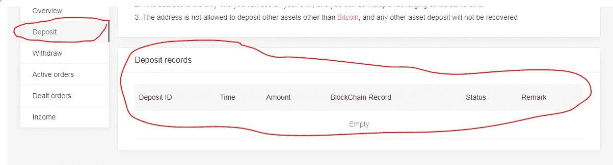

# 如何购买 QLC QLINK

> 原文：<https://medium.com/hackernoon/how-to-buy-qlink-aka-qlc-c34831ce0c76>

## 了解什么是 QLINK、QLINK 的用途以及如何从 KuCoin 购买 QLC 令牌的综合指南。

## QLINK 简介

我认为至少了解你要购买的东西的最基本的东西是很重要的，所以这篇文章和以后所有的文章都将包括一个简短的介绍来帮助你开始。

Qlink 的目标是建立世界上第一个分散式移动网络，这将扩大网络覆盖范围，降低电信基础设施的成本，并奖励用户共享未使用的网络资产。通过利用区块链技术，Qlink 将数字身份应用于电信资产，重新包装这些资产，并将每项资产的使用足迹记录到分布式分类账中。此外，Qlink 旨在推出旨在允许点对点共享资产的应用程序，包括 WiFi、移动数据访问和企业对企业短信。

**如何购买 QLINK**

在[比特币基地](https://www.coinbase.com/join/5940a7b706041a01971db0ec)上购买以太币或比特币。你可以使用下面的指南来购买它们。如果你已经有比特币或者以太坊，可以跳过这一步。

 [## 如何在美国、澳大利亚、欧洲和新加坡购买比特币

### 解释如何在美国、澳大利亚、新加坡和欧洲使用银行购买第一枚比特币的综合指南…

hackernoon.com](https://hackernoon.com/a-beginners-guide-to-buying-bitcoin-8cf715421a9c)  [## 如何在美国、澳大利亚、欧洲和新加坡购买以太坊

### 我们将解释如何购买以太坊，这是一种比比特币更先进的实现方式，被誉为下一个脸书

hackernoon.com](https://hackernoon.com/a-beginners-guide-to-buying-ethereum-e11c73b5e5ed) 

一旦你有了[比特币](https://www.coinbase.com/join/5922da0103b62e7e9e6b9df8)或[以太坊](https://www.coinbase.com/join/5922da0103b62e7e9e6b9df8)，你就可以前往[库币](https://www.kucoin.com/#/?r=1R8v3)，QLC 在那里上市并可以交易。

*   在 KuCoin 上注册——这是一个很酷的交流平台，有非常好的用户界面，也很实用，不会把杂乱的东西扔到你的脸上。
*   设置双因素身份验证时，保存恢复密钥很重要。万一你的手机丢了或者你换了手机，你需要这个密钥来让谷歌认证器正常工作。
*   使用用户名、密码和 2FA 登录后，您将进入资产屏幕，如果没有，请单击顶部菜单栏上的“资产”。

您可以登录并点击顶部导航栏中的资产，找到您的 [KuCoin](https://www.kucoin.com/#/?r=1R8v3) ETH 钱包地址。然后点击存款，从列表中选择 ETH(注意，也有一个 ETF 有类似的符号。不要向该地址发送 ETH 资金，因为它们可能会丢失)。这将加载您的库币以太坊地址。复制这个，然后打开你的[比特币基地](https://www.coinbase.com/join/5940a7b706041a01971db0ec)账户。

*   单击资产后，从侧面菜单项中选择存款，如下所示

*   在存款屏幕上，您将有一个下拉菜单来选择一项资产(比特币或以太坊或您随身携带的任何东西)。选择以太坊查看存款地址或比特币查看比特币存款地址。

*   使用这个钱包地址从[比特币基地](https://www.coinbase.com/join/5940a7b706041a01971db0ec)或任何其他你拥有比特币或以太坊的交易所发送你的资金。
*   向下滚动时，您可以看到所选资产的存款历史，如下所示

*   一旦你看到你的存款被确认，你可以向上滚动到顶部的菜单，点击 ***市场—*** ，这将显示你可以交易 QLC 的不同对。

如果你已经将比特币存入 [KuCoin](https://www.kucoin.com/#/?r=1R8v3) ，点击 BTC 标签，你会看到 QLC/BTC。

不要点击它——按照下面的步骤轻松购买/销售

如果您已经将以太币存入[库币](https://www.kucoin.com/#/?r=1R8v3)，点击 ETH 标签，您可以看到 QLC/ETH 对。不要点击它，因为你可以在这个屏幕上直接购买/出售。

在 QLC 代币进入其他交易所并变得出名之前，按照下面的截图和评论来完成你的购买。

完成 QLC 购买后，您可以转到顶部的资产菜单项，查看活动订单或已处理订单，以查看您的 QLC 代币。如果它在活跃订单中，这意味着 QLC 还没有被购买——但订单已经被下了——当它达到我们提到的价格时，它将被自动购买并转移到成交订单。

## 太棒了&恭喜

耶！您已经在库币交易所成功购买了 QLC 代币。

KCS——ku coin 股票也是一个有趣的概念，请从下面的文章中了解更多。

 [## 查看 KCS-库币公司的股票，它可以支付股息并节省 50%的交易费用。

### 币安和库科恩提供 BNB 和 KCS，可以为您节省 50%的费用，但也作为良好的长期投资。这是…

hackernoon.com](https://hackernoon.com/binance-kucoin-bnb-kcs-can-save-you-fees-be-a-good-investment-822d38cffd0) 

> "使用 [BearTax](https://bear.tax) 提交您的加密货币税！"

 [## BearTax —您的加密税务助手

### 易于使用的平台，密码交易员进口交易，计算收益和文件税。

熊税](https://bear.tax) 

> **免责声明** : **我正在使用我的推荐链接进行各自的交流。如果你使用它们，它有助于我的账单和提前写更多的信息文章。提前感谢。** *🙏*

***如果你喜欢这篇文章并继续获得更新，请关注我的*** [***推特***](http://twitter.com/confusedcoin) ***和*** [***中***](/@deepthivazrala) ***。***