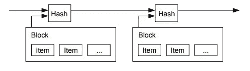

# 如何购买纳米(雷布洛克斯)又名 XRB

> 原文：<https://medium.com/hackernoon/how-to-buy-raiblocks-aka-xrb-8bfaac294364>

## 了解什么是纳米货币(以前称为 RaiBlocks)，它的令牌，目的以及如何从交易所购买 XRB 令牌的综合指南。

## RaiBlocks 的介绍现在更名为纳米货币

我认为至少了解你要购买的东西的最基本的东西是很重要的，所以这篇文章和以后所有的文章都将包括一个简短的介绍来帮助你开始。

 [## Nano 更名公告

### 对我们宝贵的社区，

medium.com](/@nanocurrency/nano-rebrand-announcement-9101528a7b76) 

RaiBlocks 旨在成为一种全新的货币，就像比特币一样，但它与现有的区块链技术相比有几个不同之处和优势。

Traditional Blockchain Layout

传统上，区块链是包含所有事务的数据块的单行文件。这一行从一个“起源块”开始，在第一个块之后一次添加一个新的块。区块链可以记录网络上发生的交易，但个人钱包的余额不会直接存储在区块链上。为了解决这个问题，区块链币(像比特币一样)必须参考链中以前的交易，以确保一个地址不能发送相同的比特币两次(大多数人称之为双重支出)。

RaiBlocks 对此采取了一种完全不同的方法，他们称之为 Block Lattice。在这个系统中，每个账户持有人都有自己的私人区块链，每个账户持有一笔交易。账户和个人区块链的集合称为分类账。这意味着每个事务需要两部分，一个发送和接收地址。

The RaiBlocks Block Lattice

当用户 A 从用户 B 收到资金时，用户 A 在其区块链上生成一个接收地址，而用户 B 生成一个指向用户 A 账户的花费地址。

如果你了解 IOTA 和 Tangle，这个系统可能看起来很熟悉，这是有原因的。这两种系统都称为有向无环图。和 IOTA 类似，RaiBlocks 没有矿工，没有交易费用，接近即时交易。然而，它与 IOTA 的不同之处在于，它是为个人对个人的交易而设计的，而 IOTA 主要是为机器之间的小额支付而设计的。此外，RaiBlocks 的基础本质上是许多小区块链，所以它不像 IOTA 那样未经证实。如果你想更深入地了解 RaiBlocks 是如何工作的，你可以从他们的[白皮书](https://raiblocks.net/media/RaiBlocks_Whitepaper__English.pdf)开始，但谷歌也是你的朋友:d。如果你想了解更多关于 IOTA 的信息，点击[这里](https://hackernoon.com/where-how-to-buy-iota-6a84dcadb470)阅读我的购买指南！

现在所有这些都解决了，让我们回到购买上来。

## 如何购买 XRB 纳米货币

*   在比特币基地购买以太币或比特币。你可以使用下面的指南来购买它们。如果你已经有比特币或者以太坊，可以跳过这一步。

 [## 如何在美国、澳大利亚、欧洲和新加坡购买比特币

### 解释如何在美国、澳大利亚、新加坡和欧洲使用银行购买第一枚比特币的综合指南…

hackernoon.com](https://hackernoon.com/a-beginners-guide-to-buying-bitcoin-8cf715421a9c)  [## 如何在美国、澳大利亚、欧洲和新加坡购买以太坊

### 我们将解释如何购买以太坊，这是一种比比特币更先进的实现方式，被誉为下一个脸书

hackernoon.com](https://hackernoon.com/a-beginners-guide-to-buying-ethereum-e11c73b5e5ed) 

*   一旦你有了[比特币](https://www.coinbase.com/join/5922da0103b62e7e9e6b9df8)或[以太坊](https://www.coinbase.com/join/5922da0103b62e7e9e6b9df8)，你就可以前往[库币](https://www.kucoin.com/#/?r=1R8v3)，XRB 在那里上市并可以交易。
*   在 ku coin[上注册——这是一个很酷的交流平台，有非常好的用户界面，也很实用，不会把杂乱的东西扔到你的脸上。](https://www.kucoin.com/#/?r=1R8v3)
*   设置双因素身份验证时，保存恢复密钥很重要。万一你的手机丢了或者你换了手机，你需要这个密钥来让谷歌认证器正常工作。
*   使用用户名、密码和 2FA 登录后，您将进入资产屏幕，如果没有，请单击顶部菜单栏上的“资产”。

您可以通过登录并点击顶部导航栏中的资产来找到您的 KuCoin ETH 钱包地址。然后点击存款，从列表中选择 ETH(注意，也有一个 ETF 有类似的符号。不要向该地址发送 ETH 资金，因为它们可能会丢失)。这将加载您的库币以太坊地址。复制这个，然后打开你的[比特币基地](https://www.coinbase.com/join/5922da0103b62e7e9e6b9df8)账户。

*   单击资产后，从侧面菜单项中选择存款，如下所示

*   在存款屏幕上，您将有一个下拉菜单来选择一项资产(比特币或以太坊或您随身携带的任何东西)。选择比特币查看存款地址或以太坊查看以太坊存款地址。

*   使用这个地址从比特币基地或任何其他你拥有比特币或以太坊的交易所发送你的资金。
*   向下滚动时，您可以看到所选资产的存款历史，如下所示

*   一旦你看到你的存款被确认，你可以滚动到顶部的菜单，点击 ***【市场】—*** ，这将显示你可以交易**的不同对。**

****

**如果你已经将比特币存入 [KuCoin](https://www.kucoin.com/#/?r=1R8v3) ，点击 BTC 标签，你会看到 XRB/BTC。**

**不要点击它——按照下面的步骤轻松购买/销售**

**如果您已经将以太坊存入[库币](https://www.kucoin.com/#/?r=1R8v3)，点击 ETH 标签，您可以看到 XRB/ETH 对。不要点击它，因为你可以在这个屏幕上直接购买/出售。**

****

**在 XRB 代币进入其他交易所并变得出名之前，按照下面的截图和评论来完成你的购买。**

****

**完成 XRB 购买后，您可以转到顶部的资产菜单项，查看活动订单或已处理订单，以查看您的 XRB 代币。如果它在活跃订单中，这意味着 XRB 还没有被购买——但订单已经被下了——当它达到我们提到的价格时，它将被自动购买并转移到成交订单。**

## **太棒了&恭喜**

**耶！您已经在库币交易所成功购买了 XRB 代币。库币交易所还提供各种其他配对，如尼奥、USDT 和 KCS。你也可以用它们来购买 XRB。**

**KCS——ku coin 股票也是一个有趣的概念，请从下面的文章中了解更多。**

** [## 查看 KCS-库币公司的股票，它可以支付股息并节省 50%的交易费用。

### 币安和库科恩提供 BNB 和 KCS，可以为您节省 50%的费用，但也作为良好的长期投资。这是…

hackernoon.com](https://hackernoon.com/binance-kucoin-bnb-kcs-can-save-you-fees-be-a-good-investment-822d38cffd0)** 

> **你在学习购买加密货币的同时，也需要对加密货币交易**负责，纳税**。这里有一篇文章试图**减少混淆，并澄清**关于加密交易收益税的问题。**

** [## 如何使用 BearTax 对加密货币收益征税

### 比特币基地、GDAX、Gemini 等地的密码交易员迫切需要计算他们从比特币中获得的收益

hackernoon.com](https://hackernoon.com/how-to-pay-bitcoin-cryptocurrency-tax-reliable-tools-beartax-bfce8bbb81bc)  [## BearTax —您的加密税务助手

### 易于使用的平台，密码交易员进口交易，计算收益和文件税。

熊税](https://bear.tax) 

感谢阅读。希望你已经发现它的信息。如果你想收到我的新文章的更新，请在[Twitter](http://twitter.com/confusedcoin)&[Medium](/@vvkr)上关注我**