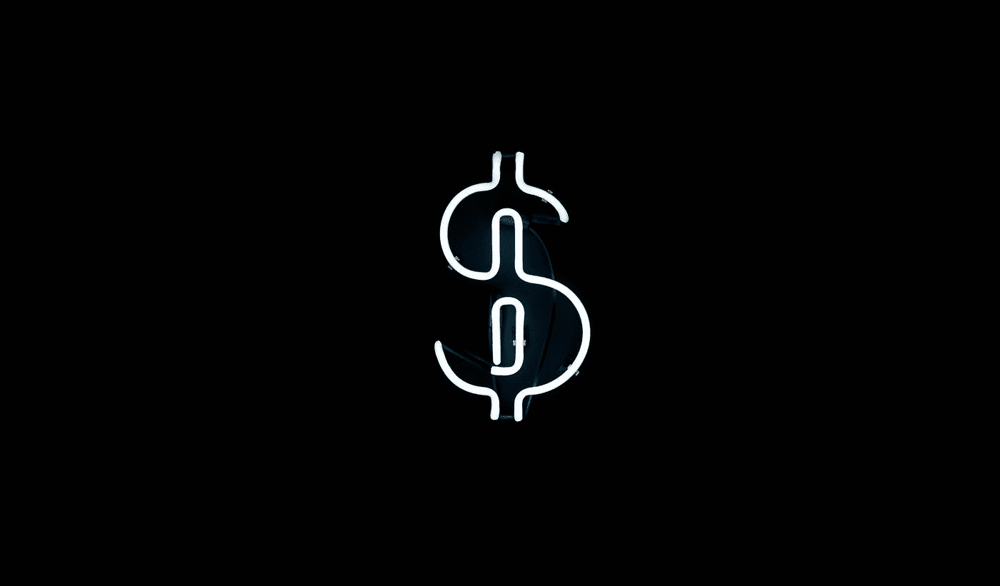
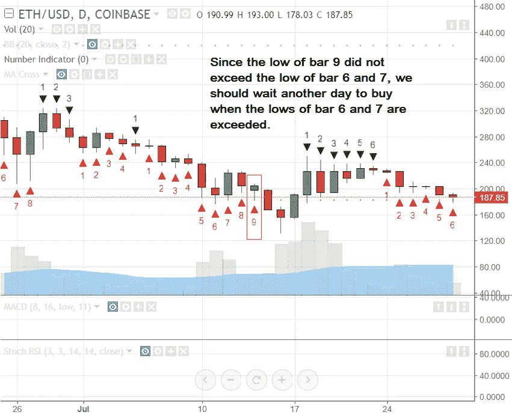
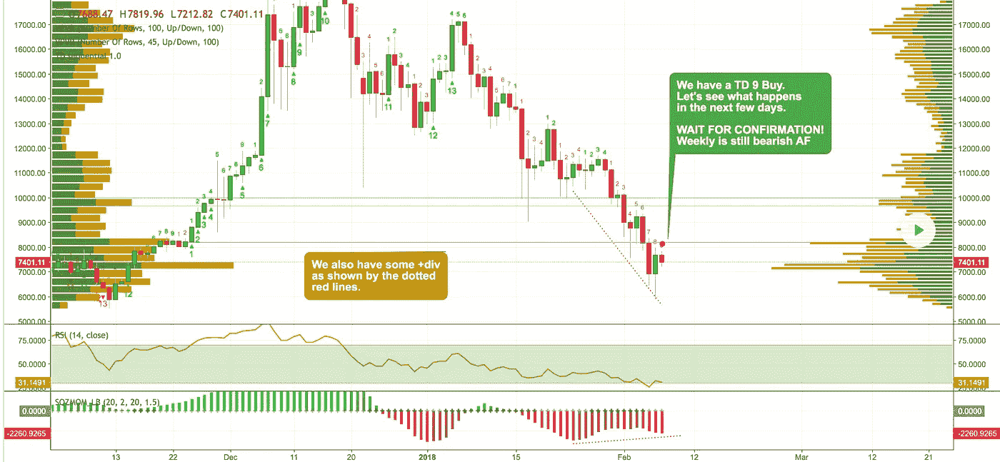
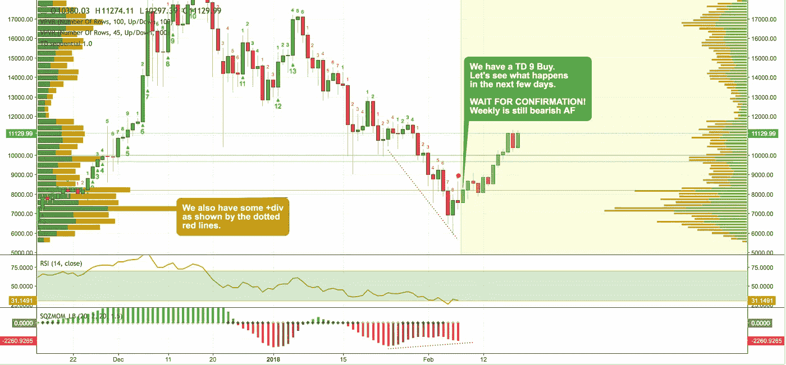
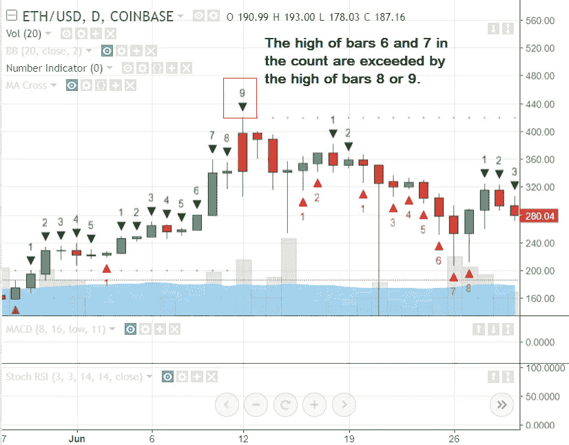
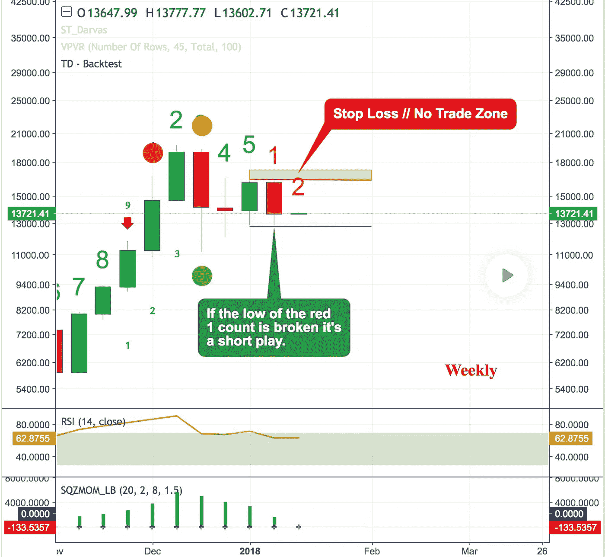
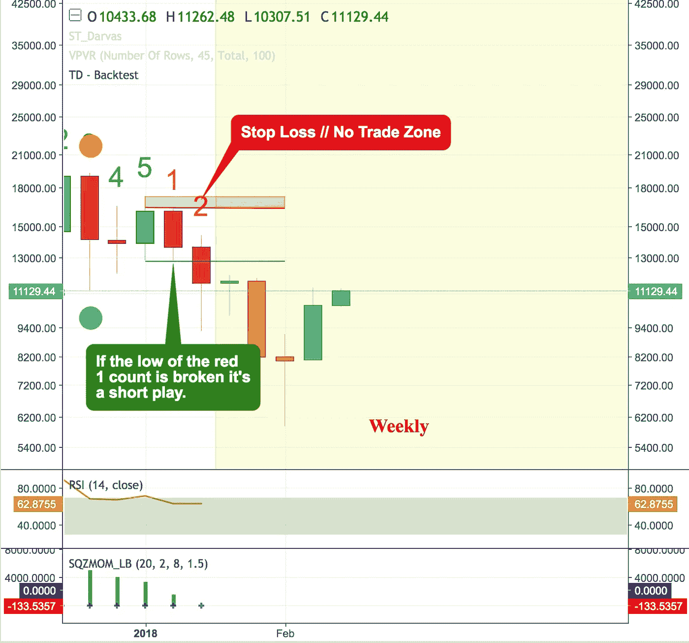

# 如何用 TD 序列指标买卖加密货币

> 原文：<https://medium.com/hackernoon/how-to-buy-sell-cryptocurrency-with-number-indicator-td-sequential-5af46f0ebce1>

*免责声明:我不是财务顾问。对于*[](https://hackernoon.com/tagged/crypto-investing)**，请做好自己的尽职调查。* ***永远不要投入你输不起的钱*** *。* [*加密货币*](https://hackernoon.com/tagged/cryptocurrency) *市场波动极大。* ***投资自担风险*** *。**

**

*“In the business world, the rearview mirror is always clearer than the windshield.” ~Warren Buffett~*

*我发现这个指标是一个简单的方法来表明在哪里卖或买。*

***什么是 TD 顺序指标？***

*数字指标，用于标识价格点，在此处上升趋势或下降趋势耗尽并反转。它给你一个建议，在哪里买，在哪里卖。*

*我们在看什么？*

*   *一系列九根蜡烛线，每根蜡烛线的收盘价都高于/低于第四根蜡烛线的收盘价。*

***什么时候有买入推荐？***

*   *当你看到 9 个连续的收盘时，**比之前的 4 个收盘低。***
*   *理想的买入是当第 6 和第 7 条的低点被第 8 或第 9 条的低点超过时。*

*参见下面的买入建议示例*

**

*在下面的例子中，我们买入了一只 TD 9，让我们看看接下来会发生什么*

****

***什么时候有卖出推荐？***

*   *当您看到 9 个连续收盘的**比之前收盘的 4 根蜡烛的**高。*
*   *理想的卖出是当第 6 和第 7 根棒线的高点被第 8 和第 9 根棒线的高点超过时。*

*参见下面推荐卖出的例子。*

**

*Sell by TD Sequential*

*另一个例子是当红色 1 计数的低点被打破时的卖出建议。这是一部短剧。*

**

*Number Indicator / TD Sequential indicator sell*

*下面是 TD 指标卖出推荐后的结果。*

**

*Tone Vays 因使用该指标而非常出名，尽管 Tone 稍微修改了 TD 序列。*

*要在 TradingView 上试用此 TD 指标，请复制粘贴此实现*

```
*study("Number Indicator / Thomas DeMark Sequential",overlay=true)
transp=input(0)
Numbers=input(true)
SR=input(true)
Barcolor=input(true)
TD = close > close[4] ?nz(TD[1])+1:0
TS = close < close[4] ?nz(TS[1])+1:0TDUp = TD - valuewhen(TD < TD[1], TD , 1 )
TDDn = TS - valuewhen(TS < TS[1], TS , 1 )
plotshape(Numbers?(TDUp==1?true:na):na,style=shape.triangledown,text="1",color=green,location=location.abovebar,transp=transp)
plotshape(Numbers?(TDUp==2?true:na):na,style=shape.triangledown,text="2",color=green,location=location.abovebar,transp=transp)
plotshape(Numbers?(TDUp==3?true:na):na,style=shape.triangledown,text="3",color=green,location=location.abovebar,transp=transp)
plotshape(Numbers?(TDUp==4?true:na):na,style=shape.triangledown,text="4",color=green,location=location.abovebar,transp=transp)
plotshape(Numbers?(TDUp==5?true:na):na,style=shape.triangledown,text="5",color=green,location=location.abovebar,transp=transp)
plotshape(Numbers?(TDUp==6?true:na):na,style=shape.triangledown,text="6",color=green,location=location.abovebar,transp=transp)
plotshape(Numbers?(TDUp==7?true:na):na,style=shape.triangledown,text="7",color=green,location=location.abovebar,transp=transp)
plotshape(Numbers?(TDUp==8?true:na):na,style=shape.triangledown,text="8",color=green,location=location.abovebar,transp=transp)
plotshape(Numbers?(TDUp==9?true:na):na,style=shape.triangledown,text="9",color=green,location=location.abovebar,transp=transp)plotshape(Numbers?(TDDn==1?true:na):na,style=shape.triangleup,text="1",color=red,location=location.belowbar,transp=transp)
plotshape(Numbers?(TDDn==2?true:na):na,style=shape.triangleup,text="2",color=red,location=location.belowbar,transp=transp)
plotshape(Numbers?(TDDn==3?true:na):na,style=shape.triangleup,text="3",color=red,location=location.belowbar,transp=transp)
plotshape(Numbers?(TDDn==4?true:na):na,style=shape.triangleup,text="4",color=red,location=location.belowbar,transp=transp)
plotshape(Numbers?(TDDn==5?true:na):na,style=shape.triangleup,text="5",color=red,location=location.belowbar,transp=transp)
plotshape(Numbers?(TDDn==6?true:na):na,style=shape.triangleup,text="6",color=red,location=location.belowbar,transp=transp)
plotshape(Numbers?(TDDn==7?true:na):na,style=shape.triangleup,text="7",color=red,location=location.belowbar,transp=transp)
plotshape(Numbers?(TDDn==8?true:na):na,style=shape.triangleup,text="8",color=red,location=location.belowbar,transp=transp)
plotshape(Numbers?(TDDn==9?true:na):na,style=shape.triangleup,text="9",color=red,location=location.belowbar,transp=transp) //------------//
// Sell Setup //
//------------//
priceflip = barssince(close<close[4])
sellsetup = close>close[4] and priceflip
sell = sellsetup and barssince(priceflip!=9)
sellovershoot = sellsetup and barssince(priceflip!=13)
sellovershoot1 = sellsetup and barssince(priceflip!=14)
sellovershoot2 = sellsetup and barssince(priceflip!=15)
sellovershoot3 = sellsetup and barssince(priceflip!=16)//----------//
// Buy setup//
//----------//
priceflip1 = barssince(close>close[4])
buysetup = close<close[4] and priceflip1
buy = buysetup and barssince(priceflip1!=9)
buyovershoot = barssince(priceflip1!=13) and buysetup
buyovershoot1 = barssince(priceflip1!=14) and buysetup
buyovershoot2 = barssince(priceflip1!=15) and buysetup
buyovershoot3 = barssince(priceflip1!=16) and buysetup//----------//
// TD lines //
//----------//
TDbuyh = valuewhen(buy,high,0)
TDbuyl = valuewhen(buy,low,0)
TDsellh = valuewhen(sell,high,0)
TDselll = valuewhen(sell,low,0)//----------//
//   Plots  //
//----------//plot(SR?(TDbuyh ? TDbuyl: na):na,style=circles, linewidth=1, color=red)
plot(SR?(TDselll ? TDsellh : na):na,style=circles, linewidth=1, color=lime)
barcolor(Barcolor?(sell? #FF0000 : buy? #00FF00 : sellovershoot? #FF66A3 : sellovershoot1? #FF3385 : sellovershoot2? #FF0066 : sellovershoot3? #CC0052 : buyovershoot? #D6FF5C : buyovershoot1? #D1FF47 : buyovershoot2? #B8E62E : buyovershoot3? #8FB224 : na):na)*
```

*一个理想的设置往往是一个更好的指标，因为常规的设置往往是在稍后的日期完善。*

*你应该明白一个设置不能保证反方向的反应。如果趋势方向的势头太强，反转很可能会被取消。*