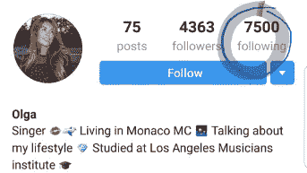

# 如何绕过 Instagrams“一天 1000 个跟随”的限制

> 原文：<https://medium.com/hackernoon/how-to-bypass-instagrams-1000-follows-a-day-limit-ccbce6ab5ded>

## (使用自动化软件时)

Photo courtesy of [Unsplash](https://unsplash.com/photos/R-8Kkjaztn0)

任何一个 [Instagram](https://hackernoon.com/tagged/instragram) 的营销人员都知道，在这个平台上，你每天可以“喜欢”和“关注”的人数是有每日和每周限制的，即使是在使用 NinjaGram 或 Instavast 这样的自动化软件时。这限制了你在不支付广告或推销费用的情况下所能获得的“自然”增长。

我最近偶然发现了一个 Instagram [营销](https://hackernoon.com/tagged/marketing)策略来绕过这个限制，这个策略非常有趣，我忍不住分享了一下。下面贴出来了，好好享受！

我正在例行检查我在 NinjaGram 上运行的一个客户的 Instagram 账户。正如你们中的许多人所知，NinjaGram 是一个自动软件，它为你追随和取消追随人，以帮助你增加你的帐户。(如果不太了解 Instagram 自动化，建议看[这篇文章](https://blog.markgrowth.com/how-i-built-a-2-189-follower-instagram-referral-machine-in-60-days-985057fac6db))。我把它设置为关注我客户的一个竞争对手的所有关注者，并检查该账户的信息。

很多时候，当你一天关注 1000 人时，你会用聊天机器人自动应答器关注几个账户。当你关注他们的账户时，他们就会被触发，通常会说这样的话:

> “嗨*插入您的用户名*感谢您关注我，我喜欢您的照片。点击此链接查看一些垃圾邮件…等等。”

在删除一堆自动消息时，我注意到我有 3 条来自不同账户的消息，名字都非常相似，比如“. Olla.Music”、“Olla”。音乐”和“Olla_Music”。三个账户都发了一条信息说:

> “感谢您关注我，我已经将我的帐户名称改为@ Olla。音乐，如果你想跟着我，我会很感激。”

….什么？显然是自动化的，但显然是天才。

在检查了这三个账户后，他们都关注了大约 7500 人(标准 Instagram 账户的上限)，并且都有大约 4000 名粉丝。

每个账户都有 50 张名为奥尔加的音乐家的高质量照片。

我快速搜索了一下，看看她创建了多少个账户，结果令我震惊。20 多！

我非常好奇她的主账号有多少粉丝，以及有多少人点击关注它。

点击 Olga 主账户的链接后，我惊讶地发现她有超过 60，000 名粉丝，粉丝参与度很高。

3.5K Likes in 1 day is great engagement.

60，000 名追随者都来自一个简单的策略，即创建一个带有自动消息的虚拟账户。

这种策略基本上可以扩展到无限量的账户，一旦达到 7，500 个粉丝的限制(如果你想让你的策略更加微妙)，就可以立即离开(就像 Olga 的情况)或删除。

# 想要更多细节？

如果你真的很想建立你的 Instagram，并且你理解了这篇文章的内容，我有一个更深入的免费的 Instagram 指南，我很乐意发给你一些操作视频和一些自动化技巧。

[点击此处获取指南](https://www.fiund.com/instagram-automation/)