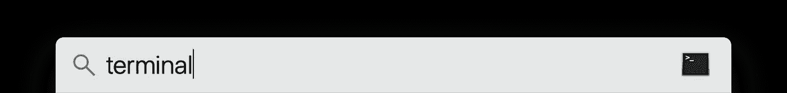

# 如何绕过 Safari 12“不安全扩展”警告

> 原文：<https://medium.com/hackernoon/how-to-bypass-safari-12-unsafe-extension-warning-c96349121e59>


Image from [https://georgegarside.com/blog/macos/install-any-safari-extension-macos-mojave/](https://georgegarside.com/blog/macos/install-any-safari-extension-macos-mojave/)

在 [Safari](https://hackernoon.com/tagged/safari) 12 中，苹果移除了下载第三方[扩展](https://hackernoon.com/tagged/extensions)的可能性，这些扩展在 **Safari 扩展库**上不可用。

希望有一种方法可以绕过这个问题，我会在这个故事中告诉你。

> **更新:**如果你使用的是 Safari 13，有一个更快的方法:只需激活开发菜单，在底部有一个允许不安全扩展的按钮

# 在本教程中，我们将使用 **Muz.li** 扩展作为示例。

首先，让我们下载扩展。


下载完成后，您的下载文件夹中应该有以下文件:


现在，让我们打开这个奇怪的应用程序(当然，如果你不是开发人员😊)称为**端子**。要打开它，只需点击 **Cmd+space** 进行简单的 Spotlight 搜索。



打开后，键入下面一行并按回车键:

```
cd Downloads
```

*这将告诉应用程序打开你的下载文件夹。*

然后，您将复制下面的代码行，但是您将用您试图下载的扩展替换“Muzli”。

```
xar -xf Muzli.safariextz
```

这将解包你的扩展。

现在，打开 Safari，点击 **Cmd+，**。这将打开设置窗口。并导航到**高级**。

现在，勾选最后一个复选框，这将启用开发模式。


然后在**开发**菜单中，转到扩展构建器。


一旦您打开了扩展构建器，您应该会看到一个窗口弹出。


现在，您将选择解压后的文件夹，该文件夹的名称末尾会有**。safari 扩展**。

一旦你打开了扩展，只需点击**执行**按钮来安装你的扩展。


# 你完了🎉

如果你喜欢这个故事，不要犹豫，垃圾邮件，鼓掌👏按钮😊。

**来源:**

*   图片:[https://georgegarside . com/blog/MAC OS/install-any-safari-extension-MAC OS-mojave/](https://georgegarside.com/blog/macos/install-any-safari-extension-macos-mojave/)
*   技巧:StackOverflow