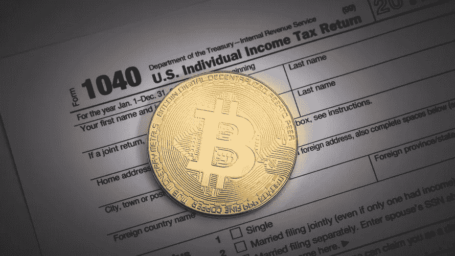

# 如何计算你的比特币税——完整指南

> 原文：<https://medium.com/hackernoon/how-to-calculate-your-bitcoin-taxes-the-complete-guide-53a6e55db8fd>

报告你的交易收益并正确完成你的[比特币](https://hackernoon.com/tagged/bitcoin)税变得越来越重要。在看到比特币和其他加密货币的市值在 2017 年从 150 亿美元增长到 6000 亿美元后，世界各国政府都更加关注比特币和其他加密货币。本指南分解了比特币税的基本原理，并介绍了美国的申报流程。

# 比特币税收基础

根据 2014 年发布的首个也是唯一一个 [**美国国税局官方指导**](https://www.irs.gov/pub/irs-drop/n-14-21.pdf) ，出于税收目的，比特币应被视为财产——而非货币。以太坊、莱特币、Ripple 等所有加密货币都是如此。出于税收目的，比特币必须被视为拥有任何其他形式的财产(股票、黄金、房地产)。这意味着你需要申报你在交易比特币和其他密码时实现的资本收益和损失。在国税局看来，不这样做在技术上是税务欺诈。

# 什么是资本收益？

资本收益是资本资产(一种投资类型的资产)价值的上升，使其价值高于购买价格。大多数政府对这些资本收益征税。

# 我如何计算我的比特币资本收益？

*第一步:理解什么被认为是应税事件——也就是当你实际上因比特币交易的资本收益而欠政府钱的时候。以下摘自 2014 年* *的*[*IRS 官方指南，关于什么被视为应税事件:*](https://www.irs.gov/pub/irs-drop/n-14-21.pdf)

*   将加密货币转换成美元等法定货币是一项应税行为
*   将加密货币转换为加密货币是一项应税事件(您必须在交易时以美元计算公平市场价值)
*   将加密货币用于商品和服务是一个应税事件(同样，您必须在交易时以美元计算公平市场价值；你可能还会欠销售税)
*   将加密货币作为礼物赠送不是应税事件(接受者继承成本基础； [**赠与税**](https://turbotax.intuit.com/tax-tips/estates/the-gift-tax/L1sFpFeXV) 如果超过赠与税免税额，仍然适用)
*   钱包之间的转账不是应税事件(您可以在交易所或钱包之间转账，而不会产生资本损益，因此请确保根据交易所的记录检查您的记录，因为交易所可能会将转账算作应税事件，以此作为避风港)
*   用美元购买加密货币不是应税事件。直到你交易、使用或出售你的密码，你才意识到收益。如果你持有一年以上，你可以实现长期资本收益(大约是短期资本收益的一半)，如果你持有不到一年，你实现短期资本收益和损失。

## 步骤 2:确定你的成本基础

既然清楚了什么时候必须纳税，那么理解纳税背后的确切过程就很重要了。你首先必须确定你持有的成本基础。你的成本基础是你投入多少钱来购买财产。对于比特币和加密资产，它包括购买价格以及与购买比特币相关的所有其他成本。其他成本通常包括交易费和你从交易所购买的经纪佣金。因此，要计算您的成本基础，您需要执行以下操作:

(密码购买价格+其他费用)/持有数量=成本基础

例如，如果你在 2017 年 11 月投资了 1000 美元的比特币，那将为你购买大约 0.06 个比特币。比方说，你还向比特币基地支付了 1.49%的交易费。你的成本基础是这样计算的:($1000 + 1.49%*1000)/0.06 =每比特币 16，915 美元或*每 0.06 比特币 1，014.90 美元*

## 第三步:计算你的资本损益决定你的资本损益的最后一步是从你的比特币售价中减去你的成本基础。

销售价格—成本基础=资本损益

举个例子，假设一个月后你正好卖出了 0.06 个比特币，因为每枚比特币的价格已经涨到了 20，000 美元(或者 0.06 个比特币的价格是 1，200 美元)。这将被视为应税事件(将加密货币转换为法定货币)，您将按如下方式计算收益:

1，200–1，014.90 = 185.10 美元资本收益

你需要为 185.10 美元的资本收益缴税。

如果你经常交易比特币，记录交易价格和你的成本会很快变得繁琐。密码交易商。税务是 [**比特币税务软件**](https://www.cryptotrader.tax/) 可以自动为你运行这些计算，并给你一份可导出的报告交给税务员。你也可以用它来避免支付昂贵的费用给“加密会计师”来代表你做同样的计算。

# 确定公平市场价值

当您考虑加密到加密的交易场景时，这个简单的资本收益计算变得有点复杂(请记住，这也会触发应税事件)。迄今为止，一个被忽略的重要信息是公平市场价值。让我们看另一个例子来理解公平市场价值是如何联系在一起的。假设你购买了价值 100 美元的比特币，包括交易和经纪费。那 100 美元目前大约可以买到 0.01 个比特币。现在让我们假设两个月后你把你所有的 0.1 比特币换成了 0.16 以太。你如何计算这种硬币对硬币交易的资本收益？事实证明，这取决于交易时比特币的公平市场价值。假设在交易时，0.01 比特币价值 160 美元。这将使 0.01 比特币的公平市值达到 160 美元。然后，您可以根据这些信息计算您的资本收益:

160–100 = 60.00 美元资本收益

对于加密到加密的交易，你将欠政府 60 美元收益的一个百分比。

这种公平市场价值的计算和概念给密码交易员带来了各种各样的问题。一些交易者已经交易密码几个月了，可能几年了，但没有记录交易时密码的美元价值或公平市场价值。这是你实际上需要的信息，以准确地报税，避免国税局的问题。根据你进行的交易量，精确计算收益可能会变得非常乏味，如果你没有跟踪公平的市场价值，手工甚至用 Excel 都可能做不到。

# 报告过程

当你报税时，实际申报过程中需要两种表格:1040 [**附表 D**](https://www.irs.gov/forms-pubs/about-schedule-d-form-1040-capital-gains-and-losses) 和 [**8949**](https://www.irs.gov/pub/irs-pdf/f8949.pdf) 。附表 D 是 IRS 表格，你在上面报告你所有个人财产的资本收益——股票、艺术品、汽车等等。您将使用 8949 来详细说明您在这一年中进行的每笔比特币交易，以及您在每笔交易中实现的收益。在 8949 的底部将这些加起来，然后将总和转移到附表 d 上。有关 [**如何申报比特币税**](https://www.cryptotrader.tax/blog/how-to-report-cryptocurrency-on-taxes) 的更多详细信息，请阅读此处。

如果您有大量交易要报告，使用 CryptoTrader.Tax 自动创建您的 8949 可能会很有用。

# 如果我不缴纳比特币税会怎么样？

许多交易者确信，由于区块链和加密交易的匿名、去中心化性质，政府没有办法看到或知道他们在交易/购买/出售比特币赚钱。严酷的事实是，这不是真的。虽然美国国税局在处理加密税方面进展缓慢，但他们正在加快步伐。国税局对比特币基地的胜利可能仅仅是一个开始，它要求大众交易所交出任何交易(买/卖/或收)中拥有 20，000 美元或更多的个人记录。当交易者没有正确申报他们的收益时，你会看到国税局开始变得非常严肃。当有这么多钱悬于一线时，大公司通常不会开玩笑。即使你只是做钱包对钱包的交易，也是如此。区块链是一个分布式公共账本，这意味着任何人都可以随时查看账本。弄清一个人在账本上的活动本质上就是把钱包地址和名字联系起来。将来，我们可能会看到专门为自动审计区块链而构建的软件。如果你选择不申报你的收入，你将面临税务欺诈，美国国税局可能会对你实施一系列处罚，包括刑事起诉、五年监禁以及高达 25 万美元的罚款。

如果你想得到美国国税局的青睐，只需使用 [CrytpoTrader。Tax](https://www.cryptotrader.tax/) 生成您完整的资本收益报告。该报告可上传至 TurboTax 或交给您的税务专家，以确保您保持合规。

*最初发布于*[*www . cryptotrader . tax*](https://www.cryptotrader.tax/blog/how-to-calculate-your-bitcoin-taxes-the-complete-guide)*。*