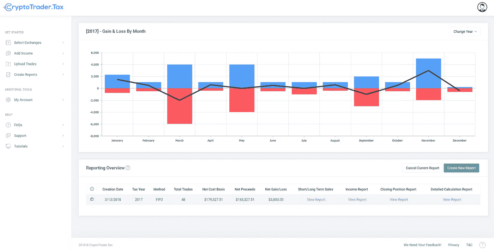
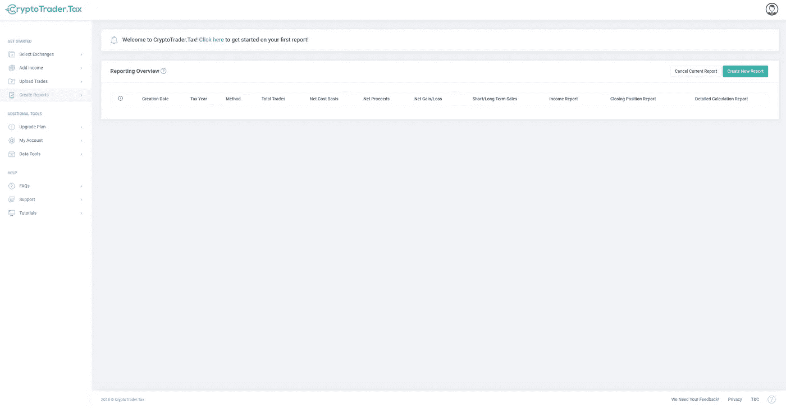
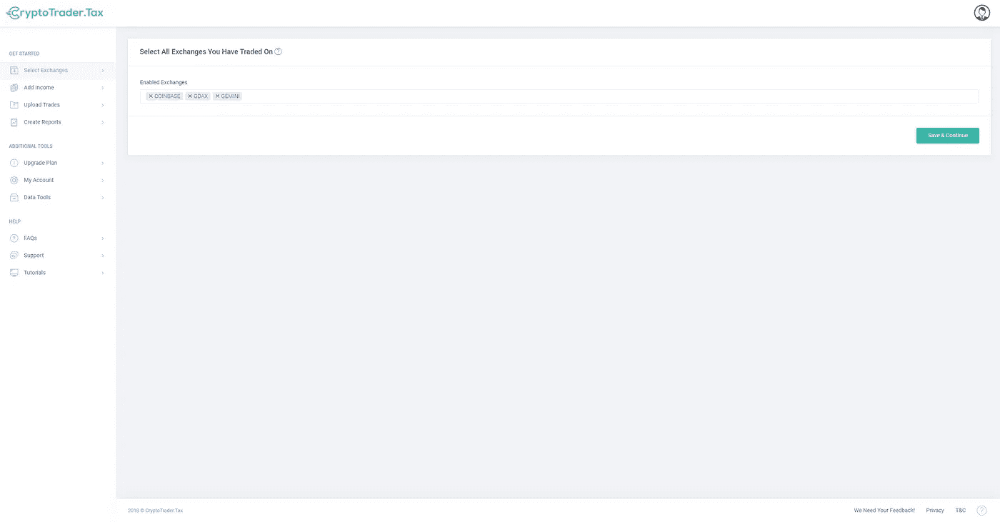
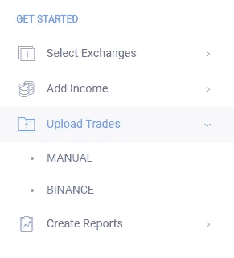
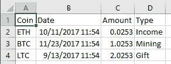
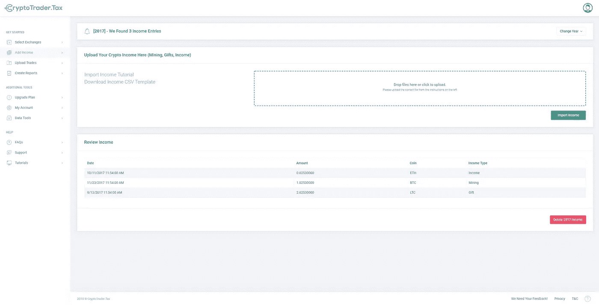
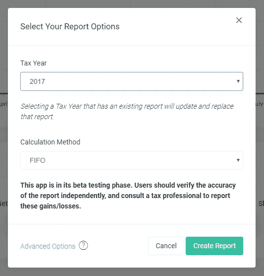
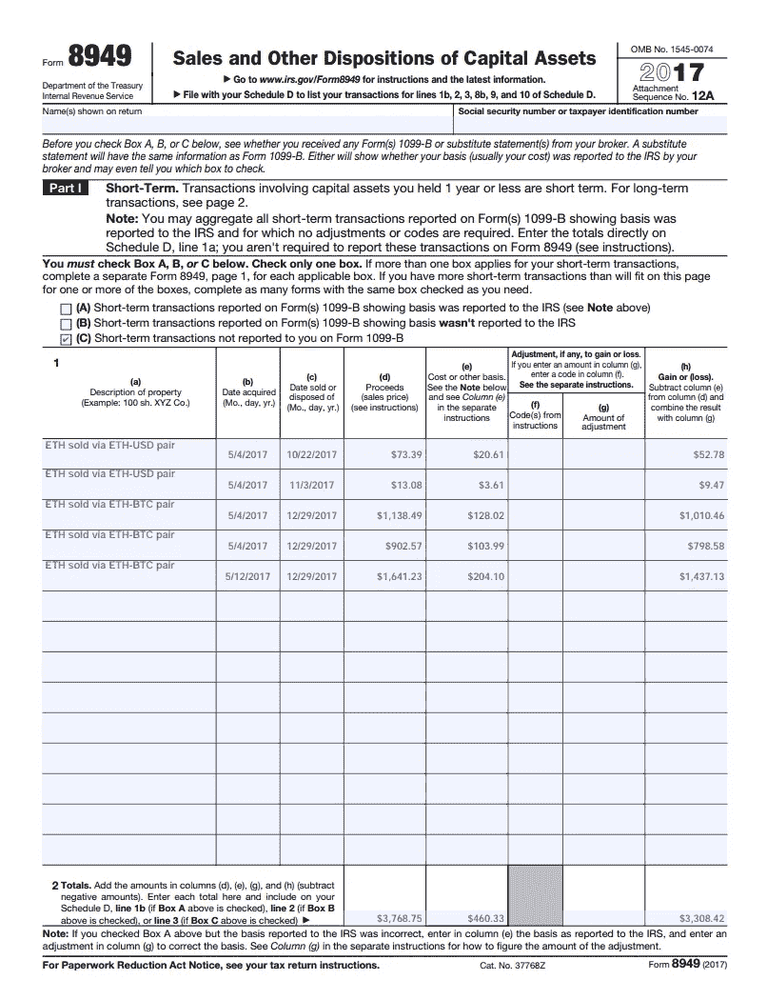

# 如何用 CryptoTrader 计算你的交易收益？税

> 原文：<https://medium.com/hackernoon/how-to-calculate-your-trading-gains-with-cryptotrader-tax-4d09ac057612>

如果你在过去的纳税季一直手工计算你的收益和损失，你会第一手地知道找到你所有交易的历史价格数据有多困难。对于硬币对硬币的交易来说，这样做更麻烦，因为你需要将每笔交易的价值与一个美元数字挂钩。我们知道这有多难，并开发了一个工具来实现自动化！

# 入门指南

前往 [**CryptoTrader。税**和记账](https://app.cryptotrader.tax/Account/Login)。我们理解您的隐私的重要性，所以唯一需要注册的是一个电子邮件地址。(随意用一次性的！)第一次登录后，您将看到这个仪表板，稍后它将为您提供本年度资本损益的概览。

# 步骤 1:进口贸易历史

在创建报告之前，你需要从你过去一年交易的所有交易所下载你的交易历史。为了使这个指南简短，我们不打算介绍如何导出你的交易历史，但是已经为最受欢迎的交易所收集了一些快速指南:

[***如何导出您的交易所交易历史***](https://cryptotrader.zendesk.com/hc/en-us/sections/360000208553-How-To-Export-Your-Exchange-Trading-History)

导航至 [**选择交易所页面**](https://app.cryptotrader.tax/Manage/Exchanges) ，从下拉列表中选择您的所有交易所。

接下来，从左侧边栏的“上传交易”中选择您的第一个交易所，并将我们之前导出的您的交易历史 CSV 拖动到文件 dropzone 中。对所有其他交换重复此过程。

# 步骤 2:导入您的加密收入(可选)

如果你没有采矿等任何[秘密](https://hackernoon.com/tagged/crypto)收入，这一步是可选的。如果这确实适用于您，请点击 从 [**下载我们的收入 CSV 模板。**](https://cryptotrader.zendesk.com/hc/en-us/article_attachments/360001225533/income.csv)

使用您最喜欢的电子表格编辑器填写 [CSV](https://hackernoon.com/tagged/csv) 文件(所有字段都是必填的)

*   **硬币**:您收到的硬币的符号名称
*   **日期**:收到硬币的日期&时间
*   **金额**:您收到的硬币金额
*   **类型**:收入的类型。可以是以下任意一种: ***(收入、采矿、馈赠)***

完成收入条目后，将电子表格上传到 [**添加收入页面**](https://app.cryptotrader.tax/Import/Income) ，并仔细检查所有匹配项。

# 步骤 3:生成您的报告

最后，导航回 [**创建报告页面**](https://app.cryptotrader.tax/Report/Index) 并点击右侧的“创建报告”按钮。这将打开一个模式，让您选择纳税季节和计算方法。选择您的选项，然后点击“创建报告”

报告完成后，页面将自动刷新，您可以在其中查看和下载您的:

*   **短期收益**
*   **长期收益**
*   **秘密收入**
*   **年末头寸**
*   **美国国税局表格 8949**

如果你在你的收入或交易历史中发现错误，只需重新上传 CSV 并为该纳税年度生成一份新报告。对于您需要进行的任何更正，所有以前的报告都将被覆盖。

*原载于 2018 年 4 月 29 日*[*www . cryptotrader . tax*](https://www.cryptotrader.tax/trading/how-to-calculate-your-trading-gains-with-cryptotrader-tax/)*。*