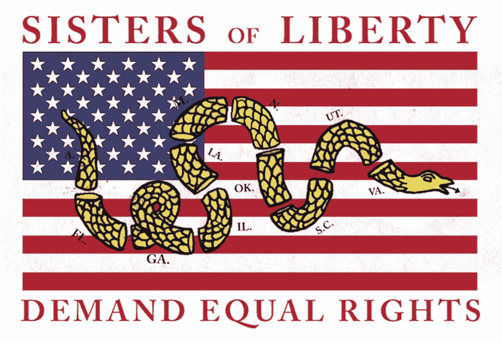

# 如何永远改变美国女性的权利…

> 原文：<https://medium.com/hackernoon/how-to-change-the-rights-of-women-in-the-united-states-forever-ed309817c735>

## 在去年#metoo 运动爆发后，我们的国家试图找到共同点，许多人问我们如何才能进入后性别世界。在这个世界里，一个人的性别不会限制他们成功的机会，也不会拒绝他们获得优于另一个性别的优惠待遇。

这里有一个强有力的方法可以改变美国的性别不平等:平等权利修正案。

美国的先辈们明智地预测到宪法将需要修改，这就是为什么他们使更新宪法以反映时代变化的社会现实成为可能。

一个历史性的时刻即将到来。平等权利修正案(“ERA”)离被批准还差一个州。 ***该修正案通过将基于性别而否认或剥夺公民权利的行为定为非法，从而在《宪法》中赋予妇女与男子同等的地位。***

虽然这应该已经在 2018 年生效，但不幸的是没有。随着 1920 年第 19 修正案的批准，妇女终于获得了投票权，并很快在 1923 年引入了平等权利修正案，以便她们能够受到宪法中所有其他权利的保护。

但它被搁置了几十年，最后，平等权利修正案于 1972 年在国会通过，并回到各州批准——这需要四分之三的州通过修正案。1982 年，平等权利修正案只有 35 个州批准，还差 3 个州。(换句话说，为了通过，宪法修正案需要 38 个州批准。)2017 年 3 月，内华达州批准了平等权利修正案，今年，2018 年 5 月 30 日，伊利诺伊州成为第 37 个批准平等权利修正案的州。

我们如此亲密。我们实际上只需要再有一个州批准这项修正案。

我们目睹了在我国宪法中没有对妇女的这种保护所导致的有害的直接和间接后果。一些例子包括对妇女不公平的医疗保健待遇(特别是在孕产妇护理和分娩方面)，而其他例子包括巨大的性别薪酬差距，以及经常缺乏对受虐待妇女的保护或公正。

至少有 185 个国家已经在宪法中加入了性别平等条款，但是 T2 和美国是七个没有性别平等条款的国家之一。美国迫使包括阿富汗和日本在内的其他国家将妇女的平等权利纳入其宪法，但我们一直不愿意为自己国家的妇女和女孩提供这些保护。

此外，联合国最近将美国列为世界上对女性最危险的[第十位。文章称:“汤森路透基金会对全球约 550 名女性问题专家进行的一项调查显示，就性暴力、性骚扰和被迫发生性行为的风险而言，美国是第十大最危险的国家。”](https://www.cbsnews.com/news/us-10-most-dangerous-country-for-women-thompson-reuters-survey-amid-metoo/)

我们值得比这更好的。

***平等权利修正案文本规定:“*** *美国或任何州不得以性别为由否认或剥夺法律规定的平等权利。”*

可以永远改变这个国家女权面貌的 23 个字。

## **您如何提供帮助**

请广而告之，帮助我们批准平等权利修正案，这样所有美国人都可以成为我们宪法的一部分，这样我们都可以生活在一个真正促进全球意识的国家。

**注意** *:* 现在，看起来弗吉尼亚州和亚利桑那州都接近获得批准这项修正案所需的票数。如果你住在这两个州中的任何一个，请打电话给你的代表，告诉他们在一月对 ERA 投票。事实上，告诉他们，如果他们希望你在 11 月为他们投票，他们需要签署平等誓言，并承诺现在就为这个时代投票。你将改变这个国家每个女人和女孩的历史进程。

这是弗吉尼亚州参议员代表的电话号码列表。打电话给他们，用你的声音！

***请报名*** [***这里***](https://equalmeansequal.org/) ***&分享给朋友如果你希望女性拥有平等的权利。***

可以跟着我上[媒](/@yasmeenturayhi)。

