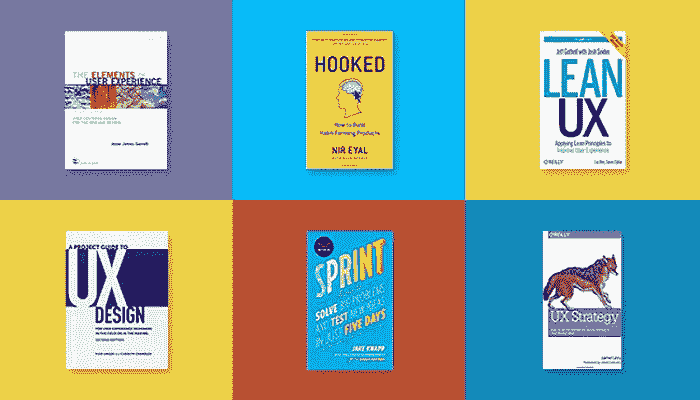

# 如何从平面设计转行到交互设计

> 原文：<https://medium.com/hackernoon/how-to-change-your-career-from-graphic-design-to-interaction-design-dcb19cf2bd1b>

## 当普通大众谈论设计时，平面设计肯定是第一个进入他们脑海的。什么样的平面设计会给人们留下如此深刻的印象？是的，平面设计产品就在我们身边。比如我们熟悉广告牌、广告和电影海报。但是随着设计潮流的发展，很多平面设计师想转行做交互设计。为什么会这样？平面设计和交互设计有什么共同点吗？平面设计师如何转行做[交互设计师](https://goo.gl/LFO4YO)？有哪些相似之处和优势？让我一步一步地指导你。

1.  **为什么平面设计师想要改变他/她的职业？**

“截至 2016 年，中国设计师的数量约为 1700 万，其中平面设计师的数量约为 200 万。深圳是中国最发达的城市之一，大约有 60，000 名设计师，其中约 40，000 名平面设计师。尴尬的情况是，大量的艺术毕业生涌入设计行业，但很少有设计毕业生能找到工作，他们不得不在毕业时转行。根据调查，60%的设计专业毕业生在 1-3 年内换了工作，80%的毕业生在毕业后的 5 年内换了工作。-搜狐

一方面，他们希望提高他们的设计技能，而不仅仅局限于排版、字体和颜色的表现。另一方面，平面设计师的工资也在逐渐下降。美国一项调查显示，平面设计师的平均工资为 4.1 万美元，但交互设计师的平均工资为 7.4 万美元。平均工资的巨大差异可能是平面设计师想要改变职业的一个主要原因。

**2。什么是平面设计？**

平面设计也称为视觉设计，其传达的形式可以是视觉的，可以包括符号、文字和图片来表达视觉表现的思想和信息。我们随处可见平面设计产品，它主要用于海报、广告牌、平面广告、出版物、产品包装等等。

**3。什么是交互设计？**

交互设计是以目标为导向的设计，是以用户为中心的设计。通过了解用户的行为，交互设计师必须使产品有用、有效和令人愉快。他们必须了解目标用户及其期望，以及用户和产品之间的交互行为。

**4。平面设计和交互设计的区别**

平面设计注重色彩、排版、字体表现，主要基于印刷媒体。交互设计强调框架、逻辑、反馈、整体结构和流程，更重要的是[用户体验](https://goo.gl/ZQ4xJW)。交互设计不需要太多的色彩表现和艺术性，但平面设计必须考虑艺术性、感觉和视觉要求。交互设计致力于用户和产品的交互，使产品易于使用。以手机按钮的设计为例，平面设计师的工作是设计一个好看的按钮，在视觉上取悦客户，但交互设计师要考虑的是如何让用户有点击按钮的欲望，看到按钮就会点击。

**5。平面设计和交互设计有哪些相似之处？**

**1)感性:**平面设计的视觉是感性的，深色代表严肃，亮色代表快乐和兴奋。而且交互设计师还要考虑用户的情绪和心理因素，因为我们都知道用户体验就是用户使用一个产品的感受。

创意:平面设计师和交互设计师都很有创意。平面设计师创造视觉设计是为了向用户传达信息，并在激烈的市场竞争中保持原创设计，这需要大量的创造力和表现力。交互设计师要设计一个能满足用户需求，让用户满意的产品。这会激发他们的创造力。

**3)原型设计:**在[交付](https://goo.gl/VSq0NR)一个产品之前，平面设计师要先设计原型和线框，这样可以避免从头开始，准确的得到用户的反馈。交互设计师也要做同样的事情，但是他们更关心这个产品的可用性，而不是它的视觉设计。

**6。改做交互设计有什么好处？**

**1)审美能力**

审美能力是一个平面设计师最大的优势。虽然交互设计师对审美要求不是很严格，但是一个好看的产品是可以提升用户体验的。相信没有用户会拒绝一个好的设计加上好看的产品，因为这样不仅能吸引更多的用户，还能给用户留下好的第一印象。

**2)沟通能力**

交互设计师需要很强的沟通技巧，他们应该能够与产品经理和开发同事顺利沟通。平面设计师掌握了行业知识，比没有这方面经验的人更了解设计。在这方面，平面设计师会很快适应工作。

**3)设计能力**

平面设计师有制作原型和线框的经验，并拥有多年的平面设计能力。我们说过，设计是相似的，它们之间的区别只是表现的方式。而原型也运用在交互设计中，让设计能力可以成为一个平面设计师的先天优势。

**7。如何成为一名交互设计师？**

阅读:至少，你应该知道交互设计和用户体验的基本概念。

学习:不断学习前人的经验，如果有师父在这方面指导，可以事半功倍。

熟能生巧:分析最热门的应用程序或网站，如果可以的话就模仿。

[**学习工具:**](https://goo.gl/ycUu7x)

Axure

贾斯丁明德

Mockplus

素描

UXPin

原始 io

[**学习书籍:**](https://goo.gl/c6amlZ)

*用户体验的要素*

*日常用品的设计，*

*不要让我思考*

*上瘾:如何打造形成习惯的产品*

*精益 UX:运用精益原则改善用户体验*

*UX 战略:如何设计出人们想要的创新数码产品*

**学习网站:**

[砸弹匣](https://www.smashingmagazine.com/)

[可用性帖子](http://usabilitypost.com/)

[UX 日报](https://www.interaction-design.org/literature/article/overview)

[中等](/)(我的最爱)

[UX 展台](http://www.uxbooth.com/)

[dibble](https://dribbble.com/)

[行为](https://www.behance.net/)

[学习 UI/UX 的 30 个最佳在线课程网站](https://goo.gl/wlCCUQ)

**社交媒体:**领英、脸书、推特

**结论**

不管你从事哪种职业。学习是掌握设计技巧和能力的唯一途径。登顶没有捷径，只有不断学习才能获得最多的经验。能力是可以培养的，但是懒惰会毁掉它。好运，伙计们。

*最初发表于*[*【www.mockplus.com】*](https://www.mockplus.com/blog/post/how-to-change-your-career-from-graphic-design-to-interaction-design)*。*