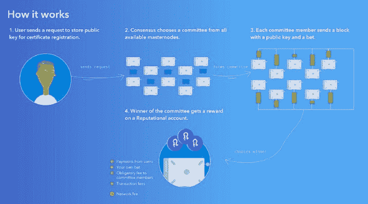

# 如何为区块链支持的服务选择共识算法

> 原文：<https://medium.com/hackernoon/how-to-choose-a-consensus-algorithm-for-blockchain-backed-services-6d3ece7fa56>

区块链即服务包括收费为客户提供区块链基础设施。客户付钱给提供商来建立和维护区块链连接的节点，并处理复杂的后端。还有另一种与分布式分类账相关的可行商业模式，即你不是为区块链本身付费，而是为它向客户提供的服务付费。这正是 [REMChain](http://remme.io) 的构建方式。作为一个分散的应用程序开发人员或私人公司代表，你不需要支付区块链维护，但为必要数量的区块链支持的 PKI 证书。

帮助你理解区块链的另一个关键点是:为区块链支持的服务付费，你不是向设计网络的公司付费，而是向网络本身付费。一个区块链的主要特点是，它是社区支持，分布和管理充分通过共识算法数据存储。然而，理想情况下，您希望奖励分配使网络成为一个分散的、安全的信息存储场所，而不管环境如何。这就是为什么你需要一个智能算法来保证 masternodes 的透明性和正确可靠的行为。

**如何下放不会被撤销的决策权**

大多数可用的共识模型的工作证明和利害关系证明是基于最大的投资者不会攻击系统的假设。攻击者将降低他们的奖励(在工作证明一致的情况下)或赌注(在赌注证明一致的情况下)。在公共区块链有分叉，引发未来共识可以拒绝接受区块的情况。这是完全合理的，因为区块链开发过程倾向于随机性，以避免恶意行为。

服务于商业用途的共识具有完全不同的性质。他们的目标与其说是保持充分的权力下放，不如说是提供高质量的服务，与中央集权的对应方相比，创造附加值。要做到这一点，有必要建立一个系统，在该系统中，控制关键数量的主节点将是有问题的，并具有快速和可扩展的共识。

拜占庭容错(BFT)算法非常适合这类任务，因为通过一致投票表决的区块是不可撤销的。BFT 算法的主要特征是，如果网络中存在严格多于⅔诚实主节点，它们可以抵抗节点的错误行为。

我想和你们分享为 REMME 开源持续了几个月的研究工作的结果。我们致力于建立一个分散的 CA，该 CA 将更新公钥基础设施技术的安全性和安全性，并更新其针对黑客的网络安全有效性。

为了寻找 REMChain 的最佳算法，我们标记了 Algorand、HoneyBadger、SBFT 和 Raft。以下是对这些方法的简短描述:

**algrand BA:两步沟通流程和扩展选项**

这种 BFT 算法有助于在恒定的预期时间内快速达成一致。当领导者诚实时，提议的价值会在两步沟通过程后达成一致。Algorand BA 还具有任意分区弹性，这意味着当网络被分区时，该协议确保了系统的安全性，因此没有两个诚实的用户会以不同的输出来完成该协议。

Algorand BA 通过高度可扩展的拜占庭协议(BA)协议来达成共识。有一个选项来扩展共识:基于可验证随机函数(VRF)的机制随机选择用户以私人和非交互的方式参与 BA，但它位于 BA 之外，是完整的 Algorand 算法的一部分。该算法可以在新的块上达成共识，具有低延迟，并且没有分叉的可能性。

**SBFT:收藏家沟通解决方案**

该算法依靠主节点收集器来减少通信。每个 masternode 不是发送给每个人，而是发送给сcollector，collector 再广播给每个人。SBFT 还使用循环循环收集器来减少负载，并使用多个收集器来提高容错能力和处理速度慢或有故障的收集器。

SBFT 使用主要的 masternode 接受来自客户端的证书请求并签名。它的一致性算法比工作验证算法更快，比实际的 BFT 具有更好的可扩展性。随着客户端数量的增加，它的性能优势会不断增加。SBFT 适用于有数十个恶意主节点的场景。

**蜜獾:纪元和门限加密**

使用这种 BFT 算法，节点接收事务作为输入，并将它们存储在缓冲区中。该协议在历元中进行，其中在每个历元之后，新的一批事务被附加到提交的日志。在每个时期的开始，节点选择其缓冲器中的事务的子集，并将它们作为输入提供给随机协定协议的实例。

HoneyBadger 通过使用阈值加密来工作，这可以防止对手在达成协议之前知道哪些交易是由哪些节点提出的。蜜獾 BFT 是一个自然的候选人，用于联盟环境和无许可的区块链，因为随机选择的委员会可以是地理异构的。

还有另一种算法，不是我们考虑可能实现的拜占庭容错算法——Raft。

**筏:领导者、追随者和候选人**

该算法的定义特征是选举安全性(在给定的任期内只能选举一个领导者)和仅领导者附加(领导者从不覆盖或删除日志中的条目；它只追加新的条目)。Raft 旨在用于大约 5 台或更少的相对较小的服务器集群。

Raft 的工作方式是给每个服务器分配三种状态之一:领导者、追随者或候选人。在正常操作中，只有一个领导者，所有其他服务器都是追随者。追随者不会主动发出请求，而是简单地回应领导者和候选人的请求。Raft 将时间划分为任意长度的项。任期的开始意味着选举的开始，在选举中，一个或多个候选人试图成为领袖。如果候选人赢得选举，它将在余下的任期内作为领导者运作。

**REMChain 服务证明共识**

对上述算法的分析让我们想到，我们需要自己的定制共识。我们来到了[模式](/remme/proof-of-service-consensus-algorithm-overview-57c359290207)，在这种模式下，所有主节点的角色都是平等的，网络所提供服务的回报与股份和声誉的大小相对应。

How REMChain consensus works

改变区块链本身的机制依赖于使用附加 bet 工具的委员会的选举。赌注允许个人增加在委员会中选择节点的可能性，同时当节点被选择并且其区块与委员会的提议不一致时，作为一种承诺。

块大小将有时间限制和证书数量的限制，加上委员会的小规模，将允许算法从协议中获得高性能的工作。

**需要注意的重要事项**

鉴于节点数量有限，以及区块链的定位是执行与商业服务相关的具体任务，这些公共区块链的共识机制都将遇到困难。首先，在小区块链，加密货币波动的损失可能不会太大，如果我们谈论供应链或数字身份，区块链支持的服务的客户的后果至关重要。

其次，少量节点的作用对于系统的正确运行将具有更大的决定性。为此，有必要开发更复杂的共识机制，该机制对于不同数量的节点和一定数量的不诚实参与者同样有效。

在选择与您的产品相对应的共识算法时，重要的是要考虑决策和数学的架构，这种架构提供了以分散和安全的方式为不同功能选择主节点的可能性。你应该用少量的活跃节点来平衡区块链的速度和稳定性，并考虑内部经济的合理逻辑，这将鼓励 masternodes 的所有者按规则游戏。