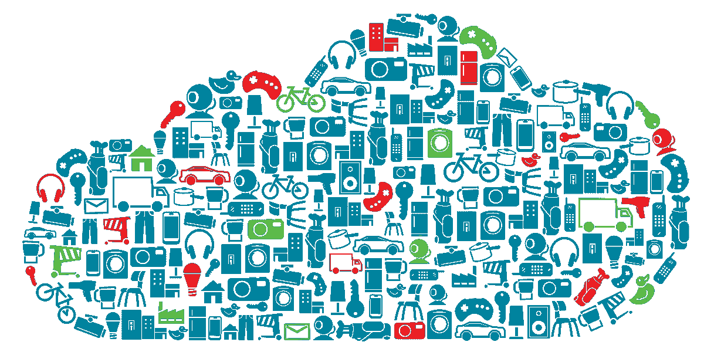
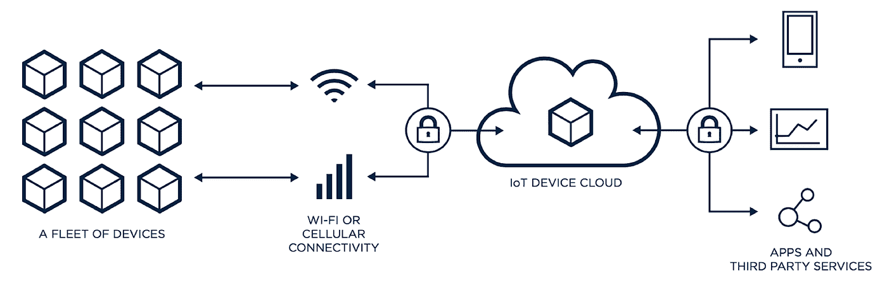
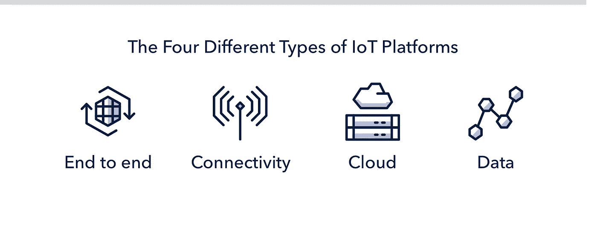
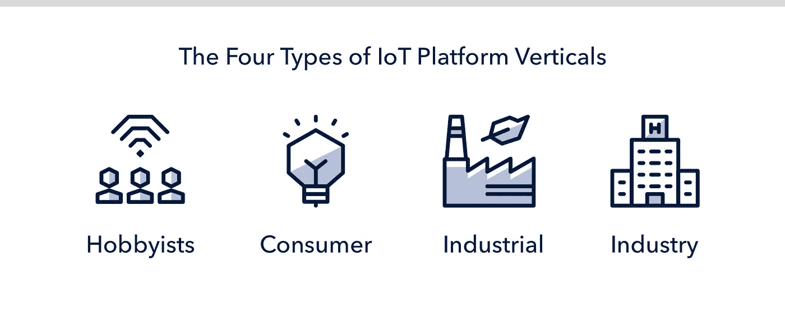
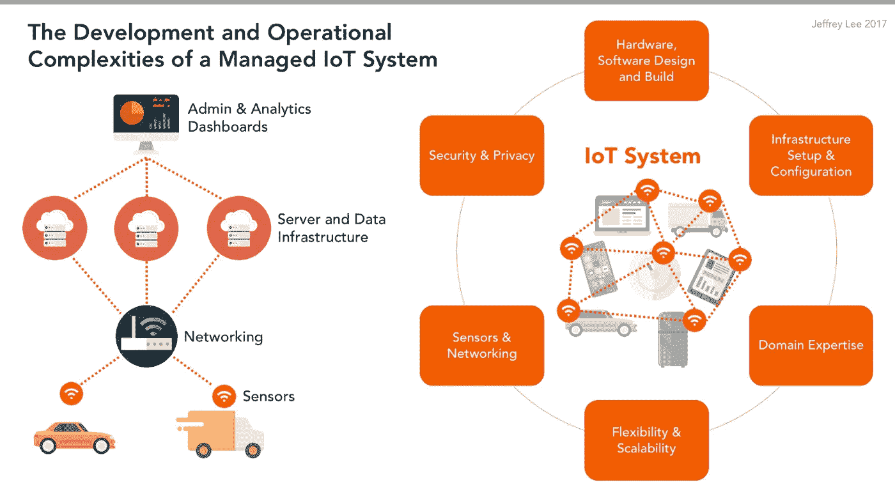
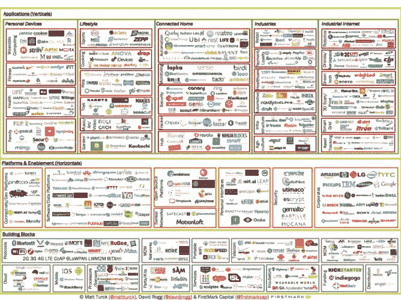

# 如何选择正确的物联网平台:终极清单

> 原文：<https://medium.com/hackernoon/how-to-choose-the-right-iot-platform-the-ultimate-checklist-47b5575d4e20>

## 不知道选择哪个物联网平台？以下是一些需要考虑的事情。

选择正确的[物联网](https://hackernoon.com/tagged/iot) [平台](https://hackernoon.com/tagged/platform)是一项复杂的工作。无论您是物联网爱好者、经验丰富的开发人员还是高级管理人员，前景都是巨大而令人困惑的。这篇文章旨在澄清一些复杂性，并提供一个物联网平台前景的**快速和可扫描的指南**。它还提供了一个标准，让您可以根据自己的需求评估物联网平台。

> “我们是一个跨功能、完全集成、全栈、无服务器、硬件无关的人工智能物联网平台，可以为您提供无限的基础设施。。."说了所有令人困惑的物联网平台网站。

# **什么是物联网平台？**

One way of illustrating an IoT platform

最简单地说，**物联网平台是一种集成服务，为您提供将物理对象上线所需的一切。**它需要能够支持数以百万计的同时设备连接，并允许您轻松配置您的设备进行机器对机器通信。

> “这是物联网的一个肮脏的小秘密:构建一个功能良好的物联网产品真的非常非常困难。”—扎克·苏帕拉

# **物联网平台类型**

## **端到端物联网平台**

从根本上说，端到端物联网平台提供了硬件、软件、连接性、安全性和设备管理工具来处理数百万个并发设备连接。它还提供了您需要的所有托管集成— OTA 固件更新、设备管理、云连接、蜂窝调制解调器等—以在线连接和监控一系列设备。

> 例子:[粒子](https://www.particle.io/)

## **连接管理平台**

这些平台通过 Wi-Fi 和蜂窝技术提供低功耗和低成本的连接管理解决方案。这包括连接硬件、蜂窝网络和数据路由功能。

> 例子: [Mulesoft](https://www.mulesoft.com/integration-solutions/api/iot) ，[全息图](https://hologram.io/)， [Sigfox](http://sigfox.com/)

## 物联网云平台

云平台旨在摆脱构建自己的复杂网络堆栈的复杂性，并提供后端服务(加上其他服务)来监控和跟踪数百万个同时发生的设备连接。

> 例子:[谷歌云物联网](https://cloud.google.com/)， [Salesforce 云物联网](https://www.salesforce.com/)

## **数据平台**

当然，每种类型的物联网平台都以某种方式处理数据。但是这些物联网数据平台结合了许多您需要的工具来路由设备数据和管理/可视化数据分析。

> 例子: [Clearblade](https://www.clearblade.com/) ， [Azure](https://www.microsoft.com/en-us/internet-of-things/azure-iot-suite) ， [ThingSpeak](https://thingspeak.com/)

# **物联网平台垂直行业**

当然，将这些物联网平台归入一个类别可能是简单地将其呈现出来。所有这些平台都倾向于提供更多的解决方案，并且不能被分解成单一的类别。所以你需要检查他们提供什么，以及他们提供给谁。

## **爱好者**

*   原型解决方案
*   开发套件
*   DIY 解决方案

## **消费电子**

*   公用事业
*   家庭自动化
*   衣服
*   任何和 Alexa 有关的事

## **工业物联网(IIoT)解决方案**

*   智能工厂仓储应用
*   预测和远程维护。
*   工业安全系统
*   资产跟踪和智能物流
*   能量优化
*   运输监控
*   互联物流

## **产业驱动**

*   农业
*   卫生保健
*   运输
*   智能城市
*   活力

# **在检查平台时您应该寻找什么**

在检查这些平台时，您应该根据您的解决方案检查或寻找这些类型的东西:

## **1。连通性**

供应商的网络覆盖范围在多大程度上符合您企业当前和未来的计划？

## **2。连接方法**

您需要什么类型的连接？您的物联网产品需要 Wi-Fi 或蜂窝解决方案吗？您需要评估这些需求，看看供应商如何解决它们。

## **3。市场寿命**

物联网平台已经运营多久了？物联网领域相对较新，但正在快速发展。找到一个已经提供服务超过 4 年的物联网平台通常是理想的。

## **4。服务类型**

物联网平台如何描述和销售自己？一些服务是纯粹的连接平台，而另一些是提供硬件、软件和连接的端到端解决方案。你需要评估你的业务需要什么。随着时间的推移，您的需求会如何变化？

## **5。地理覆盖范围**

他们为嵌入式 sim 卡提供全球支持吗？物联网平台是否覆盖了您业务所需的区域？

## **6。数据计划**

供应商是否提供公平的数据计划？您希望能够随时暂停或中止数据服务，并能够控制使用的数据量。

## **7。安全/隐私**

检查他们过去是如何处理安全和隐私问题的，并检查他们的安全内容。您需要评估他们的平台如何应对安全问题，以及它如何将复杂性从您身上抽离出来。

## **8。托管集成/ API 访问**

供应商如何将物联网所需的所有复杂东西(如蜂窝调制解调器、运营商/ sim 卡、设备诊断、固件更新、云连接、安全性、应用层、RTOS)集成到一个简单的包中，让您的工程团队不必担心？

## **9。数据访问**

您将如何将通过物联网平台获得的数据与您的企业后端和当前云服务相集成？您打算如何处理这些数据？服务符合这些需求吗？

## **10。领域专家/工程服务/合作伙伴协作**

物联网部署非常复杂，您需要一个合作伙伴来帮助您完成产品开发过程。物联网平台能帮助您满足这些需求吗？

## **11。物联网生态系统**

花时间学习和理解物联网平台提供的服务之间的关系。这将有助于您了解他们的服务如何帮助您构建产品。如果您不明白，请与销售代表交谈。

## **12。物联网路线图**

物联网平台只是从这里开始扩展。物联网平台的路线图是否符合您组织的需求？他们是否计划扩展到连接、数据和硬件领域？这对你有什么帮助？

## **13。硬件**

供应商是否为您的目标用例提供了现成的应用程序、开发人员工具包或入门包？您可能需要进行一些定制，但是不必从头开始可以节省大量的时间和精力。

## **14。硬件不可知论**

硬件不可知论是“我们只处理软件，意味着你完全依靠自己来构建所有的硬东西”的代码也就是说，不要上当。

## **15。设备管理**

供应商如何允许您监控、分割和管理现场的物联网设备？

## 16.OTA 固件更新

供应商如何允许您远程发送更新并修复设备上的错误？这是一个简单还是复杂的过程？(提示:您需要简单的解决方案)。

# 物联网平台入围名单

现在，您已经了解了物联网平台的类型、垂直行业以及您应该寻找的东西，是时候开始寻找了。这里有一个简短的列表，可以帮助您开始为您的解决方案找到合适的物联网平台。祝你好运！

If you have this amount of time to look through 450 (and more) IoT services. Cheers to you. If you want the shortlist, keep scrolling.

## 入围名单

[**Particle**](https://www.particle.io/)**——**Particle 是一个企业物联网平台，提供构建物联网产品所需的一切，从设备到云。

[**Salesforce IoT**](https://www.salesforce.com/products/salesforce-iot/overview/) —利用物联网云服务最大限度地提高您的业务成效。

[**Microsoft IoT Azure**](https://www.microsoft.com/en-us/internet-of-things/azure-iot-suite)—借助预配置的互联工厂解决方案，提高您的运营效率和盈利能力。

[**Artik 云**](https://artik.cloud/)**—**Artik 物联网平台实现物联网的开放数据交换

[**谷歌云的物联网平台**](https://cloud.google.com/solutions/iot/)**——允许您轻松、安全地连接、管理和接收物联网数据的集成服务**

**[**IBM 沃森物联网**](https://www.ibm.com/internet-of-things)**——**IBM 的新沃森物联网(IoT)是一个认知系统，它从物理世界中学习，并将智能注入物理世界。**

**[**ThingWorx**](https://www.ptc.com/en/products/iot)**——**为工业公司提供释放物理与数字融合价值的最快方式。**

**[**Xively 平台**](https://xively.com/) **—** 一个企业物联网**平台**帮助加速您的互联产品或服务。**

**[**ThingSpeak 平台**](https://thingspeak.com/)**——**thing speak 是开放的物联网平台，具有 MATLAB 分析功能。**

**[**Carriots 平台**](https://www.carriots.com/)**——**专为物联网项目设计的服务。从对象中收集数据，存储数据并构建强大的应用程序。**

**[**C3 物联网**](https://c3iot.ai/) —一个完整的平台即服务，用于快速开发和运营大数据、预测分析、人工智能和物联网软件应用。**