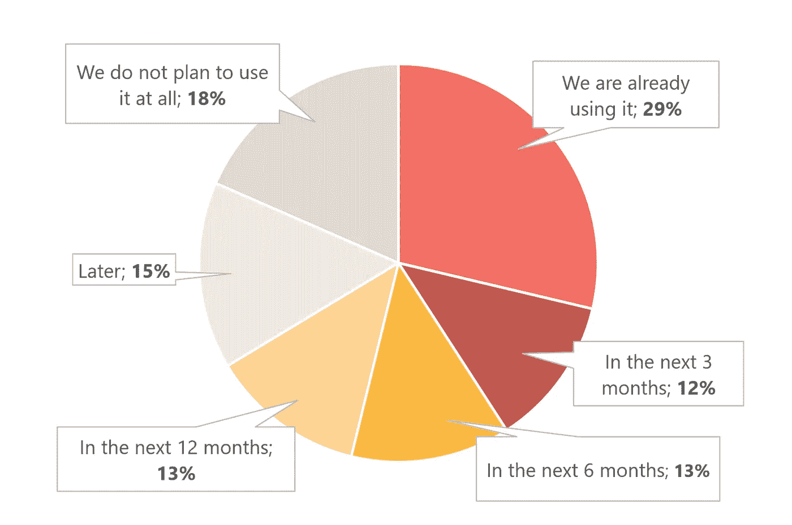
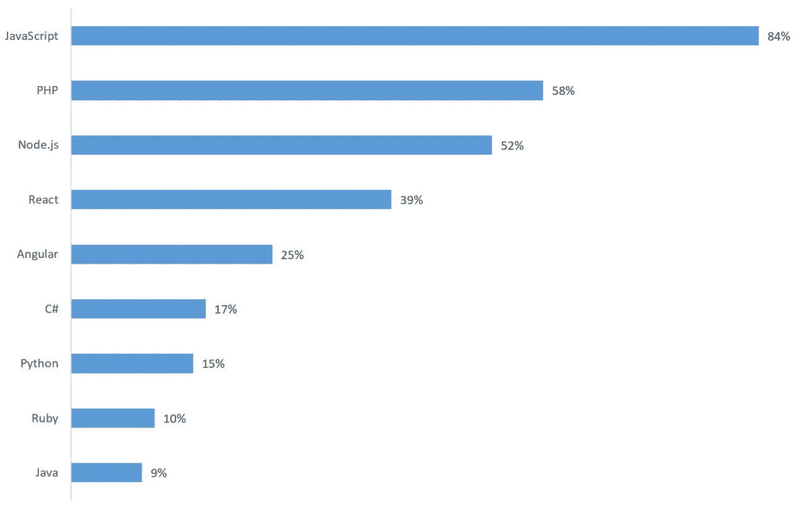
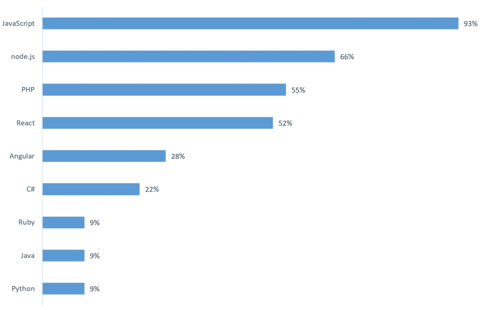
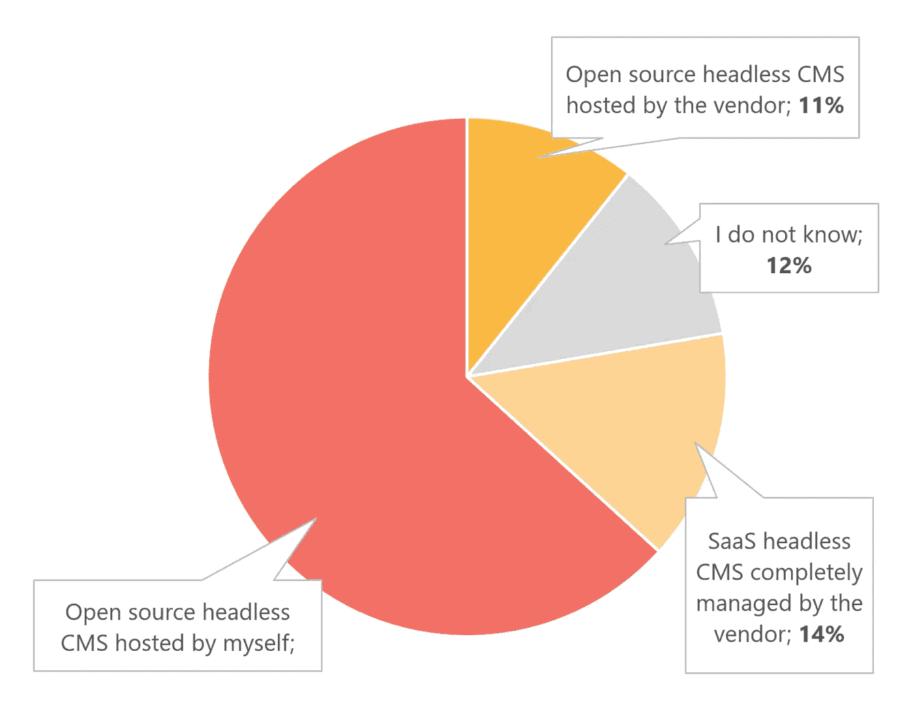
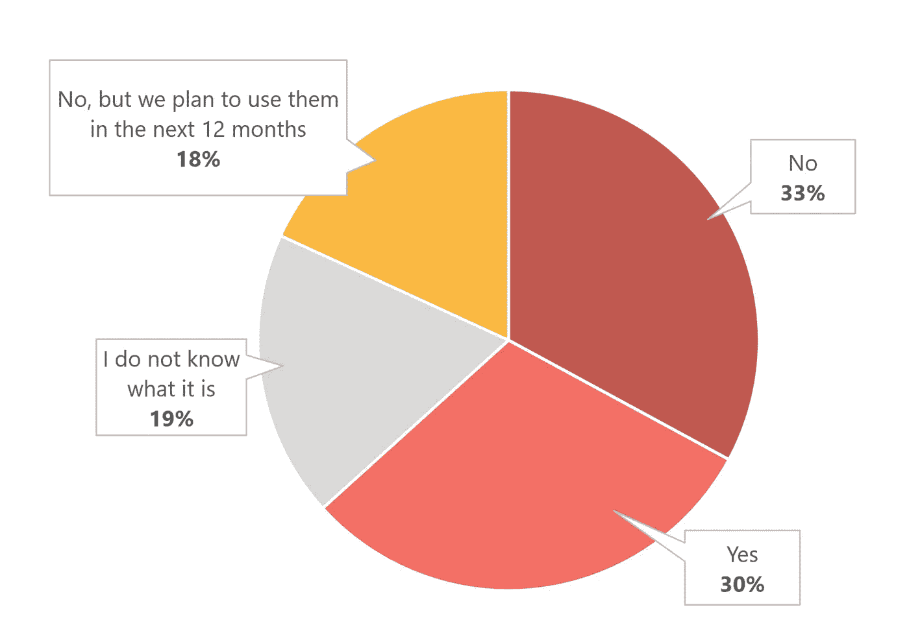

# 如何为你的下一个 CMS 项目选择正确的技术

> 原文：<https://medium.com/hackernoon/how-to-choose-the-right-technology-for-your-next-cms-project-c9aaaf7303ba>

在 CMS 的世界里呆了超过 15 年，我可以说这个行业永远不会无聊。事实上，它在最近几年发展得甚至更快。随着所有新兴设备、框架、API 和云选项的出现，总会有新的东西需要学习。每个开发人员都会问的问题:我如何为我的下一个 CMS 项目选择正确的技术，我应该学习哪些技能？

Source: [https://pixabay.com/en/children-fishing-teamwork-together-1807511/](https://pixabay.com/en/children-fishing-teamwork-together-1807511/)

# #1:传统还是无头 CMS？

在过去的两年里，无头 CMS 一直是开发者们争论的话题。鉴于它对整个 CMS 行业的颠覆性潜力，这并不奇怪。然而，是不是每个人的正确选择？

抛开争议不谈，开发者似乎觉得这个概念非常有吸引力。

根据 Kentico 今年早些时候在近 1000 名 CMS 从业者中进行的 Headless CMS 2018 调查的[状态， **29%知道 Headless CMS 的受访者已经使用过一个，另外 38%的人计划在未来 12 个月内使用它**。](https://kenticocloud.com/state-of-headless-cms-2018)

When do you plan to use a headless CMS? (n = 526; only those who knew what headless CMS was were asked this question)

那些已经使用过无头 CMS 的人非常积极: **63%的人喜欢无头 CMS 的想法，30%的人说“我喜欢它，但它有它的局限性。”**

有了这种想法，我们很可能会在最近几年看到 headless CMS 的大量采用，开发者应该开始关注这一新现象。

# #2:哪些语言和框架？

精通某种语言或框架需要大量的时间投入。

在传统 CMS 的世界中，CMS 的选择通常与您喜欢的编程语言有关。

这在 headless CMS 的世界中变得无关紧要，因为您可以使用任何语言来调用它的 API。

根据 Headless CMS 调查的[状态，这些是 CMS 开发者使用的最流行的语言和框架:](https://kenticocloud.com/state-of-headless-cms-2018)

Technologies used by developers (n=526)

不出所料，JavaScript 是明显的赢家。在后端方面，PHP 是明显的赢家——同样，考虑到 WordPress 和 Drupal 社区的规模，这并不奇怪。

**然而，当我们看到已经使用 headless CMS 的开发人员时，node.js 胜于 PHP:**

Technologies used by those who already use headless CMS (n=137)

对你的意义:随着人们采用无头 CMS，PHP 可能会失去吸引力。因此，提高 node.js 技能可能是一项面向未来的投资。

# #3:自托管开源，托管，或 SaaS？

开发人员必须做出的其他选择是“我应该选择哪种 CMS 托管模式？”以及“我应该选择开源还是商业解决方案？”

传统的 CMS 将自己的代码和开发人员编写的前端表示结合在一起。它的架构要求您对 CMS 代码及其托管环境有高度的控制权。这就是为什么开发人员历来喜欢自己托管 CMS。

然而，headless CMS 有一个非常不同的架构:它严格地将 CMS 后端和表示层分开。

这种分离允许供应商在真正的多租户 SaaS 模型中提供 headless CMS，并让您专注于使用 REST 或 GraphQL API 开发您的网站或应用程序。

有趣的是，**大多数开发人员(63%)仍然更喜欢自托管开源模型**,即使是对于无头 CMS，这样他们可以保留对 CMS 的完全控制，避免供应商锁定。

虽然在传统的 CMS 世界中选择这样的模式有一些很好的理由，但我相信随着公司探索更高的灵活性和更低的维护成本，SaaS 模式的好处将会占上风。

Which of the headless CMS models do you prefer? (n=430)

# #4:整体服务还是微服务？

使用传统的 CMS，你可以将 CMS 作为一个平台，并在此基础上建立你的网站。乍一看，这非常有意义，因为您可以获得许多现成的功能，这意味着即使是经验不足的开发人员也可以快速构建一个复杂的网站。

问题是您的代码与 CMS 紧密耦合，这意味着您不能使用不同的编程语言，并且 CMS 可能无法很好地与最新的前端框架一起工作。而且，当您决定迁移到另一个 CMS 时，您通常必须从头开始重写代码。

这就是为什么开发人员越来越喜欢微服务架构，其中 CMS 只是他们使用的服务之一。

他们结合了自己的微服务和第三方 API，如用于电子邮件的 SendGrid、用于身份验证的 Auth0 或用于支付的 Stripe。这为他们提供了更多的灵活性和对其他解决方案和供应商的独立性。另一方面，这种方法可能需要更多的编码和更强的开发技能。

无头 CMS 在使用微服务的开发者中变得如此受欢迎也就不足为奇了。根据该报告， **30%的开发者已经在使用微服务**，使用微服务的开发者(39%)是不使用微服务的开发者(19%)的两倍。

Do you use microservices to build your applications? (n=711)

向微服务架构的转移也对你如何考虑你的职业发展产生了重大影响:在过去，你需要学习 CMS 的细节以及如何用它来发展。

在 API 优先的世界里，这些知识变得几乎无关紧要，因为你只需要学习相对简单的 API。

我的建议是:与其学习特定的 CMS，不如把时间投入到理解微服务架构和提高开发技能上。

# 这完全是心态的问题

CMS 市场正处于一场重大的技术变革之中。它从网络优先、内部部署、整体式 CMS 转向内容优先、云优先、面向微服务的模式。

在这种转变中做出正确的选择并不容易。归根结底，决定因素不是技术本身，而是您和您的客户的创新欲望:

如果你想稳扎稳打，不允许失败，你很可能会选择传统模式。

如果你的目标是通过开发一些创新项目来获得竞争优势，你会选择无头模型。

> 每个项目都没有唯一的答案，你需要选择适合你和你的客户的组合。
> 
> 然而，从职业的角度来看，没有必要等待——确保你处于最新趋势的顶端。如果你的客户或雇主还没有准备好，建立一些创新的副业来保持你的技能与时俱进。

如果你喜欢这篇文章，请鼓掌、分享或在下面发表你的评论。

*如果你不确定无头 CMS 是否适合你，请看我之前的黑客正午文章:*

 [## 迁移到一个无头 CMS？首先改变你的心态！

### 如果你不改变你对内容的看法，你的无头 CMS 项目注定会失败。

hackernoon.com](https://hackernoon.com/headless-cms-first-change-your-mindset-e9f6d8b6a41e) 

*你会考虑建立自己的 CMS 吗？先看这个:*

 [## 我如何建立一个 CMS，为什么你不应该

### 在过去的 15 年里，我写了五个内容管理系统，并建立了一个领先的 CMS 软件公司。现在让我…

hackernoon.com](https://hackernoon.com/how-i-built-a-cms-and-why-you-shouldnt-daff6042413a) 

*完全披露:我是 Kentico Software 的创始人，是领先的 CMS 供应商，背后是* [Kentico Cloud，云优先的无头 CMS](https://kenticocloud.com) *。虽然我写这篇文章的初衷是好的，但我的观点可能有失偏颇。*

*您可以在*[*https://kenticocloud.com/state-of-headless-cms-2018*](https://kenticocloud.com/state-of-headless-cms-2018)*下载《无头 CMS 2018 年状态报告》完整版(直接下载，无表格)。*