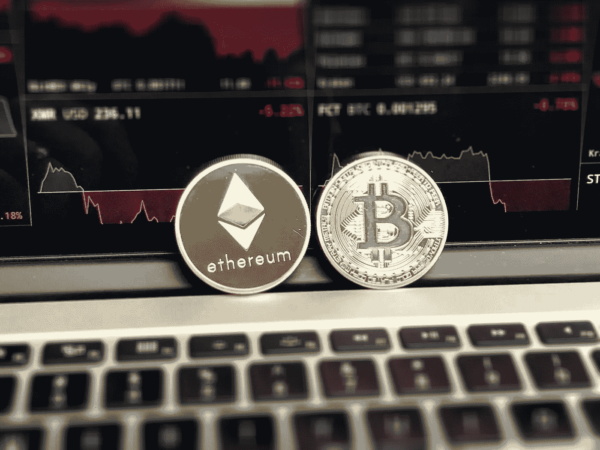

# 如何在投资组合中对加密货币进行分类

> 原文：<https://medium.com/hackernoon/how-to-class-cryptocurrencies-in-your-investment-portfolio-57d08901e70a>

(source: pexels.com)

加密货币的出现为世界增加了巨大的价值。甚至那些讨厌 crypto 的人也知道这一点。商界大机构的问题在于，这项发明来自一个他们没有预料到的角度。密码的存在可能正好解决了世界上的贫困问题。但现在确定这一点还为时过早。出生在一个国家的人不再受制于该国的货币地位。现在有了一个选择，不管该国政府的经济地位如何，艰苦地区的生产力都可以得到回报。全世界的人们都意识到创造的价值，但是政治使得政府在满足有生产力的人们的需求上如此缓慢。但是现在人们有了一个选择。加密货币。如果你生活在第一世界国家，你可能不会得到它。但是如果你看看其他(不那么活跃的)国家的经济形势；你会明白的。

发达经济体国家发现很难消化加密货币的现实。那是因为它给予的自由。从他们的历史和经验来看，他们认为人类需要大量的规则和条例来和平和谐地生活。金钱是一个非常敏感的问题，他们当然希望围绕金钱的话题和平与安宁。但是他们让社会变得越安全和规范，社会中的自由就越少。因此，过度监管社会，以至于统治阶级成为他们所保护的人民的敌人。他们变得过于依赖这些想法，以至于脱离了人民。**在金融方面，世界不应该因为某些人的错误而受到惩罚**。尽管过于简单，但加密货币就是如此。

加密货币将继续存在。就连摩根大通现在也同意这一点。但问题是如何给他们分类。我相信，如果一个人坚持基本面，就不会陷入泡沫。**每种加密货币都不一样，应该以不同的方式对待**。然而，有一些共同的兴趣。我将用比特币作为参考。

> 比特币不是资产、商品、避风港、货币或投资。这里可以看到更详细的解释[。](/@davidolarinoye/what-is-bitcoin-a-practical-explanation-for-the-everyday-person-69151f2f0ec6)

比特币是一种投资工具。它可以表现得像上面列出的 5 个中的任何一个，但它不是其中的任何一个。比特币是一种载体，能够创造自己的金融生态系统。这是一场革命；与众不同的逃避金融压迫的工具。你决定用它做什么取决于你自己。它的使用案例一直在增加，相信我，我们还没有看到它的最佳状态。*那么，一个人如何进行投资呢？*

这是我们目前所看到的；由于它最近(和未来)与华尔街的联系，当股票受到影响时，你可以预计它也会受到影响(直到生态系统变得足够大和独立)。然而，尽管它们可能同时下跌，但它们的上涨并无关联。比特币在牛市中派上了用场。**如果你在牛市中没有比特币，你会非常有限，会错过很多**。将没有办法进入加密生态系统(这似乎是目前增长最快的)。

*公牛体内什么时候有 crypto？*当投机高涨，许多人想出了伟大的东西。*熊市是什么样的？*是时候为下一次牛市巩固你的地位了。如果你不靠近熊，你就会靠近牛，你可能会被烧伤。*熊是什么时候？当 FUD 弥漫在空气中，图表显示为红色时。请始终放心，秘密世界已经走得太远，不会变得晦涩难懂。crypto 的优势在于社区。**比特币的价值在于它的社区**。你必须记住，图表有两个方向；上上下下。Crypto(此时)不会长时间保持平坦。*

比特币和其他加密货币被认为可以使用。它可以用来交易，但投资的目的是为了节省一些钱来投资或购买(当价值可观时)。你不必过于斤斤计较，不管价格如何，只要定期存钱就行了。当它能负担你想要的，或者你在密码世界看到一个合适的投资；去吧！

这表明你仍然需要黄金、债券或其他资产来保护你在熊市中的加密投资(这是为了防止你亏损套现)。一定要这样做。**如果你所有的都是股票和加密货币，你的投资组合根本就不平衡**。不要心痛，保护不好的一面。