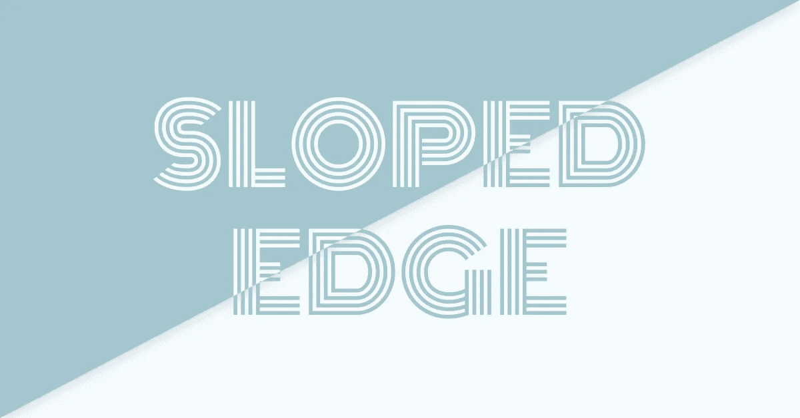

# 如何编码倾斜的截面边缘？

> 原文：<https://medium.com/hackernoon/how-to-code-sloped-section-edges-719886601ffd>

Sloped Edge — Featured Image

在过去，实现这一点的唯一选择是使用 SVG 图像。今天，我们可以有多种解决方案，我会尽力向你展示所有的可能性。

> 我个人认为，对于简单的倾斜边缘，我们可以使用 CSS 中的 border 属性作为最佳解决方案，但对于更复杂的形状，我们仍然应该坚持使用 SVG。

自撰写本文以来，您可能遇到过许多 web 应用程序，它们已经为自己的部分提供了一些创造性的[设计](https://hackernoon.com/tagged/design)解决方案。有角度的/倾斜的边缘并不新鲜，但是我们应该对此进行进一步的研究，并尝试所有可能的解决方案来实现这个漂亮的特性…

# 几个可能的解决方案…

我写了几个 *CodePen* 的例子。他们最后看起来都一样，但和往常一样，每个人都有一些*的优点*和*的缺点*。我会写反对意见，但是你来决定赞成意见…

## 1.在 CSS 中使用“border”属性的解决方案

缺点:*取决于视窗单元*

Sloped Edge — Solution using “border” property in CSS

## 2.使用 CSS 中的“[转换](https://caniuse.com/#feat=transforms2d)”属性的解决方案，特别是“skewY”函数

缺点:*水平调整大小会破坏它*

Sloped Edge — Solution using “transform: skewY()” property in CSS

## 3.使用 CSS 中的" [clip-path](https://caniuse.com/#feat=css-clip-path) "属性的解决方案，特别是" polygon "函数

CONS:
- *垂直调整大小打破它
-*-*糟糕的浏览器覆盖率*

Sloped Edge — Solution using “clip-path: polygon()” property in CSS

## 4.在 HTML 中使用“ [SVG](https://caniuse.com/#feat=svg) ”图像的解决方案

CONS:
-它让你的 HTML 变得凌乱
-为不同的部分复制 SVG 图像
-为不同的角度创建新的 SVG 图像

Sloped Edge — Solution using “SVG” images in HTML

# 几个临时演员…

使用上面的解决方案之一，但是被开发为在整个应用程序中灵活使用。

## 约瑟夫·富斯科使用“萨斯米辛”的解决方案

**在 CSS** 的“背景-图像”属性中嵌入“SVG”

如果你喜欢这种方法，可以查看他在 GitHub 上的 Angled Edges 知识库以获得更多信息。这个 mixin 支持几个不同的位置，你可能也想看看[的官方例子](https://angled-edges.josephfus.co/)。

 [## Joseph fusco/角形边缘

### 成角度的边-:三角形 _ 标尺:仅使用 Sass 快速创建成角度的截面边

github.com](https://github.com/josephfusco/angled-edges) 

> **个人点评:**
> 这款 Mixin 的自述文件文档不清晰，演示中缺少源码图。它显示的是 CSS 而不是 SCSS，所以人们可能会在实现时遇到一些麻烦。虽然，我只是不知道如何使用`*$*position`和`$hypotenuse`参数。通过摆弄它，我想出了如何实现它来匹配其他示例。它也有一些缺点，但我会让你试着在评论中找出它们？

Sloped Edge — Solution using “Angled Edges” Sass Mixin, developed by Joseph Fusco

## 使用“Nenad nova kovi(就是我)的 Sass Mixin 解决方案

**使用 CSS 中的“border”属性**

我个人偏好的斜边是使用“边界”属性。如果你和我一样喜欢这种方法，我强烈建议你查看我在 GitHub 上的 Sloped Edge 库以获取更多信息。这个 mixin 有几种可能性，因为它支持一些不同的选项。不仅适用于**右**和**左**角度，它还有中的**和**外的**选项，而且它不仅适用于**垂直布局**，也适用于**水平布局**。**

 [## 斜边/斜边

### 斜边- Sass 混合，帮助您以一致的角度构建倾斜的截面边。

github.com](https://github.com/dvlden/sloped-edge) 

**确保检查两个布局示例以及所有可能的用例:**

*   [垂直示例](https://dvlden.github.io/sloped-edge/vertical/)
*   [横例](https://dvlden.github.io/sloped-edge/horizontal/)

Sloped Edge — Solution using “Sloped Edge” Sass Mixin, developed by Nenad Novaković

## 如果您喜欢任何一个额外的解决方案，请确保抛出一个🌟因为这对开发者来说意义重大。

你也可以在别处找到 CSS 属性`transform: rotate()` 的解决方案，但是它需要一个“溢出:隐藏”属性到它的父节点。我发现这非常糟糕，甚至不应该考虑将**作为解决方案**。

# 直到下次

如果你喜欢这个并且学到了新的东西，请分享一些爱。
为此，点击拍手图标👏或者拿着它等待更多的掌声！👏👏👏

非常感谢。你是最棒的！