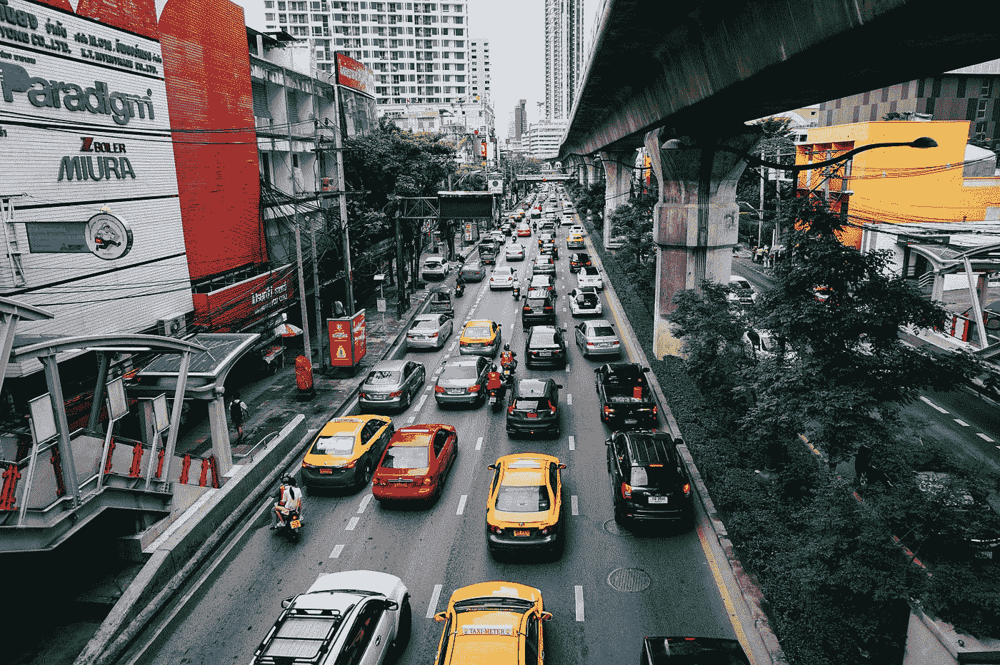
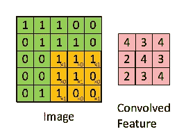
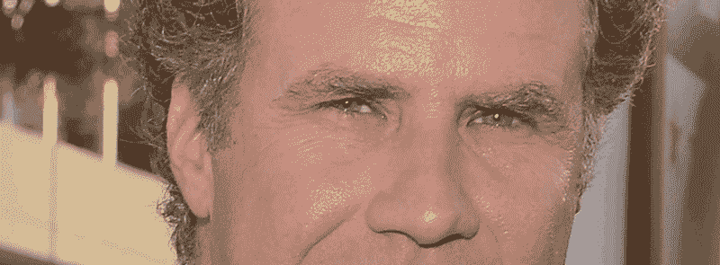
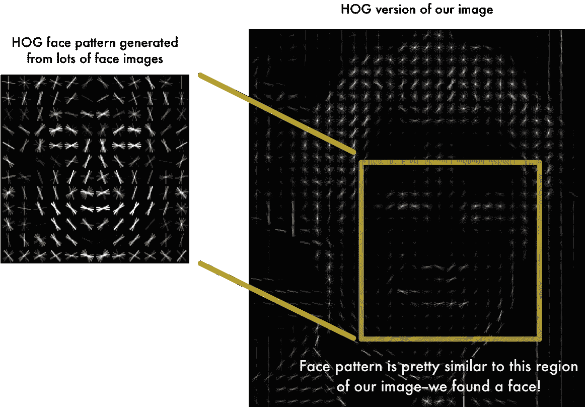

# 如何结合一些机器学习的方法进行流量预测？

> 原文：<https://medium.com/hackernoon/how-to-combine-some-machine-learning-methods-for-traffic-prediction-18bf4270881d>

“Four-lane urban busy traffic congestion in Bangkok” by [Connor Williams](https://unsplash.com/@createdbyconnor?utm_source=medium&utm_medium=referral) on [Unsplash](https://unsplash.com?utm_source=medium&utm_medium=referral)

作为一名从事地理空间数据工作一年多的数据科学家，[交通预测](https://hackernoon.com/tagged/traffic-prediction)一直是我们团队的一大挑战。我们使用[机器学习](https://hackernoon.com/tagged/machine-learning)算法进行交通估计，并使用基于实时交通估计数据的导航系统。我们建立了一个简单的交通估计预测，用于预测导航行驶时间。我们服务的产出惊人的准确。最重要的是，我们的旅行时间预测显示了辉煌的结果，除了像假期或交通行为不可预测的变化这样的异常情况。这些异常发生的几率不到 20 %,但我们的用户需要更准确的预测，特别是在异常时刻，所以这里我将谈谈我们解决问题的方法。

交通预测有多种解决方案，如 ARIMA、萨里玛、卡尔曼滤波、粒子滤波和理论交通传播方法。但是在现实世界中，当您必须在不到半秒的时间内对用户做出响应，并且您有大量脏的/丢失的/不平衡的数据时，使用这些方法似乎不起作用。

这是我们预测交通流量的方法:

作为最初的想法，我建议使用一种简单的基于线性代数的方法来找到与实时交通最相似的交通状态。假设我们找到了与当前状态最相似的状态。我们假设从现在起 20 分钟后，流量应该与 20 分钟后我们发现的状态相似。这种方法有很多错误。例如，当您使用点积时，在预测类似的州时，您无法避免城市西北部的事故对东南部交通状况的影响。

然后，我们使用一种方法来进行局部搜索，以便在我们的交通历史中找到最相似的交通状态。整个想法非常简单。把城市地图剪成几块。例如，我们使用尺寸为 200 米* 200 米的方形电池。然后，我们定义了一个由 5*5 个单元组成的网格，因此其面积为 1Km。每个网格有 9 个 3*3 单元的集合，如下图所示。

The basic idea of building mesh is borrowed from convolution neural networks.

这个局部区域的流量会通过自己的数据进行预测。整个数据量是巨大的，另一方面，我们面对的是更小块中完全缺失和不平衡的数据。这里我们需要的是对我们的数据进行特征工程。我为每个单元中的所有流量数据定义了一些特征，并对每个网格进行了一些矩阵运算，用网格的历史状态评估了网格的实时状态。最后，我发现寻找最相似状态的最佳方法是考虑一个 25 维空间，使得每个网格是一个 25 元素的向量。现在，我们可以计算每个历史状态与实时交通状态之间的点积，并通过使用余弦相似性快速找到最相似的状态。找到类似的状态后，在下一步中，我们测试了我们最初的想法。我们检验了我们是否可以将该状态后的 20 分钟视为从现在起 20 分钟后交通的预测。答案是肯定的。这些预测惊人的快速和准确。这种方法的另一个优点是它可以通过 SQL 查询预测数据库层的流量。

> 如何消除导致流量预测错误的网络问题？现在我们进入交通预测旅程的最后一部分。当我们在一个开放的街道地图网络图上工作时，它总是有像错误的死胡同和一些反向的问题。因此，当您预测该网络的流量时，结果可能不正确。**假设交通的每一种状态都是一幅图像。我们可以通过打开镜头 10 分钟来从每个网格中获取图像，然后进行拍摄。**下一个想法是从这个图像中创造出一头猪。HOG 是一个非常简单的表示，它以一种简单的方式捕获了人脸的基本结构。更多关于 HOG 的信息，请阅读[这篇文章](/@ageitgey/machine-learning-is-fun-part-4-modern-face-recognition-with-deep-learning-c3cffc121d78)。

The original image is turned into a HOG representation that captures the major features of the image regardless of image brightness.

我们的网络中有一些流量。每个都有位置和速度。这个速度有方向和大小。因此，我们可以通过使用它们的位置来定义我们的 HOG，并根据图像上那条线的长度来归一化速度的大小。然后，我们将每条线的长度分成 2 等份，并使用强烈的白色来表示矢量方向。例如，如果我们有一个从北到南的运动，图像中线的顶部北部分的强度将是底部南部分的 2 倍。

现在，我们将交通预测转换为近似重复的图像搜索。如果我们想快速找到最相似的图像，我们可以从每个州的图像中创建一个散列。我已经测试了一些方法，在这种情况下，位置敏感散列法似乎有很好的结果。要了解更多信息，我推荐阅读这篇关于快速找到近似重复图像的文章。

这种方法可以应用于各种情况，并且可以很容易地预测任何图网络上的流量。即使我们关于网络的信息有一些错误或者足够的知识不存在，我们也可以使用最后一部分来预测流量。这种方法的应用可以帮助我们通过收集网站的社交媒体数据来预测黑色星期五的网站流量。此外，我们可以在欺诈检测、发现网络流量中的异常行为、空中流量预测以及您可能知道的许多其他情况下使用这种方法。

我要感谢我的队友[穆斯塔法·贾拉姆巴达尼](https://medium.com/u/34bb88fdcb6?source=post_page-----18bf4270881d--------------------------------)、[达伍德·阿米尼](https://medium.com/u/fe4eab67246d?source=post_page-----18bf4270881d--------------------------------)和[迈赫迪·耶拉吉](https://medium.com/u/73f00af7557b?source=post_page-----18bf4270881d--------------------------------)，他们在这段旅程中帮助了我。

 [## Mahdi R .高级数据科学家——Shopee | LinkedIn

### 在统计建模，数据分析，数据挖掘，机器学习，算法实现，数据…

www.linkedin.com](https://www.linkedin.com/in/minimalaq/) 

我在这里更新了一些其他关于流量预测的作品[。](/neshanmaps/how-we-combine-some-machine-learning-methods-for-traffic-prediction-c17815f907dd)