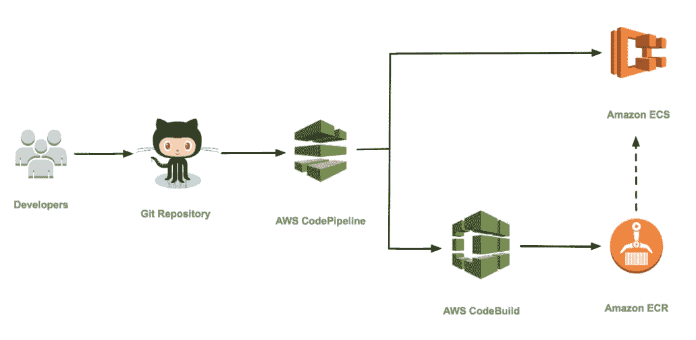
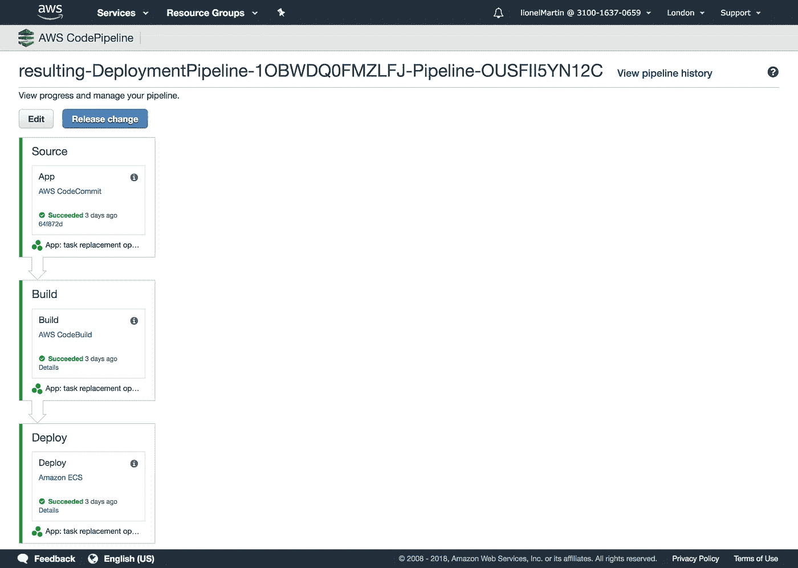

# 如何在 AWS 上持续部署您的 Laravel 应用程序

> 原文：<https://medium.com/hackernoon/how-to-continuously-deploy-your-laravel-application-on-aws-7fc0f39c558e>



即使是很小的事情，自动化也有非常强大的力量。我们有时认为自动化就像简单的数学计算一样，即每天节省给定次数的分钟/秒，但复合效应要大得多。

由于您将为您的部署设置更多的自动化，您将遇到并解决比每周节省几分钟更重要的问题。

自动化一劳永逸地解决了文档化的问题。您的部署过程将变成*基础设施即代码*和*配置即代码*，这些是最好的文档。如果您使用声明式框架，如 CloudFormation 和 Terraform，您将有效地在代码中提交漂亮的 HCL、YAML 或 JSON 文件和 docker 文件，分别描述您的基础设施和配置的状态。

自动化迫使你加强安全性。您会发现，您以前的手动过程依赖于比所需权限更多的凭证或密钥，并且您仍然没有像您说的那样创建部署密钥。您将不会允许您的自动化脚本进行这样的许可访问，因此您将最终为它设置适当的凭证和权限，这将使您的基础结构更加安全。

自动化是你有效发展技术团队的唯一途径。自动化程度越高，流程就越标准。你将会用诸如 Docker、Terraform、Kubernetes、Consul 等广为人知的技术以及它们的设计模式来取代你的零散脚本。这意味着您可以快速构建它们并将其移交给新的开发人员。你可以忘记它们，几个月后再来处理，大脑不会冻结。

在 [Laravel](https://hackernoon.com/tagged/laravel) 的上下文中，我已经发布了[一个用于](https://hackernoon.com/laravel-on-aws-a-reference-architecture-a680755130d0) [AWS](https://hackernoon.com/tagged/aws) 的参考架构，也作为开源*基础设施即代码*堆栈发布，我想在这里用持续部署(下面的 CD)来扩充它。

有许多方法可以在 AWS 上实现 CD，下面是一个首选的解决方案。我们将使用 CodeBuild 来构建 Docker 映像，使用 CodeCommit 来检测源代码更改，最后使用 CodePipeline 来编排构建并交换 ECS 上的生产容器。
我们遇到的第一个问题是，CodePipeline 只与 GitHub、CodeCommit 或 S3 集成。我建议使用 CodeCommit 作为入口点，这样您就可以处理两个工作流:
a .直接从开发人员机器上用`git push`触发重新部署(对于预生产或修补程序)
b. [通过让您的 CI 在测试通过时触发 *git push* 进行 CodeCommit，与任何 CI](/@jay_proulx/aws-codecommit-from-atlassian-bitbucket-and-bitbucket-pipelines-for-ci-offloading-4f1131695802) (Bitbucket Pipelines、GitLab CI、CodeShip 等)集成。

*这是我用来在 AWS 上部署客户的 Laravel 应用程序的程序。希望这能对你的部署有所帮助。如果您的用例更复杂，我会提供持续的支持包，从指导您的开发人员到亲手在 AWS 上构建应用程序。在 hi@getlionel.com 给我打电话*

**1。设置代码提交并推送您的 Laravel 代码**

It could not be simpler to get a Git repository on AWS!

这就是创建存储库所需的全部内容。你可以在这里找到[完整的 CloudFormation 模板，它将有效地授权代码管道访问存储库。](https://gist.github.com/li0nel/e60f1650122621013f5cfbfae3ffde3d)

同时，运行这些命令登录到存储库并发布您的 Laravel 项目:

```
*$ git remote add codecommit CODE_COMMIT_URL*
```

通过将 AWS 命令行凭据帮助器添加到 Git config:

```
*$ git config --global credential.helper ‘!aws codecommit credential-helper $@’**$ git config --global credential.UseHttpPath true*
```

现在，您可以将代码提交到 CodeCommit。

```
*git push codecommit YOUR_BRANCH:master*
```

> 如果您使用的是 OSX，后续的 git 推送可能会失败，因为 OSX 会缓存 AWS 凭据帮助器生成的短期凭据。您需要搜索您的钥匙串并删除 git-codecommit-*的任何条目。
> 此后，在手动推送 git 后，当 OSX 提示时，记得拒绝访问 OSX 钥匙链。

**2。安装代码构建**

在我们的 CodeBuild 项目中，我们定义了在 CodeBuild 克隆了我们的存储库之后要运行的命令。命令类似于您在*bit bucket-pipelines . yml*或 *gitlab-ci.yml* 中编写的内容:假设您可以定义您的环境(操作系统和预安装的工具)，并且您位于项目的根目录中。
这里我们用的是 Ubuntu 14.04，安装了 Docker、Python 和 Compose。我们将安装 node、npm 和 gulp 来编译我们的前端资产。

预构建步骤构建 Docker 存储库 URL，我们将使用它来标记我们的图像。构建命令是一个简单的`docker build`，构建后命令是一个或多个`docker push`。暂时忽略最后一个后期构建命令。

**3。设置代码管道并触发 ECS 零停机重新部署**

这里是我们连接所有点的地方。到目前为止，我们已经有了一个 CodeCommit 存储库、一个 CodeBuild 项目，并且我们的 ECS 集群运行良好。我们使用一个代码管道项目来连接它们。在您的 AWS 控制台中，它将如下所示:



对 CodeCommit 的`master`分支的每次提交都会触发我们的代码管道项目。我们定义的 CodeBuild 命令将构建我们的 Docker 映像，并将它们推送到我们的 ECR 注册表，最后，管道的最后一步将重新部署我们的应用程序。

> 我们通过重新定义 ECS 任务定义的 Docker 图像 URL 来重新部署我们的应用程序

对于*部署*步骤，CodePipeline 依赖于一个*图像定义文件*。它是我们在 CodeBuild 的后构建阶段创建的 JSON 文件，描述了应该如何更新我们的 ECS 集群的任务定义。如果群集有足够的容量，ECS 将启动新容器，等待报告它们运行状况良好，然后关闭旧容器，有效地实现零停机部署。

对于我们的多容器应用程序来说，这个 JSON 文件看起来像这样，它可以很容易地用`bash`和`printf`来构建:

```
[
    {
        "name": "laravel",
        "imageUri": "YOUR_ECR_URL_FOR_LARAVEL:COMMIT_ID"
    },
    {
        "name": "nginx",
        "imageUri": "YOUR_ECR_URL_FOR_NGINX:COMMIT_ID"
    }
]
```

请注意，这就是为什么我们用不同的标签标记新构建的 Docker 映像:ECS 现在可以获取 TaskDefinition 更新，并强制将新映像拖到我们的容器实例中。

ECS 将使用 ECS 服务的`MinimumHealthyPercent`和`MaximumPercent`设置以及当前的额外集群容量(内存和 CPU)来协调重新部署。如果您的 TaskDefinition 的一个新实例有额外的容量，而您的应用程序还没有达到允许的`MaximumPercent`，那么 ECS 将启动您的 TaskDefinition 的另一个实例，并按此顺序删除旧的实例。在另一种情况下，它可能会以相反的顺序交换它们，造成停机。

The CodePipeline CloudFormation template

我希望它能帮助您在部署中建立更多的自动化。我还期待着下个 ECS 特性的发布，预计在这个月发布:通过将您的微服务注册到 Route53 的 DNS 自动服务发现。如果你是第一个实现它的人，请在下面评论！

莱昂内尔是总部位于伦敦的初创公司 Wi5 的首席技术官，也是面向未来的工程文化课程[](https://hackernoon.com/why-the-platform-model-is-broken-a51478b1b4ee)**的作者。你可以在*[](https://getlionel.com)*上联系他**