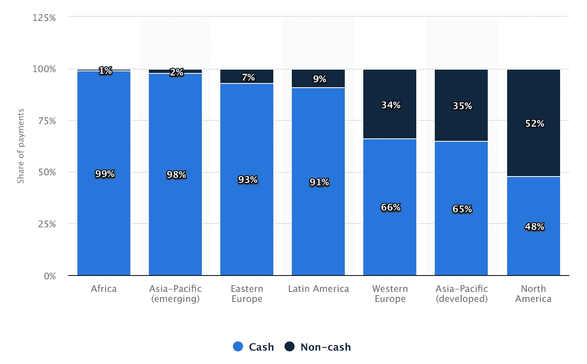

# 如何为 50 万人创建一个金融市场💸。第一部分(非技术性)

> 原文：<https://medium.com/hackernoon/how-to-create-a-financial-marketplace-for-500-000-people-part-i-non-technical-78ab893b1a65>

本文分为两部分:

*   第一部分:非技术性
*   [第二部分:技术](/@amozgovoy/how-to-create-a-financial-marketplace-for-500-000-people-part-ii-technical-4d2456d9768d)

如果您对我们创建的全球基础设施的技术方面感兴趣，请查看本文的第二部分[。同时，故事从一个使命和一个数字开始。](/@amozgovoy/how-to-create-a-financial-marketplace-for-500-000-people-part-ii-technical-4d2456d9768d)

# 寻找最有效的解决方案

根据[世界银行](https://www.worldbank.org/en/news/press-release/2018/04/19/financial-inclusion-on-the-rise-but-gaps-remain-global-findex-database-shows)的数据，仍有超过 17 亿成年人没有银行账户，然而其中三分之二的人拥有可以帮助他们获得金融服务的手机。

这清楚地告诉我们一件事:传统的银行方法效率非常低。缺乏基础设施:ATM 网络、托收和存款、柜员网络和内部汇款程序只是创建真正银行化体验道路上的几个障碍。

至于数字钱包和金融科技解决方案，让我们看看这张图表:

Proportion of cash and non-cash payments worldwide in 2017, by region

数据基于[2018](https://worldpaymentsreport.com/wp-content/uploads/sites/5/2018/10/World-Payments-Report-2018.pdf)世界支付报告。但是我们并没有直接研究这些数字。数字支付解决方案在基于现金的社会中带来的价值如何？这里的基本原则是:现金交易的权重越高，网络对参与者的价值就越低。显然，反之亦然。

这意味着，要以数字方式转移价值，最终必须有人兑现和套现价值。这就是为什么生态系统能够比简单的转移和交易更长时间地将资金保留在系统中，往往能够更好地生存。

在这一点上，我们有两个主要的想法:

*   它必须是一个数字银行
*   它必须不是一家银行。至少在常识上是这样的。

一个开始的好地方。虽然不是很具体。

# 定义金融市场

当我们发现传统的小额信贷解决方案不具规模且不能解决问题时，我们开始了解中小企业对新兴市场当地经济的影响。

这种服务的理念是，用户将拥有所有必要的工具来进行社交和金融互动。具体来说，这演变成了四个主要的功能块:

*   数字 KYC 系统
*   具有集成的基于人工智能的个人助理的聊天平台
*   加密钱包
*   市场

本条第二部分中的[部分描述了每个区块的技术方案和决策详情。在这里，我们将只触及解决方案的一个方面—财务。](/@amozgovoy/how-to-create-a-financial-marketplace-for-500-000-people-part-ii-technical-4d2456d9768d)

值得一提的是，内部结算交易引擎有多种运行方式。您可以许可现有软件，也可以构建自己的软件。当你决定建立自己的，你甚至有更多的选择。

我们决定坚持使用密码。在 crypto 中运行结算交易使我们能够轻松扩展到 4 大洲的 46 个国家，并进行全面的法律尽职调查。易于在新兴市场合法扩张——勾选✅.

下一步是决定协议解决方案。我们给予以太坊和 EVM 优先于即将到来的 Hyperledger，Stellar 或其他协议。

2017 年初，当我们开始时，以太坊网络显示出最强的采用率，增长最快的技术社区，EVM 允许许多 2 级扩展解决方案，但我们将在稍后触及这一点，因为以太坊也有很多缺点。主要的是单位经济学。

我们没有选择 Hyperledger 解决方案的原因可以在下面的跟进报价中简要说明:

“该项目的目标是通过开发区块链和分布式分类账来推进跨行业合作，特别关注提高这些系统的性能和可靠性(与类似的[加密货币](https://en.wikipedia.org/wiki/Cryptocurrency)设计相比)，以便它们能够支持主要技术、金融和供应链公司的全球商业交易。”

## 以前是什么

一个加密令牌，基于以太网上部署的标准 ERC20 合同。为了保持透明度和一致性，所有交易和排放合同调用都必须在以太坊主网上完成。

尽管在我们开始的时候以太坊有 3 个测试网，但没有一个能满足我们的需求。我们想建立一个能够快速迭代的网络。我们还相信，在未来，许多基于以太坊协议的开放和独立的网络将会运行，并具有互操作性的接口。

## 为什么？

2017 年乙醚发行率为 14.75%。每个嵌段大约有五个醚。因为以太坊奖励大叔就意味着可能多于或少于五个以太。

截至 2017 年 9 月 7 日，矿工获得了 21，335，541.72 ETH 的采矿区块奖励和 1，181，201.88 的采矿大叔奖励。为了确保网络安全，他们总共获得了 22，516，743.6 ETH。使用 2017 年 9 月 7 日 303.86 美元的价格，网络安全成本为 22516743.6 ETH * $ 303.86 = 6841937710.296 美元。网络上有 56，048，767 笔交易。

> 主以太坊网络中的一次交易的安全成本按目前的汇率大约是 122.07 美元。(日期:2017 年 9 月 7 日)

跟随数字永远不会让新兴经济体进入数字市场领域。这就是我们开始构建解决方案的原因，该解决方案不仅允许令牌在以太坊主网上保持透明和可访问，而且还提供廉价的共识来保护网络。这样我们的用户就可以在网络上进行交易，而交易费用几乎为零。

## 如何实现(优势)

我们设计并开发了混合区块链系统，该系统由 3 个主要组件组成:

*   外部(Mainnet)以太坊区块链
*   内部主区块链
*   特定国家的内部区块链(每个国家分配一个)

通过由 PoH(人类证明)共识算法控制的复杂结构，PoH(人类证明)共识算法与我们整个系统中的生物识别紧密相关，我们拥有一套路由服务，可将交易流量从内部导向外部，反之亦然。以下结构还允许我们对任何监管规则保持开放，无论是现有的还是即将出台的。

## 关于密码的最后思考

社区中目前的共识是，该协议将完成繁重的工作，一个薄薄的定制业务逻辑层将使应用程序能够在这些繁重的协议上运行。如果你相信世界正朝着这个方向发展，那么世界很有可能会是这样的——将会有一个发布协议，它将托管你的所有内容，为每个提供定制功能的频道提供定制应用。因此，《NYT》、《华尔街日报》和《经济学人》仍将通过它们自己的应用程序访问，但你将通过发布令牌为订阅内容付费。同样，你的社交媒体将过渡到一个社交媒体协议，瘦应用将提供一个定制的新闻源和其他社交体验。

基本上,“记号”这个术语字面上变成了意义数量值的表示。

# 保留、LTV、ARPPU 和 CAC

对于产品，你创造了无限的度量标准，你在任何地方都在不断地测量，从如何获得用户到他们如何坚持使用产品，以及他们如何使用产品；从做客户开发到区分核心功能到探索推荐机制和病毒效应。你明白我的意思，要发展一个产品，你必须深刻理解终端客户参与和使用产品的每个方面。为了更有效率，你必须关注 2-3 个主要指标。

轻松的说道。金融市场的概念，它所提供的特性和功能是一个非常复杂的任务，无论是技术上还是产品上。从技术上来说，必须有一个非常模块化的平台，能够处理核心服务，并且在需要时能够快速横向扩展，在几天内，甚至几周或几个月内提供一系列新功能。

不过，对谁来说是个百万美元的问题？

## 未得到充分服务的群体

金融世界的大部分都是建立在模型之上的。以 FICO 评分为例，它将信用历史的长度作为决定信用评分的关键因素，这是正确的，一致性是一个很好的预测因素。然而，可能会有年轻的借款人，他们没有长期的信用历史，但有一些其他的补偿因素，如良好的教育。金融科技模型融入了其中一些因素，以服务于不应得的细分市场。此外，它们还可以服务于千禧一代或早期新兴的富裕人群，这些人还没有足够的存款来维持一个高余额要求的存款账户。这可能是另一个服务不足的细分市场。

另一方面，小企业也可能是得不到充分服务的部分。通常，满足传统商业银行所需的收入水平和/或流程可能无法由小企业家实现。

至于多小的问题？

> 平台上 74%的商业活动都是由创始人单独经营的企业进行的。

# 转折点

我们花了 4 个月的时间开发平台的核心，用 3 个月的时间让客户开发步入正轨，了解目标受众，最后开始完善产品。

如果你看下面的图表，你可以清楚地看到产品的转折点。

January was the breaking point for an accelerated growth

1 月份的增长已经由其他乘数定义，并最终表明:技术和产品解决方案正在产生回报。

这就是为什么这个故事不是关于在 10 个月内达到 50 万用户。它是关于为特定需求创建一个高效的解决方案。它展示了技术解决方案如何为指数级增长创造空间。