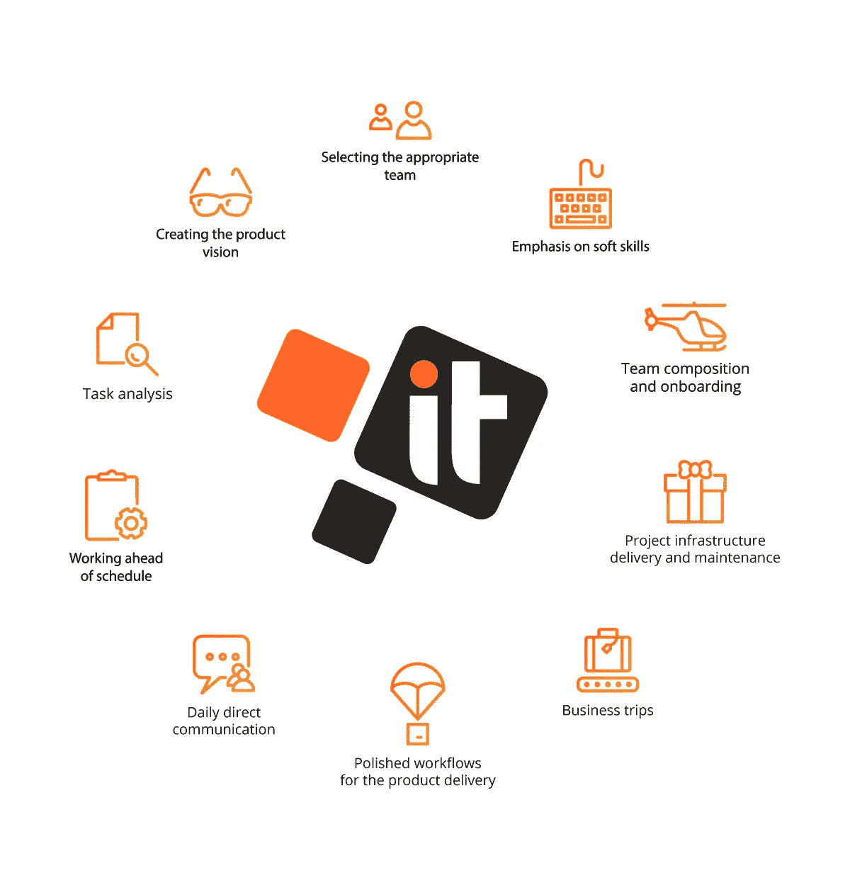

# 如何创建高绩效的项目团队——我们的成功故事

> 原文：<https://medium.com/hackernoon/how-to-create-a-high-performance-project-team-our-success-story-e03cd10c20ad>

IT Svit 为拥有完善的工作流而自豪，这些工作流帮助我们在预算内按时交付出色的产品和服务。这篇文章强调了我们在 IT Svit 进行项目管理的方式。

初创公司经常联系我们，提出同样的要求:他们有一个伟大的想法，有一些种子资金来创造一个 MVP，需要一个好的团队来实现它。他们通常缺乏技术背景，不知道产品必须如何运行，也缺乏利用 AWS、GCP 或 Azure 基础设施来维护生产中就绪应用的实践经验。尽管如此，我们能够提供一流的服务，确保客户的创业和业务目标取得成功。这是项目管理工作流程，以 Svit 风格完成。

# 任务需求分析

我们通常需要大约**3-4 周**来召集团队，满足客户对产品特性的所有要求和期望。此后，我们清楚地了解客户想要什么，以及他/她实际上需要什么来快速启动和运行产品。我们了解构建和发布 MVP 或全面产品所需的技术堆栈和工具包。了解了这一切，我们就知道需要什么样的专家来担当这些角色。

# **创造产品愿景**

我们提出了产品架构和所有组件的预期工作方式，以确保操作的稳定性和易于管理。通过形成对未来产品和基础架构的整体愿景，我们确保客户获得他想要的功能以及不间断的最终用户体验。我们还提供完成这项工作所需的专家名单。

# 选择合适的团队

IT Svit 招聘团队使用我们的产品 HRM 系统，从 3000 多名合适的申请人中筛选出最符合项目规格和最有动力获得工作的人。这些申请人渴望与一家声誉良好的 DevOps 服务提供商合作，根据国际商业评级和评估机构[Clutch.co](https://clutch.co/)的调查，该提供商被列入[全球 20 大 MSP](https://clutch.co/it-services/msp)和乌克兰 IT 外包市场的[领导者之一。我们丰富的经验和正确的团队建设方法经常被我们满意的客户在他们的](https://clutch.co/it-services/ukraine/leaders-matrix)[五星评价](https://clutch.co/profile/it-svit#reviews)中提及。

# **强调软技能**

我们特别强调软技能，因为我们深知它们的重要性。团队必须沟通和协作才能有效率，所以团队成员合作得越好，工作产品准备得就越快。通过充分重视软技能，我们确保团队成员既是熟练的专业人员又是好同事，准备投入足够的努力来确保项目成功。

# **团队组成和入职**

我们在办公室对候选人进行一系列面试，为了方便客户，我们将他们列入候选名单。客户可以根据我们的建议从几个最合适的团队中进行选择，以确保最终的团队是一个好团队，而不管参与的人才是谁。然后，经客户批准的团队成员将通过快速入职流程。他们熟悉项目需求和预期的架构，因此如果需要，他们能够为潜在的瓶颈提出解决方案。

# **项目基础设施交付和维护**

我们的许多客户将他们的产品部署在 AWS、GCP 或 Azure 上，或者希望他们未来的应用部署到这些云平台上。这些 web 或移动应用程序可能是使用 React、Node.js、PHP 或 Laravel 或任何其他框架开发的。例如，您可能已经有了 iOS / Android/web 开发团队，您仍然需要 DevOps 团队在云平台上发布产品并支持进一步的维护。

IT Svit 拥有强大而有能力的开发人员和技术支持团队，以确保稳定的基础架构运营，并在需要时提供及时的产品支持。我们专门为各种规模的公司提供经济高效的 IT 基础设施，因此[我们的开发运维专家](https://itsvit.com/our-services/devops-service-provider/)能够为初创企业和大型企业提供最佳解决方案。

更进一步说，现在几乎任何项目都涉及大量的大数据、机器学习(ML)和人工智能(AI)。正如在最新的 2018 年伦敦 [AWS 峰会](https://itsvit.com/blog/aws-summit-2018-london-highlights-takeaways/)上宣布的那样，AWS 成为以大数据&人工智能为导向的公司。为了充分利用平台的可能性，企业应该雇佣大数据工程师和数据架构师，以便能够为客户提供更好的结果。对我们的客户来说幸运的是，大数据是 IT Svit 的另一个专业领域，我们已经准备好为初创公司和任何其他企业提供完整的服务周期。我们可以设置 Hadoop、Spark、Cassandra，创建网络爬虫和抓取器，并使用任何类型的 ML 模型来提供精确和有价值的业务分析。

# 让客户熟悉团队的商务旅行

一旦客户认可了团队构成，他们就可以互相见面并建立个人联系。要么团队带薪出差到客户所在地工作几周，要么客户访问我们的办公室，获得与团队互动的实践经验，并阐明项目规格。这是当今外包工作流程中的一种流行做法，确保团队与客户和他/她的现场团队步调一致。

# 为产品交付的每个阶段优化工作流程

一旦团队开始无缝工作，并从我们的办公室返回到远程工作方案，我们将遵循我们完善的内部工作流程，以确保及时交付所需的产品功能。丰富的第一手经验使我们能够正确地确定任务的优先级，以确保成功完成 sprint。例如，每个团队成员早上写每日计划，晚上提交每日报告。这有助于正确评估项目进度，并在需要时应用先发制人的纠正措施，以确保项目按时完成。

# 与团队的日常直接沟通

我们的团队领导(TL)作为产品利益相关者，控制产品开发流程。他们通过聊天、项目管理系统(吉拉、特雷罗、Redmine 等)中的日常直接沟通向客户通报进展情况。)或 Skype 通话。客户总是知道团队在做什么，是否出现了任何障碍，以及正在做什么来克服挑战。

# **提前开工**

这种项目管理方法确保我们的团队总是按时交付结果，并且经常提前交付，以确保客户安全。多个[五星级 IT Svit 客户对 Clutch](https://clutch.co/profile/it-svit#reviews) 的评价以及近 **70%的新客户是由之前满意的 IT Svit 客户推荐给我们**的事实证明了这一点。

# **组建高绩效项目团队的 IT Svit 方法示例**

在不透露产品任何细节的情况下，我们可以描述一下我们最近的一个项目。该团队由以下专业人员组成:

*   AWS 地形工程师
*   AWS 架构师(作为团队领导)
*   Python 开发者
*   2 名技术支持工程师

TL 负责产品架构和基础设施设计，以及选择团队成员和与客户沟通。由于他对产品应该如何工作和应该使用什么技术有一个清晰的愿景，他能够提出所需技能的列表并面试潜在的申请人。

这种选择团队的方法帮助我们**将项目启动**所需的时间**缩短了 30%** ，并让客户**节省了大约 25%的总体项目预算**，因为我们高效地使用了 AWS 基础设施，没有不必要的延迟。我们的团队几乎总是领先于计划，高质量的产品按时交付。客户完全满意，我们现在正在进行产品的开发和维护。

*最初，这个故事发布在我公司的博客上—*[https://it svit . com/blog/create-high-performance-project-team-success-story/](https://itsvit.com/blog/create-high-performance-project-team-success-story/)