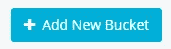
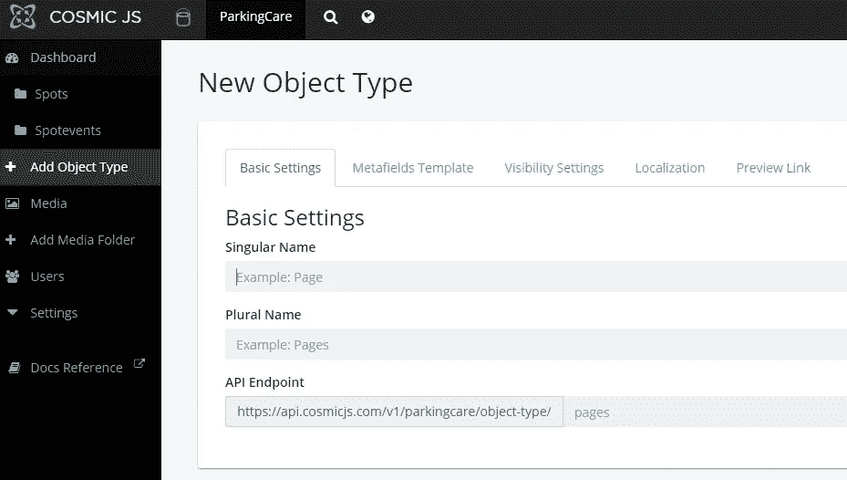
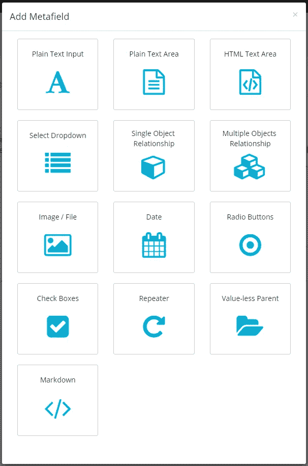
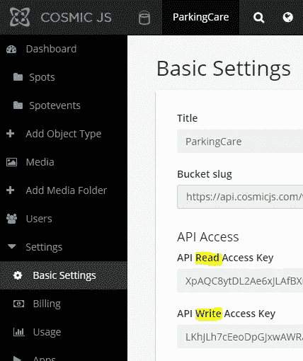
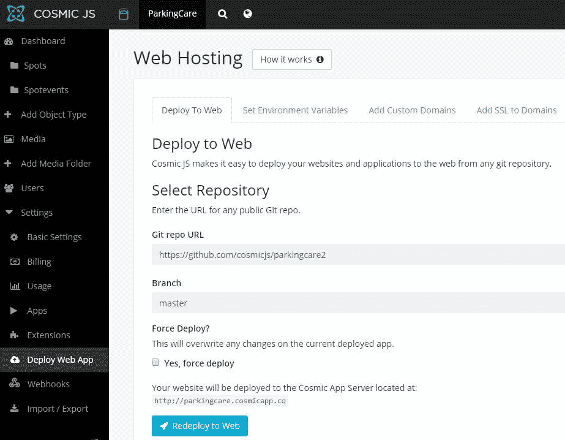

# 如何创建一个具有宇宙 JS 和 Angular 的管理系统

> 原文：<https://medium.com/hackernoon/how-to-create-a-management-system-with-cosmic-js-and-angular-a655977bc2e1>

# TL；速度三角形定位法(dead reckoning)

[下载 GitHub repo。](https://github.com/cosmicjs/parkingcare)
[查看试玩。](https://cosmicjs.com/apps/parking-care)

# 介绍

想象一下，我们需要一个应用程序来管理一个没有太多要求的停车场——停车位应该被清理和维护。广告位将被租用或拥有，顾客需要为服务付费。所有这些数据以及客户信息都需要存储起来，以便于访问。在本文中，我将向您展示如何使用 Cosmic JS 创建这个基本的数据管理应用程序。

# 准备后端

首先在 Cosmic JS 注册，创建自己的桶。

之后，我们需要创建几个对象类型:一个用于描述停车场，另一个用于描述停车场发生的事件。它可能是三种不同类型中的一种:付款、维护或清洁。

为此，在您的存储桶中单击“添加对象类型”

每个对象都有内置属性，如标题、辅助信息和内容。通常，这已经足够了，但是让我们把对象类型变得更具体一些。Metafields 来救援了！

添加一个列表以保存楼层号，并用值“地面”、“第一”和“第二”填充。

之后，创建另一个对象类型，点事件。添加元字段类型(“付款”、“维护”和“清理”)和事件日期(作为日期类型元字段)。不要忘记添加一个类型为“Object”的字段来指向一个父点。

现在我们需要增加一点安全性:设置 write_key 和 read_key 来限制匿名访问我们的数据。

它们由设置->基础设置页面控制

好了，我们的后端完成了。我们的 app 会使用强大的 Cosmic JS API 来操作，我们需要做的就是编写一个单页面的应用。Angular 2 是一个很好的解决方案。

# 让代码摇滚起来！

# 在我们开始之前。

首先，我们需要安装 NodeJS 及其包管理器 NPM(令人惊讶的是，它为 NodeJS 包管理器保留)。这里有一个相当有用的链接:[https://nodejs.org/en/download/package-manager/](https://nodejs.org/en/download/package-manager/)

安装 Angular CLI(命令行界面)。从这里开始:[https://angular.io/guide/quickstart](https://angular.io/guide/quickstart)

另外，在这里查看代码:[https://github.com/cosmicjs/parkingcare2/](https://github.com/cosmicjs/parkingcare2/)

点击此处查看演示应用:[https://parkingcare.cosmicapp.co/](https://parkingcare.cosmicapp.co/)

# 入门指南

现在打开一个控制台/命令行/无论你有什么运行命令和创建一个文件夹，进入它和类型

**ng 新泊车护理**。好了，我们已经安装了一个示例项目。

几年前所有的人都对 Bootstrap 感到兴奋，所以现在它到处都是，看起来很无聊。就拿清新明快的布尔玛框架来说吧。你可以在这里了解:【https://bulma.io/

另一个伟大的 UI 是字体真棒。如果你还没看完的话，请点击这里查看:【https://fontawesome.com/ 

转到 parkingcare/src/index.html，添加布尔玛和字体 Awesome 的参考

让我们看看它现在是什么样子:运行 **ng 发球-打开**

在应用程序中，文件夹创建另外三个:模型、服务和组件

# 数据模型

为我们的应用程序创建数据模型:进入/models 并键入 **ng 生成类实体**， **ng 生成类点**， **ng 生成类点事件**。因为 TypeScript 支持继承实体类中所有常见的东西，并在派生类中保存特定的数据:Spot 和 SpotEvent

创建另一个名为 Settings 的类，并将数据发送到其中。这些数据将作为应用程序配置文件

# 服务

现在我们需要创建一个服务——这个服务将为我们提供 API 调用。移动到/services 文件夹，键入 **ng g 服务数据**(“g”表示“生成”)。我们过一会儿再装满它。

# 成分

现在转到/components 并创建几个组件:

仪表板( **ng g 组件仪表板** ) —用于主页

spot card(**ng g c dashboard**)—用于特定的专色页面

spotcardedit(**ng g c spotcardedit**)—现场编辑表单

event card edit(**ng g c event card edit**)—spot event 编辑表单

# 按指定路线发送

现在我们需要添加一个路由器，向系统解释哪个组件应该用于准确的 URL。很好的解释位于这里[https://angular.io/tutorial/toh-pt5](https://angular.io/tutorial/toh-pt5)

我们需要服务的请求类型很少:

*   默认情况下，我们需要显示一个仪表板
*   创建新点/创建点/
*   显示选定的 spot /spots/:spot_slug(如，/spots/101)
*   编辑选定的 spot /spot/:spot_slug/edit
*   添加新的 spot 事件/spot/:spot_slug/addevent
*   我们不需要一个单独的事件列表，spot display 页面包含了它
*   将所有其他请求重定向到根

在 app/app-routing.module 中，我们需要将组件分配给路径。

好了，我们创建了一个路由，让我们看看它看起来怎么样。运行 **ng 发球——再次打开**。看不出有什么变化。这是因为我们需要给 app.component.html 添加一个路由器出口标签。

调整后运行 **ng serve — open** 。现在成功了。

# 用户界面

是时候做点 UI 了。我们的入口点，仪表板，将向用户显示两个块:

*   点列表概述
*   最后发生的事件

转到 app/componens/dashboard/dashboard . component . html，在那里创建一个两列布局(让我们将三分之二的内容放在概述中)并放置组件标签:app-spotlist 和 app-eventlist。但是没有数据，组件标签就不起作用。让我们在那里传递一些对象，“spots”用于 spot list，“spotEvents”用于 last events。

# 数据检索

dashboard.component.ts 中描述了这些对象，我们需要更深入地了解它们。

转到/services/data.service.ts 并在那里创建几个函数:

其中一些将用于获取数据，一些用于更改数据。

从一个简单的开始:获取点列表。我们将使用 RxJS([http://reactivex.io/rxjs/](http://reactivex.io/rxjs/))

首先，编写一个合适的 URL 来调用 Cosmic JS API。

之后，通过 GET 方法调用 API 并返回东西，称为 Observable

使类似于事件列表。

并使最终函数 getSpots()

返回 observable . fork join(this . getspotdata()、this . getspotevents())；

当两个列表都准备好时，它将返回所有数据。

到此为止，让我们回到 dashboard.component.ts

在 **ngOnInit** 中，我们订阅服务函数，当接收到数据时，我们进行一些数据转换:将接收到的数据重新打包到我们的对象“spots”和“spotEvents”中，这在前面已经描述过了。

随着我们的对象膨胀，它们应该呈现在页面上。我们需要添加更多的组件:spotlist 和 eventlist ( **ng g 组件 spotlist** ， **ng g 组件 eventlist** )

在组件的中。ts 文件设置 **@Input** 为对象列表(为了能够传递给组件)，

英寸 html 文件使用*** ngFor = " let spot of spots "**在传递的列表中迭代对象来描述列表。

对于事件列表来说，也是相当类似的。

# 航行

我们像添加或移动到显示页面这样的操作以链接的形式出现，但是使用的是 **routerLink** param 而不是 **href** 。

此外，还有一些按钮点击处理程序。它们以(点击)="func(param)"方式设置。

# 数据创建

要创建一个对象，我们需要向 Cosmic JS API 发送一个格式正确的 json，并在有效载荷中传递一个写密钥。让我们转到 services/data.service.ts 并创建一个服务于新点创建的函数。

默认情况下，需要传递一个 title 和 type_slug。因为我们有一个更复杂的对象，所以我们还需要将一个元数据和 write_key 传入我们的有效负载对象。

不要忘记添加一个头内容类型:application/json。如果没有它，API 将无法识别有效载荷。将它与 POST 一起发送到/add-object 并获取一个新对象。这是很明显的。

# 数据更改

要更改对象，您需要将另一个 json 提交到 Cosmic jsapi“edit-Object”控制器。在 json 中，您需要传递 write_key、更新对象 slug、title、content 和所有元字段(事件，如果它们没有改变的话)。当然，不要忘记内容类型头。

# 数据删除。

因为所有外部内部对象都是公共实体类型的子对象，所以我们可以使用一个公共函数，因为宇宙 JS 移除一个对象唯一需要的东西是它的 slug。您必须将删除请求调用到 API 的“对象”控制器。在我们的例子中，我们还需要传递一个 write_key，所以这里有一个技巧:我们在请求中添加一个 JSON**{ " write _ key ":" }**作为“body”选项。而且效果很好。

在移除污点之前，我们需要确保绑定事件不存在。所以我们调用一个函数来检查没有事件被绑定到这个点。如果不能删除该点，我们可以显示警告。 ***ngIf** 用于它

在组件/spot card/spot card . component . html 中

和 components/spot card/spot card . component . ts 中

# 准备发射。

现在我们需要以某种方式部署它。Cosmic JS 提供了一种很好的、非常简单的方式来启动你的应用程序，即基于 Dokku 的 PaaS。你只需进入左侧菜单中的设置->部署 Web 应用程序，填写回购网址，然后点击蓝色按钮“部署到 Web”。

因为我们有一个角度应用，所以需要一些额外的准备。

为了使整个画面清晰，我们需要理解以下陈述:

*   我们的代码需要构建(从 Angular/TypeScript 翻译成 Html/JavaScript)
*   我们需要安装角度基础设施，让#1 成为可能
*   建立一个应用程序后，我们需要启动小型网络服务器来服务入站请求

好了，我们来稍微调整一下 package.json。

*   将 **@angular/cli** 、 **@angular/compiler-cli** 、 **typescript** 和 **@types/node** 从 devDependencies 分支移至依赖项。
*   添加引擎块
*   添加快速依赖关系
*   按照以下方式编辑“脚本”块:
*   将“start”行从“ **ng serve** ”更改为“**NPM install&&node server . js**”。它将安装依赖列表所需的一切，然后启动我们的网络微型服务器。
*   添加“postinstall”行，设置到 angular core“ng”和 build 的完整路径。这条线提供了一个安装完成后的建筑。
*   在文件夹根目录下创建 server.js 文件。它相当原始:需要 Express framework，设置一个静态文件夹为/dist(它是 angular 的构建输出的标准文件夹)，让它监听来自环境变量或 Heroku 5000 标准的端口。就是这样。

下面是 server.js 的代码

也是 package.json 的一部分

在这些准备工作将所有内容提交到存储库之后，转到部署页面(再次，设置->部署 Web 应用程序)并单击“部署到 Web”。过一会儿，你会收到一封来自 Cosmic JS 的电子邮件，确认部署成功。如果没有，您可以再次检查该页面，查看错误日志(如果有)。

# 结论。

现在，当你看到它是多么简单和舒适时，我希望你足够兴奋，用有棱角和宇宙的 JS 将你的想法带到生活中。

这篇文章最初出现在宇宙 JS 上[。](https://cosmicjs.com/articles/how-to-create-a-management-system-with-cosmic-js-and-angular)