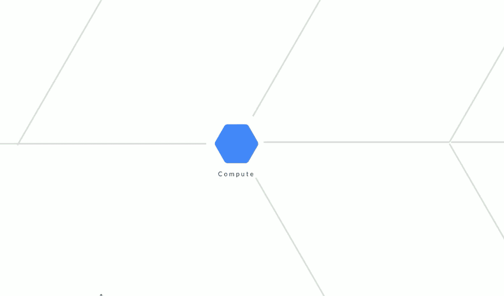
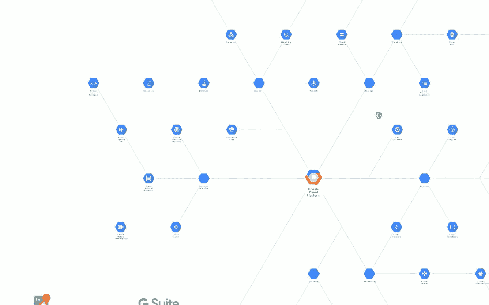
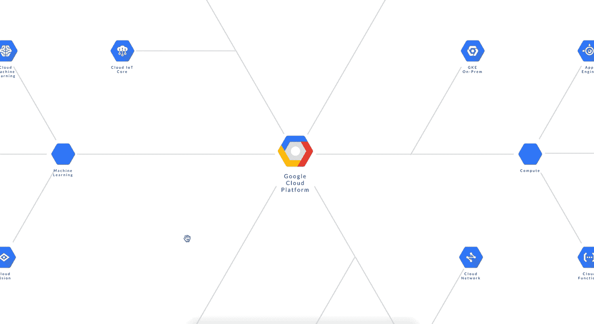
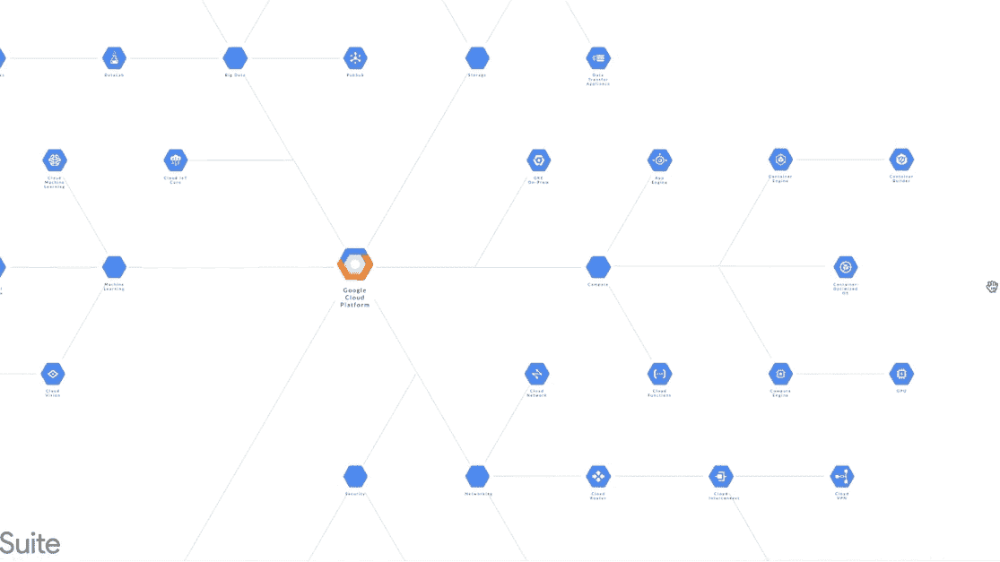

# 如何创建导航用户界面

> 原文：<https://medium.com/hackernoon/how-to-create-a-navigation-ui-bac94a9e51fa>

## 用普通 Javascript 创建交互式信息图(第二部分)



Navigation UI for large canvases

## 概述

本文是关于用普通 Javascript 创建交互式信息图的五部分系列文章。

到目前为止，我们已经设计了一个模式和一个视图引擎。然而，信息图表设计的可用性仍然受到浏览器窗口大小的限制。为了支持更大的画布，我们可以从原生 Javascript 中找到现成的答案。

## 目标

让我们创建浏览大画布的导航功能。

## 介绍

把信息图想象成一片森林。有了大量的信息要呈现，设计者可能会想把整个森林挤进一个浏览器窗口。文本、形状和图像变得过于网状，人眼看起来不舒服。

另一方面，设计师可能会将布局分割成更小的部分，并以独立页面的形式呈现。游客可能看到了树木，却失去了森林。

为什么不让用户调整细节的级别，使信息量总是与用户的需求相关联呢？

## 概念

想象在地图上拿着一面“镜子”。我们移动地图本身，而不是移动镜子来检查地图的不同部分。这个效果是通过一个叫做`overflow`的 CSS 特性实现的。通过操作其属性，我们可以创建 4 种强大的导航效果:

*   滚动(通过 X 和 Y 滚动条)
*   平移(根据光标的相对位置)
*   抓取并拖动(通过光标的移动)
*   放大(或缩小)

## 开始—准备画布

创建一个名为`canvas`的变量来引用地图。这是父容器。

```
var canvas = document.getElementById(“parentContainer”);
```

## 卷起


Scroll vertically and horizontally

第一种技术`scroll`是用一个简单的 CSS 创建的:

```
div {
    overflow:scroll;
}
```

`overflow`控制内容的显示方式。把这个属性想象成一个中间有一个剪切窗口的假想覆盖图。`overflow`是我们的虚拟镜子。

玻璃下面是森林(即`canvas`)本身。`scroll`告诉浏览器水平或垂直移动底层画布(或通过触控板同时移动)。透过那个窗口只能看到森林中暴露的部分。

## 防止意外相互作用

我们不希望用户在浏览其他内容时无意中移动了`canvas`。您可以通过一个基本的 HTML 按钮在`scroll`和`hidden`的 UI 状态之间切换来防止这种情况。你可能希望`hidden`成为默认的 CSS 行为(即锁定 X 和 Y 滚动)。

```
canvas.style.overflow = "hidden";
```

当游客准备好探索`canvas`时，让他们切换到`scroll`。

```
canvas.style.overflow = "scroll";
```

`scroll`是默认的浏览器功能。您不必编写任何自定义处理程序。

让我们继续下一个导航功能。

## 平底锅



Pan by holding down the right mouse button and moving the mouse simultaneously

无论`canvas`的大小如何，都可以快速浏览整个画布，而无需使用鼠标垫。按住鼠标右键并同时移动鼠标即可激活此功能。

使用鼠标光标的位置计算新的相对滚动值(见粗体)。

```
canvas.addEventListener("mousemove", handlerMove, false);
function handlerMove(event) {
    if (event.which == 3) { // use right button to pan
    **canvas.scrollTo( event.clientX , event.clientY );**
    }
}
```

*   `mousemove`监听任何被按下(未释放)的鼠标按键。
*   `event.which == 3`检测鼠标右键。`event.which == 1`探测左侧。`event.which == 2`检测中间的滚动按钮。
*   `event.clientX`和`event.clientY`提供鼠标光标的当前坐标。

**设置鼠标按键**。让我们为“平移”导航保留鼠标右键。由于浏览器默认显示鼠标右键的上下文菜单，我们需要指示浏览器给我们这样的控制:

```
canvas.addEventListener(‘contextmenu’, 
    function(event) {
        event.preventDefault();
    },
false);
```

## 抓住并拖动



两个概念协力创造了这种效果。

**动作和反应**。让我们把`canvas`放在桌面上，把鼠标光标想象成我们的手指。当我们用一个手指抵住画布并推动它时，我们的手指被认为移动了一定的 X 和 Y 距离。类似地，画布移动相同的 X 和 Y 距离。手指引起了一个**动作。**反应是**反映**画布移动的程度。

**鼠标光标增量。**我们想要**镜像**这个距离作为画布上的反应。换句话说，画布应该精确地移动光标移动的距离。让我们称这个值为鼠标光标增量。

用一个非常简单的公式计算:

```
start coordinates - end coordinates
```

结果应该实时更新为新的滚动值。透过我们想象中的窗口，一个访问者会觉得好像她用鼠标拖动了画布。

*提示:“鼠标增量值”只是一个标签，与* `*WheelEvent.deltaX*` *浏览器事件不同。*

**实现**。添加一个事件监听器`mousedown`来检测鼠标左键的按下。

```
canvas.addEventListener("mousedown", handlerGrab, false);function handlerGrab(event) {
    if (event.which == 1) {
        mouseDownBoolean = true;
        // Find the initial scroll value
        // Capture the initial mouse cursor position
        ...
    };
}
```

*   用`event.which == 1`分配鼠标左键。
*   `mouseDownBoolean`告知其他相关功能鼠标左键当前是否按下。

一前一后添加`mousemove`和`mouseup`监听器来拖动和释放画布。

```
canvas.addEventListener("mousemove", elementDrag, false);function elementDrag(event) {
    if (mouseDownBoolean){
        // Calculate the delta after the mouse cursor has moved
        // scroll to the new position
        ...
    }
};canvas.addEventListener("mouseup", elementDragclose, false);function elementDragclose() {
    if (mouseDownBoolean){
        mouseDownBoolean = true;  // "releases" the drag
        //  change the cursor icon dynamically
    }
};
```

*   `mousemove`触发自定义函数`elementDrag`拖动画布。
*   `mouseDownBoolean`仅当鼠标左键也按下时(由`handlerGrab`设置)，动作才有效。
*   `mouseup`检测到**三步序列**的结束，调用`elementDragclose`复位 UI 状态。

按顺序检测所有三个动作:

```
1\. Press & hold the left mouse button
2\. Grab and drag the cursor some X and Y distances
3\. Release the mouse button
```

在`if (event.which == 1) {…}`代码块内，我们可以用`getBoundingClientRect()`找到起始滚动值:

```
var distanceToTop = canvas.getBoundingClientRect().top;
var distanceToLeft = canvas.getBoundingClientRect().left;
```

并捕捉鼠标光标的初始位置(在它移动之前):

```
var posXdelta = 0, posYdelta = 0, posX = 0, posY = 0;myBox = e || window.event;
posX = myBox.clientX - distanceToLeft;
posY = myBox.clientY - distanceToTop;
```

在代码块`elementDrag(event),`中找到终点坐标，并计算最终的增量值:

```
posXdelta = pos3 - ( myBox.clientX - distanceToLeft );
posYdelta = pos4 - ( myBox.clientY - distanceToTop );
```

并命令浏览器“滚动”到其新的相对位置:

```
var newX = canvas.scrollLeft + posXdelta;
var newY = canvas.scrollTop + posYdelta;
canvas.scrollTo( newX , newY );
```

*   管理您的变量`mouseDownBoolean`、`pos1`、`pos2`、`pos3`、`pos4`、`distanceToTop`、`distanceToLeft`，以便上面提到的函数可以访问它们。

*提示:如果你将一个节点元素显示为带有* `**` *标签的图像，那么要防止它被意外拖出窗口。*

```
itemElementName[i].ondragstart = function(){ return false; };
```

## 不要遗漏次要的细节

用尖尖的箭头光标拖动东西会不会感觉怪怪的？换成代码块`elementDrag(event)`内的`grab`光标(即手形图标)怎么样？

```
canvas.style.cursor = "-webkit-grab";
// supports Chrome, Safari and Opera
```

更好的是，添加一个动画效果`grabbing`,每当鼠标按钮被按下时显示“正在抓取”。

```
canvas.style.cursor = "-webkit-grabbing";
```

请记住，一旦松开鼠标按钮，就在代码块`elementDragclose()`处重置 UI 状态。

## 一款云视频会议软件



Zoom with mouse-scroll button

使用滚动按钮进行缩放。要放大并查看细节，请向上滚动。要缩小并查看更大的图片，请向下滚动。像这样使用`wheel`:

```
canvas.addEventListener("wheel", handlerWheel);
```

`zoom`通过操纵数值。

```
canvas.style.zoom = 1;
```

结构如下:

```
canvas.addEventListener("wheel", handlerWheel);function handlerWheel(event) { if (zoomAllow) {
        if (event.wheelDelta === 100) {
            zoomLevel = zoomLevel + 0.1;
            if (zoomLevel > 3){
                ...
            }
        } else if (event.wheelDelta === -100) {
            zoomLevel = zoomLevel - 0.1;
            if (zoomLevel < 0.3){
                ...
            }
        }
    }}
```

*   防止意外的`wheel`交互是一个很好的做法。我们还应该区分窗口`scroll`动作和`zoom`动作。使用布尔值`zoomAllow`在缩放和滚动“模式”之间切换。
*   使用`event.wheelDelta`设置缩放计数的阈值。
*   保持一个变量`zoomLevel`以递增和平滑地缩放。值越小，缩放越精细。接受小数。考虑添加缓动行为以平滑地制作动画。
*   使用条件语句`if (zoomLevel > myNumber)`设置最大和最小缩放范围。

**保持焦点**。缩放后，绝对 X 和 Y 滚动值将保持不变。这将在每次缩放时将画布“跳转”到新的相对滚动位置。让我们写一个方法来“记住”原来的焦点区域。

```
var prevRatioX = (canvas.scrollLeft) / (canvas.scrollWidth - canvas.clientWidth);
var prevRatioY = (canvas.scrollTop) / (canvas.scrollHeight - canvas.clientHeight);var newX = prevRatioX * (canvas.scrollWidth - canvas.clientWidth);
var newY = prevRatioY * (canvas.scrollHeight - canvas.clientHeight)canvas.scrollTo( newX , newY );
```

*   `prevRatioX`和`prevRatioY`计算滚动比(缩放前)。
*   `newX`和`newY`重新计算新的相对滚动值(缩放后)。
*   `scrollTo`告诉浏览器回到之前的相对位置。

## 后续步骤

我们通过 4 个导航功能增强了视图引擎。

让我们用导航小工具让它更上一层楼。

## 到其他部分的链接

第一部分为设计交互式信息图奠定了基础。

**第二部分→** *你现在在这里。*

[**Part-three** 增加动态小地图，增强导航。](/@PageiiStudio/how-to-create-a-two-way-navigation-map-e96600a73cbd)

[**Part-four** 增加了一个内嵌 UI 来访问分层内容。](/@PageiiStudio/how-to-create-a-progressive-ui-to-enhance-presentation-cc42fe97360c)

第五部分展示了为什么创建具有人情味的用户界面如此容易。

如果你喜欢这个故事，你可以在 [Pageii 工作室](https://pageii.com/story;title=How-to-create-a-navigation-UI)找到更多。