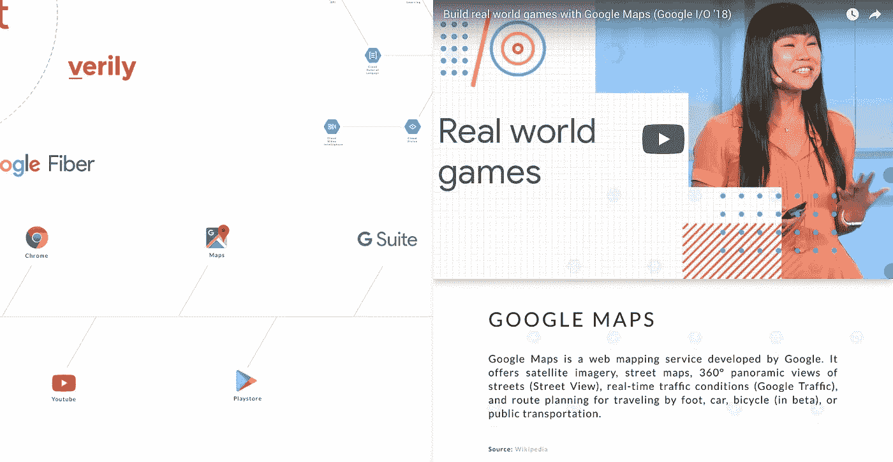
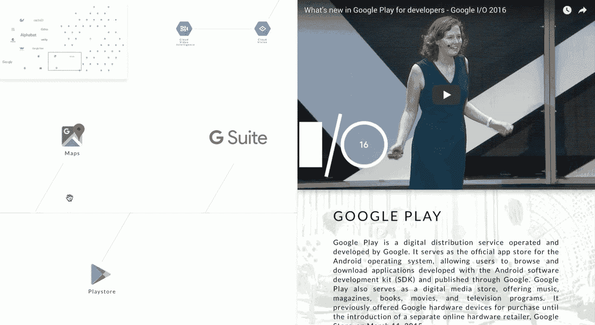
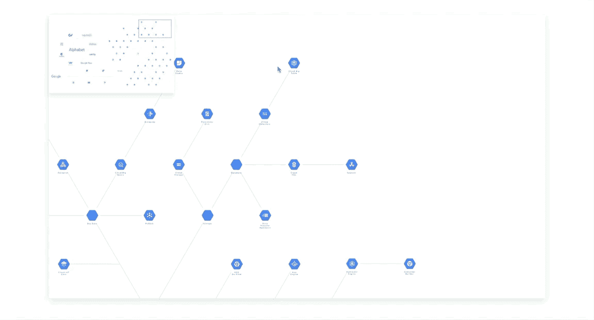

# 如何创建渐进式用户界面来增强演示效果

> 原文：<https://medium.com/hackernoon/how-to-create-a-progressive-ui-to-enhance-presentation-cc42fe97360c>

## 用普通 Javascript 创建交互式信息图(第四部分)



Creating a progressive UI to simplify information architectures and enhance presentation

## 概述

本文是关于用普通 Javascript 创建交互式信息图的五部分系列文章。

之前我们设计了一个双向地图定位器来增强用户导航。在本文中，我们将继续基于谷歌云平台(GCP)产品的 UI 示例来呈现具有复杂架构的内容。

观看我们如何使产品信息易于使用。

Video demo: how to simplify information architectures with a progressive UI design

## 目标

让我们设计一个 UI 来呈现多方面的内容。

## 介绍

将信息组织成层次结构是有好处的。你可以对话题进行分类，逐步揭示有意义的关系。

例如，在知识门户上，动物学家可能对关于杰克·拉塞尔斯的话题感兴趣。她沿着一条特定的信息路径前进:

```
Animals > Mammals > Carnivore > Canis > Dogs > Jack Russells
```

假设她也在研究哈士奇、鬣狗和狐狸。与杰克·拉塞尔斯相比，表达相关信息的好方法是什么？如何提供上下文信息，而又不至于让用户不堪重负？

一种方法是将数据分成小段，然后跨多个独立的页面重新连接它们。随着每一个页面的加载，用户会跳转到新的类别和网页中去寻找更多的细节。然而，突出上下文关系变得更加困难。过多的页面加载也会使用户迷失方向或感到沮丧。结果是用户体验下降。

一定有更好的方法来引导用户实现他们的目标。这个等式的一部分在我们之前的讨论中已经解决了。我们可以把一张完整的地图，或者动物王国，放到画布上，仍然可以盈利地导航。

我们现在剩下的是“Jack Russell”问题——在不影响信息流的情况下，让 UI 向下显示详细内容的设计挑战。

## 概念

可以把扩展(节点的)信息路径想象成添加一个 HTML 容器。像使用便利贴一样，我们可以将这些容器“粘贴”到浏览器窗口上，以显示分层信息。不需要页面加载。我们基本上描述了一个**内嵌 UI** 。

现在是激动人心的部分。当访问者从一个节点“跳到”另一个节点时，这些容器会换进换出以显示更新的内容。我们将通过制作 UI 动画向用户展示正在发生的事情。



Animated revealers for layered content

用户现在可以访问详细的内容，而不会丢失大画面。更好的是，它们总是在一个一致和持久的用户界面之上。

*提示:如果你正在编写一个单页应用程序(SPA ),比如 React 或 Angular，通过动态地优化路径来创造最好的用户体验。例如，当用户点击一个直接带她到 animalchart.com/jack-russells,路线的反向链接时，SPA 应该提取相关数据，自动聚焦在节点上，并在用户不做任何事情的情况下启动动画。*

## 入门指南

实现很简单。

*   便利贴机制仅仅是一个在运行时创建或销毁的 div 容器。
*   动画是带有缓动效果的普通 CSS。
*   数据存储重用了`legend[]`数组(来自第一部分的讨论)。

## **步骤 1:准备画布**

在主`while`循环中添加一个`click`监听器(第一部分讨论)。

```
while (item[i]) {
    ...
    itemElementName[i].addEventListener("click", showLayeredContent)
}
```

*   为每个节点添加一个`click`监听器。
*   `click`将触发自定义功能`showLayeredContent`。

`showLayeredContent`运行指令以:

*   从`legend[]`中检索数据。
*   创建一个显示内容的 div 容器。
*   将容器“粘贴/粘贴”到浏览器窗口或`canvas`。
*   将容器的初始位置放置在视口的“下方”,以便它在激活后可以“向上滑动”。

```
*function* showLayeredContent(event) {

    var div = document.createElement('div');
    div.id = "some HTML" + deepContent;
 *//  add your CSS
    //  add your animation* // attach the new container to the DOM
    document.body.appendChild(div);
    //  ... add animation to show what's going on

    anotherLayeredElement(*this*.id);
    //  ... more "post-it notes", if any}
```

*   `document.createElement(‘div’)`动态创建“便利贴”容器。
*   `div.id = “some HTML” + ‘deepContent’`填充容器。
*   `deepContent`包含实际内容。使用`this.id`作为索引键从`legend[]`数据存储中检索记录。
*   `document.body.appendChild(div)`将容器附加到 DOM 中进行渲染。`document.body`是通用的。使用`canvas`或者你自己的容器元素。
*   `anotherLayeredElement(this.id)`添加更多容器。在我们的演示视频中，我们总共使用了 3 个“粘性”容器。

技巧 1:动态地生成容器元素和它的 CSS，这样我们就可以快速地使引擎适应其他项目。

技巧 2:记得在换入新的容器之前，先把旧的容器拿走。

## 步骤 2:用动画指导用户操作

将第一个“粘性”容器作为全高元件放置在右侧。它的入口以**自下而上**的动作动画化。

```
var sticky01 = document.getElementById( myContainerID );//  Stage the container's pre-animation position
sticky01.style.bottom = "-100vh";
sticky01.style.right = "0%";//  Attach CSS class to the RHS container.
sticky01.classList.add("myCssClass");//  Once your container is ready, animate its entrance.
sticky01.style.transform = "translateY(0px)";
...
```

*   `sticky01`引用第一个容器

*提示:将* `*translateY*` *改为* `*translate3d*` *，利用硬件加速来提高性能。*

```
layeredContainerRHS {
    position: fixed;
    overflow-y: scroll;
    top: 0;
    right: 0;
    width: 50vw;
    height: 100vh;
    zIndex: 9;
    transition: all 200ms cubic-bezier(0.165, 0.84, 0.44, 1);
}
```

*   `position: fixed`“粘贴”容器到`canvas` UI 上。
*   `overflow-y: scroll`可以通过垂直滚动显示无限内容。
*   `top: 0`设置容器在画布“下方”的预入口位置。
*   `right: 0`、`width: 50vw`和`height: 100vh`将容器的样式设置为占据浏览器窗口的右侧。
*   `zIndex: 9`指定分层顺序。
*   `transition`创建动画效果。`cubic-bezier`产生柔滑的运动。

## 步骤 3:添加多个“粘性”容器



Opening and closing “sticky” containers

到目前为止，我们已经创建了一个全高的“粘性”容器来显示详细信息。同时，用户仍然可以浏览其他主题。

如果您希望将信息分层到更多的层，只需添加更多的容器。在我们的演示视频中，我们添加了两个较小的容器来显示摘要信息:

*   摘要文本和特征图像的“中间”容器。
*   “左”容器突出显示相关信息、参考或外部资源链接。在我们的例子中，我们用它来显示流程图。

```
function middleSticky(ID) {
    ...
    // "middle" sticky container (#02)
    div.style.left = "25vw";
    div.style.height = "44vh";
    div.style.width = "30vw";
    div.style.background = "#000";
    ...
    middleSticky.style.transform = “translateY(0vh)”;
    ...
}function leftSticky(ID) {
    ...
    // "left-most" sticky container (#03)
    div.style.left = "0vw";
    div.style.height = "21vh";
    div.style.width = "25vw";
    div.style.background = "#e68717";
    ...
    leftMostSticky.style.transform = “translateY(0vh)”;
    ...
    }
```

*   `translateY(0vh)`启动动画起始位置:
*   用 CSS 区分每个容器。

## 第四步:清理

一旦动物学家完成了任何主题，UI 关闭粘性容器以最大化主导航 UI。以相反的顺序，“滑下”粘性容器，并将其从场景后面的 DOM 中移除。

```
function closeStickyWindows(id){
    div.style.transform= "translateY(0vh)";
    setTimeout(() => {
        div.parentNode.removeChild(div);
    }, 500);
}
```

*   `500`例如(最后一个动画开始于 300 毫秒)+(200 毫秒完成动画)。
*   `div.parentNode.removeChild(div)`删除 DOM 元素(即垃圾收集)。如果 ES6 向后兼容性不成问题，请使用`.remove()`。

## 后续步骤

用户可以以更精细的方式浏览内容。

在这个系列的最后一部分，我们将讨论赋予 ui 人性化的想法。

## 到其他部分的链接

[**第一部分**为设计交互式信息图奠定了基础。](/@PageiiStudio/how-to-build-an-interactive-infographic-from-scratch-94128678c83b)

[**Part-two** 增加浏览内容的导航功能。](/@PageiiStudio/how-to-create-a-navigation-ui-bac94a9e51fa)

[**第三部**增加动态小地图，增强导航。](/@PageiiStudio/how-to-create-a-two-way-navigation-map-e96600a73cbd)

**Part-four →** *你来了。*

第五部分展示了为什么创建人性化的用户界面如此容易。

如果你喜欢这个故事，你可以在 [Pageii 工作室](https://pageii.com/story;title=How-to-create-a-progressive-UI-to-enhance-presentation)找到更多。