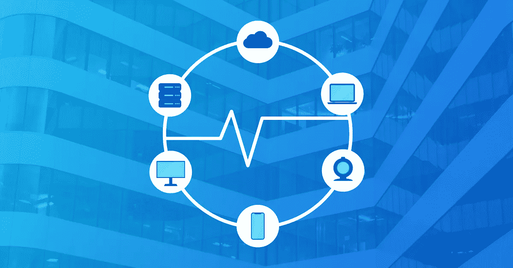
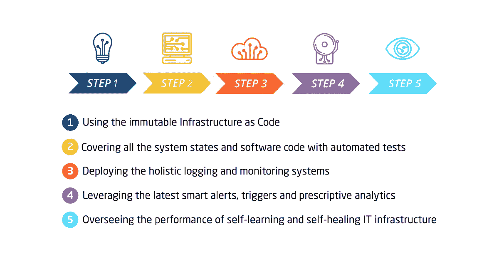

# 如何创建自我修复的 IT 基础架构

> 原文：<https://medium.com/hackernoon/how-to-create-a-self-healing-it-infrastructure-d171bfe479fc>

日常任务的自动化为创建真正自我管理的环境铺平了道路，在这种环境中，系统本身处理配置。今天，我们讨论如何创建自我修复的 IT 基础架构。

从这里到那里总会有一些过渡，一些进化过程。例如，汽车行业的下一件大事是自动驾驶汽车在世界范围内的接受。尽管埃隆·马斯克的[特斯拉自动驾驶](https://www.wired.com/story/tesla-autopilot-self-driving-crash-california/)，[福特计划生产无人驾驶汽车](https://www.reuters.com/article/us-fordmotor-selfdriving/ford-to-test-new-self-driving-vehicle-technology-in-2018-idUSKBN1E129L)，[戴姆勒-奔驰已经在测试无人驾驶卡车](https://www.theverge.com/2017/1/31/14453704/uber-daimler-partnership-self-driving-cars-mercedes-benz-volvo)。这些制造商根据一个 [5 步计划来实现无人驾驶汽车](http://insight.vineresources.com/the-5-stages-of-driverless-cars)。

转变的难点在于态度的转变——司机必须接受乘客的角色，而不是道路的主人。不过，好处是最大的——全天候工作的全自动送货系统，确保道路上更少的车祸和人员伤亡。通往这个乌托邦的道路似乎很漫长，然而汽车巨头们用七步走完了这段路。

# 自我修复 IT 基础架构的 5 个步骤

那么 IT 行业呢？明显的发展方向是自动化。当越来越多的日常任务实现自动化时，可以将工作时间和资源用于改善基础架构和提高其性能，而不是手动解决大量繁琐的任务。构建能够自动执行日常任务的自我修复 IT 基础架构将极大地简化开发运维工作流。糟糕的是，没有行业定义的路线图来实现软件交付的这种状态。今天，我们将阐述如何创建自我修复的 IT 基础架构。

这是一个漫长过程的简短路线图，很可能需要大约 5-10 年的时间:

1.  使用不可变的基础设施作为代码
2.  用自动化测试覆盖所有的系统状态和软件代码
3.  部署整体日志记录和监控系统
4.  利用最新的智能警报、触发器和说明性分析
5.  监督自我学习和自我修复的 IT 基础架构的性能

下面我们将详细介绍这些步骤。

# 不可变的 IaC 作为自我修复 IT 基础架构的基础

现代 IT 工程师不得不面对的最费力和最例行的任务之一是配置服务器。手动完成时，这是一个耗时且极易出错的过程。即使现代的 [DevOps 团队](https://itsvit.com/our-services/devops-service-provider/)不必将物理服务器安装到机架中，他们也必须在提供现成的开发、测试、试运行或生产环境之前，在多个仪表板中对其进行配置。将[不可变的基础设施视为代码](https://itsvit.com/blog/modern-face-of-10-old-school-it-rules/)用根据简单、可理解和容易调整的清单工作来代替这个过程。使用 Kubernetes 管理带有应用程序的 Docker 容器和 Terraform，以编程方式部署和配置所需的服务器，有助于将漫长且容易出错的过程转变为简化的软件交付管道。

# 自动化测试是保持代码库高效的关键

向左移动的**是 2018 最热门的 DevOps 趋势之一[。开发人员并没有将测试和错误修复工作留到软件交付生命周期的末尾，而是转移了所有的测试——集成、安全性、完整性等。—在软件创建流程的左侧。产品的自动化单元测试是在产品本身的开发开始之前编写的，并且总是与主要的开发过程并行更新。也就是说，随着时间的推移，团队拥有自动运行的测试所覆盖的所有产品代码库，而不是每天手动运行它们。集成测试确保系统组件始终稳定，新版本在投入生产后不会导致系统故障。](https://hackernoon.com/10-disruptive-devops-trends-of-2018-b0b6d5719376)**

# 日志记录和监控是自我修复基础设施的关键

日志记录和监控工具应在系统架构设计阶段选择，并与解决方案组件集成，以便有效收集 [DevOps 系统性能](https://itsvit.com/blog/3-steps-to-improve-the-business-devops-performance/)的所有重要细节。详细的日志极大地简化了问题根源的查找和响应手册的编写。一旦 DevOps 工程师针对某个特定问题提出了解决方案，任何系统管理员(甚至是开发人员)都可以在将来按照清单进行操作，从而减轻了合格的 DevOps 专家的工作量。此外，一旦收集了足够大的日志数据库，就可以对其应用机器学习算法来训练系统自动处理日常问题。

# 智能警报、触发器和说明性分析

随着日志和监控工具变得越来越复杂，它们能够在错误报告中包含更多的信息。[现代监控工具](https://itsvit.com/blog/5-parts-svit-logging-monitoring-toolkit/)不再简单地显示系统组件是启动还是关闭，而是生成具有更详细信息的智能警报，允许[将解决问题的时间缩短 90%](https://itsvit.com/cases/svit-internal-monitoring-system/) 。一旦解决了这些错误，就可以为每种情况创建适当的触发器和规定的响应。由于这种方法，多个重复性的问题可以被描述并有效地解决，甚至不需要 DevOps 团队的关注。最重要的是，可以针对问题的根源设置这样的触发器。这样可以预防问题，而不是处理后果。

# 监督自我修复 IT 基础架构的性能

自我修复 IT 基础设施的最后一步是根据不断增长的日志库不断训练已部署的机器学习算法。在 2025+的乌托邦世界中，DevOps 工程师将收到潜在问题的通知，并批准自我修复 IT 基础架构提供的解决方案。更进一步说，这个过程还将受到机器学习的影响，因此随着时间的推移，需要人工关注的错误将越来越少，从而确保稳定的基础设施性能，并允许 DevOps 团队集中精力改善整体系统架构，而不是每天解决小问题。

# 创建自我修复 IT 基础架构的步骤的最终想法

尽管这是一幅乌托邦式的图画，但外行的 DevOps 团队很快就能接触到这样的系统是最不可能的。开发实现这种方法所需的系统所需的人力和财力远远超出了一般企业的能力。因此，我们必须一如既往地等待并希望像 AWS 或 GCP 这样的行业巨头能够创造出类似 AWS Lambda 或 Kubernetes 的平台并开源。只有在完成之后，全球的 DevOps 人才才能从使用自我修复的 it 基础设施中受益。

你对前面提到的进化过程有什么看法？你的公司或组织目前处于这条道路的哪个阶段？你打算很快进入下一阶段吗？请在下面的评论区分享你的想法和观点！

*原载于 2018 年 9 月 24 日*[*【itsvit.com*](https://itsvit.com/blog/create-self-healing-infrastructure/)*。*