# 如何在 8 分钟内创建一个向工作区所有成员发送消息的 Slack Bot

> 原文：<https://medium.com/hackernoon/how-to-create-a-slack-bot-that-messages-all-members-of-a-workspace-in-8-minutes-32a5b52838be>

因此，几个月前，我创建了一个 Slack workspace，让各行各业的人聚集在一起，分享有趣的文章、视频和播客——把它想象成一个你可以从商业、教育、技术等各个领域找到有趣内容的地方。人们开始加入，像所有的团体一样，它达到了一个阶段，我觉得#活跃的人是< # people in the group. I wanted to send a message to everyone asking if they’d like to continue or leave the group.

*注意:如果你有兴趣加入工作空间，请在下面评论。*

**于是，我打开谷歌，输入“如何在一个宽松的工作环境中给每个人发送直接消息”。令我惊讶的是，没有直接的方法做这件事。唯一的方法是自己创建一个 Slack bot，并添加几行代码来启用这个特性——我没有找到任何文章有详细的过程。我有一些空闲时间，所以我想我应该自己试试。这对我即将到来的面试也是一个很好的复习。**

***警告:*** *说到编程，我是个业余爱好者，所以我花了 3 天时间，花了很多很多时间…错误之后，它终于工作了。希望这一步一步的指导能让你更容易理解。*

# 第 1 分钟:下载 Python 2.7.13 并添加到 PATH

在开始编码之前，您需要设置环境。您需要以下内容来创建 bot 并使其工作:

1.  Python 2.7.13
2.  皮普和虚拟
3.  您所在的松弛帐户和工作区

*注:我是在我的 Windows 笔记本电脑上做的。如果是在 Mac 或 Linux 机器上，命令会稍有不同，所以请在线检查是否有适当的更改。*

就是这样。现在，[跟随此链接](https://www.python.org/downloads/release/python-2713/)下载 Python 2.7.13 版本。*不要下载 Python 2.7，因为它与下载最新的 Pip 版本不兼容。*

下载安装了吗？太好了！现在，如果您打开命令提示符并键入 Python，它将显示以下内容:

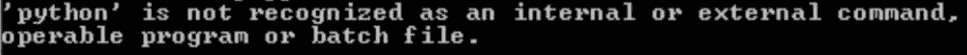

这是因为 [Python 路径还没有添加到您的 path 环境变量中。](https://www.pythoncentral.io/add-python-to-path-python-is-not-recognized-as-an-internal-or-external-command/)转到我的电脑- >属性- >高级系统设置- >环境变量。您应该看到以下内容。

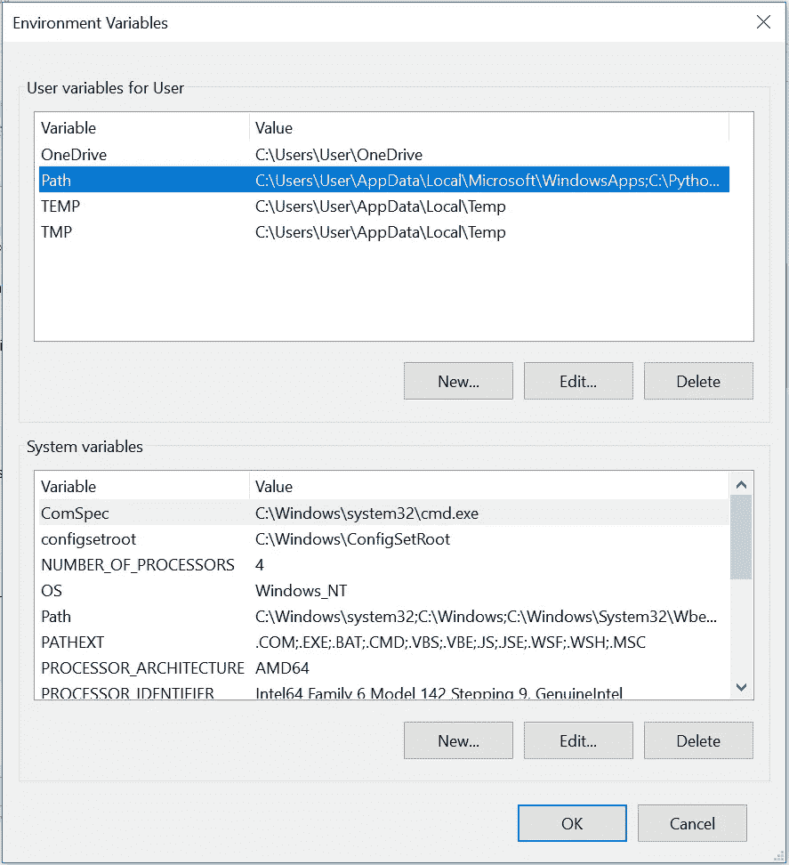

点击路径并“编辑”。在那里添加一个新路径: *C:\Python27* (假设这是您的 Python 目录所在的位置，或者添加任何路径)。

现在打开命令提示符，键入 Python。应该能行！

# 第 2 分钟:下载并安装 pip

下载 **pip** 的时间到了。 **pip** 是一个软件包管理系统，用于安装和管理用 Python 编写的软件包。[点击此链接](https://pip.pypa.io/en/stable/installing/)，下载 get-pip.py 文件并保存在新文件夹中。这是从现在开始保存所有文件的文件夹。

现在，打开命令提示符，导航到 pip 文件所在的文件夹并键入:

*python get-pip.py*

它应该工作，并告诉你它是成功的。现在，您必须像以前一样添加 pip 文件的路径。遵循与前面相同的说明，并将它添加到您的 PATH 环境变量: *C:/Python27/Scripts* (这是 pip 文件所在的位置)。

现在在命令提示符下输入 pip，它应该可以工作了！

# 第 3 分钟:安装并激活 virtualenv

**virtualenv** 是一个创建隔离 Python 环境的工具。 **virtualenv** 创建一个文件夹，其中包含使用 Python 项目所需的包所需的所有可执行文件。

只需转到存储 get-pip.py 文件的文件夹，键入以下内容:

*pip 安装 virtualenv*

安装完成后，您需要创建一个新的 virtualenv 并激活它。

*虚拟环境*

*环境\脚本\激活*

以上命令应该会显示以下屏幕:

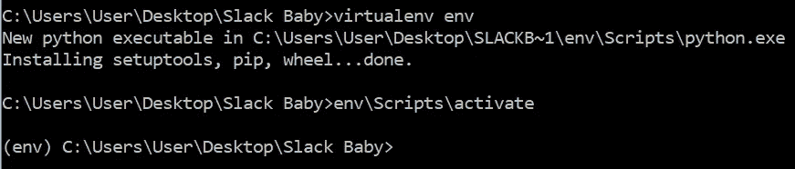

I was too attached to this project, hence the name Slack Baby

# 第 4 分钟:创建一个新的 Slack 应用和 Slack 机器人

现在是时候创建一个机器人来完成向所有成员发送消息的实际任务了。点击此链接，进入 Slack API 页面。使用您的 Slack 帐户凭证登录，您应该会看到这样的屏幕。

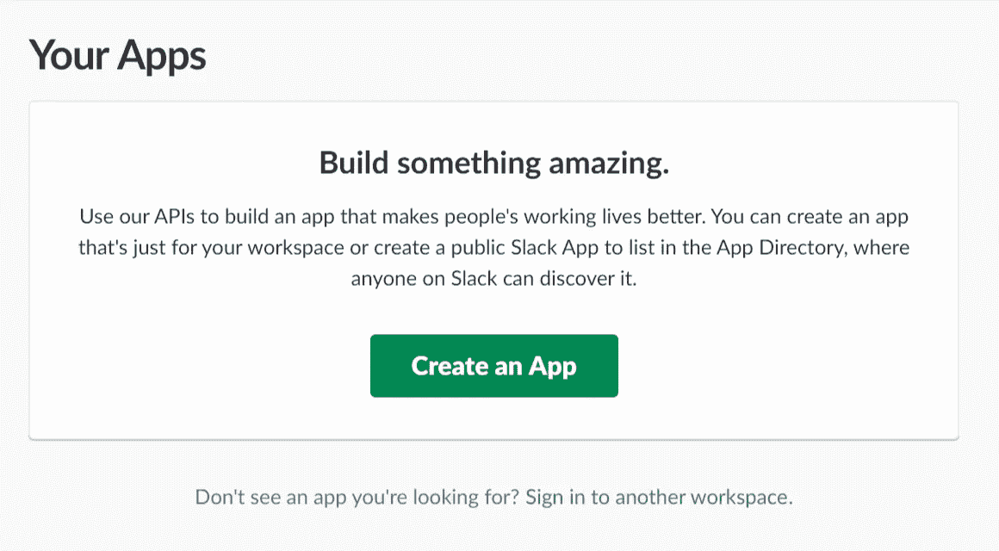

点击创建应用程序后，填写应用程序名称并选择您的工作空间:

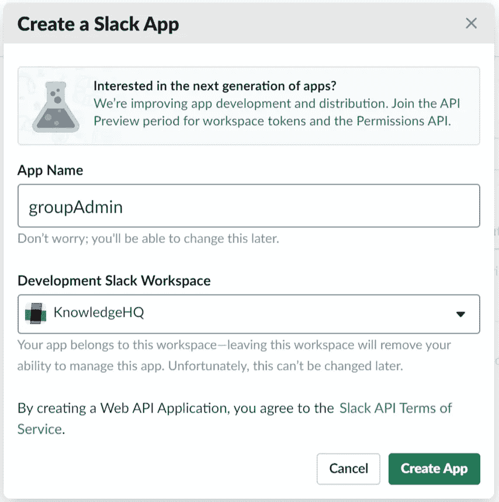

现在，转到左侧的 Bot Users 选项卡，创建一个新的 Bot:

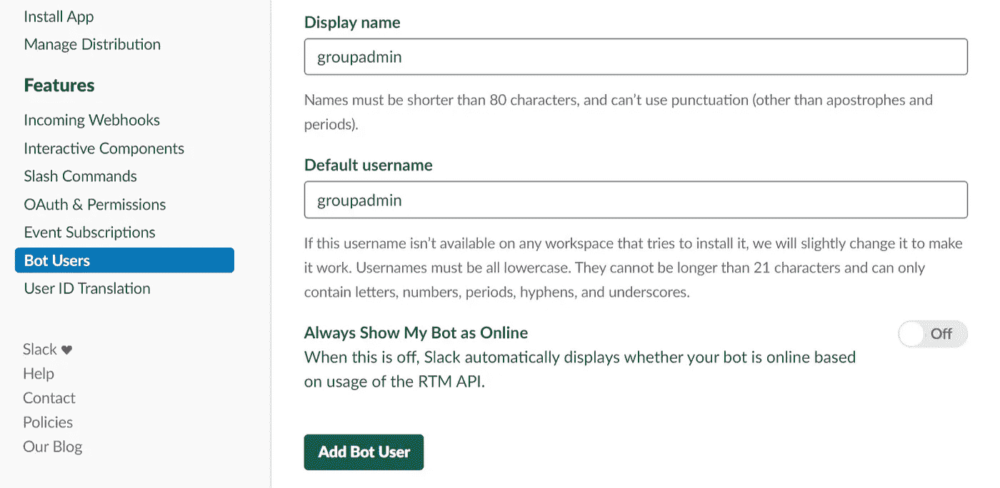

一旦你添加了这个，你需要进入 OAuth & Permissions 并授权机器人在你的工作空间中发布:

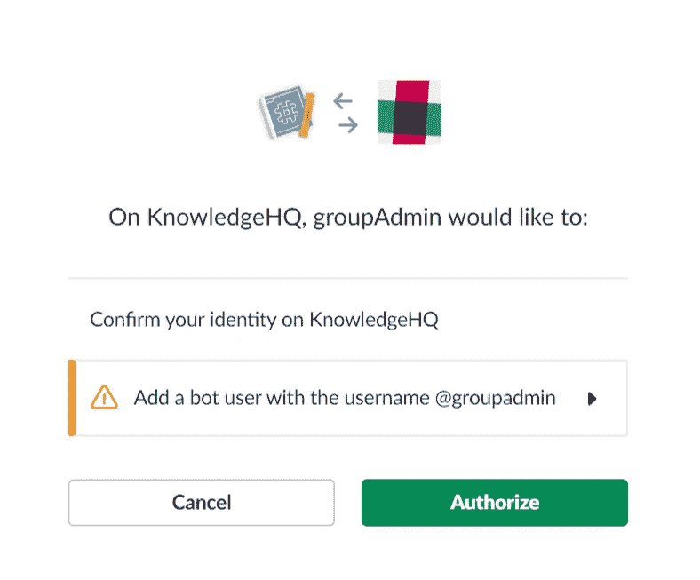

目前一切都好吗？现在，回到 OAuth & Permissions。您应该会看到以下两个令牌。这些非常重要，因此你要保密。

# 第 5 分钟:安装 Slackclient 并检查 API 调用是否有效

再次打开旧的命令提示符(希望它仍然保持打开)，转到 pip 文件所在的文件夹，键入以下内容:

*pip 安装 slackclient*

我们需要 SlackClient 连接到 Slack Bot。让我们看看它现在是否工作。复制 *Bot 用户 OAuth 访问令牌*并保存。现在，在命令提示符中键入 python，并进入 python 环境。

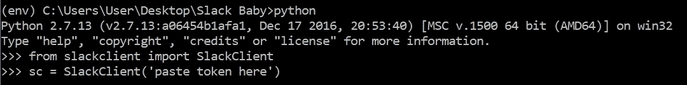

# 第 6 分钟:测试环境的时间

到目前为止，我们所做的只是设置环境。现在是时候编写实际的代码了。我希望您首先通过编写一段代码来测试您的环境是否工作正常，这段代码获取您的工作区中所有通道名称的列表，并在提示符中显示出来。使用以下代码:

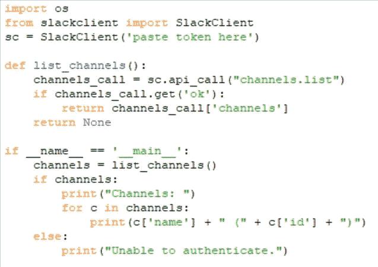

*(在下面评论以获得此代码+我的代码，稍后会出现)*

现在，在命令提示符下，键入:

*python filename.py*

它应该显示在工作区中所有频道名称的下方。作品？厉害！

# 第七分钟:方法一:使用丹·戈尔丁的代码

所以，我找到了丹·戈尔丁的[博客](http://dangoldin.com/2017/06/30/send-private-messages-to-all-members-of-a-slack-channel/)(非常感谢丹！)他已经写了一个可以完成这项工作的脚本。这里是他的 Github 代码。我将向您展示执行这项工作的两种方法。

首先，我们将使用丹的代码。接下来，我将展示我的代码。

所以，希望你已经下载了 Dan 的代码，并把它放在你一直使用到现在的文件夹中。

首先，我们需要安装 requirements.txt，在您的命令提示符下，通过键入 *exit()* 退出 python 环境。现在，键入:

*pip install-r requirements . txt*

它应该安装所有需要的软件包！

现在，在 [IDLE](https://en.wikipedia.org/wiki/IDLE) 中打开 spam_channel_members.py(或者您拥有的任何 python IDE ),并将您的令牌粘贴到该行中

*sh = SlackHelper('在此粘贴您的令牌')*

# **第 8 分钟:方法 2:使用我的代码**

现在，这是最后一部分。在提示符下键入以下内容:

*python spam _ channel _ members . py your _ test _ channel _ name your _ test _ message*

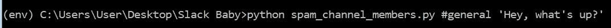

这应该有望成功！

因此，我写了一个代码来做同样的事情，这个代码更短，但可能不是最佳的。代码如下:

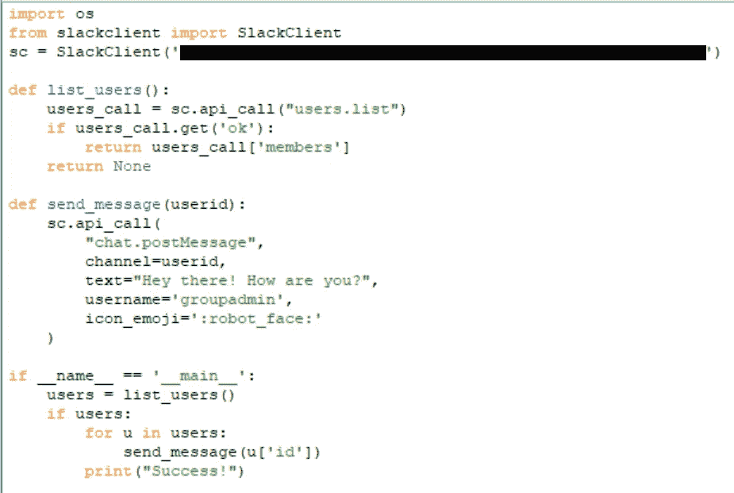

我基本上是使用 users.list API 调用获取工作区中的用户列表，从中提取成员字典，并使用 for 循环将消息发送给使用其 ID 的成员。这对我很有效，希望对你也一样。如果你需要上面的代码，请在下面推荐，我会发邮件给你！

在 Python 文件中准备好上述代码后，只需进入提示符并键入:

*python filename.py*

仅此而已！它应该有希望向你展示一个“成功！”消息，你应该已经给你工作区的每个人都发了一条消息。

*******************************************************************

所以希望这对你有用。这只是我上周做的一个小项目，我认为如果有人想做同样的事情，它会很有用。如果你在任何一步遇到错误， [Stackoverflow](https://stackoverflow.com/) 是你最好的朋友。我在每一步都有错误，并且花了我最长的时间来设置环境。最初，我试图使用 Stdlib 和 Node.js 来实现这一点，但是没有成功。巨蟒来救援了！

**这是我第一篇谈论技术概念的文章，我计划从现在开始做更多。我很想听听你对这篇文章是否清晰易懂的评论。谢谢你读到现在。欢呼:)**

*如果你觉得这很有趣，请关注我以获取更多文章。我是一个足够频繁的作家。这里是我的* [***个人博客***](http://poojabalasubramani.wordpress.com/) ***。***

*和我联系的最好方式是通过**[***insta gram***](https://www.instagram.com/thecuriousmaverick/)*和* [***脸书***](https://www.facebook.com/pooja.balasubramani?ref=bookmarks) *。我在那里分享了很多有趣的内容。想了解更多我的职业生活，可以查看我的*[***LinkedIn***](https://www.linkedin.com/in/soundarya-balasubramani/)*。快乐阅读！**