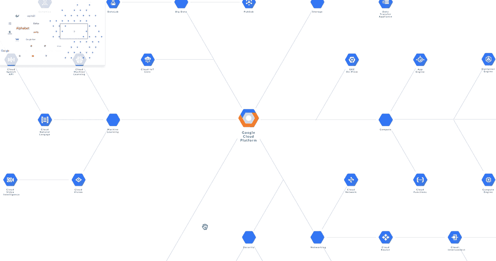
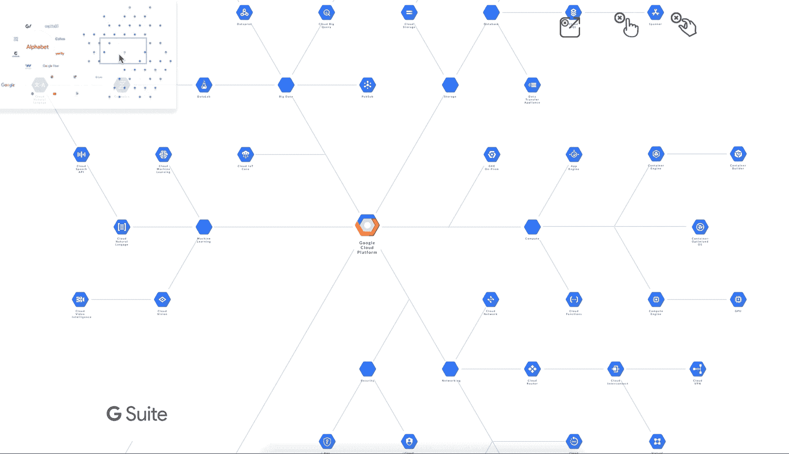

# 如何创建双向导航地图

> 原文：<https://medium.com/hackernoon/how-to-create-a-two-way-navigation-map-e96600a73cbd>

## 用普通 Javascript 创建交互式信息图(第三部分)

## 概述

本文是关于用普通 Javascript 创建交互式信息图的五部分系列文章。

以前，我们添加了导航功能来与内容进行交互。我们可以任意滚动、缩放、平移或拖动大画布。



Integrated usage (so far)

你注意到什么特别的事情了吗？有一个小地图可以响应用户的动作。这是怎么回事？

## 目标

我们将添加一个地图定位器来增强导航。

## 介绍

地图定位器对于探索大型画布非常有用。这是一个简单而有效的可视化工具，提供当前位置的持续更新。这个小工具也是展示交互组件之间主题关系的理想工具。

## 概念

地图定位器包括一个`miniMap`和一个`location indicator`。小地图是实际大小的`canvas`的缩小版。位置指示器是表示用户当前位置的图标或标记。

您可以通过两种方式使用地图定位器:

*   当访问者滚动/缩放/平移/拖动画布时，指示器会自动移动到新位置。您已经在之前的介绍/回顾演示视频中看到了这一点。
*   反过来，访问者也可以使用指示器本身与画布进行交互。您可以拖动指示器或点击任何区域来导航到任何新区域。



Navigate by mini-map: drag bracket, or, point-and-click

## 行动和反应的概念

回想一下第二部分的讨论，我们对 UI 有一个动作和反应的概念。简言之，鼠标上的**动作**会在 HTML 元素上产生相同的**反应**。例如，光标移动会导致画布移动相同的距离。这种镜像效果被测量为**鼠标增量值**。

我们将应用相同的概念来构建地图定位器。位置指示符的增量移动转化为更大画布上的新的相对滚动值。我们可以映射这两种方式来创建一个多功能的双向导航工具。

## 准备小地图容器

创建对`miniMap`容器的引用。它将停留在画布的顶部来引导导航。

```
var miniMap = document.getElementById( “miniMap” );
```

创建一个存在于`miniMap`容器中的引用`indicator`。

```
var indicator = document.getElementById( "indicator" );
```

使用任何方法来生成你的小地图。我们将走捷径，使用画布的缩小静态图像。

```

```

记得使用`z-index`设置正确的出现顺序。

## 使用指示器导航

添加一个事件监听器来捕获`indicator`的鼠标增量值，并更新`canvas`的新的相对滚动位置。

```
miniMap.addEventListener("mousedown", handlerIndicator, false);function handlerIndicator(event) {
    if (event.which == 1) {
        // formula
    }
}
```

该公式应根据相对鼠标增量值动态更新画布滚动值:

```
canvas.scrollTo( 
    ( canvas.scrollWidth * (event.clientX - boundingbox(0, 0, miniMap).x) / boundingbox(0, 0, miniMap).w ) - canvas.offsetWidth/2,
    (canvas.scrollHeight * (event.clientY - boundingbox(0, 0, miniMap).y) / boundingbox(0, 0, miniMap).h ) - canvas.offsetHeight/2 
);
```

*   `canvas.scrollTo`告诉浏览器在检测到`miniMap`上的`mousedown`事件时执行滚动。
*   `event.clientX`和`event.clientY`返回鼠标光标的 X 和 Y 坐标。这些值由浏览器引擎动态更新。
*   `scrollWidth`返回画布(即父容器)的宽度。
*   `event.clientX — boundingbox(0, 0, miniMap).x) / boundingbox(0, 0, miniMap).w`将指示器的相对移动转换到实际大小的画布上。
*   `canvas.offsetWidth/2`和`canvas.offsetHeight/2`初始化正确的滚动偏移值。

我们创造了一种单向导航设备。让我们使它成为双向的。

## 导航画布

创建一个事件监听器，以便每当在画布上检测到交互(即滚动/平移/拖动)时调用自定义函数`handler_mouseScroll`

```
canvas.addEventListener("scroll", handlerMouseScroll, false);function handlerMouseScroll(event) {

 *var* scrollpercentX = canvas.scrollLeft / canvas.scrollWidth; *var* scrollpercentY = canvas.scrollTop / canvas.scrollHeight; indicator.style.left = miniMap.offsetWidth * scrollpercentx
    + "px";
    indicator.style.top = miniMap.offsetHeight * scrollpercenty
    + "px";
    ...
}
```

*   `scrollpercentX`和`scrollpercentY`给出了用于计算小地图上相对滚动值的转换率。
*   `miniMap.offsetWidth`和`miniMap.offsetHeight`给出了小地图的尺寸。
*   `indicator.style.left`和`indicator.style.top`更新迷你地图上指示器的位置。

## 后续步骤

有了双向导航工具，游客可以探索一个大画布而不会迷失方向。我们可以创建复杂但易于使用的信息图表。

在下一篇文章中，我们将设计一个可以表示多方面内容的信息架构的 UI。

## 到其他部分的链接

第一部分为设计交互式信息图奠定了基础。

[**第二部分**增加浏览内容的导航功能。](/@PageiiStudio/how-to-create-a-navigation-ui-bac94a9e51fa)

第三部分→ *你来了。*

[**Part-four** 增加了一个内嵌 UI 来访问分层内容。](/@PageiiStudio/how-to-create-a-progressive-ui-to-enhance-presentation-cc42fe97360c)

第五部分展示了为什么创建有人情味的用户界面如此容易。

如果你喜欢这个故事，你可以在 [Pageii 工作室](https://pageii.com/story;title=How-to-create-a-two-way-navigation-map)找到更多。