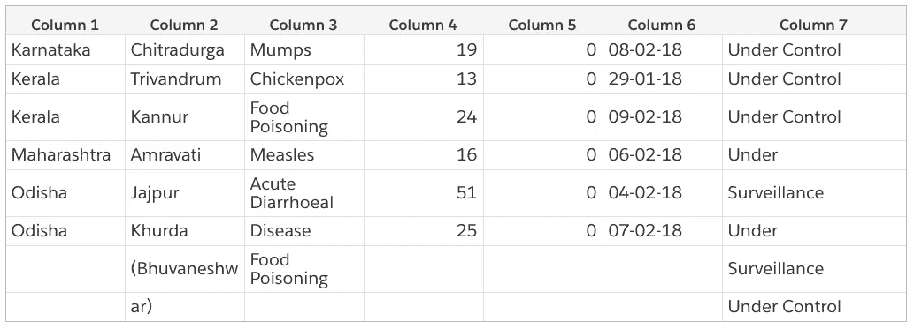
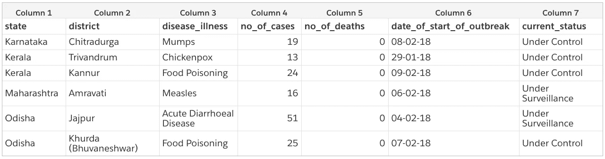

# 如何在 Apache Airflow 中创建工作流来跟踪印度的疾病爆发

> 原文：<https://medium.com/hackernoon/how-to-create-a-workflow-in-apache-airflow-to-track-disease-outbreaks-in-india-fd145575efa4>

> 我最初为 [SocialCops 工程博客](https://blog.socialcops.com/technology/data-science/apache-airflow-disease-outbreaks-india/)写了这篇文章。

听到“气流”这个词时，你首先想到的是什么？数据工程，对吧？我想这是有原因的。你很可能会在每一篇讨论数据工程的博客文章中发现气流。

[Apache Airflow](https://airflow.apache.org/) 是一个工作流管理平台。简单来说，你可以把它想成 cron，但是用了类固醇！它是由 Airbnb 的 Maxime Beauchemin 于 2014 年 10 月创办的。从第一次提交开始，Airflow 就是开源的。不到一年后，它被搬进了 Airbnb Github。从那时起，它已经成为数据工程生态系统中至关重要的一部分。

一年多来，我们一直使用气流在我们的内部系统之间移动数据，在此期间，我们创建了许多 ETL(提取-转换-加载)管道。在本帖中，我们将详细讨论其中一个管道，并向您展示设置步骤。

*注意:我们不会讨论如何设置气流。你可以看看千里眼* *的一个很棒的博客。*

# 为什么要用气流？

*   **依赖管理:**工作流可以定义为有向无环图(DAG)。Airflow 将确保定义的任务一个接一个地执行，管理任务之间的依赖关系。
*   **可扩展** : Airflow 提供了多种操作符，它们是工作流的构建块。PythonOperator 就是一个例子，您可以使用它来编写将作为工作流的一部分运行的自定义 Python 代码。
*   **可扩展** : Celery，这是一个分布式任务队列，可以作为一个执行器来扩展你的工作流的执行。
*   开源:它正在 Apache 软件基金会孵化，这意味着它被积极地维护着。

# IDSP:疾病数据来源

即使开放数据门户出现在多个领域，处理它们提供的数据集也很困难。在我们努力识别并帮助预防 T21 的疾病爆发时，我们遇到了一个如此困难的数据来源。

[卫生和家庭事务部](https://mohfw.gov.in/) (MHRD)运行着[综合疾病监测规划](http://www.idsp.nic.in/) (IDSP)计划，该计划在全印度的分区&村一级识别疾病暴发。根据这一计划，MHRD 以 PDF 文档的形式发布每周疫情数据。

众所周知，pdf 文件很难抓取并整合到数据科学工作流中，但只要看看 IDSP PDFs 文件就知道了。它们中的数据可能看起来是一种很好的表格格式，但是这些年来他们已经改变了表格格式，并且可能会继续这样做。我们还遇到了文档中的小故障，比如不同的表格被连接在一起，表格流出页面，甚至表格中的表格！

# 设置 ETL 管道

对于弄清楚我们的管道中涉及的步骤没有印象分。我们( **E** )从 IDSP 网站提取 pdf，( **T** )将 pdf 转换成 CSV 文件，然后( **L** )将这些 CSV 文件数据加载到一个存储中。

# 约定

让我们现在建立一些公约，因为没有秩序，无政府状态将接踵而至！每个有向无环图应该有一个唯一的标识符。我们可以使用一个 ID，它描述了我们的 DAG 正在做什么，再加上一个版本号。让我们将我们的 DAG 命名为 idsp_v1。

*注意:我们从* [*气流“常见陷阱”文档*](https://cwiki.apache.org/confluence/display/AIRFLOW/Common+Pitfalls) *中借用了这个命名约定。当您必须更改 DAG 的开始日期和计划间隔，同时保留旧版本的计划历史时，它会很方便。请务必查看此链接，了解其他常见的陷阱。*

我们还将定义一个基本目录，用于保存所有 DagRuns 中的数据。你会问，DagRun 是什么？它只是你的 DAG 在时间上的一个实例。我们还将为每个 DagRun 创建一个新目录。

这里有一个 requirements.txt 文件，您可以用它来安装依赖项。

# 如何 DAG

在 Airflow 中，dag 被定义为 Python 文件。它们必须放置在`dag_folder`内，这可以在气流配置文件中定义。基于我们上面定义的 ETL 步骤，让我们创建我们的 DAG。

我们将使用气流 PythonOperator 定义三个任务。您需要使用`python_callable`关键字参数将包含任务逻辑的 Python 函数传递给每个操作符。现在在一个 **utils.py** 文件中将这些定义为虚拟函数。我们稍后会逐一介绍。

我们还将使用`set_downstream`方法将它们链接在一起。这将定义我们的任务执行的顺序。请注意，我们还没有定义将在任务内部运行的逻辑，但是我们的 DAG 已经准备好运行了！

看看 DAG 文件。我们已经将`schedule_interval`设置为`0 0 * * 2`。是的，你猜对了——这是一个 cron 字符串。这意味着我们的 DAG 将在每周二上午 12 点运行。气流调度可能有点混乱，所以我们建议你查看[气流文档](https://airflow.apache.org/scheduler.html#scheduling-triggers)以了解它是如何工作的。

我们还将`provide_context`设置为`True`，因为我们希望气流通过 DagRun 的上下文(想想元数据，比如 dag_id、execution_date 等。)作为关键字参数添加到我们的任务函数中。

*注意:我们将使用来自上下文的 execution_date(这是一个 Python datetime 对象)将气流传递到我们的函数中，以创建一个新的目录，就像我们上面讨论的那样，来存储 DagRun 的数据。*

此时，您可以通过在命令行上执行`airflow trigger_dag idsp_v1`来创建 DAG 运行。确保在创建 DagRun 之前转到 Airflow UI 并取消暂停 DAG。DagRun 应该是成功的，因为我们的任务只是虚拟函数。

现在我们已经准备好了 DAG 文件，让我们看看将在我们的任务中运行的逻辑。

*注意:在传递给 PythonOperator 的函数中，打印到标准输出* *的所有内容都可以在 Airflow UI 上看到。只需在相应运营商的 DAG 节点中单击查看日志。*

# 抓取 IDSP 网站

IDSP 网站几乎每周都会发布一份新的 PDF 文档(有些滞后)。我们不能每次发布一个新的 pdf 文件就把所有的 pdf 文件都删掉。相反，我们将不得不保存我们最后刮到的 PDF 的周数。

我们可以在每个 DagRun 结束时将此状态存储在基本目录中的 CSV 文件中，并在另一个 Dag run 开始时引用它。看一下刮码。这里没有什么新奇的东西，只是使用*请求*和 *lxml* 的普通 web 抓取。

*注意:在生产中，我们不运行气流内部的刮码。它运行在一个单独的服务上，除了运行这些刮刀之外，该服务还可以连接到 REST/SOAP API 来提取数据。这为我们提供了一个中心位置来安排和跟踪数据是如何被拉入我们的平台的。任务逻辑被替换为对数据导出服务的调用。*

# 抓取 pdf

耶！既然我们有了新的 pdf，我们就可以着手清理它们了。我们将使用 *pdfminer* 来完成这项工作。

但是首先，让我指出 PDF 是表格数据最差的格式。PDF 包含 PDF 查看者在 2D 平面的特定 X，Y 坐标上以所需字体放置文本的说明。如果我们只需要从 PDF 中获取文本，这没有关系，但是如果我们需要完整地获取表格结构的表格数据，这就变得很困难。我们在这里使用一个简单的试探法来获取这些数据。

首先，我们使用 *pdfminer* 提取所有文本对象。一个文本对象包含一个字符串和一个浮点坐标元组，它描述了字符串的位置。然后，我们按照 X 和 Y 递增的顺序对所有这些对象进行排序。现在，从最后一行开始，所有这些文本对象都是以行为主的格式。我们可以根据它们在 x 轴上的投影将它们分组到不同的列中，从而丢弃跨越多列的任何对象。我们可以删除第一列和最后一列，因为它们在这篇文章中没有任何用处。

瞧，我们有桌子了！它仍然不能使用，但需要一些小清洗。我们把这个作为练习留给你。很容易在代码中定义一些规则来将上面的 CSV 转换成更干净的东西，如下所示。

您可以将这个清理代码添加为另一个 PythonOperator 或同一个`scrape_pdf`操作符。如果您不习惯使用 Python，而是想使用 R，那么您可以使用 BashOperator 来调用您的 R 脚本。扩展性 FTW！

*注意:使用单一工具很难在所有类型的 PDF 上获得 100%的表格刮擦准确性。我们可以用各种试探法来解决问题，希望得到最好的结果。通常需要清洁步骤。*

*当我们在准备 IDSP 数据集的过程中，使用所有以前年份的 pdf 时，我们找不到任何可以解决这个问题的工具/库。我们尝试了很多开源工具像* [*Tabula*](https://tabula.technology/) *，以及闭源工具像*[*pdf tables*](https://pdftables.com/)*都没有成功。*

*这让我们开发了自己的库，它使用图像识别和一系列试探法来尝试解决 PDF 表格抓取问题。它在许多 PDF 类型上给了我们一个可接受的刮擦精度，包括 IDSP 类型。一旦我们将它插入到我们的数据清理产品中，* [*转换*](https://socialcops.com/transform/) *，我们最终可以将 PDF 数据转换成完全干净的 CSV 格式。*

***更新(2018 年 10 月 5 日):*** *我们发布了* [*Camelot，一个帮助任何人从 pdf*](https://blog.socialcops.com/technology/engineering/camelot-python-library-pdf-data/)*中提取表格数据的 Python 库。你可以在这个* [*Jupyter 笔记本中找到这篇博文中提供的使用 Camelot 的代码版本。*](https://gist.github.com/vinayak-mehta/e5949f7c2410a0e12f25d3682dc9e873)

# 管理收集的数据

现在我们有了一个干净的 CSV，我们可以将它添加到我们的主 IDSP 数据集。该操作符只包含一个 for 循环，它将页面 CSV 追加到我们的主 CSV 数据集。我们可以在这里使用 [pandas](https://pandas.pydata.org/) ,但是我们不想仅仅为这个 append 添加另一个需求。

在内部，我们的 ETL 管道并没有就此停止。我们通过实体识别系统传递之前删除的“评论”栏中的文本，这为我们提供了疫情发生的地理位置列表。然后，这将用于向我们的团队和客户发送警报。

# 从这里你能去哪里？

恭喜你。你有一个定期更新的疾病爆发数据集！现在该由你来决定如何使用它了。*咳嗽*预测分析*咳嗽。*你可以替换刮码从其他任何网站刮数据，写到 run 目录，插上 PDF 刮算子(如果你刮的数据是 PDF 格式的)，或者插上一堆自己的算子做任何事情。

你可以在这里找到这个练习[的完整代码报告。](https://github.com/socialcopsdev/airflow_blog)

如果你真的扩展了这条 DAG，请发[微博给我们](https://twitter.com/social_cops)。我们很想听听你做了什么！

抓住数据！