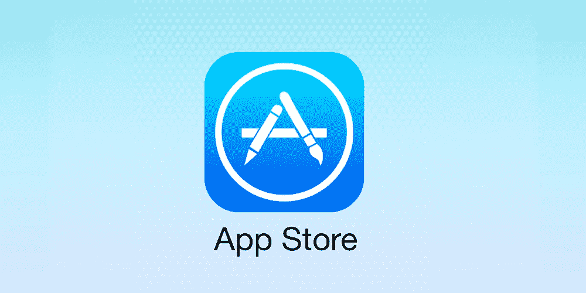
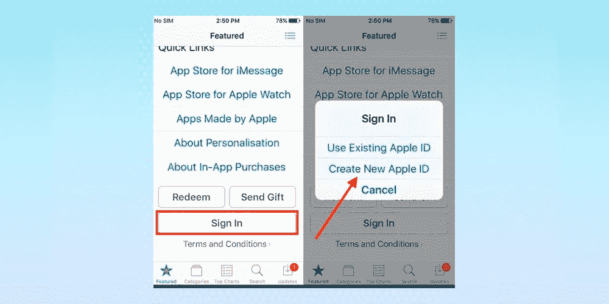
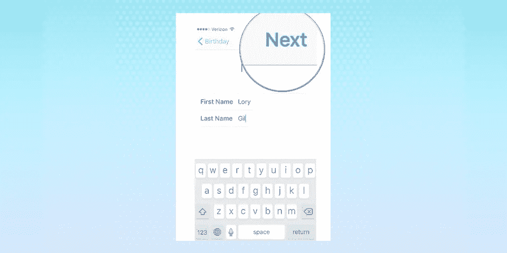
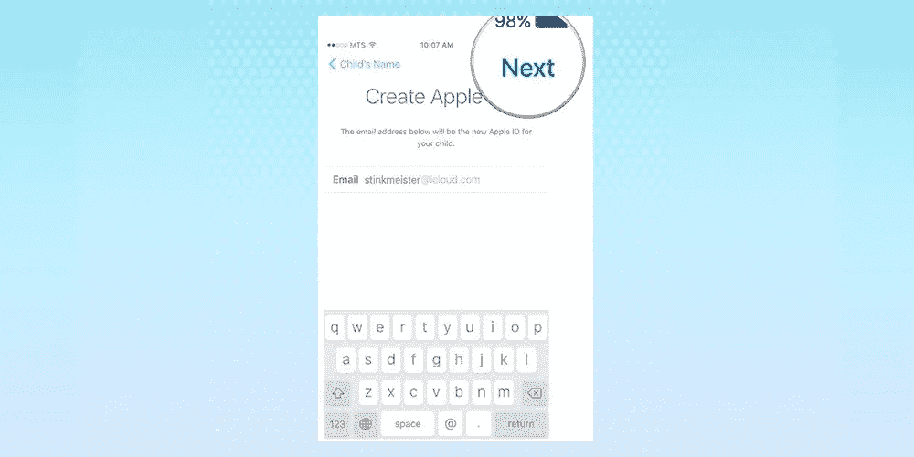
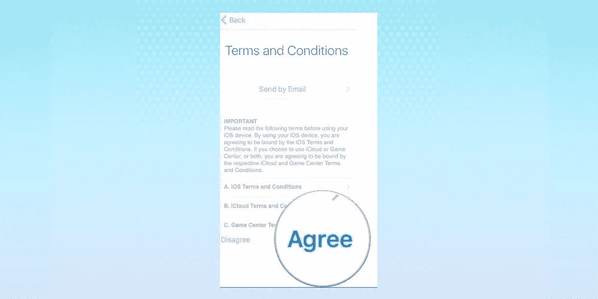
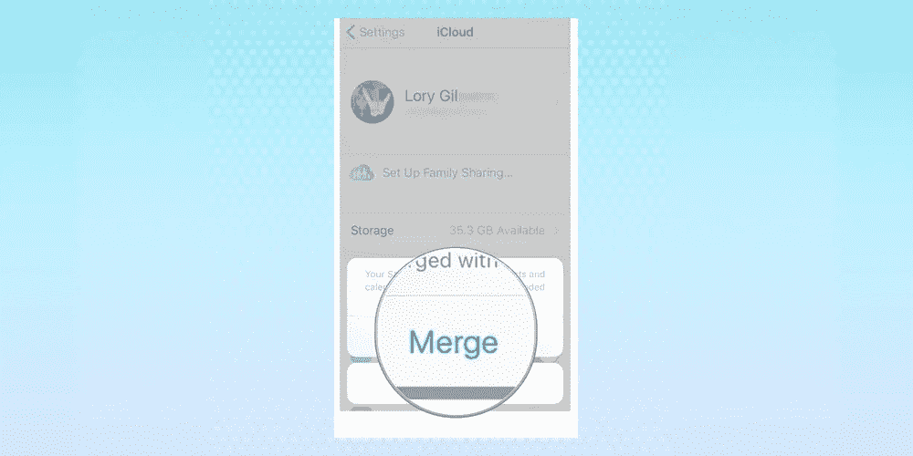
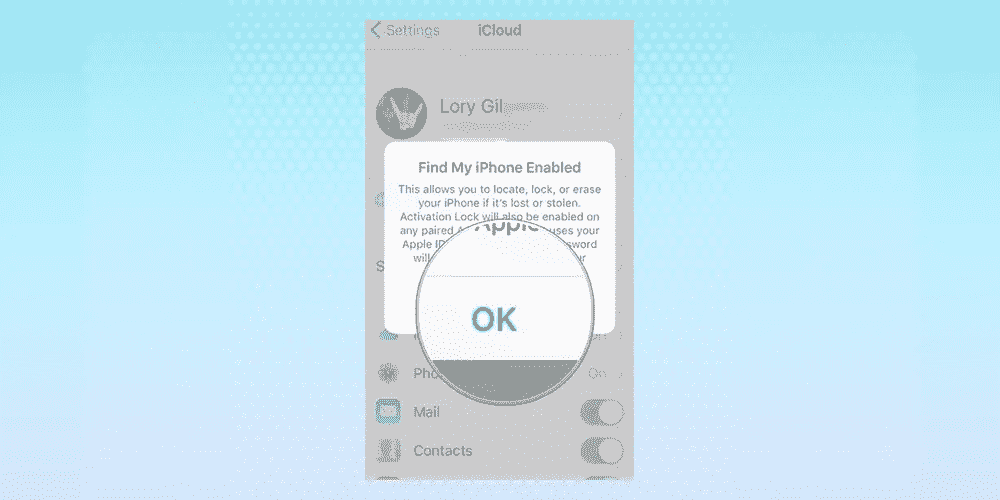

# 如何在 Apple Store 上创建帐户

> 原文：<https://medium.com/hackernoon/how-to-create-an-account-on-apple-store-a5399c6f95b3>

最近宣布苹果公司的价值超过一万亿美元。这比几乎所有你喜欢的公司加起来都要多。因此，苹果产品的用户在增加也就不足为奇了。从花哨的 iPhone 到时尚的 iPad，还有 MacBook 和智能手表。我们正处于数字时代，苹果正在引领这场革命。

考虑到所有这些，每个人都有一个问题是“如何在 Apple store 上创建帐户？”商店里摆满了许多有趣的产品；移动应用程序、歌曲、视频等。在商店(iTunes Store、App Store、Apple Music、Apple News、iBooks Store)上也可以做很多事情，所有这些都可以通过一个 Apple ID 来完成。

好了，现在我们需要分解它。

# Apple ID 是什么？

为了访问任何形式的数字存储库，我们需要一种安全和身份识别的账户形式。想想你的银行账户，你的电子邮件账户，甚至你的脸书账户。内容是完全个性化的，你可以享受你订阅或付费的服务。苹果账户也是如此。但是这个苹果账户被称为苹果 ID。

您的 Apple ID 被定义为用于访问 Apple 服务(如 iTunes Store、App Store、iBooks Store、iCloud、iMessage、Apple News、Podcasts 等)的帐户。您使用唯一的电子邮件地址和密码访问该帐户，这将允许您访问所有您喜欢的服务。

这个 Apple ID 还允许您从任何您想要的 Apple Store 购买和下载内容。如前所述，您只需要一个 ID 就可以访问所有服务。这意味着，如果您已经使用 Apple ID 访问了 iCloud，您可以使用同一个 ID 从 iTunes 购买歌曲。

# 创建 Apple ID 需要什么

尝试安装新设备或首次登录 iTunes 或 iCloud 的用户需要创建一个 Apple ID。如果你之前访问过这些服务，那么很可能你已经有了一个苹果 ID。

要创建一个，这里是你需要的基本要素。

1.  您经常使用的有效电子邮件地址。这将作为您的用户名。
2.  被认为是强密码。强密码的要求见[这里](https://support.apple.com/kb/HT201303)。
3.  你的出生日期
4.  三个安全问题的易记答案和一个救援电子邮件地址。如果您不使用双因素鉴定，这将用于验证您的身份并取回您的 Apple ID。如果您忘记了密码，这也是必需的。

# 如何在 iPhone 或 iPad 上创建新的 Apple ID

首先要做的是启动手机上的设置。从这里，点击屏幕顶部的“登录到您的 iPhone”按钮。

然后你会看到这样一段话，“没有苹果 ID 或者忘记了？”点击这个，然后当弹出一个窗口让你创建一个新的苹果 ID 时，点击“创建苹果 ID”。

在提供的空白处，输入您的出生日期，然后单击下一步。

系统会询问您的名字和姓氏，然后您还应该单击“下一步”。

然后会要求您选择现有的电子邮件地址。您还可以选择获取新的 iCloud 电子邮件。无论您选择哪一个，都会要求您创建并验证该帐户的密码。

之后，您选择一个安全问题，提供一个答案，然后重复两个以上的答案。

议程上的下一步是阅读和审查条款和条件。做完这个，你就同意了。

您可以合并或选择不合并来同步日历、通讯录和提醒事项中的 iCloud 数据。

最后一件事；确认“查找我的 iPhone 已打开”。只需点击确定按钮。

瞧，你可以走了！

# 如何管理您的 Apple ID

既然您已经成功设置了 Apple ID，那么正确管理它以避免可能出现的任何复杂情况就很重要了。您还需要定期登录您的 Apple ID 帐户页面并更新现有信息，以便帮助 Apple 更好地为您服务。

我们可以将管理 Apple ID 的一些技巧总结为 6 个要点。

1.  更新您的 Apple ID 电子邮件地址，并确保提供的电子邮件是您经常使用的电子邮件。
2.  每当您觉得您的帐户受到威胁时，请尝试更改您的密码。
3.  更新您的付款信息，并填写正确的付款方式和帐单地址。
4.  如果您有其他经常使用的电子邮件地址，请将其添加到您的 Apple ID。这将有助于更轻松地交流，朋友可以在 FaceTime、iMessage 等网站上找到你。
5.  定期检查您在 Apple ID 上登录的设备。
6.  确保您的验证电话号码是最新的。

# 您有现有的 Apple ID 吗？

如果您有一个现有的 ID，并且需要创建另一个，您应该记住，您可能无法将数据或购买历史从以前的帐户移动到新帐户。如果你不是很确定，你想确认你有一个苹果 ID，你可以在这里检查一下。

即使您创建第一个 Apple ID 时使用的原始电子邮件地址有问题，您仍然可以使用您的手机号码登录 Apple ID。请注意，这仅适用于印度和中国。

在当今世界，创建一个苹果 ID 更像是一种必需品，而不是奢侈品。它为你打开了如此多的机会，也给了你渴望的舒适。你应该庆幸自己学到了这宝贵的一课。

[由乔治·楚克利撰写](https://www.linkedin.com/in/chukhley-george-966961108/)