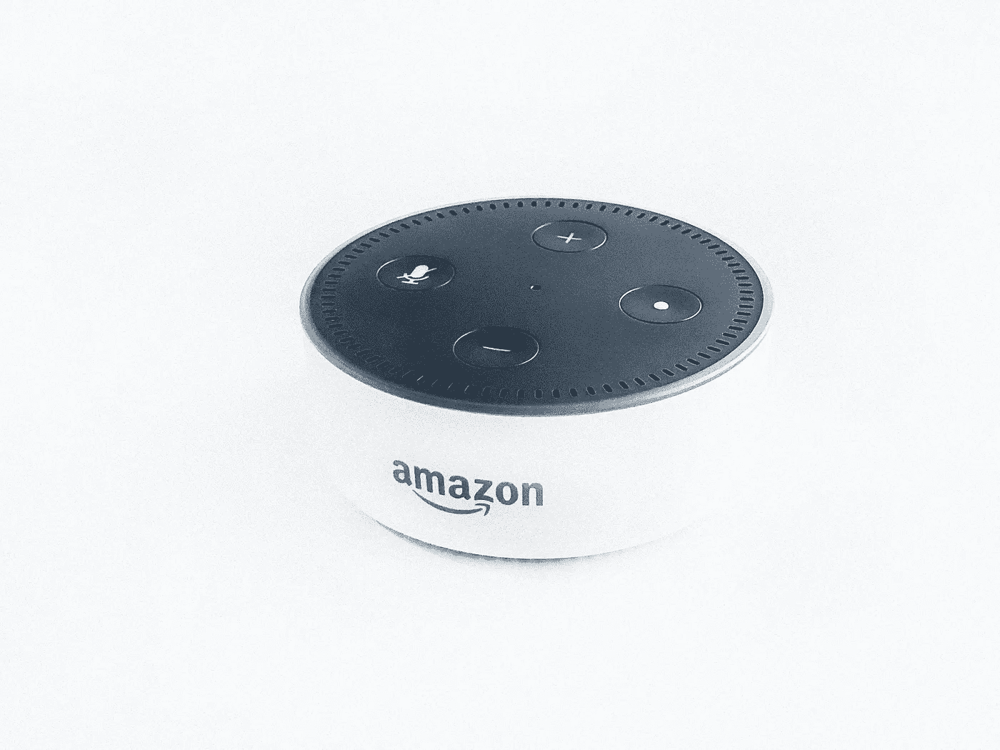
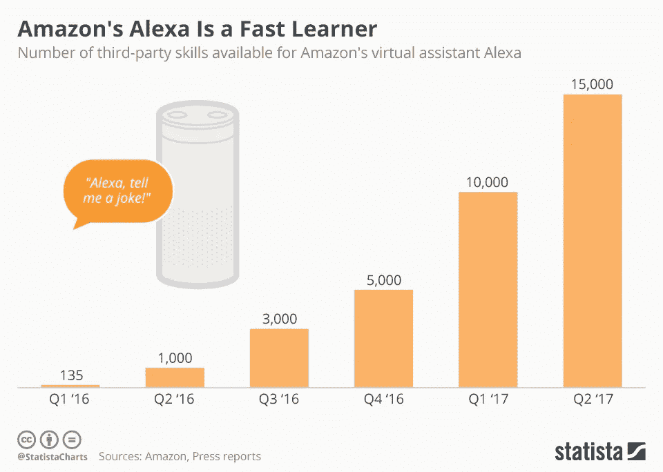
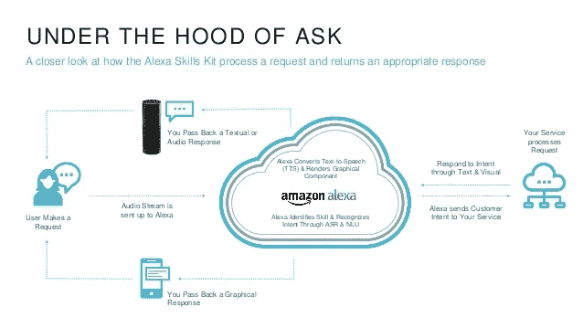
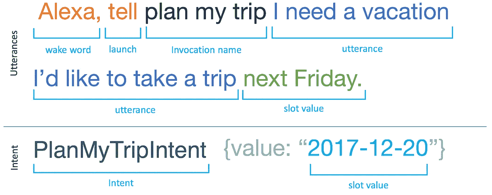

# 如何为你的小企业创建一个 Alexa 技能？

> 原文：<https://medium.com/hackernoon/how-to-create-an-alexa-skill-for-your-small-business-366a1cd190c8>

声控虚拟助理和人工智能正在改变人们在现代家庭中互动和使用技术的方式。截至 2017 年 5 月，[1000 多万台](https://www.geekwire.com/2017/amazon-passes-10m-alexa-powered-echo-devices-sold-survey-says-with-more-models-on-the-way/)支持 Alexa 的设备在世界各地销售。专家已经预测，到 2020 年，Alexa 和其他语音助手将成为一个价值 100 亿美元的[产业，因为未来超过 30%的智能设备交互将基于语音。](https://www.cnbc.com/2017/03/10/amazon-alexa-voice-assistan-could-be-a-10-billion-mega-hit-by-2020-research.html)

Source: [Statista](https://www.statista.com/chart/8304/alexa-skills/)

这种过渡场景对您的小型企业意味着什么？随着 Alexa 技能市场目前充斥着应用程序，你如何利用这项技术为你的商业利益？

Alexa 不仅扰乱了人们在家中使用技术的方式，商界也在寻求简化办公室常见任务的线索。鉴于市场上技能数量的巨大飞跃，你需要迅速投资为你的企业建立一项 Alexa 技能。

# **通过 Alexa Skill 增强你的业务**

亚马逊的 Alexa 不仅仅是一个家常助手。它可以帮助您以绝对的效率管理办公室或企业中的多项任务。全球各地的企业都在展示 Alexa 等智能助理如何高效地将传统办公室转变为智能办公室。最近， [Financialforce](https://www.financialforce.com/blog/amazon-echo-meet-financialforce-erp/) 展示了如何在他们的 ERP 中使用 Alexa 技能，通过语音使用 Alexa 获取重要的业务报告。

就像 Financialforce 一样，企业家正在他们的常规工作环境中检查 Alexa 的应用程序。虽然有些人正在使用 Alexa 将会议添加到谷歌日历中，发布消息和添加任务，但其他人正在转向在商业环境中更复杂地使用 Alexa。

*   **创建/更新待办事项列表&跟踪任务**

Alexa 可以通过语音命令来更新待办事项列表。企业家和专业人士可以使用 Alexa 在日历上安排一个项目，或者创建一个待办事项列表，可以通过移动或计算机上的 Alexa 应用程序轻松访问。使用语音激活的命令，你可以请求 Alexa 创建一个提醒。例如，一个小命令，如 Alexa 将 3:00 与 ABC 先生的会议添加到日历中，将提示 Alexa 将相同的内容添加到您的日历中，并在正确的时间之前通知您。

*   **创建&跟踪旅行路线**

Alexa 可以为经常乘坐飞机的公司简化商务旅行。使用 Alexa 技能，员工和企业主可以计划商务旅行，预订机票，获得航班延误和取消的警报，技能定制可以包括更多功能，如座位地图，天气更新，驾驶方向等。完全掌控旅行体验。

*   **智能库存管理**

Alexa skill 可以用来智能管理库存。借助您企业中的声控库存管理系统，您可以随时随地轻松访问库存数据，而无需摆弄复杂的软件或电子表格。

拥有超过 20，000 个 Alexa 直播技能，目前来看，可能性和商业应用是无穷无尽的。但是为了利用 Alexa 平台，你需要通过理解平台和遵循结构化的过程来发展正确的 Alexa 技能。让我们看看你如何为你的小企业发展 Alexa 技能。

# **Alexa 技能处理架构**

Source: [SlideShare](https://www.slideshare.net/AmazonWebServices/creating-iot-solutions-with-serverless-architecture-alexa)

# **为你的企业开发 Alexa 技能**

如果你热衷于利用 Alexa 的全部潜力，你将被要求根据你的定制业务需求开发一项技能。您可以考虑自动化流程、简化结构或改善访问。一个伟大的 Alexa 技能的关键是简单和创新。一旦您确定了需要语音辅助支持的核心业务领域，您将必须遵循以下步骤来创建 Alexa 技能:

*   **为 Alexa 技能设计语音用户界面**

创建 Alexa 技能最重要的一步是设计一个直观的语音用户界面。这就是普通用户，员工和其他人如何激活 Alexa 使用技能。为了设计一个合适的界面，你必须创建一个流程图来定义用户交互的路径。

该流程图将帮助您识别各种类型的用户请求。被识别的用户请求将成为*意图。*意图是 Alexa 为满足用户请求而需要执行的动作。

Source: [Amazon](https://developer.amazon.com/designing-for-voice/what-users-say/)

*   **开始在开发者控制台中创建技能**

在亚马逊开发者控制台的帮助下，你可以开始培养你的技能。你将被要求为你的 Alexa 技能定义技能的名称，支持的语言和交互模型。

由于您正在为自己独特的商业理念从头开始培养技能，因此在出现提示时选择自定义交互模式。在自定义模型中，您可以定义您的技能可以处理的请求，以及触发该技能的示例话语。

*   **配置语音设计，创建您的交互模型**

你的交互模型将定义技能如何回应用户。它基本上由意图、示例话语和对话模式的集合组成。如前所述，意图是您的技能可以处理的请求，即基本功能。示例话语是用户用来表达意图的单词和短语。

对话模型将识别完成请求所需的信息，以及 Alexa 在与用户交互时可以用来收集和确认相同信息的对话。

*   为你的技能编写代码

Alexa 技能编码的基本前提是完成接受用户请求并发回适当响应的任务。要开始编码，您可以使用 AWS Lambda 运行代码，而不必管理服务器。

如果你打算使用 AWS Lambda，使用 Node.js、Java、Python 或 C#写下基本代码。如果您想将您的技能作为 web 服务，您甚至可以使用其他编程语言。该代码应该能够处理用户请求，实现内置的意图，理解帐户链接，访问 Alexa 购物和待办事项清单，以执行所需的任务。

完成编码后，在 Alexa 测试页面或使用支持 Alexa 的设备测试你的技能。在进行测试之前，不要忘记在开发人员控制台中更新您的技能端点。

一旦你完成了测试，添加关于你的技能的元数据，它将出现在 Alexa 技能商店中。

*   **进行测试**

一旦一切都完成了，你就可以邀请 beta 测试人员在正式发布前检查和测试你的技能。您可以选择 beta 测试人员，也可以邀请普通公众中的任何人。测试是完全可选的，但将使您能够收集反馈，这将有助于提高您的 Alexa 技能。

*   **提交你的 Alexa 技能认证**

当你完成了这个过程，并准备为用户推出你的 Alexa 技能后，你应该提交它进行认证。即使你的测试没有完成，你也可以提交你的技能。在提交之前，您应该运行开发人员控制台的认证页面上列出的所有功能和验证测试。

确保您遵守提交清单，以加快认证过程。当你对自己的 Alexa 技能足够自信后，提交给亚马逊进行认证。Amazon 批准您的技能后，用户可以查看、启用和使用该技能来完成任务。

# 下一步

为企业创造 Alexa 技能可以简化常见任务，甚至提高组织内部的整体效率。如果你发现开发定制 Alexa 技能的过程令人困惑，你可以随时[寻求专业 Alexa 技能开发者的帮助](https://www.intuz.com/contactus?utm_source=Medium&utm_medium=Hackernoon_Alexa&utm_campaign=HackerNoon_AlexaSkill)。我们在 [Intuz](https://www.intuz.com/?utm_source=Medium&utm_medium=Hackernoon_Alexa&utm_campaign=HackerNoon_AlexaSkill) 通过可靠的 Alexa 技能开发服务，不断颠覆基于语音的搜索生态系统。我们的专家可以创建可靠的 Alexa 技能，您可以将这些技能用于您的业务，以提高运营和员工参与度。