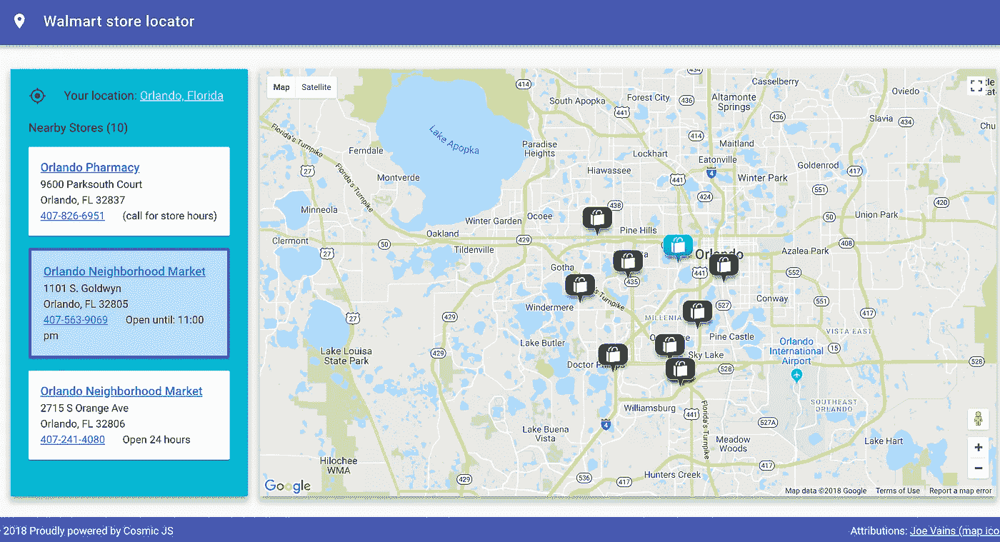
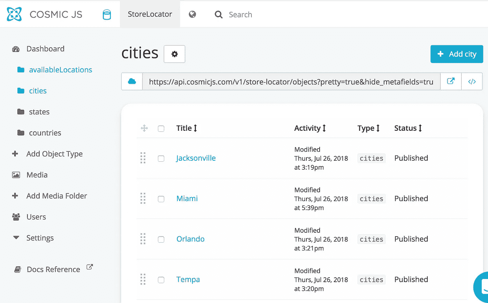
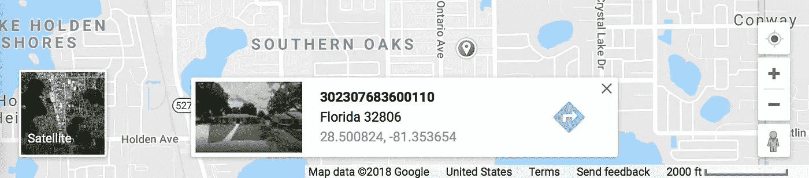

# 如何使用 Vuejs、Cosmic JS 和 Google Maps 创建商店定位器应用程序？

> 原文：<https://medium.com/hackernoon/how-to-create-an-awesome-store-locator-app-using-vuejs-cosmic-js-and-google-maps-d813b3c4d157>



store locator app build using Vue, Cosmic JS, and Google Maps

TL；博士:

[演示](http://store-locator.cosmicapp.co/#/)

[源代码(github)](https://github.com/mtermoul/vuejs-store-locator)

[宇宙 JS 后端功能](https://cosmicjs.github.io/rest-api-docs/)

[谷歌地图 javascript API](https://developers.google.com/maps/documentation/javascript/tutorial)

[Vue js 和 vuex](/codingthesmartway-com-blog/vue-js-2-state-management-with-vuex-introduction-db26cb495113)

[Vue-googlemaps](https://github.com/Akryum/vue-googlemaps)

## 介绍

这个小应用程序可以让用户搜索和定位你的商店。如果商店与你的业务无关，你可以用它来定位你的办公室、分支机构、仓库…或者任何你的业务。要做到这一点，您需要定义一个用户可以找到并定位的位置列表。

## 后端

使用 Cosmic JS 可以节省你很多时间，因为它允许你存储你的数据，并且不需要任何额外的编码就可以准备好一个 REST api。出于这个应用的目的，我使用了 Cosmic JS 的以下功能:

*   Bucket 对象:在后端存储数据，比如城市、州，这些地方有可用的存储。
*   桶媒体:存储应用图像和谷歌地图图标。将数据和媒体存储在一个地方非常方便。
*   虚拟主机:我使用了 Cosmic JS 来托管我的应用程序，但是你也可以使用 Cosmic JS 将你的应用程序部署到其他托管服务中。



Cosmic JS dashboard — adding cities where your store is available

## 启动您的 vue 应用程序

安装 vue-cli 后，您可以运行以下命令开始构建您的应用程序

```
$ npm install -g vue-cli
$ vue init webpack store-locator
$ cd store-locator
$ npm install
$ npm install --save vuex vuetify vue-router vue-resource vue-googlemaps cosmicjs moment
$ npm run dev
```

vue 应用程序将有两个主要组件:

*   允许用户选择一个城市，并获得一个商店列表
*   MapPanel.vue:为每个商店显示带有标记的对应地图

你可以用 [vuetify](https://vuetifyjs.com/en/layout/pre-defined) grid system 轻松构建应用布局，不需要写很多 css。

## 使用 Vuex 和 Cosmic JS 添加状态管理

store-locator/src/store/index.js

创建应用程序时，我们需要调用 Cosmic JS rest api 来获取将在搜索中使用的城市。所以在下面的代码中有两件事值得一提。首先，我们用从 [google api 控制台](https://console.cloud.google.com/apis/dashboard)提供的`GOOGLE_API_KEY`初始化 VueGoogleMaps 组件。其次，我们调用`this.$store.dispatch('fetchCities')`来填充 vuex 存储文件上的`availableLocations`。我们还可以调用`this.$store.dispatch('fetchStoreCardImages')`，它将调用 Cosmic JS REST api 来获取存储在媒体文件夹中的所有图像。

store-locator/src/main.js

这是配置 Cosmic JS REST API 要调用的代码。注册后，您可以读取 Api，编写密钥，并添加您的 Bucket。

store-locator/src/api/config.js

存储桶是应用程序中所有数据、文件和图像的根容器。

store-locator/src/api/cosmic.js

在下面的代码中，您可以在`fetchCities`动作中看到，我们调用了 Cosmic JS api 来选择所有类型为 cities 的对象，并遍历结果数组，创建另一个对象来填充 store `availableLocations`变量，该变量将在 SearchPanel 组件中使用，以显示可用位置的列表。

store-locator/src/store/index.js

同样以非常相似的方式，我们可以调用 Cosmic JS REST Api 来获取图像，并使用`Cosmic.getMedia(...)`将它们存储在 Vuex 存储中

store-locator/src/store/index.js

## 将谷歌地图添加到您的 vue 应用程序中

为了显示地图，我使用了 [vue-googlemaps](https://github.com/Akryum/vue-googlemaps) 组件，这是一个易于使用的 vue 组件，就像是[Google Maps Javascript API](https://developers.google.com/maps/documentation/javascript/tutorial)的包装器。为了绘制地图，您需要提供一个特定位置的地理编码`mapCenter`点。例如奥兰多市中心有以下地理位置`{latitude: 30.325974,longitude: -81.660454}`。此外，要在地图上绘制表示商店或特殊位置的标记，您需要地理点、标题和图标。为了这个应用程序的目的，我存储了不同城市的地理位置，并存储在 Cosmic JS 后端。

你可能会问，我如何获得我的家庭地址或工作办公室的地理位置。有几种服务可以将常规地址转换成地理位置，反之亦然。但最简单的方法，是打开[谷歌地图](https://www.google.com/maps)，点击地图上的任意一点。然后你会在底部看到那个位置的地理点。



Google maps showing a geolocation of selected point

下面是应用程序启动时绘制地图的代码

store-locator/src/components/MapPanel.vue

在`MapPanel` vue 组件中，我们使用`vue-googlemaps`来显示谷歌地图。我们所能提供的就是`mapCenter, zoom, mapMarkers`。我们有几个观察者来更新地图。首先是当用户从`SearchPanel`中选择新城市时触发的`selectedLocation`。我们还在等待`stores`用标记填充地图，标记为该位置的每个商店显示一个小图标。我们也在等待`selectedStore`高亮显示相应的地图标记。这就是我们更新地图视图的方式

最后，我们只需要在地图上添加几个事件。第一个事件`onMapMarkerClick`使标记图标高亮显示，并使相应的商店在搜索窗格上被选中。`onMapMarkerMouseOver`添加一点动画，让图标上下跳动。

## 构建和部署

在您构建并测试您的应用程序之后，您需要将`.env`文件添加到您的根文件夹中，以进行您的应用程序配置，如下所示。

```
GOOGLE_API_KEY=PASTE-YOUR-API-KEY-HERE
COSMIC_BUCKET=store-locator
COSMIC_READ_KEY=PASTE-YOUR-API-KEY-HERE
COSMIC_WRITE_KEY=PASTE-YOUR-API-KEY-HERE
PORT=5000
```

您还需要将`start`命令添加到`package.json`脚本中，这将被 Cosmic JS 主机用来启动您的应用服务器。一旦更新了 Api 键，就可以使用以下命令构建并部署到 Cosmic JS

```
$ # to run you app on dev mode
$ npm run dev
$ # to test your production server mode
$ npm run start
$ # to build your application before deployment
$ npm run build
$ # commit all changes to github
$ git add .
$ git commit -m 'Before deployment'
$ git push
```

现在，您可以直接进入 Cosmic JS web hosting，按照说明部署您的应用程序。

## 结论

将谷歌地图添加到您的应用程序中是增强用户体验的有趣且简单的方法。在这个应用程序中使用 Vue.js 也节省了大量时间。然而，有了 Cosmic JS，我就可以在没有额外编码的情况下使用服务器 Rest Api 实现完整的堆栈应用程序。我认为 Cosmic JS 是一个很好的云平台，可以在不需要额外编码的情况下促进你的开发。

## 我很想收到你的来信

最后，我鼓励你浏览一下[源代码](https://github.com/mtermoul/vuejs-store-locator)，试试这个应用程序，如果你有任何问题或评论，请告诉我。

不断创造令人惊叹的应用程序。

干杯。