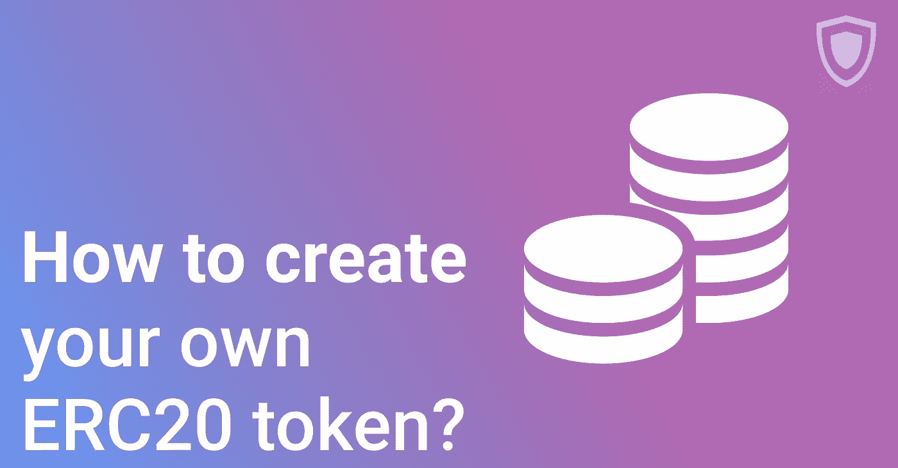

# 如何创建 ERC20 令牌？

> 原文：<https://medium.com/hackernoon/how-to-create-an-erc20-token-b9e935353ac>

**风靡市场的加密货币代币**
加密货币代币正以相当快的速度进入市场。然而，并不是每个人都清楚令牌到底代表什么以及它们是如何工作的。为此，我们想对 ERC20(可以说是最受欢迎的加密货币令牌类型)进行一些介绍，并提到一些可能有助于您部署自己的令牌的服务。

**什么是 ERC20 令牌？**
ERC 20 令牌是在以太坊区块链上使用的加密货币令牌。为了更好地理解这一切意味着什么，让我们更深入地挖掘细节。
首先，以太坊是一个去中心化的网络，用于创建和运行去中心化的应用程序(又名 DApps)。DApps 是利用其技术在上述区块链上建造的。以太坊也有 DApps 的额外津贴——他们向以太网(ETH)的开发者收取电脑用电量的费用。DApps 可能会出于各种原因创造 ERC20 代币(作为货币，代表公司股票或其他东西)。
要创建令牌，您需要一个智能合约。智能合约具有关于未来令牌的所有信息以及 ERC20 令牌功能的所有规则。
代币创建后，它可以以不同的方式使用——交易、消费、赠送…
但是，等等，代币为什么如此有价值？答案很简单——代币是帮助企业发展的好方法。企业家对发行代币很感兴趣。
这样想吧:通常，公司会使用某种忠诚度计划或现金回馈来回报客户，但这种策略变得相当容易预测。为什么不发行代币？代币代表某种价值或资产，因此持有者总是可以利用他们的代币储蓄——用它来访问商家网站上的一些特殊服务，甚至交换或交易加密代币。不错吧？企业可以通过发行自己的货币获得丰厚的利润。现在，这似乎是一件非常“技术”的事情，但是看看市场——越来越多的公司加入了代币的行列。
然而，发行令牌可能不像看起来那么容易。一个想要创建自己的密码的人需要有一些特殊的编码知识来制定一个智能契约并部署它。这就是代币生成器(创建加密货币代币的特殊服务)出现的原因。但是，您可以使用的平台并不多。因此，我们想在这个简短的概述中讨论它们:

**1。我的愿望**

MyWish 是最知名的令牌创建平台之一。该服务可与以太坊(上面提到的 ERC20)和 EOS 令牌一起使用。用户需要通过几个步骤来使用 MyWish 部署令牌——创建名称、选择所有者(获得链接到 ETH 地址的令牌)、设置未来令牌的最大供应量，以及最终获得全新的加密。我们可以肯定地说，这是一个相当简单的过程。令牌部署的服务费为 2.99 ETH(约 350 美元)——my WISH 接受以 ETH、BTC 或 WISH tokens 支付。MyWish 是一项值得信赖的服务——正如官员们所说，有成千上万的公司使用这项服务来创造他们的代币。新手的唯一缺点是价格标签。
更多关于 https://mywish.io/[的信息](https://mywish.io/)

**2。Guarda**
名单上最年轻的竞争对手，Guarda Token Generator 是一款使用 ERC20 令牌的服务。你可能听说过 Guarda 是一个钱包创造者(该公司为各种加密货币开发轻型钱包，在这一领域值得信赖)。现在是 Guarda 扩张的时候了——好吧，代币与加密货币钱包并没有什么关系，对吧？就像 MyWish 一样，Guarda 的产品使用起来相当简单——只需 3 个步骤就可以创建一个令牌，不需要任何技术背景。创建一个令牌的服务费是 25 美元——负担得起绝对是这个生成器区别于其他生成器的一个特征。一些功能，如令牌推广包，仍在维护中，但开发团队保证这个项目的工作将在不久的将来完成。随着所有功能加入到服务中，用户将能够创建自定义钱包，为他们的令牌进行即时空投，上传用于交换表示的图标等等。
更多关于[https://guarda.co/app/token-generator](https://guarda.co/app/token-generator)的信息

**3。Smartz.io**
Smartz 是一个平台，旨在让智能合约变得简单易懂。当然，ERC20 令牌也在列表中。该服务允许用户在没有任何第三方连接的情况下创建合同(包括使用移动版本)。此外，像 MyWish 一样，您可以使用 Smarts 推出自己的平台。该项目为他们的用户提供了一个机会，用选定的名称和 ticker 创建一个自定义令牌。但是，平台上还没有更高级的选项。从他们的网站上可以看出，Smartz 目前正致力于将去中心化的应用带给大众。
从该平台部署令牌将花费用户 0.5 ETH(约 43 美元)。
更多关于[的信息 https://smartz.io](https://smartz.io)