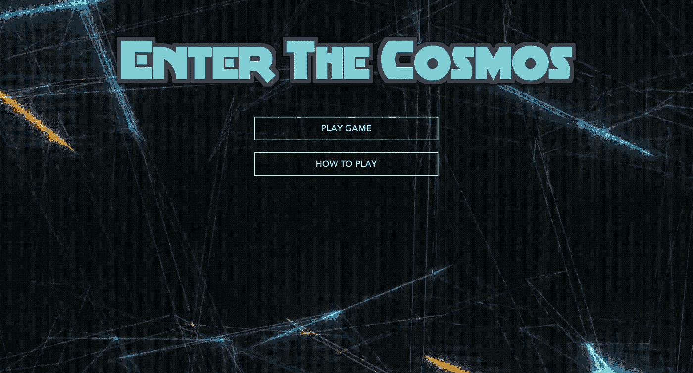

# 如何用 Vue 创建一个 RPG 冒险游戏？JS 和宇宙 JS

> 原文：<https://medium.com/hackernoon/how-to-create-an-rpg-adventure-game-using-vue-js-and-cosmic-js-8db909e9813>

Cosmic JS 是一个很棒的内容管理工具，它让你能够轻松地上传、访问和编辑你的数据和媒体文件。这些特性使它成为构建基于 web 的视频游戏的首选，因为它们大量结合了媒体图像、文件和数据对象的大量组合。在本教程中，我们将学习如何在 Vue 中制作一个简单的角色扮演冒险游戏。同时使用宇宙 JS 来管理我们的内容。

# TL；博士:

[RPG 游戏](https://cosmicjs.com/apps/vue-rpg-game)
RPG 游戏试玩 T5[RPG 游戏 Github](https://github.com/cosmicjs/vue-rpg-game)

# 介绍

因为这个网站上有很多文章可以帮助你开始使用 Cosmic JS，所以本教程假设你对 Cosmic JS 的工作原理有一个基本的了解。请参考[入门指南](https://cosmicjs.com/getting-started)。

与第三方应用程序集成通常是建立一个新项目最令人沮丧的任务之一。然而，通过对 Cosmic JS 的 API 进行一些简单的调用，我们可以非常容易地检索我们的数据。

# 设置您的项目

在本教程中，我们将使用 vue-cli 快速启动并运行我们的项目。我们也可以使用 npm 轻松安装 Cosmic JS:

> *$ npm install -g vue-cli*
> 
> *$ vue init webpack 宇宙游戏*
> 
> *$ cd 宇宙游戏*
> 
> *$ npm 安装—保存 vuex cosmicjs*
> 
> *$ npm 安装*
> 
> *$ npm 运行开发*

然后，我们将编辑/config/config.js 来添加我们的 bucket，并添加我们的读写密钥进行授权:

# 使用宇宙 JS 上传和划分我们的游戏资产

为了用故事、环境和角色填充我们的游戏，我们将把数据分成三个部分。

第一个桶将是“故事”，并将包含与游戏的实际故事和环境相关的任何内容。我们可以轻松地输入和编辑故事文本，并在这里添加资产，如环境背景图像。请注意，我们可以多么轻松地使用 Cosmic JS CMS 来编辑我们的数据！

下一个桶将被命名为“英雄”。这里，顾名思义，我们可以添加与主角相关的所有资产和元数据。这个桶可以包含所有英雄的精灵(例如:运动、动作和空闲的动画)以及元数据，例如英雄的角色统计。

下一个也是最后一个桶将会是“敌人”，正如它的名字所暗示的，将会拥有所有敌人的资产和角色属性。

能够将我们的 RPG 游戏分成这三个部分给了我们几个独特的优势。首先，所有的资产都被整齐地归档，并且易于获取。其次，Cosmic JS CMS 允许我们轻松地添加和编辑故事情节，就像编辑博客文章一样容易。

# 从宇宙 JS 访问我们游戏中的数据

我们可以使用 Cosmic JS API 轻松地从 Cosmic JS 访问我们的内容，并将它们填充到三个 Vue 中。JS 组件反映了我们为故事、英雄和敌人制作的三个桶。

我们可以在每个组件挂载的调用中引用以下函数，这样当组件从我们的存储桶中加载数据时就可以使用了:

在我们的游戏开始之前，我们可以通过从我们的“故事”桶中提取故事来给我们的玩家解释。我们还可以使用 story bucket 通过设置环境来进一步设置场景:

正如你在上面的代码片段中看到的，我们很容易通过 REST API 转换 Cosmic JS 上托管的数据，并可以存储它们以供 VueJS 的数据对象使用。

使用相同的方法，创建 hero.vue 和 enemy.vue 组件，并从各自的桶中加载它们的元数据。

为了使组件之间的对话更容易(例如，hero.vue 中的攻击方法影响敌人的健康)，您可以使用 Vuex 提供的通过 store 的状态管理，我们已经在前面使用 NPM 安装了它。以下是 Vuex 如何使用从 Cosmic JS 获得的数据来管理我们商店的示例文件:

现在我们已经加载了所有必要的游戏数据，我们可以填充我们的游戏了！我们可以将环境图像作为背景图像加载到我们的组件中，将英雄和敌人的精灵添加到它们各自的组件中，并使用我们新创建的存储来处理我们的战斗、升级和其他状态更改逻辑。

这里是你的主屏幕菜单的一些示例代码，在这里你可以看到我们是如何填充和更新从 Cosmic JS 接收的数据的:

# 结论

构建一个视频游戏，无论是在浏览器中还是在其他地方，都需要大量的数据管理。在本教程中，我们不仅探索了通过将数据分成三个不同的存储桶来管理数据是多么容易，还看到了访问和修改相同的数据是多么快速和容易。此外，集成非常简单:只需运行一个 bash 命令，并确保正确设置了环境键。

Cosmic JS 是一个轻量级但功能强大的平台——我希望本教程能够恰当地展示它的许多优势。

如果你对用 Cosmic JS 构建应用有任何意见或问题，[在 Twitter 上联系我们](https://twitter.com/cosmic_js)和[在 Slack 上加入对话](https://cosmicjs.com/community)。