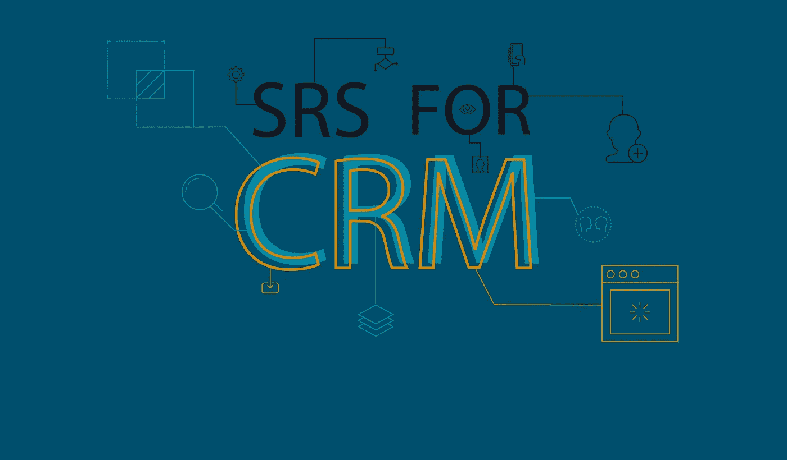

# 如何为 CRM 创建 SRS？快速入门的简单 SRS 模板

> 原文：<https://medium.com/hackernoon/how-to-create-an-srs-for-crm-simple-srs-template-for-a-fast-start-46543ca47f9f>

当你决定需要一个 CRM 系统时，你不能指望你选择的[网络开发公司](https://freshcodeit.com/)在没有你的参与下读懂你的想法并提出一个完美的解决方案。如果您希望项目满足您的业务目标，请从关键需求评估开始。为了帮助您进行规划，我们准备了详细的指南和 [SRS 模板示例](https://freshcodeit.com/freshcode-post/how-to-create-srs-system-requirements-specification-for-web-application-advice-from-experienced-developers)。

# 你的 CRM 需要软件需求规格说明吗？

每个开发项目都应该从软件需求规范(SRS)开始，无论你设计的是游戏应用还是 CRM。SRS 文档是您希望项目走向的地图，它突出显示了所有主要站点和地标。当你心中有了计划，你的发展之旅就会一帆风顺，不会走不必要的弯路。因此，您将更快地到达目的地(成品)。

在向定制软件开发公司寻求帮助之前，请写一份 SRS，回答以下问题:

1.  你希望你的项目达到什么目的？
2.  你将如何检查产品是否满足你的需求？
3.  哪些因素会限制发展进程？

如果你想[了解更多关于编写 SRS 文档](https://freshcodeit.com/freshcode-post/how-to-create-srs-system-requirements-specification-for-web-application-advice-from-experienced-developers)的一步一步的过程，看看我们开发者的建议。你会发现创建 SRS 的每个阶段的详细解释和一个可下载的样本，这是一个很好的商业计划模板。

# CRM 发展业务的两种方式。哪个适合你？

客户关系管理，简称 CRM，是一个业务流程自动化、客户数据分析和用户体验改善的系统。CRM 可以让你花更少的时间在普通的营销和销售程序上，并提高你对客户的了解，从而赚更多的钱。

根据您的业务需求，您可以通过两种方式增加收入:

1.  **使用 CRM 来满足您现有业务的运营需求**。这条道路往往更容易，因为你对自己的业务流程有着深入的了解，可以通过 CRM 更好地了解客户的需求，从而增加收入。您甚至可能满足于开箱即用的解决方案，尽管它可能无法满足您的所有需求。
2.  **创建自己的应用程序，并以 SaaS 模式提供给其他公司**。在这种情况下，你需要考虑全局，把许多因素都考虑进去。即使你为一个单一的行业开发一个产品，比如房地产 CRM，公司的需求也会有所不同，这取决于他们的目标受众和商业模式。你需要区分关键功能的优先级，削减可选功能，以保持项目的可管理性。

# 如何为一个 CRM 项目写一个 SRS？

当你寻求[网络开发服务](https://freshcodeit.com/services)时，SRS 帮助你与设计师、开发人员、质量保证专家和团队的其他成员保持一致。为确保实现这一目标，每个 SRS 都有三个主要部分:引言、要求列表和约束或限制列表。

SRS 简介应概述项目的范围和目的。写下你的业务目标和实施 CRM 系统后的首选结果。如果你为自己的企业开发它，你会清楚地看到 CRM 应该如何帮助你增加收入。在 CRM SaaS 的情况下，对你的目标受众有一个清晰的概念，也就是说那些将从你的产品中受益的企业主。

需求占据了小型企业主和大型企业 CRM 的最大部分。它们包括:

*   **技术需求**:软硬件兼容性、可扩展性、集成选项，甚至开发技术。
*   **功能需求**:移动设备集成、营销和其他业务运营的自动化、销售跟踪等。

要创建一个需求列表，对于一个定制的内部 CRM，使用一个“原样”的业务流程图。包括客户从第一次接触到销售，再到追加销售和客户重新激活的整个过程中的每一步。一旦你对这个过程有了一个清晰的认识，你就可以很快识别出浪费你资源的热点。然后，你可以继续你的“目标”业务流程，这是客户互动的完美版本，可以最有效地促成销售。在您认识到哪些过程需要自动化和改进之后，您可以创建一个用户需求列表。每一个都将对应于 CRM 的一个或多个特性。

对于贵公司的 CRM，考虑有用的功能，如:

*   离线访问；
*   电子邮件和日历集成；
*   训练版本或沙盒环境；
*   数据重复识别；
*   多语言和货币支持。

当你为你的 SaaS 项目开发 CRM 时，你不能期望潜在用户清楚地描述他们的需求。大多数营销和销售专家只使用少量的 CRM 功能。他们不了解这个系统的全部潜力。因此，你不能只依赖用户的反馈。将它与所选行业中企业日常问题的知识结合起来。你的客户关系管理解决的问题越多，SaaS 模式给你带来的收入就越多。

为了增加成功的机会，您的 CRM 系统应该:

*   自带**定制功能**让公司根据自己的需求定制系统；
*   成为**手机友好型**，让安卓和 iOS 用户都能使用；
*   拥有灵活的**用户层次**和访问设置；
*   确保公司业务和客户数据的最大安全。

写一份 SRS，要具体，尽可能多的添加细节。这将有助于你雇佣的应用开发团队更好地理解你的业务需求和要求。将开发外包给离岸和近岸公司时，详细的 SRS 至关重要。

约束列表涉及时间框架和预算。您可以概述项目实施的最大允许时间，并指定每个开发阶段的截止日期。维护和升级需求也可以包括在限制列表中。预算部分将包括开发的初始成本、实施和维护预算。

为 CRM 系统编写一个 SRS 对你来说不再是火箭科学！使用我们的建议和软件需求规格模板，你将会毫无困难地从头开始创建文档或者改进你已经写好的初稿。如果您对编写 SRS 有任何疑问，请联系 FreshCode 团队，我们将帮助您润色文档或编写新文档。如果您准备好开始您的项目，请将您的 SRS 发送给我们，我们将给您回复报价。

想了解从外包软件开发服务到项目管理的所有信息技术吗？点击进入 [Freshcode 博客](https://freshcodeit.com/blog)并注册订阅我们的时事通讯！

你喜欢这篇文章吗？请为我们鼓掌！在媒体上与其他人分享文章。

请随时联系我们的[*fresh code . website*](https://freshcodeit.com/)

[原文*此处*原文](https://freshcodeit.com/freshcode-post/how-to-create-an-srs-for-crm-simple-srs-template-for-a-fast-start)