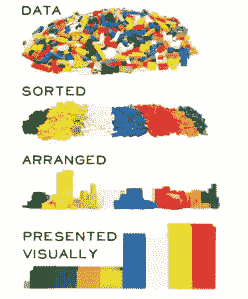
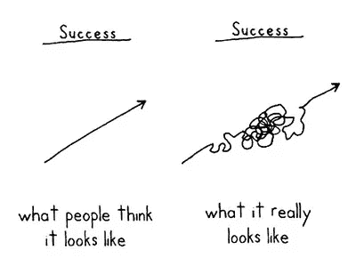
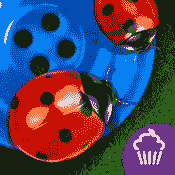

# 如何使用 Recharts、WikiQuotes API 和数据集部署 Create React 应用程序

> 原文：<https://medium.com/hackernoon/how-to-create-and-deploy-a-create-react-app-with-recharts-the-wikiquotes-api-and-a-data-set-1f3a90fccb2d>

## 我最近开发了一个应用，利用了来自世卫组织(世界卫生组织)、维基百科 API、Recharts、大量 CSS 和 JS 的数据，当然，还有对这个主题的热情。这将详细地告诉你如何去做。

在开始一个项目之前，有一件事你必须知道，那就是你到底对什么有热情。我将把这个基本难题留给你。就我个人而言，我喜欢详细描述地球上的生命和人们生活中各种不同的力量。我决定这样做:

*   十组数据表达了生活中一些强烈的东西。创建用户数据体验的十个图表。
*   与数据相关的十条引文，来自 WikiQuotes [API](https://hackernoon.com/tagged/api) 。

这是这个应用程序最终的样子:

Quick viewing of the app

本指南将分为以下几部分:

1.  用 Create [React](https://hackernoon.com/tagged/react) app 创建 App
2.  操纵数据，用图表创建图表
3.  利用 WikiQuotes API 收集报价
4.  动态换页和传递道具
5.  在 Github 页面上部署

你肯定能做到。


this is possibly, probably, maybe an exaggeration

# 创建 React 应用程序

1.  `npm install -g create-react-app`
2.  然后这个:`create-react-app name_of_app_you're_creating`
3.  这将创建一个包含文件结构的目录
4.  进入这个新目录
5.  `npm start`或`yarn start`
6.  砰！您已经设置好了文件结构！

**看一看吧:**

```
my-app/
  README.md
  node_modules/
  package.json
  public/
    index.html
    favicon.ico
  src/
    App.css
    App.js
    App.test.js
    index.css
    index.js
    logo.svg
```

**节点模块？**

*   包含由一些聪明人编写的无数行代码，为您做各种繁重的工作，因此您可以简单地关注编写代码中容易概念化的部分(做相关事情和视觉方面的功能)

**公？**

*   这是将在页面上可视化呈现的 HTML 文件，页面是应用程序的起点。
*   `favicon.ico`那是你标签上的小图片。它在`manifest.json`中被引用
*   `manifest.json`主要用于元数据

**src**

这是你写的所有东西的位置

参见`index.css`和`App.css`。两者做同样的事情。我是这样想的。我希望在整个应用程序中出现什么样的视觉效果？把那个放进`index.css`。其他全部放入`App.css`。是个小 app。

这就产生了“工作人员”,他们的任务是改善用户对网站的体验，并从整体上改善网站的功能。

`index.js`将`index.html` 与你要写的所有东西联系起来。

有趣的部分是你的应用程序。这是居住的地方。万物汇聚的地方。就我个人而言，我删除了退货声明中的所有内容，除了`div`，因为我不想要标题。

注意我放在那里的文件夹。去找一些数据，我个人用:[世卫组织数据](http://apps.who.int/gho/data/node.home)四处点击，直到找到感兴趣的数据。JSON 下载后，将文件移动到 data 文件夹。

现在，开始实际的代码编写。


你会有几个独立的页面？你应该为每一个都创建一个组件。我的计划是这样开始的。十个数据文件创建十个图表。因此，我将展示如何创建图表。

首先，创建一个新文件夹来保存您将创建的这些组件，同时创建相关的文件。

# 数据处理和图表创建

**我将向您展示如何创建这个图表:**


I did mention expressing something intense about life

如果好奇可以链接到数据:[数据集](http://apps.who.int/gho/data/view.main.vEQKNHIVTOTv)

数据最初的结构如下:

```
{ "dimension": [
                   many_irrelevant_objects
                ],
   "fact": [ {
                   "dims": {
                               "COUNTRY": "Afganhistan",
                               "YEAR": "2010",
                               "GHO": "Knowledge about sexual    
                               transmission of AIDS",
                               "SEX": "Female"
                           },
                   "Value": "8.8" },
              ...many_more_objects of same format
           ]
}
```

对于我的图表，我希望数据最终看起来像这样:

```
[
  {
    "year": "1993",
    "Burkina Faso": 16,
    "Ghana": 0,
    "Kenya": 0
  },
  ...,
  {
    "year": "2010",
    "Burkina Faso": 80.4,
    "Ghana": 75.05,
    ...
  }
]
```

**格式化数据**

注意，初始格式中有不需要的奇数`“dimension”`字段，所有需要的都在`"fact"`的`"dims"`和`"Value"`中。所以，我在这里获取这些值，并将它们设置为一个单独的对象。

```
const initialReformat = (data) => {
  let temp = {}
  return data.fact.map(row => {
    temp = row.Value
    row = row.dims
    row.Value = temp
    return row
  })
}
```

我现在有了这个:

```
[ 
   { 
     COUNTRY: 'Afghanistan',
     YEAR: '2010',
     GHO: 'Knowledge about sexual transmission of AIDS',
     SEX: 'Female',
     Value: '8.8' 
   },
   ...
]
```

接下来，我创建了一个对象，将每年设置为一个键，该键的值是一个数组，其中包含与年份值相关的所有数据。

```
const sortDataByYear = data => {
  var sortByYear = {}
  data.forEach( row => {
    if (!sortByYear[row.YEAR]) {
      sortByYear[row.YEAR] = [];
      sortByYear[row.YEAR].push(row);
    } else {
      sortByYear[row.YEAR].push(row);
    }
  })
  return sortByYear
}
```

很简单，检查年份是否不存在，如果是，创建一个新数组并将数据放入其中。否则，将数据推入已经创建的年份数组中。

最后我得到了这个东西:

```
{ 
   1992: 
      [ { COUNTRY: 'Malawi',
          YEAR: '1992',
          GHO: 'Knowledge about sexual transmission of AIDS',
          SEX: 'Male',
          Value: '0.0' },
          ...
      ],
    1993: [...],
    ...
}
```

现在，获取图表所需数据结构的最后一个函数:

```
const finalData = []
for (const year in sortByYear) {
  finalData.push({ year })
  sortByYear[year].forEach(obj => {
    if (parseFloat(finalData[i][obj.COUNTRY]) > 0) {
      finalData[i][obj.COUNTRY] = (finalData[i][obj.COUNTRY] + parseFloat(obj.Value)) / 2
    }
    else finalData[i][obj.COUNTRY] =  
         parseFloat(obj.Value).toFixed(2)
  })
  i++
}
```

首先，我制作了一个全新的数组来存储最终数据。然后，我为每一年创建一个新对象，并将该年设置为对象的键/值对之一(`finalData.push({ year })`)。最后，我遍历了前面函数返回的对象:`sortByYear`中对应于年份的数组。

在这个数组中，我有两层要检查:

1.  国家是否被设置为最终数据数组中对象的键？
2.  如果没有，这意味着我看到的是一个不同的性别，所以我应该将这个数字与前一个数字进行平均。

使用了`i`,所以下一年在数组的下一个索引中。



我们在*安排的*点。不过，接下来将快速描述 react 组件的创建。然后是视觉呈现。

**看看 React 组件的渲染**

1.  `import React, { Component } from 'react'`
2.  创建类和构造函数

```
class HIVKnowledge extends Component {
    constructor(props) {
        super(props)
        this.state = {
            data: [],
            quote: ""
        }
    }...
```

3.导入数据，当“组件安装”时，设置数据的状态。

```
const HIVKnowledgeData = require('../data/diseases-hiv-knowledge.json');...where I left off abovecomponentDidMount() {
    const data = []
    data = initialReformat(HIVKnowledgeData)
    this.setState({ data })
}
```

`componentDidMount`当页面被“装载”或准备加载时运行，无论在这里放置什么都会影响初始呈现。

4.呈现页面之前的最终数据管理:

```
render() {
    let sortByYear = [],
      finalData = [],
      i = 0
    if (this.state.data.length > 0) {
        sortByYear = sortDataByYear(this.state.data)
        ...then run the last data function on sortByYear
}
```

检查长度是否大于零，因为`componentDidMount`不会立即出现。因此，在这个 if 语句的第一次检查中，数据将是一个空数组，这根本不是我们想要输入到图表中的内容。

**图表的创建和页面的呈现**

`npm install recharts`

从 recharts 导入什么:

```
import { LineChart, Line, XAxis, YAxis, CartesianGrid, Tooltip, ResponsiveContainer } from 'recharts';
```

在标签上方的 index.html 中放置什么(如果你想让标签显示其他内容，也可以修改)

```
<link rel="stylesheet" href="[https://maxcdn.bootstrapcdn.com/bootstrap/3.3.2/css/bootstrap.min.css](https://maxcdn.bootstrapcdn.com/bootstrap/3.3.2/css/bootstrap.min.css)">
<script src="[https://code.jquery.com/jquery-2.1.3.min.js](https://code.jquery.com/jquery-2.1.3.min.js)" integrity="sha256-ivk71nXhz9nsyFDoYoGf2sbjrR9ddh+XDkCcfZxjvcM="
  crossorigin="anonymous"></script>
<script src="[https://maxcdn.bootstrapcdn.com/bootstrap/3.3.2/js/bootstrap.min.js](https://maxcdn.bootstrapcdn.com/bootstrap/3.3.2/js/bootstrap.min.js)"></script>
```

呈现器的返回语句中应该包含什么:

```
return (
     <div className="chart bar HIV">
          <h6>Knowlege about sexual transmission of AIDS (Average              
          Both Sexes)</h6>
          <ResponsiveContainer width='100%' height={300}>
              <LineChart 
                cx="50%" 
                cy="50%" 
                outerRadius="80%"
                data={finalData}
               >
               <XAxis dataKey="year" />
               <YAxis />
               <CartesianGrid strokeDasharray="3 3" />
               <Tooltip />
               <Line 
                   connectNulls={true} 
                   type="monotone" 
                   dataKey="Zambia" 
                   stroke="black" 
               />  
               ...rest of lines and closing tags
```

这是页面上将呈现的内容。这是 JSX。类名是 React 设置类的方式。否则,`<h6>`正如人们所料，请注意该图也非常 HTML'y。请注意，JSX 组件的一个决定性因素是茶包。

至于图表:

响应式容器完全按照预期的那样工作，根据屏幕大小变大变小。

`width` `cx` `cy` `outerRadius`都不是随机数。这是获得图表中心位置的秘方。

`data={finalData}`是数据输入图表的方式。

`<XAxis datakey=”year” />`是将年份设定为… x 轴的东西，非常复杂。

`<Tooltip />`悬停在数据上时创建一个可爱的用户交互。

`<Line … />`是每一行的颜色，国家(在数组中的关键)，而`connectNulls`将做到这一点，如果下一年是一个距离，线将连接。这些数据很有帮助，因为许多国家的研究间隔了很多年。

**导出文件末尾的组件**

`export default HIVKnowledge`

**导入 App.js 中的组件**

`import HIVKnowledge from ‘./poem-1-data/HIVKnowledge’`

**渲染图表组件**

将`<HIVKnowledge />`放在 render 方法的 return 语句中的`div`内。

现在，您应该会看到页面上的图表。



Hopefully not

# 利用 WikiQuotes API 来呈现报价

1.我用的是 github 上现成的这个模块:[https://github.com/natetyler/wikiquotes-api](https://github.com/natetyler/wikiquotes-api)

将其复制并粘贴到应用程序中的一个文件中。我用了一个叫`WikiQuote.js`的文件。

2.在该文件的顶部导入 jQuery:

`import * as $ from ‘jquery’`

3.导出模块:

`export const WikiquoteApi = ...`

4.创建必要的错误回调:

```
export const error = (err) => {
    console.error(err)
}
```

5.导入图表组件:

`import { WikiquoteApi, error } from ‘../WikiQuote.js’`

6a。在`componentDidMount`中创建`success`回调函数，以便在调用时设置`quote`变量:

```
const success = (wikiData) => {
    quote = `"${wikiData.quote}"`
}
```

6b。创建一个等待 WikiQuote 函数完成的`checkQuoteLength`函数(这是一个异步挑战)，重复调用自己，直到完成，立即设置状态。将此也放入`componentDidMount`

```
const checkQuoteLength = () => {
  if (quote.length > 0) {
    this.setState({ quote, data })
  } else {
    setTimeout(checkQuoteLength, 100)
  }
}
```

6c。调用`checkQuoteLength`:

```
checkQuoteLength()
```

6d。呼叫`WikiquoteApi.getRandomQuote(title_to_search_in_wikiquotes, success, error)`:

```
componentDidMount () {
  let quote = "", data = []
  const success = (wikiData) => {
    quote = `"${wikiData.quote}"`
  }
  const checkQuoteLength = () => {
    if (quote.length > 0) {
      this.setState({ quote, data })
    } else {
      setTimeout(checkQuoteLength, 100)
    }
  }
  WikiquoteApi.getRandomQuote("HIV/AIDS", success, error)
  data = initialReformat(HIVKnowledgeData)
  checkQuoteLength()
}
```

7.呈现报价:

```
return (
     <div className="chart bar HIV">
          <h6>Knowlege about sexual transmission of AIDS (Average              
          Both Sexes)</h6>
          <p>{this.state.quote}</p>
          <ResponsiveContainer width='100%' height={300}>
          ...
```

瞧啊。现在这段引文已经出现在网页上了。


Now you can do all sorts of stuff with this in apps

但是您只有一个包含一个图表的页面，如果您打算继续，请在继续之前创建更多的图表。接下来，将展示如何以简单的方式从一个页面转到下一个页面。

# 动态换页和传递道具

**创建一些按钮:**

我用 [CSS 按钮生成器](http://css3buttongenerator.com)让我的生活更轻松。

**为左右按钮创建按钮组件:**

1.  创建一个名为`Buttons`的文件，其中包含按钮的 HTML。
2.  创建一个具有两个初始状态`leftButtonDisable: true`和`rightButtonDisable: false`的类组件(同上)。
3.  在返回时创建按钮:

```
<div className="buttons">
    <button className="btn" value="left" disabled=
    {this.state.leftButtonDisable} onClick=                                   
    {this.handleClick}>◀</button>
    <button className="btn" value="right" disabled=
    {this.state.rightButtonDisable} onClick=
    {this.handleClick}>▶</button>
</div>
```

3.创建`handleClick`类方法:

```
handleClick(event) {
  let value = 0
  if (event.target.value === "left") {
    value--
    this.props.onPageChange(value)
  } else {
    value++
    this.props.onPageChange(value)
  }
}
```

将值设置为零，如果为左，则递减，否则递增。并将该值传递给… `this.props.onPageChange`。我接下来会讲这个。

4.导出组件

**在 App.js 内:**

1.  `import Buttons from ‘./Buttons’`
2.  创建一个当前页面状态并将其设置为零:`currentPage: 0`

2.创建一个`onPageChange`类方法，并设置`this`上下文以允许呈现相应的页面

```
constructor (props) {
  ...
  this.onPageChange = this.onPageChange.bind(this)
}onPageChange(value) {
  const currentPage = this.state.currentPage + value
  this.setState({ currentPage })
}
```

3.将按钮组件放入渲染中，并将`onPageChange`和`currentPage`作为道具传递给`Buttons`组件

```
<Buttons 
    currentPage={this.state.currentPage} 
    onPageChange={this.onPageChange}
/>
```

**回到按钮组件**

使用生命周期方法`componentWillRecieveProps`了解何时禁用按钮

```
componentWillReceiveProps(nextProps) {
  let currentPage = nextProps.currentPage
  if (currentPage === 0) {
    this.setState({
      leftButtonDisable: true
    })
  }
  else if (currentPage === 9) {
    this.setState({
      rightButtonDisable: true
    })
  } else {
    this.setState({
      leftButtonDisable: false,
      rightButtonDisable: false
    })
  }
}
```

每当`App.js`传递给`buttons.js`的道具发生变化时就会运行，在这种情况下，`currentPage`发生变化。当`currentPage`改变时`componentWillReceiveProps`运行，并且`nextProps`是一个对象，其属性的键/值作为传入值被传递。这允许您改变该实例的状态，进而改变页面上可视的组件。



Ah buttons, wonderful buttons

**根据** `**currentPage**`渲染不同的页面

1.  在 App.js 中创建一个呈现页面类方法

```
renderPage(curPage) {
  switch (curPage) {
    case 0:
      return <HIVKnowledge />
    case 1:
      return <LifeExpectancy /> 
    ...
    default:
      return console.error("Something is wrong with your buttons")
  }
}
```

2.在`render`类方法的`return`语句中调用这个函数

```
<div className="App">
  {this.renderPage(this.state.currentPage)}
  <Buttons currentPage={this.state.currentPage} onPageChange= 
           {this.onPageChange} />
</div>
```

现在，可能，希望你知道如何创建一个多页面的 react 应用程序。


If yes, you must feel this way

# 将应用程序部署到 Github 页面

Info 感谢[这篇媒体文章](https://medium.freecodecamp.org/surge-vs-github-pages-deploying-a-create-react-app-project-c0ecbf317089)。

1.  转到您的`package.json`并添加两个新字段，如下所示:

```
{
    ...
    "private": true, //below this add:
    "homepage": "https://github_username.github.io/repository_name",
    ... 
    "scripts": {
        "eject": "react-scripts-eject", //below this add:
        "deploy: "npm run build&&gh-pages -d build"
    ...
}
```

2.然后这样做:`npm install --save-dev gh-pages`。把你的代码推给 master。

3.`npm run build`这将创建应用程序中所有代码的捆绑包(运行后，查看您的文件系统，您将看到一个`build` 文件夹，其中包含紧密编织的、不可读格式的所有代码)。

4.`npm run deploy`是终端的最后一步

5.进入你的 GitHub 账户。转到应用程序页面，然后到设置，向下滚动直到你到达 GitHub 页面，点击源下拉菜单，找到`gh-pages branch`，然后等待一会儿，你就…

部署完毕！

将来，如果你编辑了一些代码或类似的东西，一定要运行`npm run build`然后`npm run deploy`，这样你部署的应用就会受到影响！


buenisimo

# 最后

无论您的 React 技能水平如何，我的目标是确保这篇文章包含任何人都可以学习的细微差别。这是在完成上述项目后直接写的，所以这些麻烦和磨难在我脑海中记忆犹新(当我打这些文字时，它们是参考文献)。

React 中还有无数的资源，这只是众多资源中的一小部分。如果你读了这篇文章，但知道你还有其他想做的事情，看看这个回购:[真棒-反应-组件](https://github.com/brillout/awesome-react-components)。

这是马赛尔·普鲁斯特的一句话:

> “每个读者都发现自己。作家的作品只不过是一种光学仪器，使读者能够辨别出如果没有这本书，他可能永远也看不到的东西。”

让我们希望 React 是一个工具，可以帮助您编写同样的代码。

有相应的 CSS 文章… [这里](/@muzsik33/a-compilation-of-css-hacks-a4392947d16)

这是回购:[报价和图表](https://github.com/jMuzsik/quote_and_a_chart)

感谢道格和凯尔的校对！

> 祝你旅途顺利，我定期创作内容，所以如果你学到了一两件事，请跟我来，那些鼓掌的东西肯定是受欢迎的。评论也是。