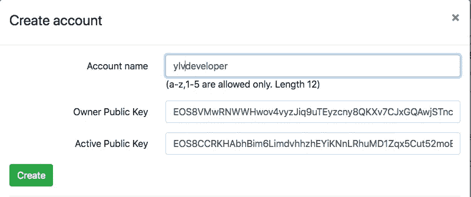
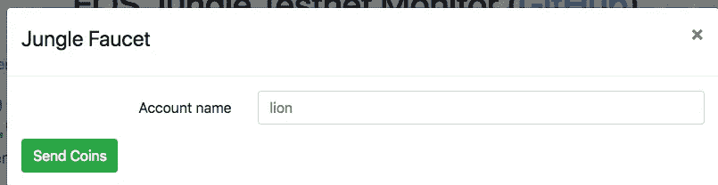

# 如何创建和部署您自己的 EOS 令牌

> 原文：<https://medium.com/hackernoon/how-to-create-and-deploy-your-own-eos-token-1f4c9cc0eca1>

## 我们将弄清楚什么是 EOS 令牌，以及您如何自己创建和部署它。


Photo by Aleksey Shmatov

# 什么是 EOS 令牌？

与以太坊相反，EOS 自带令牌智能合约。正如以太坊有 ERC20 智能合约，EOS 有 [eosio.token](https://github.com/EOSIO/eos/tree/16808f94dc79791819ddc8ad919e4cb8111b4eff/contracts/eosio.token) 智能合约。Eosio.token 智能合约允许您通过提供最大供应量和令牌字面量来创建自己的令牌，向帐户发放令牌以及在帐户之间转移令牌。EOS 区块链上的 EOS 令牌是使用相同的合同发行的。

“url”参数指定要连接的节点。你可以在[官网](https://www.eosdocs.io/resources/apiendpoints/)查看更多 API 端点。

# 安装 Cleos

[Cleos](https://developers.eos.io/eosio-nodeos/docs/cleos-overview) 是一个命令行工具，与 nodeos 公开的 REST API 接口。我们需要 cleos 运行所有的命令与 eos 区块链互动。你可以使用 [Docker](https://www.eosdocs.io/dappdevelopment/software/docker) 、 [AWS 镜像](https://www.eosdocs.io/dappdevelopment/software/amazonaws)或者[编译](https://www.eosdocs.io/dappdevelopment/software/compile)源代码来安装 cleos。最终结果必须是 cleos 在您的终端中可用。

# 创建钱包

> 钱包是存储密钥的客户端，这些密钥可能与一个或多个帐户的权限相关联，也可能不相关联。理想情况下，钱包有锁定(加密)和解锁(解密)状态，由高熵密码保护。EOSIO/eos 存储库与一个名为 cleos 的命令行接口客户端捆绑在一起，该客户端与一个名为 keosd 的精简客户端接口，它们一起演示了这种模式。
> 
> [来自“帐户和权限](https://developers.eos.io/eosio-nodeos/docs/accounts-and-permissions)

让我们创造一个叫做“宝藏”的东西。

你必须把密码保存在安全的地方，因为如果密码丢失了，就没有办法找回钱包里的所有钥匙。

现在我们需要为所有者和活动权限生成两对密钥。之后，我们将它们导入我们的钱包。

# 创建帐户

为了在 EOS 区块链做任何事情，你需要有一个帐户。

> 帐户是存储在区块链上的可读名称。根据权限配置，它可以由一个人或一组人拥有。向区块链转账或推送交易需要账户。
> [来自‘账户和权限’](https://developers.eos.io/eosio-nodeos/docs/accounts-and-permissions)

帐户本质上是一系列的公钥/私钥，它们都有一个唯一的名字。钥匙存放在钱包里。账户储存在 EOS 区块链上。

在本地创建一个帐户很容易，你只需运行`cleos create account` 命令，因为你拥有默认的 eosio 帐户，这显然不是 Mainnet 上的情况。为了在 Mainnet 上创建账户，你需要已经拥有账户的人的帮助，比如 [zeos](https://www.zeos.co/) 或 [eos-account-creator](https://eos-account-creator.com/) ，这是要花钱的。此外，您只能创建正好由 12 个符号组成的帐户，并且只能由 a-z 小写字母和 1-5 位数字组成。在我看来，这是难以置信的限制。要获得一个名字较短的账户，你必须在拍卖中用[出价](/@MediShares/q-a-eos-account-name-bidding-90890e72c92b)。考虑到(双关语)你可以转售 EOS 帐户抢注将是巨大的。考虑到这一点，我们将在教程中使用 Testnet 来节省金钱和时间。

尽可能靠近主网。转到 [jungle.cryptolions.io](http://jungle.cryptolions.io/) 并点击“创建帐户”链接。它会要求您输入帐户名和两个密钥。使用之前生成的公钥。



确认帐户已创建:

现在，我们需要为我们的帐户购买一些内存，因为为了发布我们的合同。在 EOS 区块链，有鲸鱼玩公牛的公羊市场，这是有钱人的另一个巨大投机机会。
使用 [EOS 丛林测试网龙头](http://jungle.cryptolions.io/#faucet)向你的账户投放一些 EOS 代币。



之后运行`cleos system buyram`命令用 EOS 令牌购买 RAM。

# 创建合同

首先，我们必须将我们的合同上传到区块链。Cleos 命令`set contract`通过以下位置参数实现了这一点:

```
* account — the account to publish a contract for.
* contract-dir — contract directory.
* wast-file — the file containing the contract WAST or WASM.
* abi-file — the ABI of the contract.
```

正如你所看到的，我们需要指定 wast 和 abi 文件。如果您已经从源代码构建了 EOS，那么您可以在。/build/contracts/EOS io . token/folder。为了方便起见，我把它们都上传了——[wast](https://github.com/ylv-io/eos-stuff/raw/master/eosio.token.wasm)/[ABI](https://raw.githubusercontent.com/ylv-io/eos-stuff/master/eosio.token.abi)。让我们用我们的帐户和文件调用`set contract`命令。因为我们的 wast/abi 文件与目录名同名，所以我们可以跳过这些参数。

让我们检查代码是否已经用`get code ylvdeveloper`命令上传了。

是的，它在那里。

# 创建令牌

最后，我们可以创建和发布我们的令牌。我们将使用 cleos `push action`命令来利用智能合约的`create`和`issue`动作，该命令采用以下参数:

```
* contract — the account providing the contract to execute.
* action — the action to execute on the contract.
* data — the arguments to the contract.
```

让我们创建`YLV`令牌并发布一些令牌。

我们刚刚创建了最大容量为 1，000，000.00 令牌的`YLV`令牌。现在让我们向 ylvdeveloper 帐户发放 1000 个令牌。

接下来，检查余额:

太好了。我们有代币合同，可以发行代币。我们还需要什么？能够将令牌从一个帐户转移到另一个帐户。我们将使用来自 cleos 的相同的`push action`命令和令牌智能合约的`transfer`方法。您需要另一个帐户来转移代币。可以使用与我们创建`ylvdeveloper`相同的步骤来创建它。我们将从`ylvdeveloper`向`ylvio`账户发送 100 个代币。

检查余额:

按预期工作。

# 摘要

从安装 cleos 和了解 eosio.token 智能合约，到拥有自己的令牌并将令牌转移到其他帐户，我们走了一条完整的道路。我们使用与 Mainnet 几乎相同的 EOS Jungle Testnet 完成了所有这些工作。相同的步骤将适用于 Mainnet，你只需要使用不同的 API 端点，并支付帐户和内存。

# TL；速度三角形定位法(dead reckoning)

*   EOS token 是一个智能合约。
*   Cleos 是用于与钱包和节点交互的命令行实用程序。
*   EOS 丛林测试网可用于开发。
*   您可以使用 eosio.token 智能合约创建、发行和转让您自己的令牌。

## 有关系的

*   [了解 eosio.token 合同](/coinmonks/understanding-the-eosio-token-contract-87466b9fdca9)
*   [EOS 区块链开发的第一步](/infinitexlabs/first-steps-in-eos-blockchain-development-56824502c799)